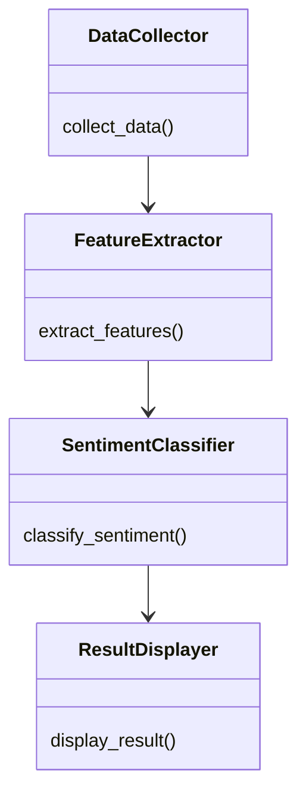
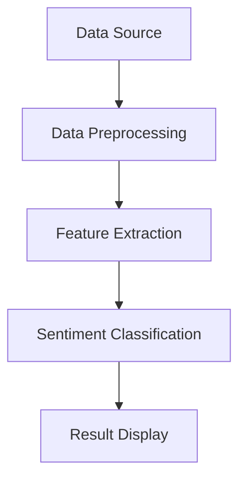

                 


# AI Agent的情感识别与表达机制

---

## 关键词：  
AI Agent, 情感识别, 情感计算, 情感数据, 情感表达, 情感算法

---

## 摘要：  
本文将详细探讨AI Agent在情感识别与表达机制中的核心原理、算法实现、系统架构及实际应用。通过分析情感识别的基本概念、算法原理、系统设计与项目实战，结合实际案例，深入解读AI Agent如何通过情感识别技术实现智能化交互，提升用户体验。文章内容丰富，涵盖理论与实践，适合技术开发者、研究人员及对AI情感识别感兴趣的读者阅读。

---

# 目录

1. [情感识别与表达的背景介绍](#情感识别与表达的背景介绍)
2. [情感识别的核心概念与联系](#情感识别的核心概念与联系)
3. [情感识别的算法原理与实现](#情感识别的算法原理与实现)
4. [系统分析与架构设计方案](#系统分析与架构设计方案)
5. [项目实战：情感识别系统的实现](#项目实战：情感识别系统的实现)
6. [最佳实践、小结与拓展阅读](#最佳实践、小结与拓展阅读)

---

## 第1章：情感识别与表达的背景介绍

### 1.1 情感识别的定义与问题背景

#### 1.1.1 情感识别的定义  
情感识别（Emotion Recognition）是指通过分析文本、语音、面部表情等多模态数据，识别和理解人类情感状态的过程。情感识别的核心目标是让计算机能够理解人类的情感表达，并基于此进行智能化的交互。

#### 1.1.2 情感识别的问题背景  
随着人工智能技术的快速发展，AI Agent（智能代理）逐渐成为人机交互的重要形式。然而，传统的AI Agent往往缺乏对人类情感的理解能力，导致交互体验较差。情感识别技术的引入，使得AI Agent能够更好地理解用户的情感状态，从而提供更智能化、个性化的服务。

#### 1.1.3 情感识别的应用场景  
- 智能客服：通过识别用户情绪，提供更贴心的服务。
- 智能教育：根据学生情绪调整教学策略。
- 智能音箱：通过识别用户情感调整播放内容。

---

## 第2章：情感识别的核心概念与联系

### 2.1 情感计算的原理

#### 2.1.1 情感计算的基本原理  
情感计算（Affective Computing）是通过分析多模态数据，理解人类情感状态，并基于此进行计算的过程。其核心步骤包括数据采集、特征提取、情感分类和结果应用。

#### 2.1.2 情感计算的关键技术  
- 多模态数据融合：结合文本、语音、面部表情等多种数据源，提高情感识别的准确性。
- 情感特征提取：从数据中提取与情感相关的特征，如文本中的情感词、语音中的语调特征等。
- 情感分类：基于机器学习或深度学习算法，对情感特征进行分类。

### 2.2 情感特征的提取与分析

#### 2.2.1 文本特征提取方法  
- 词袋模型（Bag-of-Words）
- 词嵌入（Word Embedding，如Word2Vec、GloVe）
- 情感词典（如AFINN、SentiWordNet）

#### 2.2.2 声音与语调特征提取  
- 音调变化（Pitch）
- 语速（Speech Rate）
- 音量变化（Volume）

#### 2.2.3 面部表情特征提取  
- 面部关键点检测（Face Landmarks）
- 面部动作单元（Action Units）
- 表情分类（如快乐、悲伤、愤怒等）

### 2.3 情感数据的分析与建模

#### 2.3.1 情感数据的预处理  
- 数据清洗：去除噪音数据。
- 数据标注：对情感数据进行人工标注或自动标注。

#### 2.3.2 情感数据的建模方法  
- 统计模型：如朴素贝叶斯、支持向量机。
- 深度学习模型：如LSTM、Transformer。

#### 2.3.3 情感数据的可视化  
- 词云分析：展示情感相关的关键词分布。
- 热图分析：展示情感特征的重要性。

---

## 第3章：情感识别的算法原理与实现

### 3.1 情感识别的主要算法

#### 3.1.1 基于词典的情感识别方法  
- 使用预定义的情感词典对文本进行情感分析。
- 示例：  
  ```python
  def sentiment_analysis(text, word_dict):
      sentiment_score = 0
      for word in text.split():
          if word in word_dict:
              sentiment_score += word_dict[word]
      return sentiment_score
  ```

#### 3.1.2 统计学习方法  
- 朴素贝叶斯分类器：基于概率模型的分类方法。
- 支持向量机（SVM）：基于线性分隔的分类方法。

#### 3.1.3 深度学习方法  
- 循环神经网络（RNN）：适用于处理序列数据。
- Transformer架构：基于自注意力机制的模型。

---

## 第4章：系统分析与架构设计方案

### 4.1 系统功能设计

#### 4.1.1 功能模块划分  
- 数据采集模块：采集文本、语音、面部表情等数据。
- 特征提取模块：提取情感相关特征。
- 情感分类模块：基于算法进行情感分类。
- 结果展示模块：展示情感识别结果。

#### 4.1.2 领域模型设计  


#### 4.1.3 系统架构设计  


---

## 第5章：项目实战：情感识别系统的实现

### 5.1 环境安装

#### 5.1.1 Python环境配置  
- 安装Python 3.x
- 安装必要的库：numpy、pandas、scikit-learn、tensorflow。

#### 5.1.2 数据集准备  
- 使用公开的情感识别数据集（如IMDB电影评论数据集）。

### 5.2 核心代码实现

#### 5.2.1 数据预处理  
```python
import pandas as pd
import numpy as np

def preprocess_data(data):
    data.dropna(inplace=True)
    data['label'] = data['label'].astype(int)
    return data
```

#### 5.2.2 情感分类模型实现  
```python
import tensorflow as tf
from tensorflow.keras import layers

model = tf.keras.Sequential([
    layers.Embedding(input_dim=10000, output_dim=16),
    layers.LSTM(64),
    layers.Dense(1, activation='sigmoid')
])
model.compile(optimizer='adam', loss='binary_crossentropy', metrics=['accuracy'])
```

#### 5.2.3 模型训练与评估  
```python
model.fit(X_train, y_train, epochs=10, batch_size=32)
loss, accuracy = model.evaluate(X_test, y_test)
print(f"Loss: {loss}, Accuracy: {accuracy}")
```

### 5.3 实际案例分析

#### 5.3.1 数据分析  
- 数据分布：分析数据集的类别分布。
- 特征重要性：分析哪些特征对情感分类影响最大。

#### 5.3.2 模型优化  
- 调整模型参数：如改变LSTM的隐藏层大小。
- 使用早停法防止过拟合。

---

## 第6章：最佳实践、小结与拓展阅读

### 6.1 最佳实践  
- 数据预处理：确保数据质量，避免噪音。
- 特征选择：选择合适的特征提取方法。
- 模型调优：通过交叉验证优化模型参数。

### 6.2 小结  
本文详细介绍了AI Agent的情感识别与表达机制，从基本概念到算法实现，再到系统设计和项目实战，为读者提供了全面的知识体系。情感识别技术的引入，使得AI Agent能够更好地理解人类情感，从而实现更智能化的交互。

### 6.3 注意事项  
- 情感识别的准确性受数据质量和算法复杂度影响。
- 多模态数据融合可以提高识别精度。
- 情感识别技术的应用需遵守隐私保护等相关法律法规。

### 6.4 拓展阅读  
- 阅读相关学术论文，了解最新的研究进展。
- 关注情感计算领域的顶级会议和期刊。

---

## 作者：  
**AI天才研究院 / AI Genius Institute**  
**禅与计算机程序设计艺术 / Zen And The Art of Computer Programming**

