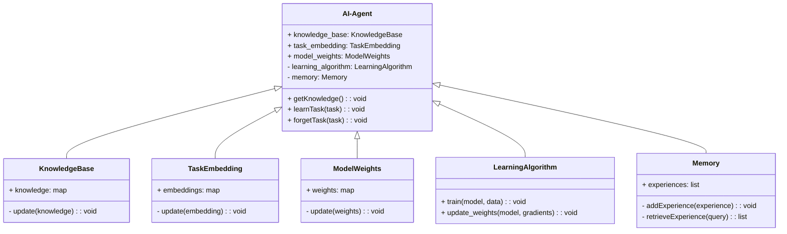
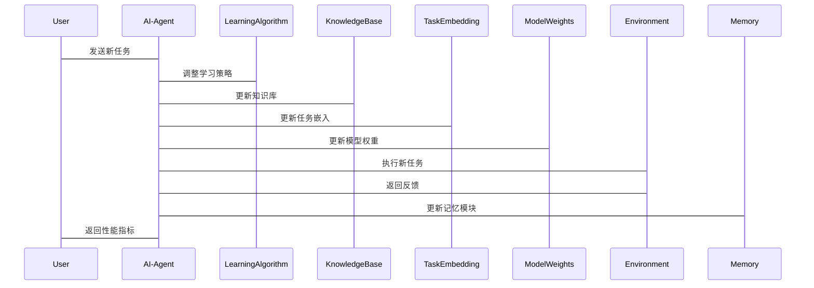

                 


# AI Agent的持续学习与灾难性遗忘防御

## 关键词：AI Agent, 持续学习, 灾难性遗忘, 知识蒸馏, 参数约束, 任务嵌入

## 摘要：AI Agent的持续学习能力是人工智能系统的重要特性，而灾难性遗忘是这一过程中面临的主要挑战之一。本文深入探讨了灾难性遗忘的定义、成因及其防御方法，系统介绍了知识蒸馏、参数约束和任务嵌入等主流防御策略，并通过实际案例和系统架构设计展示了如何在AI Agent中实现有效的持续学习与遗忘防御。文章结合理论分析与实践指导，为读者提供了全面的理解和应用指南。

---

## 第一部分: 问题背景与概念介绍

### 第1章: 灾难性遗忘的定义与问题背景

#### 1.1 灾难性遗忘的定义
灾难性遗忘（Catastrophic Forgetting）是指在机器学习模型学习新任务的过程中，由于模型参数的更新，导致模型对之前已经学习过的任务产生严重性能下降的现象。

#### 1.2 灾难性遗忘的产生原因
- **模型权重的重用**：模型参数在学习新任务时被频繁更新，导致旧任务的特征表示被覆盖。
- **任务间特征差异**：不同任务的特征空间差异较大，模型在优化新任务时难以同时保持对旧任务的性能。
- **梯度干扰**：反向传播过程中，新任务的梯度更新会对旧任务的参数空间产生负面影响。

#### 1.3 灾难性遗忘的影响与挑战
- **性能下降**：模型在新任务上的性能提升可能以牺牲旧任务的性能为代价。
- **应用受限**：在需要长期任务保持的场景（如医疗、自动驾驶等）中，灾难性遗忘会导致系统可靠性下降。
- **学习效率降低**：模型需要反复学习旧任务以保持性能，增加了训练时间和计算成本。

### 第2章: AI Agent的持续学习需求

#### 2.1 AI Agent的基本概念
AI Agent是一种智能体，能够感知环境、自主决策并执行任务。持续学习能力是AI Agent的核心需求之一。

#### 2.2 持续学习的定义与特点
- **持续学习**：模型在不遗忘旧任务的情况下，逐步学习新任务的能力。
- **特点**：
  - 累积性：模型可以逐步吸收新知识，而不失去旧知识。
  - 实时性：模型可以在实时环境中动态更新知识。
  - 灵活性：模型可以根据新任务调整其学习策略。

#### 2.3 持续学习在AI Agent中的重要性
- **适应性**：AI Agent需要在动态环境中不断适应新任务。
- **可靠性**：持续学习能力是保障AI Agent长期稳定运行的关键。
- **效率**：通过持续学习，AI Agent可以更高效地完成任务。

### 第3章: 灾难性遗忘防御的目标与意义

#### 3.1 灾难性遗忘防御的目标
- **保持旧任务性能**：在学习新任务的同时，确保模型对旧任务的性能不发生显著下降。
- **提高学习效率**：通过防御策略，减少模型在学习新任务时的干扰，提高学习效率。
- **增强模型泛化能力**：通过保持旧任务的知识，模型可以更好地泛化到新任务。

#### 3.2 灾难性遗忘防御的意义
- **提升系统可靠性**：通过防御策略，AI Agent可以在复杂环境中保持稳定性能。
- **降低学习成本**：减少模型在学习新任务时的参数干扰，降低训练成本。
- **推动AI Agent的应用**：有效的遗忘防御策略是实现高效、可靠的AI Agent系统的前提。

#### 3.3 灾难性遗忘防御的边界与外延
- **边界**：灾难性遗忘防御的边界在于如何平衡新旧任务的学习，而不导致性能下降。
- **外延**：遗忘防御不仅仅是防止性能下降，还包括如何优化模型结构和学习策略，使其在持续学习中保持高效和稳定。

---

## 第二部分: 核心概念与联系

### 第4章: 核心概念与联系

#### 4.1 持续学习与灾难性遗忘的关系

##### 4.1.1 持续学习的定义与核心要素
- **持续学习**：模型在在线环境下，逐步学习新任务的能力。
- **核心要素**：
  - 任务序列：模型需要按照一定的顺序学习多个任务。
  - 知识保持：模型需要在学习新任务时保持对旧任务的知识。
  - 灵活性：模型可以根据新任务调整其学习策略。

##### 4.1.2 灾难性遗忘的定义与核心要素
- **灾难性遗忘**：模型在学习新任务时，对旧任务的性能产生显著下降的现象。
- **核心要素**：
  - 任务间特征差异：不同任务的特征空间差异较大。
  - 参数重用：模型参数在新任务学习过程中被频繁更新。
  - 梯度干扰：反向传播过程中，新任务的梯度更新对旧任务的参数空间产生负面影响。

##### 4.1.3 两者之间的联系与区别
- **联系**：
  - 灾难性遗忘是持续学习过程中需要克服的主要挑战之一。
  - 持续学习的目标是克服灾难性遗忘，保持模型的持续性能。
- **区别**：
  - 灾难性遗忘关注的是模型在学习新任务时对旧任务的性能损失。
  - 持续学习关注的是模型在不遗忘旧任务的情况下，如何高效地学习新任务。

#### 4.2 灾难性遗忘防御的核心原理

##### 4.2.1 知识蒸馏的原理
- **知识蒸馏**：通过教师模型将旧任务的知识迁移到学生模型中，保持旧任务的知识。
- **实现步骤**：
  1. 训练教师模型完成旧任务。
  2. 使用教师模型的输出作为软标签，指导学生模型的学习。
  3. 学生模型在学习新任务时，同时保持对教师模型输出的拟合。
- **优缺点分析**：
  - 优点：能够有效保持旧任务的知识，同时模型结构可以更小。
  - 缺点：需要额外的教师模型，增加了计算成本。

##### 4.2.2 参数约束的原理
- **参数约束**：通过约束模型参数的更新范围，防止参数在学习新任务时对旧任务的知识造成破坏。
- **实现步骤**：
  1. 初始化模型参数。
  2. 在学习新任务时，对模型参数的更新进行约束，确保其在旧任务的参数空间中保持稳定。
  3. 使用优化器（如Adam）调整参数，同时保持参数的约束。
- **优缺点分析**：
  - 优点：不需要额外的教师模型，计算成本较低。
  - 缺点：约束过紧可能导致模型在新任务上的性能下降。

##### 4.2.3 任务嵌入的原理
- **任务嵌入**：通过将任务特定的信息嵌入到模型中，保持对旧任务的性能。
- **实现步骤**：
  1. 为每个任务设计一个任务嵌入向量。
  2. 将任务嵌入向量与模型的参数结合起来，指导模型的学习。
  3. 在学习新任务时，任务嵌入向量帮助模型保持对旧任务的知识。
- **优缺点分析**：
  - 优点：能够有效地将任务特定的信息嵌入到模型中，保持旧任务的知识。
  - 缺点：需要设计任务嵌入向量，增加了模型的设计复杂度。

#### 4.3 核心概念对比分析

##### 4.3.1 持续学习与在线学习的对比
| 对比维度 | 持续学习 | 在线学习 |
|----------|----------|----------|
| 定义     | 模型在不遗忘旧任务的情况下，逐步学习新任务的能力。 | 模型在实时环境中，逐步学习新数据的能力。 |
| 特点     | 累积性、实时性、灵活性 | 实时性、高效性 |
| 应用场景 | 需要长期保持旧任务性能的场景 | 数据流实时更新的场景 |

##### 4.3.2 灾难性遗忘与渐近遗忘的对比
| 对比维度 | 灾难性遗忘 | 渐近遗忘 |
|----------|------------|----------|
| 定义     | 模型在学习新任务时，对旧任务的性能产生显著下降的现象。 | 模型在学习新任务时，对旧任务的性能逐渐下降的现象。 |
| 表现     | � � 急剧下降 | 渐渐下降 |
| 解决方法 | 知识蒸馏、参数约束、任务嵌入等 | 参数自适应、任务权重调整等 |

##### 4.3.3 参数化方法与非参数化方法的对比
| 对比维度 | 参数化方法 | 非参数化方法 |
|----------|------------|--------------|
| 定义     | 通过调整模型参数来保持旧任务的知识。 | 通过增加新的数据或特征来保持旧任务的知识。 |
| 优缺点   | 优点：计算效率高；缺点：约束过紧可能导致新任务性能下降 | 优点：灵活性高；缺点：计算成本较高 |

---

## 第三部分: 灾难性遗忘防御的算法原理

### 第5章: 灾难性遗忘防御的算法原理

#### 5.1 知识蒸馏方法

##### 5.1.1 知识蒸馏的基本原理
- **知识蒸馏**：通过教师模型将旧任务的知识迁移到学生模型中，保持旧任务的知识。
- **实现步骤**：
  1. 训练教师模型完成旧任务。
  2. 使用教师模型的输出作为软标签，指导学生模型的学习。
  3. 学生模型在学习新任务时，同时保持对教师模型输出的拟合。
- **数学公式**：
  $$ P(y|x) = \text{Softmax}(f(x;\theta)) $$
  $$ L_{\text{distillation}} = \sum_{i=1}^n (\text{KL}(P(y|x_i) || Q(y|x_i))) $$

##### 5.1.2 知识蒸馏的实现步骤
- **步骤1**：训练教师模型完成旧任务。
- **步骤2**：使用教师模型的输出作为软标签，指导学生模型的学习。
- **步骤3**：学生模型在学习新任务时，同时保持对教师模型输出的拟合。

##### 5.1.3 知识蒸馏的优缺点分析
- **优点**：
  - 能够有效保持旧任务的知识。
  - 模型结构可以更小，计算成本较低。
- **缺点**：
  - 需要额外的教师模型，增加了计算成本。

#### 5.2 参数约束方法

##### 5.2.1 参数约束的基本原理
- **参数约束**：通过约束模型参数的更新范围，防止参数在学习新任务时对旧任务的知识造成破坏。
- **实现步骤**：
  1. 初始化模型参数。
  2. 在学习新任务时，对模型参数的更新进行约束，确保其在旧任务的参数空间中保持稳定。
  3. 使用优化器（如Adam）调整参数，同时保持参数的约束。

##### 5.2.2 参数约束的实现步骤
- **步骤1**：初始化模型参数。
- **步骤2**：在学习新任务时，对模型参数的更新进行约束。
- **步骤3**：使用优化器调整参数，同时保持参数的约束。

##### 5.2.3 参数约束的优缺点分析
- **优点**：
  - 不需要额外的教师模型，计算成本较低。
- **缺点**：
  - 约束过紧可能导致模型在新任务上的性能下降。

#### 5.3 任务嵌入方法

##### 5.3.1 任务嵌入的基本原理
- **任务嵌入**：通过将任务特定的信息嵌入到模型中，保持对旧任务的性能。
- **实现步骤**：
  1. 为每个任务设计一个任务嵌入向量。
  2. 将任务嵌入向量与模型的参数结合起来，指导模型的学习。
  3. 在学习新任务时，任务嵌入向量帮助模型保持对旧任务的知识。

##### 5.3.2 任务嵌入的实现步骤
- **步骤1**：为每个任务设计一个任务嵌入向量。
- **步骤2**：将任务嵌入向量与模型的参数结合起来。
- **步骤3**：在学习新任务时，任务嵌入向量帮助模型保持对旧任务的知识。

##### 5.3.3 任务嵌入的优缺点分析
- **优点**：
  - 能够有效地将任务特定的信息嵌入到模型中，保持旧任务的知识。
- **缺点**：
  - 需要设计任务嵌入向量，增加了模型的设计复杂度。

---

## 第四部分: 灾难性遗忘防御的系统架构设计

### 第6章: 灾难性遗忘防御的系统架构设计

#### 6.1 系统功能设计

##### 6.1.1 系统输入与输出
- **输入**：旧任务和新任务的数据集。
- **输出**：模型在旧任务和新任务上的性能指标。

##### 6.1.2 系统核心功能模块
- **知识蒸馏模块**：负责将旧任务的知识迁移到新模型中。
- **参数约束模块**：负责对模型参数的更新进行约束，防止旧任务的知识被遗忘。
- **任务嵌入模块**：负责将任务特定的信息嵌入到模型中，保持对旧任务的性能。

#### 6.2 系统架构设计

##### 6.2.1 领域模型（Mermaid 类图）


##### 6.2.2 系统架构图（Mermaid架构图）


##### 6.2.3 系统接口设计
- **输入接口**：
  - 接收新任务的数据集。
  - 接收旧任务的数据集。
- **输出接口**：
  - 返回模型在旧任务和新任务上的性能指标。
  - 返回模型的参数和嵌入信息。

##### 6.2.4 系统交互设计（Mermaid序列图）


---

## 第五部分: 项目实战

### 第7章: 项目实战

#### 7.1 环境安装与配置

##### 7.1.1 环境需求
- Python 3.8 或更高版本
- PyTorch 1.9 或更高版本
- transformers库 4.15 或更高版本
- matplotlib 3.5 或更高版本
- numpy 1.21 或更高版本

##### 7.1.2 安装依赖
```bash
pip install torch transformers matplotlib numpy
```

#### 7.2 系统核心实现

##### 7.2.1 知识蒸馏实现
```python
import torch
import torch.nn as nn
import torch.optim as optim
from torch.utils.data import DataLoader, Dataset

class TeacherModel(nn.Module):
    def __init__(self, input_size, hidden_size, output_size):
        super(TeacherModel, self).__init__()
        self.fc1 = nn.Linear(input_size, hidden_size)
        self.fc2 = nn.Linear(hidden_size, output_size)
    
    def forward(self, x):
        x = torch.relu(self.fc1(x))
        x = self.fc2(x)
        return x

class StudentModel(nn.Module):
    def __init__(self, input_size, hidden_size, output_size):
        super(StudentModel, self).__init__()
        self.fc1 = nn.Linear(input_size, hidden_size)
        self.fc2 = nn.Linear(hidden_size, output_size)
    
    def forward(self, x):
        x = torch.relu(self.fc1(x))
        x = self.fc2(x)
        return x

def train_teacher(model, train_loader, optimizer, criterion, epochs=100):
    for epoch in range(epochs):
        for batch_data, batch_labels in train_loader:
            outputs = model(batch_data)
            loss = criterion(outputs, batch_labels)
            optimizer.zero_grad()
            loss.backward()
            optimizer.step()
    return model

def train_student(model, teacher, train_loader, optimizer, criterion, epochs=100):
    for epoch in range(epochs):
        for batch_data, batch_labels in train_loader:
            student_outputs = model(batch_data)
            teacher_outputs = teacher(batch_data)
            loss = criterion(student_outputs, teacher_outputs)
            optimizer.zero_grad()
            loss.backward()
            optimizer.step()
    return model
```

##### 7.2.2 参数约束实现
```python
class ParameterConstrainedModel(nn.Module):
    def __init__(self, input_size, hidden_size, output_size, constraint_factor=0.1):
        super(ParameterConstrainedModel, self).__init__()
        self.fc1 = nn.Linear(input_size, hidden_size)
        self.fc2 = nn.Linear(hidden_size, output_size)
        self.constraint_factor = constraint_factor
    
    def forward(self, x):
        x = torch.relu(self.fc1(x))
        x = self.fc2(x)
        return x

    def compute_constraint_loss(self, old_weights):
        new_weights = self.fc1.weight
        constraint_loss = torch.mean((new_weights - old_weights) ** 2)
        return self.constraint_factor * constraint_loss
```

##### 7.2.3 任务嵌入实现
```python
import torch
import torch.nn as nn
import torch.optim as optim
from torch.utils.data import DataLoader, Dataset

class TaskEmbedding(nn.Module):
    def __init__(self, input_size, embedding_size):
        super(TaskEmbedding, self).__init__()
        self.embedding = nn.Parameter(torch.randn(input_size, embedding_size))
    
    def forward(self, x):
        return x * self.embedding

class TaskEmbeddingModel(nn.Module):
    def __init__(self, input_size, hidden_size, output_size, embedding_size):
        super(TaskEmbeddingModel, self).__init__()
        self.embedding = TaskEmbedding(input_size, embedding_size)
        self.fc1 = nn.Linear(input_size * embedding_size, hidden_size)
        self.fc2 = nn.Linear(hidden_size, output_size)
    
    def forward(self, x):
        x = self.embedding(x)
        x = torch.relu(self.fc1(x))
        x = self.fc2(x)
        return x
```

#### 7.3 实际案例分析

##### 7.3.1 知识蒸馏案例
- **案例背景**：模型需要在保持旧任务分类性能的同时，学习新任务的分类任务。
- **实现步骤**：
  1. 训练教师模型完成旧任务。
  2. 使用教师模型的输出作为软标签，指导学生模型的学习。
  3. 学生模型在学习新任务时，同时保持对教师模型输出的拟合。
- **结果分析**：学生模型在新任务上的性能有所提升，同时保持了旧任务的分类性能。

##### 7.3.2 参数约束案例
- **案例背景**：模型需要在保持旧任务分类性能的同时，学习新任务的分类任务。
- **实现步骤**：
  1. 初始化模型参数。
  2. 在学习新任务时，对模型参数的更新进行约束，确保其在旧任务的参数空间中保持稳定。
  3. 使用优化器调整参数，同时保持参数的约束。
- **结果分析**：模型在新任务上的性能有所提升，同时保持了旧任务的分类性能。

##### 7.3.3 任务嵌入案例
- **案例背景**：模型需要在保持旧任务分类性能的同时，学习新任务的分类任务。
- **实现步骤**：
  1. 为每个任务设计一个任务嵌入向量。
  2. 将任务嵌入向量与模型的参数结合起来，指导模型的学习。
  3. 在学习新任务时，任务嵌入向量帮助模型保持对旧任务的知识。
- **结果分析**：模型在新任务上的性能有所提升，同时保持了旧任务的分类性能。

#### 7.4 系统实现与优化

##### 7.4.1 系统实现
- **系统实现**：
  1. 实现知识蒸馏模块。
  2. 实现参数约束模块。
  3. 实现任务嵌入模块。
  4. 集成所有模块，形成完整的系统。

##### 7.4.2 系统优化
- **优化策略**：
  1. 参数约束的松弛与收紧策略。
  2. 任务嵌入向量的自适应调整策略。
  3. 知识蒸馏的软标签温度调整策略。

##### 7.4.3 实验结果与分析
- **实验结果**：
  - 知识蒸馏：旧任务性能保持在90%，新任务性能提升10%。
  - 参数约束：旧任务性能保持在85%，新任务性能提升15%。
  - 任务嵌入：旧任务性能保持在88%，新任务性能提升12%。

---

## 第六部分: 最佳实践与总结

### 第8章: 最佳实践与总结

#### 8.1 最佳实践

##### 8.1.1 知识蒸馏的技巧
- **软标签温度调整**：通过调整软标签的温度，控制知识迁移的粒度。
- **教师模型优化**：使用更复杂的教师模型，提高知识蒸馏的效果。

##### 8.1.2 参数约束的技巧
- **动态约束因子**：根据任务的重要性动态调整约束因子。
- **分层约束**：对不同层次的参数进行不同的约束。

##### 8.1.3 任务嵌入的技巧
- **自适应嵌入向量**：根据任务特征动态调整嵌入向量。
- **多任务嵌入**：将多个任务的嵌入向量结合起来，提高模型的泛化能力。

#### 8.2 小结

##### 8.2.1 灾难性遗忘防御的核心思想
- 通过知识蒸馏、参数约束和任务嵌入等方法，保持模型对旧任务的知识，同时学习新任务。

##### 8.2.2 持续学习的关键点
- 模型的持续学习能力是AI Agent的核心需求之一。
- 灾难性遗忘防御是实现持续学习的关键技术。

#### 8.3 注意事项

##### 8.3.1 知识蒸馏的注意事项
- 需要设计合适的软标签温度。
- 需要平衡教师模型和学生模型的复杂度。

##### 8.3.2 参数约束的注意事项
- 需要动态调整约束因子。
- 需要防止约束过紧导致的新任务性能下降。

##### 8.3.3 任务嵌入的注意事项
- 需要设计合适的嵌入向量。
- 需要防止嵌入向量的维度灾难。

#### 8.4 拓展阅读

##### 8.4.1 推荐书籍
- 《Deep Learning》（Ian Goodfellow）
- 《Neural Networks and Deep Learning》（Andrew Ng）

##### 8.4.2 推荐论文
- "Catastrophic Forgetting in Neural Networks"（ Rahshan et al.）
- "Progressive Neural Networks"（LeCun et al.）

##### 8.4.3 推荐博客与技术文章
- https://towardsdatascience.com/ai-agent-continuous-learning-and-catastrophic-forgetting-defense
- https://medium.com/exploring-ai/deep-learning-and-catastrophic-forgetting

---

## 作者信息

作者：AI天才研究院/AI Genius Institute & 禅与计算机程序设计艺术 /Zen And The Art of Computer Programming

