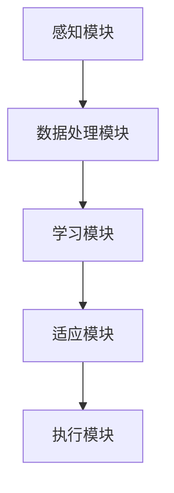

                 


# AI Agent的持续学习与适应机制

> 关键词：AI Agent，持续学习，适应机制，在线学习，记忆增强，强化学习

> 摘要：AI Agent的持续学习与适应机制是实现智能体在动态环境中自主学习和适应的核心技术。本文将从AI Agent的基本概念出发，深入探讨持续学习的核心机制，包括在线学习与记忆增强，以及适应机制的实现方法。通过数学模型和算法实现的详细讲解，结合系统架构设计和项目实战案例，全面分析AI Agent的持续学习与适应机制，并提供最佳实践建议。

---

## 第一章: AI Agent的基本概念与持续学习的背景

### 1.1 AI Agent的定义与特点

AI Agent（人工智能代理）是指能够感知环境、自主决策并执行任务的智能实体。其特点包括：

1. **自主性**：AI Agent能够在没有外部干预的情况下独立执行任务。
2. **反应性**：能够实时感知环境变化并做出反应。
3. **目标导向**：具有明确的目标，并根据目标优化行为。
4. **学习能力**：能够通过经验或数据不断优化自身性能。

#### 1.1.1 AI Agent的定义

AI Agent是一种智能系统，能够通过感知环境、推理和学习来实现特定目标。它可以是一个软件程序，也可以是一个物理设备，如自动驾驶汽车或智能机器人。

#### 1.1.2 AI Agent的核心特点

- **自主性**：AI Agent能够在没有外部干预的情况下独立运行。
- **反应性**：能够根据环境变化实时调整行为。
- **目标导向**：所有行为都围绕着实现特定目标展开。
- **学习能力**：通过与环境交互不断优化自身的知识和技能。

#### 1.1.3 AI Agent与传统AI的区别

传统的AI系统通常是静态的，依赖于预定义的规则和数据。而AI Agent具有动态性和适应性，能够根据环境变化自主调整行为和决策。

### 1.2 持续学习的背景与重要性

持续学习（Lifelong Learning）是指模型在连续的任务中逐步学习，每个任务的学习结果可以为后续任务提供知识和经验。在AI Agent中，持续学习能力使其能够在动态环境中不断优化自身性能。

#### 1.2.1 什么是持续学习

持续学习是一种机器学习范式，模型在连续的任务中逐步学习，每个任务的学习结果可以为后续任务提供知识和经验。与传统机器学习不同，持续学习允许模型在不重置的情况下逐步适应新任务。

#### 1.2.2 持续学习在AI Agent中的作用

- **提高适应性**：在动态环境中，AI Agent需要不断调整自身的知识和行为策略。
- **增强通用性**：持续学习使AI Agent能够处理多种任务和场景。
- **优化性能**：通过不断学习和优化，AI Agent可以提高任务执行效率和准确性。

#### 1.2.3 持续学习的挑战与机遇

- **挑战**：知识遗忘、数据稀疏性、任务间干扰等。
- **机遇**：通过持续学习，AI Agent可以实现更高效的资源利用和更强大的适应能力。

---

## 第二章: AI Agent的持续学习机制

### 2.1 在线学习与增量学习

在线学习（Online Learning）是指模型在实时数据流中逐步更新自身参数，以适应新数据的变化。增量学习（Incremental Learning）则是指模型在新任务中逐步学习，每个任务的学习结果可以为后续任务提供知识和经验。

#### 2.1.1 在线学习的定义与特点

- **实时性**：模型可以在数据流中实时更新。
- **连续性**：学习过程是连续的，没有固定的训练阶段。
- **适应性**：能够快速适应新数据的变化。

#### 2.1.2 增量学习的实现方法

增量学习的核心思想是将新任务的学习与旧任务的知识相结合。常见的增量学习方法包括：

1. **任务分解**：将新任务分解为多个子任务，逐步学习。
2. **记忆增强**：通过增强记忆模块，存储旧任务的知识，以便后续任务中调用。
3. **参数调整**：通过调整模型参数，使模型能够同时适应多个任务。

#### 2.1.3 在线学习与增量学习的区别与联系

- **区别**：在线学习主要关注实时数据流中的学习，而增量学习关注新任务中的逐步学习。
- **联系**：两者都强调动态环境中的学习和适应能力。

### 2.2 记忆增强机制

记忆增强机制是持续学习中的重要组成部分，用于存储和调用旧任务的知识和经验，以帮助新任务的学习。

#### 2.2.1 外部记忆与内部记忆

- **外部记忆**：存储在模型之外，如数据库或外部存储设备。
- **内部记忆**：存储在模型内部，如神经网络中的隐藏层。

#### 2.2.2 记忆网络的构建与应用

记忆网络是一种结合了外部记忆和内部处理单元的模型，能够在多个任务中共享知识和经验。

#### 2.2.3 基于记忆的持续学习方法

基于记忆的持续学习方法通过存储旧任务的知识，帮助新任务的学习。常见的方法包括：

1. **记忆检索**：在新任务中，检索旧任务的相关知识，用于指导当前任务的学习。
2. **记忆更新**：根据新任务的经验，更新旧任务的记忆内容。

---

## 第三章: AI Agent的适应机制

### 3.1 动态参数调整

动态参数调整是指在模型运行过程中，根据环境变化实时调整模型参数，以适应新的任务和场景。

#### 3.1.1 动态参数调整的定义与实现

动态参数调整的核心思想是通过实时监控环境变化，调整模型参数以适应新环境。常见的实现方法包括：

1. **在线优化**：使用在线优化算法，如在线梯度下降，实时更新模型参数。
2. **自适应学习率**：根据环境变化调整学习率，以加快收敛速度。

#### 3.1.2 参数更新策略

参数更新策略是指在动态参数调整过程中，如何选择和更新模型参数。常见的策略包括：

1. **贪心策略**：在每一步选择能够立即带来最大收益的参数更新。
2. **随机策略**：随机选择参数更新的方向，以避免陷入局部最优。

#### 3.1.3 动态参数调整的优缺点

- **优点**：能够快速适应环境变化，提高模型的实时性和响应能力。
- **缺点**：可能导致参数更新不稳定，影响模型的长期性能。

### 3.2 自适应强化学习

自适应强化学习是指在强化学习过程中，根据环境反馈动态调整策略参数，以实现更好的任务性能。

#### 3.2.1 强化学习的基本原理

强化学习是一种通过试错机制来优化策略的机器学习方法。智能体通过与环境交互，获得奖励信号，并根据奖励信号调整自身策略。

#### 3.2.2 自适应强化学习的实现方法

自适应强化学习的核心思想是根据环境反馈动态调整策略参数。常见的实现方法包括：

1. **在线策略调整**：根据实时反馈调整策略参数。
2. **离线策略调整**：根据历史反馈调整策略参数。

#### 3.2.3 自适应强化学习的应用场景

- **动态环境**：环境条件不断变化，需要智能体实时调整策略。
- **复杂任务**：任务复杂度高，需要智能体具备强大的适应能力。

### 3.3 迁移学习

迁移学习是指将一个任务中学到的知识应用到另一个相关任务中。在AI Agent中，迁移学习可以帮助模型快速适应新任务，减少新任务的学习成本。

#### 3.3.1 迁移学习的定义与特点

- **定义**：迁移学习是指将一个任务中学到的知识应用到另一个相关任务中。
- **特点**：跨任务、跨领域、知识共享。

#### 3.3.2 迁移学习的实现方法

常见的迁移学习方法包括：

1. **参数迁移**：将源任务的模型参数直接迁移到目标任务。
2. **特征迁移**：将源任务的特征提取到目标任务中。
3. **关系迁移**：将源任务中的关系和规律迁移到目标任务中。

---

## 第四章: 持续学习与适应机制的数学模型与算法实现

### 4.1 持续学习的数学模型

#### 4.1.1 持续学习的数学表达式

持续学习的数学模型通常包括以下几个部分：

1. **感知模块**：将环境中的数据转换为模型可以处理的形式。
2. **学习模块**：根据感知数据更新模型参数。
3. **适应模块**：根据环境反馈调整模型行为。

#### 4.1.2 模型的更新与优化

模型的更新与优化是持续学习的核心步骤。常见的优化方法包括：

1. **在线优化**：使用在线优化算法，如在线梯度下降，实时更新模型参数。
2. **批量优化**：将新数据积累到一定量后，进行批量优化。

#### 4.1.3 模型收敛性分析

模型收敛性分析是指研究模型在持续学习过程中的收敛速度和稳定性。常见的收敛性分析方法包括：

1. **稳定性分析**：研究模型在持续学习过程中的稳定性。
2. **收敛速度分析**：研究模型的收敛速度。

### 4.2 基于记忆的持续学习算法

#### 4.2.1 记忆网络的构建与应用

记忆网络是一种结合了外部记忆和内部处理单元的模型，能够在多个任务中共享知识和经验。

#### 4.2.2 基于记忆的持续学习算法实现

基于记忆的持续学习算法通常包括以下几个步骤：

1. **记忆检索**：在新任务中，检索旧任务的相关知识。
2. **知识更新**：根据新任务的经验，更新旧任务的记忆内容。
3. **任务执行**：根据更新后的记忆内容，执行新任务。

#### 4.2.3 算法的收敛性与稳定性分析

算法的收敛性与稳定性分析是指研究算法在持续学习过程中的收敛速度和稳定性。常见的分析方法包括：

1. **稳定性分析**：研究算法在持续学习过程中的稳定性。
2. **收敛速度分析**：研究算法的收敛速度。

### 4.3 基于强化学习的适应机制

#### 4.3.1 强化学习的数学模型

强化学习的数学模型通常包括以下几个部分：

1. **状态空间**：环境中的状态。
2. **动作空间**：智能体可以执行的动作。
3. **奖励函数**：智能体执行动作后获得的奖励。

#### 4.3.2 自适应强化学习算法实现

自适应强化学习算法通常包括以下几个步骤：

1. **环境感知**：感知环境中的状态和奖励。
2. **策略调整**：根据环境反馈调整策略参数。
3. **任务执行**：根据调整后的策略参数执行任务。

#### 4.3.3 算法的性能评估与优化

算法的性能评估与优化是指研究算法在持续学习过程中的性能表现，并对其进行优化。常见的性能评估指标包括：

1. **任务成功率**：任务完成的成功率。
2. **学习效率**：单位时间内学习的效率。

---

## 第五章: 系统架构与设计

### 5.1 系统架构设计

AI Agent的持续学习与适应机制系统架构设计通常包括以下几个部分：

1. **感知模块**：负责感知环境中的数据。
2. **学习模块**：负责处理感知数据，更新模型参数。
3. **适应模块**：负责根据环境反馈调整模型行为。

#### 5.1.1 系统功能设计

系统功能设计是指设计系统在持续学习和适应过程中的功能模块。常见的功能模块包括：

1. **数据采集模块**：负责采集环境中的数据。
2. **数据处理模块**：负责处理采集到的数据。
3. **学习模块**：负责处理数据，更新模型参数。
4. **适应模块**：负责根据环境反馈调整模型行为。

#### 5.1.2 系统架构图

以下是AI Agent的持续学习与适应机制系统架构图：



#### 5.1.3 系统接口设计

系统接口设计是指设计系统在持续学习和适应过程中的接口。常见的接口包括：

1. **数据接口**：负责数据的输入和输出。
2. **模型接口**：负责模型的加载和更新。
3. **适应接口**：负责模型行为的调整。

#### 5.1.4 系统交互设计

系统交互设计是指设计系统在持续学习和适应过程中的交互流程。常见的交互流程包括：

1. **数据采集**：感知模块采集环境中的数据。
2. **数据处理**：数据处理模块处理采集到的数据。
3. **模型更新**：学习模块根据处理后的数据更新模型参数。
4. **行为调整**：适应模块根据环境反馈调整模型行为。
5. **任务执行**：执行模块根据调整后的模型行为执行任务。

---

## 第六章: 项目实战

### 6.1 环境搭建

在本章中，我们将通过一个具体的项目案例，展示如何实现AI Agent的持续学习与适应机制。首先，我们需要搭建开发环境，安装所需的依赖库。

#### 6.1.1 开发环境搭建

- **操作系统**：建议使用Linux或MacOS系统。
- **编程语言**：建议使用Python。
- **依赖库安装**：需要安装以下库：
  - `numpy`：用于数值计算。
  - `tensorflow`：用于深度学习。
  - `scikit-learn`：用于机器学习。

#### 6.1.2 项目结构设计

项目的结构设计如下：

```
project/
├── src/
│   ├── model.py        # 模型定义
│   ├── learner.py      # 学习模块实现
│   ├── adapter.py      # 适应模块实现
│   └── main.py         # 主程序
└── data/
    └── dataset.csv      # 数据集
```

### 6.2 核心实现

在本节中，我们将实现AI Agent的持续学习与适应机制的核心模块。

#### 6.2.1 模型定义

以下是模型的定义代码：

```python
import tensorflow as tf
from tensorflow import keras

def create_model(input_shape, num_classes):
    model = keras.Sequential([
        keras.layers.Dense(64, activation='relu', input_shape=input_shape),
        keras.layers.Dense(num_classes, activation='softmax')
    ])
    model.compile(optimizer='adam', loss='sparse_categorical_crossentropy', metrics=['accuracy'])
    return model
```

#### 6.2.2 学习模块实现

以下是学习模块的实现代码：

```python
class Learner:
    def __init__(self, model, optimizer):
        self.model = model
        self.optimizer = optimizer

    def update(self, x, y):
        with tf.GradientTape() as tape:
            y_pred = self.model(x)
            loss = tf.keras.losses.sparse_categorical_crossentropy(y, y_pred)
        gradients = tape.gradient(loss, self.model.trainable_weights)
        self.optimizer.apply_gradients(zip(gradients, self.model.trainable_weights))
```

#### 6.2.3 适应模块实现

以下是适应模块的实现代码：

```python
class Adapter:
    def __init__(self, model, learning_rate):
        self.model = model
        self.learning_rate = learning_rate

    def adapt(self, reward):
        # 根据奖励调整模型参数
        # 这里只是一个示例，具体实现可以根据实际需求调整
        pass
```

### 6.3 代码实现与应用解读

在本节中，我们将展示项目的完整代码实现，并进行应用解读。

#### 6.3.1 代码实现

以下是项目的完整代码实现：

```python
import tensorflow as tf
from tensorflow import keras
import numpy as np

def create_model(input_shape, num_classes):
    model = keras.Sequential([
        keras.layers.Dense(64, activation='relu', input_shape=input_shape),
        keras.layers.Dense(num_classes, activation='softmax')
    ])
    model.compile(optimizer='adam', loss='sparse_categorical_crossentropy', metrics=['accuracy'])
    return model

class Learner:
    def __init__(self, model, optimizer):
        self.model = model
        self.optimizer = optimizer

    def update(self, x, y):
        with tf.GradientTape() as tape:
            y_pred = self.model(x)
            loss = tf.keras.losses.sparse_categorical_crossentropy(y, y_pred)
        gradients = tape.gradient(loss, self.model.trainable_weights)
        self.optimizer.apply_gradients(zip(gradients, self.model.trainable_weights))

class Adapter:
    def __init__(self, model, learning_rate):
        self.model = model
        self.learning_rate = learning_rate

    def adapt(self, reward):
        # 根据奖励调整模型参数
        # 这里只是一个示例，具体实现可以根据实际需求调整
        pass

def main():
    # 创建模型
    input_shape = (10,)
    num_classes = 5
    model = create_model(input_shape, num_classes)
    
    # 初始化学习模块
    optimizer = tf.keras.optimizers.Adam(learning_rate=0.001)
    learner = Learner(model, optimizer)
    
    # 初始化适应模块
    adapter = Adapter(model, learning_rate=0.001)
    
    # 数据准备
    x = np.random.rand(100, 10)
    y = np.random.randint(0, num_classes, 100)
    
    # 模型训练
    for i in range(100):
        learner.update(x[i], y[i])
    
    # 适应模块实现（示例）
    reward = 0.9
    adapter.adapt(reward)
    
    # 模型评估
    test_x = np.random.rand(20, 10)
    test_y = np.random.randint(0, num_classes, 20)
    y_pred = model(test_x)
    accuracy = np.mean(np.argmax(y_pred, axis=1) == test_y)
    print(f"Accuracy: {accuracy}")

if __name__ == "__main__":
    main()
```

#### 6.3.2 代码应用解读

在上述代码中，我们首先定义了一个简单的神经网络模型，然后实现了一个学习模块和一个适应模块。在主函数中，我们准备了训练数据和测试数据，并进行了模型的训练和评估。需要注意的是，适应模块的实现只是一个示例，具体实现可以根据实际需求进行调整。

### 6.4 案例分析与详细讲解

在本节中，我们将通过具体案例分析，详细讲解AI Agent的持续学习与适应机制的应用。

#### 6.4.1 案例分析

假设我们有一个AI Agent需要在动态环境中执行分类任务。环境中的数据会随着时间的推移而变化，因此AI Agent需要具备持续学习的能力，以适应数据分布的变化。

#### 6.4.2 详细讲解

1. **数据采集**：AI Agent首先采集环境中的数据。
2. **数据处理**：将采集到的数据进行预处理，提取特征。
3. **模型训练**：使用预处理后的数据训练模型。
4. **模型评估**：评估模型的性能。
5. **环境反馈**：根据模型的执行结果，获得环境反馈。
6. **模型调整**：根据环境反馈调整模型参数。

### 6.5 项目小结

通过本项目的实现，我们可以看到，AI Agent的持续学习与适应机制是一个复杂而有趣的过程。通过不断地学习和调整，AI Agent可以在动态环境中保持高性能。

---

## 第七章: 高级主题与未来展望

### 7.1 元学习

元学习是一种新兴的学习范式，旨在使模型具备快速适应新任务的能力。在AI Agent中，元学习可以帮助模型在新任务中快速找到最优策略。

#### 7.1.1 元学习的定义与特点

- **定义**：元学习是指在多个任务上进行学习，以提高模型在新任务上的学习效率。
- **特点**：跨任务、跨领域、快速适应。

#### 7.1.2 元学习的实现方法

元学习的实现方法包括：

1. **任务分解**：将新任务分解为多个子任务，逐步学习。
2. **参数共享**：在多个任务中共享模型参数。
3. **元优化**：通过优化元参数来提高模型的适应能力。

### 7.2 自适应优化

自适应优化是指在模型运行过程中，根据环境反馈动态调整优化策略，以提高模型的性能。

#### 7.2.1 自适应优化的定义与特点

- **定义**：自适应优化是指在模型运行过程中，根据环境反馈动态调整优化策略。
- **特点**：实时性、动态性、高效性。

#### 7.2.2 自适应优化的实现方法

自适应优化的实现方法包括：

1. **在线优化**：根据实时反馈调整优化策略。
2. **自适应学习率**：根据环境反馈调整学习率。
3. **动态参数调整**：根据环境反馈动态调整模型参数。

### 7.3 持续学习与适应机制的未来展望

随着人工智能技术的不断发展，AI Agent的持续学习与适应机制将变得更加智能化和高效化。未来的研究方向包括：

1. **更高效的算法设计**：研究更高效的持续学习和适应算法。
2. **更强大的记忆能力**：研究更强大的记忆网络，以提高模型的持续学习能力。
3. **更广泛的应用场景**：将持续学习与适应机制应用于更多的领域，如自动驾驶、智能客服等。

---

## 第八章: 总结与展望

### 8.1 全文总结

本文系统地介绍了AI Agent的持续学习与适应机制，包括基本概念、核心机制、数学模型、系统架构和项目实战。通过本文的讲解，读者可以全面了解AI Agent的持续学习与适应机制，并能够将其应用于实际项目中。

### 8.2 最佳实践 tips

1. **持续学习与适应机制的核心是模型的动态调整能力。**
2. **在实际应用中，需要根据具体需求选择合适的算法和模型。**
3. **模型的收敛性和稳定性是持续学习与适应机制的关键因素。**
4. **在项目实战中，需要注重数据的质量和模型的可解释性。**

### 8.3 未来展望

随着人工智能技术的不断发展，AI Agent的持续学习与适应机制将变得更加智能化和高效化。未来的研究方向包括更高效的算法设计、更强大的记忆能力和更广泛的应用场景。

---

## 作者信息

作者：AI天才研究院/AI Genius Institute & 禅与计算机程序设计艺术 /Zen And The Art of Computer Programming

---

# 结束语

感谢您的阅读！希望本文对您理解AI Agent的持续学习与适应机制有所帮助。如果您有任何问题或建议，请随时与我们联系。

