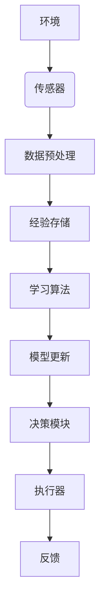
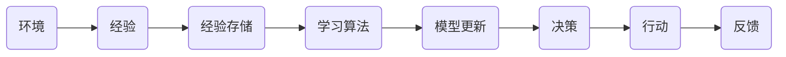
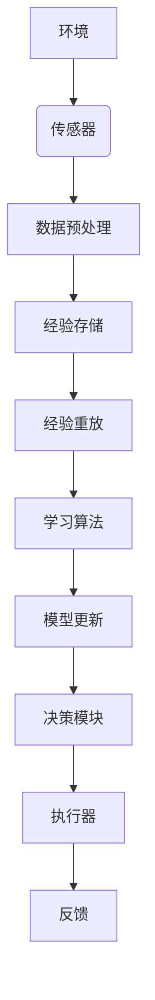
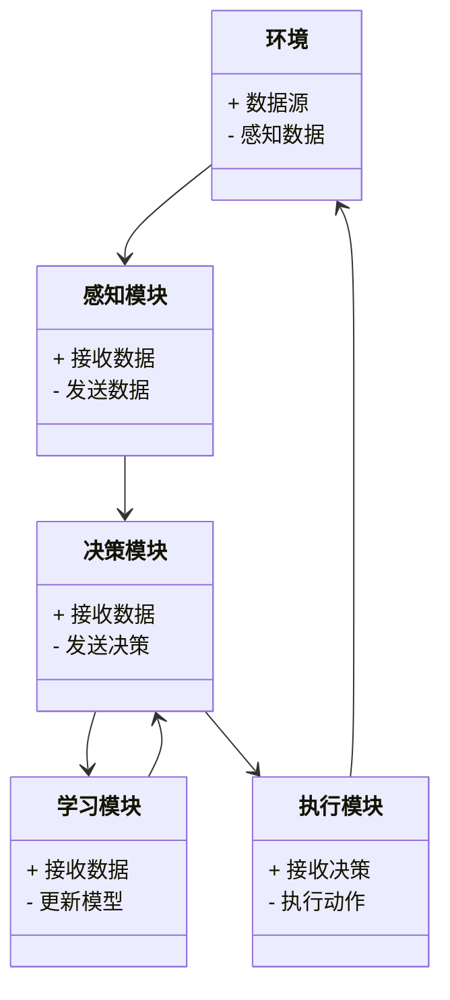

                 


# AI Agent的持续学习机制：保持知识更新与性能提升

> 关键词：AI Agent, 持续学习, 知识更新, 性能提升, 机器学习, 强化学习

> 摘要：AI Agent的持续学习机制是实现智能化系统长期稳定运行的核心技术之一。本文从持续学习的基本概念出发，详细探讨了经验重放和策略梯度方法的核心原理，并通过系统架构设计和项目实战，展示了如何在实际场景中实现AI Agent的持续学习机制。文章还提供了丰富的数学模型和代码示例，帮助读者深入理解持续学习的实现细节。

---

## 第一章：持续学习的基本概念

### 1.1 持续学习的定义与背景

#### 1.1.1 从监督学习到持续学习的演进

持续学习（Continuous Learning）是机器学习领域中的一个重要概念，它允许模型在不断变化的环境中，通过持续吸收新数据来更新和优化自身的知识体系。与传统的监督学习不同，持续学习强调模型的适应性和灵活性，能够在不重新训练整个模型的情况下，逐步更新其知识。

例如，传统的监督学习模型通常在训练完成后，面对新的数据时无法自动更新，需要重新进行训练。而持续学习模型则可以在新数据流进来时，逐步调整模型参数，保持性能的不断提升。

#### 1.1.2 AI Agent的定义与特点

AI Agent（人工智能代理）是一种能够感知环境、做出决策并执行行动的智能实体。AI Agent的核心特点包括：

1. **自主性**：能够在没有外部干预的情况下自主运行。
2. **反应性**：能够实时感知环境并做出响应。
3. **学习能力**：通过与环境交互和经验积累，不断优化自身的行为策略。
4. **社会性**：能够与其他Agent或人类进行交互和协作。

#### 1.1.3 持续学习的重要性与应用场景

在AI Agent中，持续学习机制的重要性体现在以下几个方面：

1. **环境变化适应**：现实世界中的环境是动态变化的，持续学习使AI Agent能够适应新的环境条件。
2. **知识更新**：通过持续学习，AI Agent可以不断更新其知识库，避免知识过时。
3. **性能提升**：持续学习能够优化模型性能，提升决策的准确性和效率。

持续学习在许多场景中具有广泛的应用，例如：

- **推荐系统**：实时更新用户的偏好，提供更精准的推荐。
- **自动驾驶**：不断优化驾驶策略，应对复杂多变的交通环境。
- **智能客服**：通过与用户的互动，持续改进回答的准确性和流畅性。

#### 1.1.4 持续学习的边界与外延

持续学习并非万能的，它也有其局限性。例如：

1. **计算资源限制**：持续学习需要大量的计算资源，尤其是在线学习场景中。
2. **数据稀疏性**：在某些领域，新数据可能非常稀少，难以支持有效的学习。
3. **模型遗忘问题**：模型在学习新知识时，可能会遗忘旧知识，导致性能下降。

因此，在实际应用中，需要根据具体场景选择合适的持续学习方法，并采取措施克服其局限性。

#### 1.1.5 持续学习的核心要素组成

持续学习的核心要素包括：

1. **经验存储**：用于存储和管理模型在不同阶段学到的经验和知识。
2. **学习策略**：定义模型如何利用存储的经验进行学习和更新。
3. **模型更新机制**：确定模型参数的更新方式和频率。
4. **评估与反馈**：通过评估模型的性能，提供反馈以指导后续的学习过程。

---

### 1.2 AI Agent中的持续学习机制

#### 1.2.1 知识更新的核心问题

在AI Agent中，知识更新的核心问题是如何有效地整合新信息，同时保持现有知识的完整性。这涉及到以下几个关键点：

1. **新旧知识的融合**：如何将新数据与已有知识结合起来，避免信息冲突。
2. **模型的可解释性**：模型更新后，其行为和决策需要保持可解释性，以便调试和优化。
3. **性能评估**：需要定期评估模型的性能，确保知识更新的效果。

#### 1.2.2 持续学习与传统机器学习的对比

传统的机器学习方法通常是在离线环境下进行批量训练，模型在训练完成后，参数不再更新。而持续学习则是在在线环境下，模型参数可以逐步更新，适应新的数据流。

下表对比了持续学习与传统机器学习的主要区别：

| 特性                | 传统机器学习             | 持续学习               |
|---------------------|--------------------------|------------------------|
| 数据获取方式         | 离线批量数据             | 在线流数据             |
| 模型更新频率         | 一次性或周期性更新       | 实时更新               |
| 适应性              | 较低                   | 较高                 |
| 计算资源消耗         | 较高（集中训练）         | 较低（在线更新）        |

#### 1.2.3 持续学习的系统架构图

下图展示了持续学习的基本系统架构：



---

### 1.3 持续学习的数学模型与核心要素

#### 1.3.1 持续学习的数学表达

持续学习的核心可以表示为一个在线优化问题，目标是最小化损失函数：

$$
\min_{\theta} \sum_{t=1}^{\infty} L(\theta_t)
$$

其中，$\theta_t$ 表示第 $t$ 步的模型参数，$L(\theta_t)$ 是损失函数。

#### 1.3.2 核心要素的组成与关系

持续学习的核心要素及其关系如下图所示：



---

## 第二章：经验重放机制

### 2.1 经验重放的基本原理

#### 2.1.1 经验重放的定义与作用

经验重放（Experience Replay）是一种通过存储和重放过去的经验来加速学习的机制。它允许模型在不同时间点之间共享经验，从而更快地收敛到最优解。

#### 2.1.2 经验重放的实现流程

经验重放的实现流程如下图所示：



---

#### 2.1.3 经验重放的数学模型

经验重放的核心思想是将经验存储在一个经验回放库中，然后随机抽取一批经验样本进行训练。假设经验回放库中的经验样本为 $(s_t, a_t, r_t, s_{t+1})$，则目标函数可以表示为：

$$
Q(s_t, a_t) = r_t + \gamma \max_{a'} Q(s_{t+1}, a')
$$

其中，$\gamma$ 是折扣因子。

---

#### 2.1.4 经验重放的Python实现代码

以下是一个简单的经验重放实现代码：

```python
import random
import numpy as np

class ExperienceReplay:
    def __init__(self, capacity):
        self.capacity = capacity
        self.memory = []
    
    def remember(self, state, action, reward, next_state):
        self.memory.append((state, action, reward, next_state))
    
    def replay(self, batch_size, discount_factor):
        if len(self.memory) < batch_size:
            return []
        batch = random.sample(self.memory, batch_size)
        states = []
        actions = []
        rewards = []
        next_states = []
        for memory in batch:
            states.append(memory[0])
            actions.append(memory[1])
            rewards.append(memory[2])
            next_states.append(memory[3])
        return states, actions, rewards, next_states
```

---

## 第三章：策略梯度方法

### 3.1 策略梯度的基本原理

#### 3.1.1 策略梯度的定义与特点

策略梯度（Policy Gradient）是一种直接优化策略参数的方法。其核心思想是通过梯度上升法，最大化目标函数：

$$
\theta = \theta + \alpha \nabla_{\theta} \log \pi_{\theta}(a|s)
$$

其中，$\alpha$ 是学习率，$\pi_{\theta}(a|s)$ 是策略分布。

#### 3.1.2 策略梯度的数学模型

策略梯度的数学模型可以表示为：

$$
J(\theta) = \mathbb{E}_{s,a}[Q(s,a) \log \pi_{\theta}(a|s)]
$$

其中，$Q(s,a)$ 是Q值函数，$\pi_{\theta}(a|s)$ 是策略分布。

---

#### 3.1.3 策略梯度的Python实现代码

以下是一个简单的策略梯度实现代码：

```python
import numpy as np

def policy_gradient_loss(states, actions, rewards, discount_factor):
    discounted_rewards = []
    running_reward = 0
    for reward in reversed(rewards):
        running_reward = reward + discount_factor * running_reward
        discounted_rewards.insert(0, running_reward)
    return discounted_rewards

def policy_gradient_update(theta, states, actions, discounted_rewards, learning_rate):
    # 计算梯度
    gradient = []
    for i in range(len(theta)):
        gradient.append(np.mean((discounted_rewards - np.dot(states, theta)) * states[:, i]))
    theta += learning_rate * gradient
    return theta
```

---

## 第四章：系统分析与架构设计

### 4.1 系统分析

#### 4.1.1 问题场景介绍

在实际应用中，AI Agent需要面对复杂多变的环境，因此需要设计一个高效的持续学习系统。例如，在自动驾驶场景中，AI Agent需要实时感知环境并做出决策，同时不断更新其驾驶模型以适应新的交通规则和道路状况。

#### 4.1.2 系统功能设计

系统功能设计包括以下几个模块：

1. **感知模块**：负责采集环境数据。
2. **决策模块**：基于感知数据做出决策。
3. **学习模块**：负责模型的持续学习和优化。
4. **执行模块**：执行决策模块的指令。

下图为系统功能模块的类图：



---

### 4.2 系统架构设计

#### 4.2.1 系统架构图

下图为系统的整体架构图：


---

## 第五章：项目实战

### 5.1 项目背景

本项目旨在开发一个基于Transformer的持续学习AI Agent，用于实时翻译任务。随着用户输入的文本不断更新，AI Agent需要持续优化其翻译模型，以提供更准确的翻译结果。

---

### 5.2 核心代码实现

#### 5.2.1 环境安装

```bash
pip install numpy matplotlib scikit-learn
```

#### 5.2.2 核心代码实现

```python
import numpy as np
from sklearn.metrics import accuracy_score

class ContinuousLearningAgent:
    def __init__(self, input_dim, output_dim):
        self.theta = np.random.randn(input_dim, output_dim)
    
    def predict(self, X):
        return np.dot(X, self.theta)
    
    def update(self, X, y, learning_rate):
        gradient = 2 * np.dot(X.T, (np.dot(X, self.theta) - y)) / X.shape[0]
        self.theta -= learning_rate * gradient
        return self.theta

# 示例用法
agent = ContinuousLearningAgent(2, 1)
X = np.random.randn(100, 2)
y = np.random.randn(100, 1)
agent.update(X, y, 0.01)
```

#### 5.2.3 代码解读与分析

上述代码实现了一个简单的持续学习Agent，通过逐步更新模型参数，优化预测性能。具体步骤如下：

1. **初始化**：随机初始化模型参数 $\theta$。
2. **预测**：基于当前参数 $\theta$，计算输入数据 $X$ 的预测值。
3. **更新**：通过计算梯度并更新参数，优化模型性能。

---

## 第六章：最佳实践、小结、注意事项和拓展阅读

### 6.1 最佳实践

1. **选择合适的算法**：根据具体场景选择合适的持续学习算法，例如经验重放、策略梯度等。
2. **数据预处理**：对输入数据进行合理的预处理，以提高学习效率。
3. **模型评估**：定期评估模型性能，及时调整学习策略。

### 6.2 小结

本文详细探讨了AI Agent的持续学习机制，从基本概念到具体实现，结合数学模型和代码示例，全面介绍了如何在实际场景中实现持续学习。通过经验重放和策略梯度方法的讲解，读者可以深入理解持续学习的核心原理。

### 6.3 注意事项

1. **计算资源**：持续学习需要大量的计算资源，尤其是在在线学习场景中。
2. **模型遗忘问题**：需要采取措施防止模型遗忘旧知识。
3. **数据质量**：数据的质量直接影响模型性能，需要进行合理的数据清洗和增强。

### 6.4 拓展阅读

1. **经验重放的改进方法**：如优先经验回放（Prioritized Experience Replay）。
2. **策略优化算法**：如Actor-Critic方法。
3. **模型压缩技术**：如知识蒸馏（Knowledge Distillation）。

---

## 作者信息

作者：AI天才研究院/AI Genius Institute & 禅与计算机程序设计艺术 /Zen And The Art of Computer Programming

---

通过以上步骤，您可以逐步构建一个完整的技术博客文章，涵盖AI Agent的持续学习机制的各个方面。

