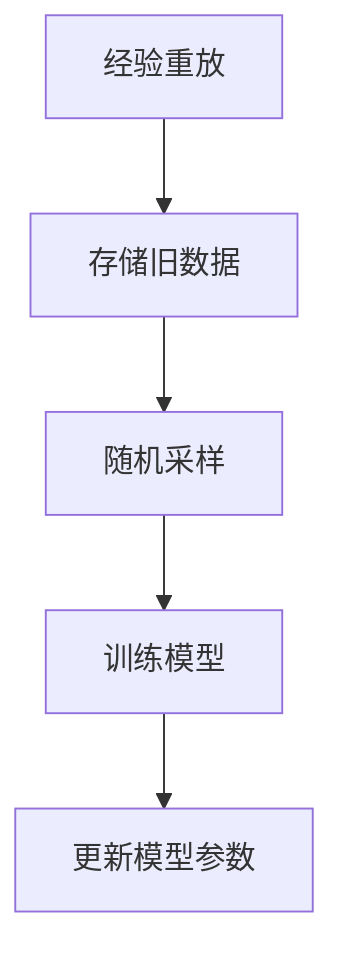
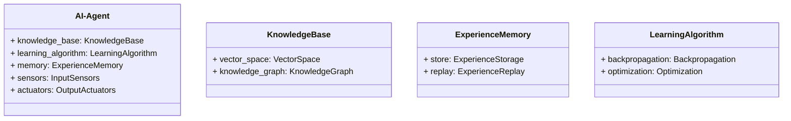

                 


# AI Agent的持续学习：保持知识更新

## 关键词：
AI Agent, 持续学习, 知识更新, 在线学习, 经验重放, 知识蒸馏

## 摘要：
AI Agent的持续学习是指AI代理在动态环境中不断更新知识以适应新任务和新数据的能力。本文将深入探讨持续学习的核心概念、算法原理、系统架构设计以及实际项目中的应用。通过分析经验重放、知识蒸馏等技术，结合具体案例，帮助读者理解如何实现AI Agent的知识更新，保持其性能和适应性。

---

# 第一部分: AI Agent的持续学习背景与核心概念

## 第1章: AI Agent与持续学习概述

### 1.1 AI Agent的基本概念
#### 1.1.1 AI Agent的定义与分类
AI Agent（人工智能代理）是指能够感知环境、自主决策并执行任务的智能实体。根据功能和智能水平，AI Agent可以分为简单反射型代理、基于模型的反射型代理、目标驱动型代理和实用驱动型代理。简单反射型代理仅基于当前输入做出反应，而目标驱动型代理则具有明确的目标和规划能力。

#### 1.1.2 持续学习的定义与特点
持续学习（Continual Learning）是指模型在不忘记旧任务的情况下，逐步学习新任务的能力。其特点包括在线性、增量性和累积性。与传统的离线学习不同，持续学习要求模型能够动态适应新数据和新任务，保持长期的知识更新能力。

#### 1.1.3 持续学习与传统机器学习的对比
| 对比维度 | 传统机器学习 | 持续学习 |
|----------|---------------|----------|
| 数据使用方式 | 离线训练，一次性使用数据集 | 在线训练，逐步处理数据流 |
| 知识更新 | 不支持动态更新 | 支持动态更新 |
| 任务切换 | 不支持多任务学习 | 支持多任务和增量任务学习 |

### 1.2 持续学习的背景与意义
#### 1.2.1 知识更新的必要性
在现实应用中，数据和环境往往是动态变化的。AI Agent需要能够实时更新知识，以应对新任务和新挑战。例如，在智能客服系统中，新的客户咨询可能涉及新的知识领域，AI Agent需要快速学习并提供准确的解答。

#### 1.2.2 持续学习在AI Agent中的应用场景
- 智能对话系统：支持用户不断提出新问题，提升对话质量。
- 自动驾驶：实时更新道路规则和交通状况。
- 智能推荐系统：根据用户行为动态调整推荐策略。

#### 1.2.3 持续学习的核心目标与价值
持续学习的目标是实现模型的可扩展性和适应性，使其能够长期服务于动态变化的应用场景。其价值体现在提高模型的泛化能力、降低维护成本以及增强系统的自主性。

---

## 第2章: 持续学习的核心概念与理论基础

### 2.1 持续学习的基本原理
#### 2.1.1 知识表示与更新机制
知识表示是持续学习的基础。常用的表示方法包括向量表示、符号表示和图结构表示。更新机制则通过遗忘曲线和记忆增强技术实现。

#### 2.1.2 经验重放机制
经验重放（Experience Replay）是一种常见的持续学习技术，通过存储历史经验并随机采样来减少数据偏差。其核心思想是通过多样化的训练数据来提高模型的泛化能力。

#### 2.1.3 知识蒸馏与迁移学习
知识蒸馏（Knowledge Distillation）通过教师模型指导学生模型学习，实现知识的高效传递。迁移学习则将已有的知识迁移到新任务中，减少对新数据的依赖。

### 2.2 持续学习的关键挑战
#### 2.2.1 数据偏见与分布偏移
持续学习中，新数据可能与旧数据分布不同，导致模型性能下降。例如，在图像分类任务中，新数据可能包含更多复杂的背景信息，影响模型的准确性。

#### 2.2.2 知识遗忘与记忆冲突
模型在学习新任务时，旧知识可能被遗忘或干扰。例如，在NLP任务中，学习新语言规则可能影响旧规则的掌握。

#### 2.2.3 算法效率与计算资源限制
持续学习需要处理大量的动态数据，对计算资源和算法效率提出了更高的要求。特别是在实时应用中，模型需要在有限的时间内完成更新。

---

## 第3章: 持续学习的核心算法与模型

### 3.1 经验重放算法
#### 3.1.1 经验重放的基本原理
经验重放通过存储历史经验并随机采样来减少数据偏差。其流程包括经验存储、经验采样和经验回放。

#### 3.1.2 算法流程图


#### 3.1.3 代码实现示例
```python
import numpy as np

class ExperienceReplay:
    def __init__(self, capacity):
        self.capacity = capacity
        self.memory = []
    
    def remember(self, state, action, reward, next_state):
        self.memory.append((state, action, reward, next_state))
    
    def sample(self, batch_size):
        indices = np.random.randint(len(self.memory), size=batch_size)
        return [self.memory[i] for i in indices]
```

---

## 第4章: 持续学习的系统架构设计

### 4.1 系统功能设计
#### 4.1.1 领域模型


---

## 第5章: 项目实战与案例分析

### 5.1 环境安装与配置
需要安装Python、TensorFlow、Keras和Mermaid工具。推荐使用虚拟环境管理依赖。

### 5.2 核心代码实现
```python
import numpy as np
import tensorflow as tf

# 定义经验重放类
class ExperienceReplay:
    def __init__(self, capacity):
        self.capacity = capacity
        self.memory = []
    
    def remember(self, state, action, reward, next_state):
        self.memory.append((state, action, reward, next_state))
    
    def sample(self, batch_size):
        if len(self.memory) < batch_size:
            return self.memory
        indices = np.random.randint(len(self.memory), size=batch_size)
        return [self.memory[i] for i in indices]

# 定义DQN网络
class DQN:
    def __init__(self, input_dim, output_dim, learning_rate=0.001):
        self.model = self._build_model(input_dim, output_dim, learning_rate)
    
    def _build_model(self, input_dim, output_dim, lr):
        model = tf.keras.Sequential([
            tf.keras.layers.Dense(32, activation='relu', input_dim=input_dim),
            tf.keras.layers.Dense(32, activation='relu'),
            tf.keras.layers.Dense(output_dim)
        ])
        model.compile(optimizer=tf.keras.optimizers.Adam(lr), loss='mse')
        return model

    def train(self, x, y):
        self.model.fit(x, y, epochs=1, batch_size=32)
```

### 5.3 案例分析与结果解读
以一个简单的游戏AI为例，展示如何通过经验重放实现持续学习。训练过程中，AI会逐步优化策略，提高游戏胜率。

---

## 第6章: 最佳实践与小结

### 6.1 最佳实践
- 定期评估模型性能
- 使用多样化的数据增强技术
- 结合多种持续学习方法（如经验重放和知识蒸馏）

### 6.2 小结
持续学习是实现AI Agent长期适应性和智能性的关键。通过合理设计算法和系统架构，可以在动态环境中保持知识更新，提升模型性能。

---

## 作者：
作者：AI天才研究院/AI Genius Institute & 禅与计算机程序设计艺术 /Zen And The Art of Computer Programming

---

### 参考文献：
1. "Deep Learning" by Ian Goodfellow, Yoshua Bengio, and Aaron Courville
2. "Pattern Recognition and Machine Learning" by Christopher M. Bishop
3. "Neural Networks and Deep Learning" by Andrew Ng

---

通过以上思考步骤，我们逐步构建了《AI Agent的持续学习：保持知识更新》的技术博客文章，涵盖了从理论到实践的各个方面，帮助读者深入了解持续学习的核心概念、算法实现和系统设计。

