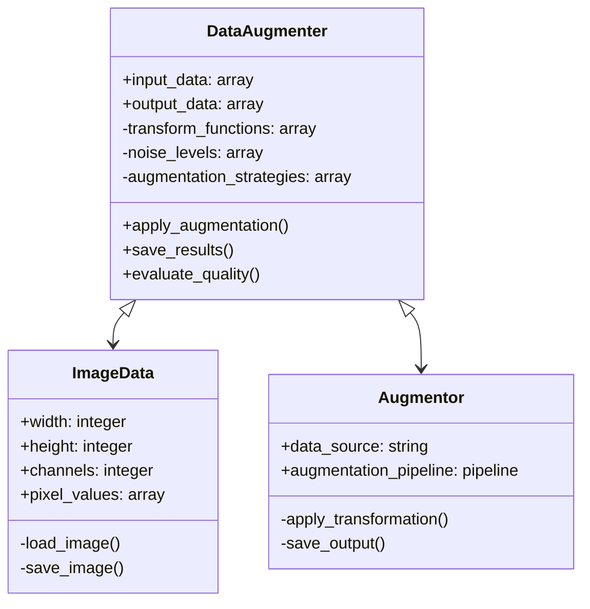
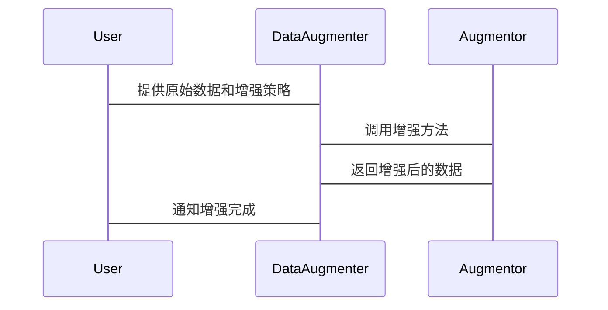

                 


# AI Agent的数据增强技术与策略

> 关键词：AI Agent, 数据增强, 数据多样性, 模型优化, 机器学习

> 摘要：数据增强技术在AI Agent领域中扮演着至关重要的角色，通过生成多样化的数据样本，提升模型的泛化能力和鲁棒性。本文将从AI Agent的基本概念出发，深入探讨数据增强技术的核心原理、算法实现、系统架构设计以及项目实战，结合丰富的案例和代码示例，帮助读者全面掌握AI Agent中的数据增强技术与策略。

---

# 第1章: AI Agent与数据增强技术概述

## 1.1 AI Agent的基本概念

### 1.1.1 AI Agent的定义

AI Agent（人工智能代理）是指能够感知环境、自主决策并执行任务的智能实体。它可以是一个软件程序、机器人或其他智能系统，具备以下核心特征：

- **自主性**：能够在没有外部干预的情况下独立执行任务。
- **反应性**：能够感知环境并实时调整行为。
- **目标导向**：所有行为都以实现特定目标为导向。

### 1.1.2 AI Agent的核心特征

1. **感知能力**：通过传感器或数据输入获取环境信息。
2. **决策能力**：基于感知信息做出最优决策。
3. **执行能力**：通过执行机构或输出模块完成任务。
4. **学习能力**：通过数据和经验不断优化自身性能。

### 1.1.3 数据增强技术的定义与作用

数据增强技术是指通过技术手段对现有数据进行变换或扩展，以生成更多样化、更具代表性的数据集。其主要作用包括：

- **增加数据多样性**：缓解数据不足的问题。
- **提升模型泛化能力**：通过多样化数据训练，使模型更具鲁棒性。
- **降低过拟合风险**：通过引入更多样化的数据，减少模型对特定训练数据的依赖。

---

## 1.2 数据增强技术的重要性

### 1.2.1 数据增强在AI Agent中的作用

数据增强技术是AI Agent训练过程中不可或缺的一部分，主要体现在以下几个方面：

- **提升模型性能**：通过多样化数据训练，使模型能够更好地适应不同场景。
- **降低数据需求**：在数据稀缺的情况下，通过数据增强生成更多样化的数据，降低对高质量数据的需求。
- **增强模型鲁棒性**：通过引入噪声、干扰等，使模型具备更强的抗干扰能力。

### 1.2.2 数据增强对模型性能的影响

数据增强技术通过改变数据的分布，使模型能够更好地适应不同环境。具体表现如下：

- **提高模型的泛化能力**：通过生成多样化的数据，使模型能够更好地推广到未见数据。
- **增强模型的稳定性**：通过引入噪声和干扰，使模型能够更好地应对不确定性。
- **提升模型的可解释性**：通过可视化数据增强过程，帮助理解模型的行为。

### 1.2.3 数据增强技术的分类与应用场景

数据增强技术可以根据不同的维度进行分类，主要包括以下几种类型：

- **几何变换**：如旋转、缩放、翻转等。
- **颜色变换**：如亮度调整、对比度调整、颜色平衡等。
- **噪声注入**：如高斯噪声、盐噪声、椒噪声等。
- **数据扩展**：如数据插值、数据模拟等。

---

## 1.3 数据增强技术的发展背景

### 1.3.1 AI Agent技术的演进

AI Agent技术的发展经历了多个阶段，从简单的规则驱动到复杂的深度学习驱动，数据增强技术在其演进过程中起到了关键作用。

- **规则驱动阶段**：AI Agent通过预定义规则进行决策，数据增强技术主要用于扩展规则库。
- **机器学习阶段**：AI Agent通过机器学习模型进行决策，数据增强技术主要用于提升模型性能。
- **深度学习阶段**：AI Agent通过深度学习模型进行决策，数据增强技术成为提升模型性能的核心技术。

### 1.3.2 数据增强技术的历史发展

数据增强技术的发展可以追溯到20世纪80年代，随着机器学习技术的兴起，数据增强技术逐渐成为机器学习研究的热点。

- **早期阶段**：主要应用于图像处理领域，如医学图像分析。
- **深度学习阶段**：数据增强技术被广泛应用于深度学习模型的训练，如卷积神经网络（CNN）。

### 1.3.3 当前数据增强技术的挑战与机遇

随着深度学习技术的快速发展，数据增强技术面临着新的挑战和机遇。

- **挑战**：如何在保证数据多样性的前提下，避免过度增强导致数据失真。
- **机遇**：通过深度学习技术生成更具真实性的增强数据，如生成对抗网络（GAN）。

---

## 1.4 数据增强技术的核心目标

### 1.4.1 提升模型泛化能力

数据增强技术通过生成多样化的数据，使模型能够更好地推广到未见数据。

### 1.4.2 增强数据多样性

通过引入不同类型的增强操作，使数据集覆盖更多的场景和样本。

### 1.4.3 降低模型过拟合风险

通过引入多样化的数据，使模型能够更好地泛化，降低过拟合风险。

---

## 1.5 本章小结

本章介绍了AI Agent的基本概念、数据增强技术的重要性和核心目标。通过分析数据增强技术的发展背景，我们理解了其在AI Agent中的重要性。下一章将深入探讨数据增强技术的核心原理与策略。

---

# 第2章: 数据增强技术的核心原理与策略

## 2.1 数据增强技术的核心原理

### 2.1.1 数据增强的数学模型

数据增强技术可以通过数学变换来实现，常见的数学模型包括几何变换和颜色变换。

- **几何变换**：通过变换矩阵对图像进行几何变换，如旋转、缩放、翻转等。
  $$ y = f(x) $$
  其中，\( x \) 是输入数据，\( y \) 是增强后的数据，\( f \) 是增强函数。

- **颜色变换**：通过调整颜色通道的值实现颜色变换，如亮度、对比度、饱和度等。
  $$ y_i = a x_i + b $$
  其中，\( a \) 和 \( b \) 是调整参数，\( x_i \) 和 \( y_i \) 分别是输入和输出的颜色值。

### 2.1.2 数据变换的函数表示

数据变换可以通过函数表示，具体形式如下：

- **线性变换**：如旋转、缩放等，可以通过线性代数实现。
- **非线性变换**：如弯曲、扭曲等，可以通过非线性函数实现。

### 2.1.3 数据增强的不变性原则

数据增强的核心思想是保持数据的不变性，即在增强过程中，数据的本质特征保持不变。例如，在图像增强中，物体的形状和位置可能会发生变化，但物体的本质特征（如颜色、纹理）保持不变。

---

## 2.2 数据增强的主要策略

### 2.2.1 基于几何变换的增强策略

几何变换是数据增强的重要策略之一，主要包括以下几种操作：

- **旋转**：通过对图像进行旋转，改变物体的朝向。
- **缩放**：通过对图像进行缩放，改变物体的大小。
- **翻转**：通过对图像进行水平或垂直翻转，改变物体的方向。

### 2.2.2 基于颜色变换的增强策略

颜色变换是另一种重要的增强策略，主要包括以下几种操作：

- **亮度调整**：通过调整图像的亮度，改变图像的整体明暗。
- **对比度调整**：通过调整图像的对比度，增强或减弱图像的明暗差异。
- **饱和度调整**：通过调整图像的饱和度，改变图像的颜色鲜艳程度。

### 2.2.3 基于噪声注入的增强策略

噪声注入是通过向数据中添加噪声来增强数据多样性，主要包括以下几种操作：

- **高斯噪声**：通过添加高斯噪声，模拟数据中的随机干扰。
- **盐噪声**：通过随机将某些像素设置为白色或黑色，模拟图像中的噪声。
- **椒噪声**：通过随机将某些像素设置为随机值，模拟图像中的噪声。

---

## 2.3 数据增强的多样性与平衡性

### 2.3.1 数据增强的多样性原则

数据增强的核心目标是增加数据的多样性，具体可以通过以下策略实现：

- **多种增强操作的组合**：通过组合不同的增强操作，生成更多样化的数据。
- **动态增强**：根据模型的训练情况动态调整增强策略，使数据更加多样化。

### 2.3.2 数据增强的平衡性策略

数据增强需要在多样性和真实性之间找到平衡点。

- **避免过度增强**：过度增强可能导致数据失真，影响模型性能。
- **保持数据一致性**：在增强过程中，需要保持数据的整体一致性和真实性。

### 2.3.3 数据增强的评估指标

评估数据增强的效果需要使用适当的指标，主要包括以下几种：

- **相似度指标**：如SSIM（结构相似性指数）。
- **多样性指标**：如KL散度。
- **模型性能指标**：如准确率、召回率、F1分数等。

---

## 2.4 数据增强的可解释性

### 2.4.1 数据增强的可解释性挑战

数据增强技术的可解释性是一个重要问题，尤其是在安全关键领域（如医学图像分析）。

- **增强操作的可解释性**：需要明确增强操作的具体含义。
- **增强结果的可追溯性**：需要能够追溯增强结果的来源。

### 2.4.2 数据增强的可视化分析

可视化分析是提升数据增强可解释性的重要手段，主要包括以下几种方法：

- **热图分析**：通过热图展示增强操作对图像的影响。
- **过程可视化**：通过可视化增强过程，帮助理解数据增强的具体步骤。

### 2.4.3 数据增强的可解释性优化

优化数据增强的可解释性需要从以下几个方面入手：

- **选择透明的增强操作**：如几何变换和颜色变换。
- **记录增强过程**：通过日志记录增强操作的具体细节。
- **提供可视化工具**：通过可视化工具帮助理解增强结果。

---

## 2.5 本章小结

本章深入探讨了数据增强技术的核心原理与策略，包括数学模型、增强策略、多样性与平衡性以及可解释性。通过分析这些方面，我们理解了数据增强技术的实现细节和优化方向。下一章将详细介绍数据增强技术的核心算法与实现。

---

# 第3章: 数据增强技术的核心算法与实现

## 3.1 数据增强算法的分类

### 3.1.1 基于图像变换的数据增强算法

基于图像变换的增强算法主要包括以下几种：

- **随机裁剪**：随机从图像中裁剪出一个子图像。
- **随机缩放**：随机调整图像的大小。
- **随机翻转**：随机将图像进行水平或垂直翻转。

### 3.1.2 基于数据扰动的数据增强算法

基于数据扰动的增强算法主要包括以下几种：

- **随机噪声注入**：随机向图像中添加噪声。
- **随机颜色抖动**：随机调整图像的颜色通道值。
- **随机模糊**：随机对图像进行模糊处理。

### 3.1.3 基于数据生成的数据增强算法

基于数据生成的增强算法主要包括以下几种：

- **生成对抗网络（GAN）**：通过GAN生成新的数据样本。
- **变分自编码器（VAE）**：通过VAE生成新的数据样本。
- **图像生成网络（如StyleGAN）**：通过图像生成网络生成高质量的图像样本。

---

## 3.2 数据增强算法的实现细节

### 3.2.1 几何变换的具体实现

几何变换的具体实现可以通过OpenCV库完成，以下是Python代码示例：

```python
import cv2
import numpy as np

# 旋转
def rotate_image(image, angle):
    height, width = image.shape[:2]
    center = (width // 2, height // 2)
    rotation_matrix = cv2.getRotationMatrix2D(center, angle, 1)
    rotated_image = cv2.warpAffine(image, rotation_matrix, (width, height))
    return rotated_image

# 缩放
def scale_image(image, scale_factor):
    height, width = image.shape[:2]
    scaled_image = cv2.resize(image, (int(width * scale_factor), int(height * scale_factor)))
    return scaled_image

# 翻转
def flip_image(image, flip_code):
    flipped_image = cv2.flip(image, flip_code)
    return flipped_image
```

### 3.2.2 颜色变换的具体实现

颜色变换的具体实现可以通过Pillow库完成，以下是Python代码示例：

```python
from PIL import Image, ImageEnhance

# 亮度调整
def adjust_brightness(image, brightness_factor):
    enhancer = ImageEnhance.Brightness(image)
    return enhancer.enhance(brightness_factor)

# 对比度调整
def adjust_contrast(image, contrast_factor):
    enhancer = ImageEnhance.Contrast(image)
    return enhancer.enhance(contrast_factor)

# 饱和度调整
def adjust_saturation(image, saturation_factor):
    enhancer = ImageEnhance.Color(image)
    return enhancer.enhance(saturation_factor)
```

### 3.2.3 噪声注入的具体实现

噪声注入的具体实现可以通过添加高斯噪声完成，以下是Python代码示例：

```python
import numpy as np

def add_gaussian_noise(image, noise_level):
    noise = np.random.normal(0, noise_level, image.shape)
    noisy_image = image + noise
    return noisy_image
```

---

## 3.3 数据增强算法的优化策略

### 3.3.1 算法效率的优化

数据增强算法的效率优化可以通过以下策略实现：

- **并行处理**：利用多线程或GPU加速数据增强过程。
- **批量处理**：一次性处理多个数据样本，减少I/O开销。

### 3.3.2 算法效果的评估

数据增强算法的效果可以通过以下指标进行评估：

- **相似度指标**：如PSNR（峰值信噪比）。
- **多样性指标**：如KL散度。
- **模型性能指标**：如准确率、召回率、F1分数。

### 3.3.3 算法参数的调优

数据增强算法的参数调优可以通过以下方法实现：

- **随机搜索**：随机选择参数组合，找到最优参数。
- **网格搜索**：遍历所有可能的参数组合，找到最优参数。
- **贝叶斯优化**：利用贝叶斯方法优化参数。

---

## 3.4 数据增强算法的数学模型

### 3.4.1 几何变换的数学模型

几何变换可以通过变换矩阵实现，具体如下：

$$
\begin{bmatrix}
\cos\theta & -\sin\theta & 0 \\
\sin\theta & \cos\theta & 0 \\
0 & 0 & 1
\end{bmatrix}
$$

其中，\( \theta \) 是旋转角度。

### 3.4.2 颜色变换的数学模型

颜色变换可以通过线性变换实现，具体如下：

$$
y_i = a x_i + b
$$

其中，\( a \) 和 \( b \) 是调整参数。

### 3.4.3 噪声注入的数学模型

噪声注入可以通过加性噪声实现，具体如下：

$$
y_i = x_i + \epsilon
$$

其中，\( \epsilon \) 是噪声项。

---

## 3.5 本章小结

本章详细介绍了数据增强技术的核心算法与实现，包括几何变换、颜色变换、噪声注入等具体实现方法，以及算法优化策略和数学模型。通过这些内容，我们理解了数据增强技术的实现细节和优化方向。

---

# 第4章: 数据增强技术的系统架构设计与实现

## 4.1 问题场景介绍

AI Agent的训练过程需要大量的高质量数据，但由于数据获取成本和数据多样性的限制，往往难以获得足够的训练数据。数据增强技术通过生成多样化的数据样本，有效解决了这一问题。

---

## 4.2 系统功能设计

### 4.2.1 领域模型

以下是数据增强系统的领域模型：



### 4.2.2 系统架构设计

以下是数据增强系统的架构设计：


### 4.2.3 系统接口设计

数据增强系统的接口设计如下：

- **输入接口**：接收原始数据和增强策略。
- **输出接口**：输出增强后的数据。
- **控制接口**：控制增强过程和参数。

### 4.2.4 系统交互设计

以下是数据增强系统的交互设计：



---

## 4.3 项目实战

### 4.3.1 环境安装

数据增强系统的开发需要以下环境：

- Python 3.8+
- OpenCV
- PIL（Python Imaging Library）
- NumPy

安装命令如下：

```bash
pip install numpy opencv-python Pillow
```

---

### 4.3.2 系统核心实现

以下是数据增强系统的实现代码：

```python
import cv2
from PIL import Image, ImageEnhance
import numpy as np

class DataAugmenter:
    def __init__(self, input_data):
        self.input_data = input_data
        self.output_data = []
        self.transform_functions = [
            self.rotate_image,
            self.flip_image,
            self.adjust_brightness
        ]
        self.noise_levels = [0.1, 0.2, 0.3]
        self.augmentation_strategies = ['random', 'sequential', 'dynamic']

    def apply_augmentation(self):
        for data in self.input_data:
            augmented_data = self.apply_augmentation_strategy(data)
            self.output_data.append(augmented_data)
        return self.output_data

    def apply_augmentation_strategy(self, image):
        # 随机选择增强策略
        strategy = np.random.choice(self.augmentation_strategies)
        if strategy == 'random':
            return self.apply_random_augmentation(image)
        elif strategy == 'sequential':
            return self.apply_sequential_augmentation(image)
        else:
            return self.apply_dynamic_augmentation(image)

    def apply_random_augmentation(self, image):
        # 随机选择增强函数
        func = np.random.choice(self.transform_functions)
        return func(image)

    def apply_sequential_augmentation(self, image):
        # 依次应用所有增强函数
        for func in self.transform_functions:
            image = func(image)
        return image

    def apply_dynamic_augmentation(self, image):
        # 根据图像内容动态选择增强函数
        if np.random.random() < 0.5:
            return self.rotate_image(image, 30)
        elif np.random.random() < 0.5:
            return self.flip_image(image, 1)
        else:
            return self.adjust_brightness(image, 1.5)

    def rotate_image(self, image, angle):
        # 实现图像旋转
        pass

    def flip_image(self, image, flip_code):
        # 实现图像翻转
        pass

    def adjust_brightness(self, image, brightness_factor):
        # 实现亮度调整
        pass

# 使用示例
if __name__ == '__main__':
    # 加载图像
    image = cv2.imread('input.jpg')
    # 初始化数据增强器
    augmenter = DataAugmenter([image])
    # 应用增强
    augmented_images = augmenter.apply_augmentation()
    # 保存增强结果
    for i, augmented_image in enumerate(augmented_images):
        cv2.imwrite(f'augmented_{i+1}.jpg', augmented_image)
```

---

## 4.4 本章小结

本章详细介绍了数据增强技术的系统架构设计与实现，包括系统功能设计、接口设计、交互设计以及项目实战。通过实际代码示例，我们理解了数据增强技术在实际项目中的应用。

---

# 第5章: 数据增强技术的最佳实践与未来展望

## 5.1 数据增强技术的最佳实践

### 5.1.1 确保数据多样性

在数据增强过程中，需要确保生成的数据具有足够的多样性，以覆盖更多的场景和样本。

### 5.1.2 选择合适的增强策略

根据具体任务需求选择合适的增强策略，避免过度增强导致数据失真。

### 5.1.3 定期评估增强效果

定期评估增强效果，根据模型性能调整增强策略。

### 5.1.4 结合领域知识

结合具体领域的知识，设计更具针对性的增强策略。

---

## 5.2 数据增强技术的未来展望

### 5.2.1 深度学习驱动的数据增强

随着深度学习技术的快速发展，数据增强技术将更加智能化和自动化。

### 5.2.2 可解释性增强

未来的数据增强技术将更加注重可解释性，使用户能够更好地理解和控制增强过程。

### 5.2.3 多模态数据增强

多模态数据增强技术将越来越重要，尤其是在需要处理多种类型数据的场景中。

### 5.2.4 自适应增强

自适应增强技术将根据环境和任务需求动态调整增强策略。

---

## 5.3 本章小结

本章总结了数据增强技术的最佳实践，并展望了其未来发展方向。通过这些内容，我们理解了数据增强技术的重要性和未来发展潜力。

---

# 结论

数据增强技术在AI Agent领域中扮演着至关重要的角色，通过生成多样化的数据样本，提升模型的泛化能力和鲁棒性。本文系统地介绍了数据增强技术的核心原理、算法实现、系统架构设计以及项目实战，结合丰富的案例和代码示例，帮助读者全面掌握AI Agent中的数据增强技术与策略。未来，随着技术的不断发展，数据增强技术将在更多领域发挥重要作用。

---

# 作者

作者：AI天才研究院/AI Genius Institute & 禅与计算机程序设计艺术 /Zen And The Art of Computer Programming

---

