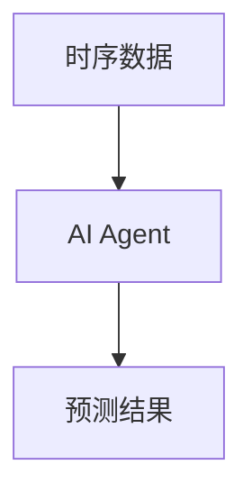
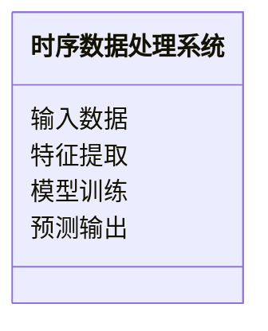
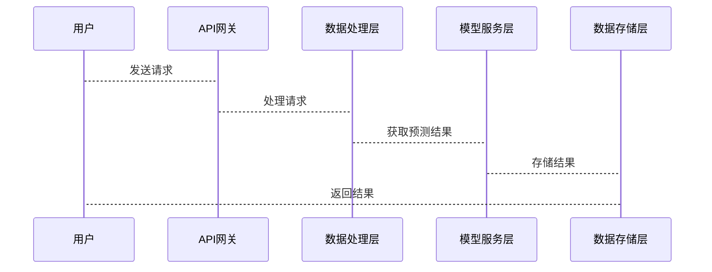

                 


# AI Agent的时序数据处理与预测

## 关键词
AI Agent, 时序数据, 时间序列分析, 预测模型, 智能预测

## 摘要
本文详细探讨了AI Agent在时序数据处理与预测中的应用，分析了其核心原理、算法实现、系统架构设计及实际案例，帮助读者全面理解AI Agent在时序数据处理中的优势与挑战。

---

# 第一部分: AI Agent的时序数据处理与预测基础

# 第1章: 时序数据与AI Agent概述

## 1.1 时序数据的基本概念
### 1.1.1 时序数据的定义
时序数据是指按时间顺序排列的数据，例如股票价格、天气数据、用户行为数据等。

### 1.1.2 时序数据的特征
时序数据通常具有时间依赖性、趋势性、周期性、随机性等特征。

### 1.1.3 时序数据的应用场景
时序数据广泛应用于金融、气象、医疗、交通等领域。

## 1.2 AI Agent的定义与特点
### 1.2.1 AI Agent的基本定义
AI Agent是一种能够感知环境、自主决策的智能体，能够根据输入信息做出反应。

### 1.2.2 AI Agent的核心特点
- 自主性：能够自主决策
- 反应性：能够感知环境并实时反应
- 学习能力：能够通过数据学习和优化

## 1.3 时序数据处理与预测的背景
### 1.3.1 时序数据处理的挑战
- 数据的非独立性
- 时间依赖性
- 噪声干扰

### 1.3.2 AI Agent在时序数据处理中的作用
AI Agent能够通过学习时序数据的模式，帮助预测未来趋势。

### 1.3.3 时序数据预测的业务价值
通过准确预测，企业可以优化资源分配、降低风险。

## 1.4 本章小结
本章介绍了时序数据的基本概念和AI Agent的特点，以及AI Agent在时序数据处理中的重要性。

---

# 第二部分: 时序数据处理的核心概念与联系

# 第2章: 时序数据处理的核心原理

## 2.1 时序数据的特征提取
### 2.1.1 常见的时序特征提取方法
- 移动平均数
- 滑动窗口技术
- 傅里叶变换

### 2.1.2 滑动窗口技术
滑动窗口技术通过计算窗口内的数据特征，帮助模型捕捉局部趋势。

### 2.1.3 时序数据的序列建模
序列建模包括循环神经网络（RNN）和Transformer等方法。

## 2.2 时序数据处理的数学模型
### 2.2.1 时间序列分析的基本方法
时间序列分析包括ARIMA、GARCH等模型。

### 2.2.2 时序数据的线性回归模型
线性回归模型用于预测时序数据的趋势。

### 2.2.3 时序数据的非线性建模
非线性建模包括神经网络和树模型。

## 2.3 AI Agent与时序数据的关联
### 2.3.1 AI Agent在时序数据处理中的角色
AI Agent作为决策者，能够根据时序数据做出预测和决策。

### 2.3.2 时序数据对AI Agent的影响
时序数据帮助AI Agent学习历史模式，优化未来预测。

### 2.3.3 AI Agent如何优化时序数据处理
通过自主学习和实时反馈，AI Agent能够提高时序数据处理的效率和准确性。

## 2.4 核心概念对比表
| 概念 | 描述 | 示例 |
|------|------|------|
| 时序数据 | 时间序列数据 | 股价、天气数据 |
| AI Agent | 自主决策的智能体 | 推荐系统、自动驾驶 |

## 2.5 ER实体关系图


## 2.6 本章小结
本章详细介绍了时序数据处理的核心原理，并探讨了AI Agent在其中的作用。

---

# 第三部分: 时序数据预测的算法原理

# 第3章: 常见时序预测算法

## 3.1 ARIMA算法
### 3.1.1

---

# 第四部分: 时序数据处理的系统架构与设计

# 第4章: 时序数据处理系统的架构设计

## 4.1 项目背景
本项目旨在构建一个基于AI Agent的时序数据预测系统。

## 4.2 系统功能设计
### 4.2.1 领域模型设计


## 4.3 系统架构设计


## 4.4 接口设计
- API接口定义
- 数据格式规范

## 4.5 交互设计


## 4.6 本章小结
本章详细设计了时序数据处理系统的架构，并探讨了系统各部分的交互关系。

---

# 第五部分: 项目实战

# 第5章: 基于AI Agent的时序数据预测实战

## 5.1 项目背景
本项目通过股票价格预测案例，展示AI Agent在时序数据处理中的应用。

## 5.2 环境安装
```bash
pip install numpy pandas scikit-learn tensorflow
```

## 5.3 数据预处理
```python
import pandas as pd
data = pd.read_csv('stock.csv')
```

## 5.4 模型实现
```python
import tensorflow as tf
model = tf.keras.Sequential([
    tf.keras.layers.LSTM(64, input_shape=(None, 1)),
    tf.keras.layers.Dense(1)
])
model.compile(optimizer='adam', loss='mse')
```

## 5.5 模型训练与评估
```python
model.fit(X_train, y_train, epochs=100, batch_size=32)
```

## 5.6 项目小结
本章通过实际案例展示了AI Agent在时序数据预测中的应用，并详细讲解了模型实现和评估过程。

---

# 第六部分: 总结与展望

# 第6章: 总结与展望

## 6.1 本章总结
本文详细探讨了AI Agent在时序数据处理与预测中的应用，分析了其核心原理和系统架构设计。

## 6.2 未来展望
未来的研究方向包括更复杂的模型、多模态数据融合和边缘计算等。

---

# 作者：AI天才研究院 & 禅与计算机程序设计艺术

