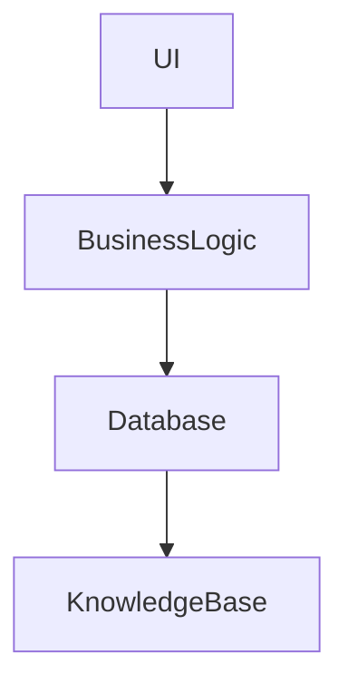
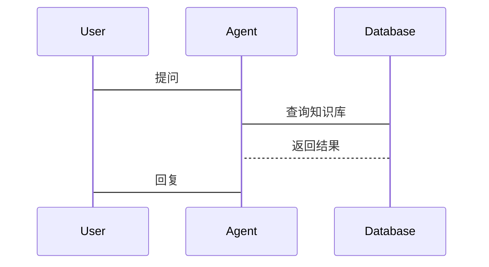

                 


# AI Agent的未来：趋势预测与展望

> 关键词：AI Agent, 人工智能, 机器学习, 强化学习, 自动化系统, 智能决策

> 摘要：AI Agent作为一种智能实体，正在逐步改变我们的生活方式和工作方式。本文将从AI Agent的基本概念出发，分析其核心算法和系统架构，通过具体项目实战展示其应用，最后预测其未来发展趋势。

---

## 第1章: AI Agent概述

### 1.1 AI Agent的基本概念

#### 1.1.1 什么是AI Agent
AI Agent（人工智能代理）是指能够感知环境、自主决策并执行任务的智能实体。它能够根据环境信息做出决策，并采取行动以实现目标。

#### 1.1.2 AI Agent的核心特征
- **自主性**：能够在没有外部干预的情况下自主运行。
- **反应性**：能够实时感知环境并做出反应。
- **目标导向性**：所有行为都以实现特定目标为导向。
- **学习能力**：通过经验改进自身性能。

#### 1.1.3 AI Agent与传统AI的区别
传统AI主要专注于数据处理和分析，而AI Agent具备自主决策和执行的能力，能够与环境进行交互。

### 1.2 AI Agent的发展历程

#### 1.2.1 AI Agent的历史演变
AI Agent的概念可以追溯到20世纪60年代，早期的AI Agent主要用于简单任务处理。

#### 1.2.2 当前AI Agent的技术现状
现代AI Agent结合了机器学习、自然语言处理和强化学习等多种技术，能够执行复杂任务。

#### 1.2.3 AI Agent的未来趋势
AI Agent将更加智能化和自主化，能够处理更复杂的任务，并在更多领域得到广泛应用。

---

## 第2章: AI Agent的核心概念与联系

### 2.1 AI Agent的核心原理

#### 2.1.1 AI Agent的基本原理
AI Agent通过感知环境、分析信息、制定策略并执行行动来实现目标。

#### 2.1.2 AI Agent的感知与决策机制
感知环境是AI Agent的第一步，通过传感器或数据接口获取信息。决策机制基于这些信息，利用算法制定行动方案。

#### 2.1.3 AI Agent的行动与反馈循环
AI Agent根据决策采取行动，并通过反馈机制不断优化自身的决策过程。

### 2.2 AI Agent与相关概念的对比

#### 2.2.1 AI Agent与传统软件的区别
传统软件依赖于预定义的规则，而AI Agent能够自主学习和适应环境。

#### 2.2.2 AI Agent与机器人技术的关系
AI Agent为机器人提供智能决策能力，而机器人则是AI Agent的物理执行载体。

#### 2.2.3 AI Agent与大数据分析的联系
大数据分析为AI Agent提供决策所需的信息，而AI Agent则通过大数据分析提升自身的智能水平。

---

## 第3章: AI Agent的类型与应用场景

### 3.1 AI Agent的分类

#### 3.1.1 简单反射型AI Agent
这类AI Agent基于简单的规则做出反应，适用于任务处理。

#### 3.1.2 基于模型的AI Agent
这类AI Agent利用内部模型来预测环境变化，适用于复杂任务。

#### 3.1.3 基于学习的AI Agent
这类AI Agent通过机器学习不断优化自身性能，适用于需要持续改进的任务。

### 3.2 AI Agent的主要应用场景

#### 3.2.1 个人助手
如智能音箱、智能手机助手，能够帮助用户完成日常任务。

#### 3.2.2 智能客服
通过自然语言处理技术，为用户提供智能咨询服务。

#### 3.2.3 自动交易系统
利用强化学习算法，在金融市场中进行自动交易。

#### 3.2.4 智能推荐系统
通过分析用户行为，推荐个性化内容。

---

## 第4章: AI Agent的核心算法原理

### 4.1 强化学习算法

#### 4.1.1 Q-learning算法

Q-learning是一种常用的强化学习算法，通过更新Q值表来优化决策策略。

$$ Q(s,a) = Q(s,a) + \alpha \times [r + \max Q(s',a') - Q(s,a)] $$

其中：
- \( Q(s,a) \)：当前状态s和动作a的Q值。
- \( \alpha \)：学习率。
- \( r \)：奖励值。
- \( s' \)：下一个状态。
- \( a' \)：下一个动作。

#### 4.1.2 Deep Q-Networks (DQN)算法

DQN算法将Q值的更新与深度神经网络结合，能够处理高维状态空间。

#### 4.1.3 策略梯度算法

策略梯度算法直接优化策略，通过梯度上升方法更新参数。

### 4.2 监督学习与无监督学习在AI Agent中的应用

#### 4.2.1 监督学习的应用场景
适用于任务目标明确的场景，如分类、回归任务。

#### 4.2.2 无监督学习的应用场景
适用于任务目标不明确的场景，如聚类、异常检测。

### 4.3 贝叶斯网络与马尔可夫决策过程

#### 4.3.1 贝叶斯网络的基本原理
贝叶斯网络通过概率推理来处理不确定性，适用于动态环境中的决策。

#### 4.3.2 马尔可夫决策过程的应用
马尔可夫决策过程将环境建模为状态-动作-奖励的马尔可夫链，适用于序列决策问题。

---

## 第5章: AI Agent的数学模型与算法实现

### 5.1 Q-learning算法的数学模型

Q-learning算法通过不断更新Q值表，实现对最优策略的逼近。算法流程如下：

1. 初始化Q值表。
2. 与环境交互，获取状态s、动作a和奖励r。
3. 更新Q(s,a)的值：
$$ Q(s,a) = Q(s,a) + \alpha \times (r + \max Q(s',a') - Q(s,a)) $$
4. 重复上述步骤，直到收敛。

### 5.2 算法实现代码示例

```python
import numpy as np

class QLearning:
    def __init__(self, state_space, action_space, alpha=0.1, gamma=0.9):
        self.state_space = state_space
        self.action_space = action_space
        self.alpha = alpha
        self.gamma = gamma
        self.q_table = np.zeros((state_space, action_space))
    
    def choose_action(self, state):
        return np.argmax(self.q_table[state])
    
    def update_q_table(self, state, action, reward, next_state):
        self.q_table[state][action] += self.alpha * (reward + self.gamma * np.max(self.q_table[next_state]) - self.q_table[state][action])
```

---

## 第6章: AI Agent的系统分析与架构设计

### 6.1 问题场景介绍

以智能客服系统为例，设计一个基于AI Agent的解决方案。

### 6.2 系统功能设计

- **领域模型设计**：
  - 用户信息
  - 常见问题库
  - 对话历史

- **系统架构设计**：
  - 用户界面层
  - 业务逻辑层
  - 数据存储层

### 6.3 系统架构图



### 6.4 系统接口设计

- **用户输入接口**：文本框、语音输入
- **输出接口**：文本回复、语音播报

### 6.5 系统交互流程图



---

## 第7章: AI Agent的项目实战

### 7.1 环境配置

- **开发环境**：Python 3.8+
- **依赖库**：numpy, pandas, scikit-learn

### 7.2 核心代码实现

```python
import numpy as np

def q_learning_example():
    states = 4
    actions = 2
    agent = QLearning(states, actions)
    for episode in range(1000):
        state = 0
        done = False
        while not done:
            action = agent.choose_action(state)
            next_state = ...  # 根据动作和环境变化确定下一个状态
            reward = ...       # 根据动作和下一个状态确定奖励
            agent.update_q_table(state, action, reward, next_state)
            state = next_state
    return agent.q_table

if __name__ == "__main__":
    q_table = q_learning_example()
    print(q_table)
```

### 7.3 案例分析

以智能客服为例，通过具体对话流程展示AI Agent的实际应用。

---

## 第8章: AI Agent的趋势预测与展望

### 8.1 当前技术趋势

- **多模态交互**：结合视觉、听觉等多种感知方式。
- **人机协作**：AI Agent与人类协同工作，提高效率。
- **边缘计算**：AI Agent在边缘设备上的应用越来越广泛。

### 8.2 未来发展趋势

- **自主决策能力提升**：AI Agent将具备更强的自主决策能力。
- **跨平台协作**：AI Agent能够与其他系统和设备无缝协作。
- **伦理与安全**：AI Agent的伦理和安全问题将得到更多关注。

### 8.3 技术挑战与解决方案

- **数据隐私**：通过联邦学习等技术保护数据隐私。
- **计算资源**：利用边缘计算和云计算结合的方式优化资源使用。

### 8.4 最佳实践 tips

- **数据质量**：确保训练数据的多样性和代表性。
- **模型解释性**：提高AI Agent的决策透明度。
- **持续优化**：定期更新模型，适应环境变化。

---

## 附录

### A. 术语表

- AI Agent：人工智能代理
- Q-learning：Q学习算法
- DQN：深度Q网络

### B. 工具推荐

- **机器学习框架**：TensorFlow, PyTorch
- **数据处理工具**：Pandas, NumPy
- **可视化工具**：Matplotlib, Seaborn

### C. 参考文献

- Russell, S., & Norvig, P. (2010). Artificial Intelligence: A Modern Approach.
- Sutton, R. S., & Barto, A. G. (2018). Reinforcement Learning: An Introduction.

---

作者：AI天才研究院 & 禅与计算机程序设计艺术

