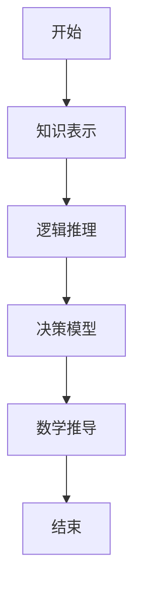
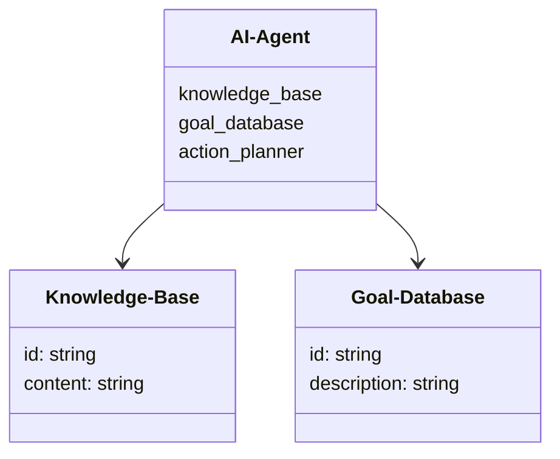
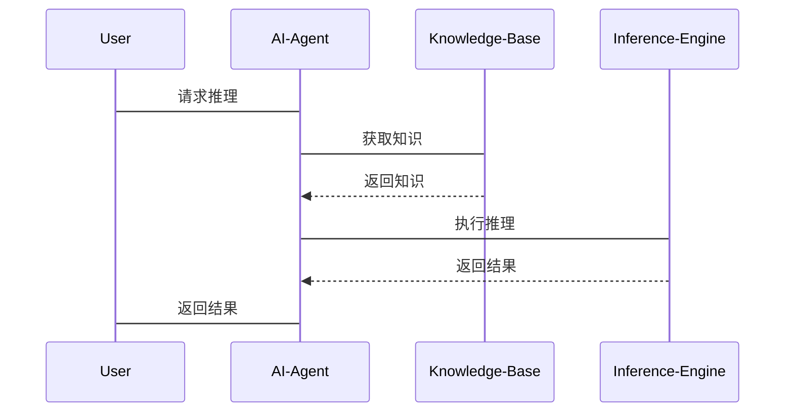

                 


# 第4章: AI Agent 的数学模型与公式推导

## 4.1 知识表示的数学模型
### 4.1.1 知识表示的基本形式
$$ 知识 = \{ (s, r, o) \} $$
其中，$s$ 是主语，$r$ 是关系，$o$ 是宾语。

### 4.1.2 知识图谱表示
使用图论中的图结构表示知识：
$$ G = (V, E) $$
其中，$V$ 是节点集合，$E$ 是边集合。

## 4.2 逻辑推理的数学基础
### 4.2.1 命题逻辑
命题逻辑通过布尔逻辑连接词（如 ∧，∨，¬）构建推理规则。

### 4.2.2 �谓词逻辑
谓词逻辑使用谓词和量词（∀，∃）来表达更复杂的推理：
$$ ∀x∃y (P(x) → Q(y)) $$

## 4.3 决策模型的数学框架
### 4.3.1 Q-Learning算法
Q-Learning的目标是找到最优策略：
$$ Q(s, a) = r + \gamma \max_{a'} Q(s', a') $$

### 4.3.2 推理过程的数学表示
逻辑推理可以通过以下步骤表示：
$$ s_0 \rightarrow s_1 \rightarrow s_2 \rightarrow ... \rightarrow s_n $$
其中，$s_i$ 是推理过程中的状态。

## 4.4 数学推导流程图


## 4.5 本章小结
数学模型为AI Agent的推理和决策提供了理论基础，理解这些模型有助于深入掌握AI Agent的工作机制。

---

# 第5章: AI Agent 的系统架构与设计

## 5.1 系统架构概述
AI Agent的系统架构通常包括知识库、推理引擎和执行模块。

## 5.2 领域模型设计
使用类图表示系统组件：


## 5.3 系统架构设计


## 5.4 系统交互设计


## 5.5 本章小结
系统架构设计确保了AI Agent的高效运行，各组件协同工作，完成从知识获取到决策执行的全过程。

---

# 第6章: 项目实战——AI Agent 的实现

## 6.1 项目概述
开发一个简单的AI Agent，能够根据知识库进行推理并做出决策。

## 6.2 环境安装
安装必要的Python库：
```
pip install numpy
pip install matplotlib
```

## 6.3 核心代码实现
### 知识库类
```python
class KnowledgeBase:
    def __init__(self):
        self.knowledge = {}

    def add_knowledge(self, s, r, o):
        key = (s, r)
        self.knowledge[key] = o

    def get_knowledge(self, s, r):
        return self.knowledge.get((s, r), None)
```

### 推理引擎类
```python
class InferenceEngine:
    def __init__(self, knowledge_base):
        self.knowledge_base = knowledge_base

    def infer(self, s, r, o):
        knowledge = self.knowledge_base.get_knowledge(s, r)
        return knowledge
```

### AI Agent 类
```python
class AI-Agent:
    def __init__(self):
        self.knowledge_base = KnowledgeBase()

    def add_knowledge(self, s, r, o):
        self.knowledge_base.add_knowledge(s, r, o)

    def infer(self, s, r):
        return self.knowledge_base.get_knowledge(s, r)
```

## 6.4 代码应用与解读
通过实例化AI-Agent并添加知识，展示推理过程：
```python
agent = AI-Agent()
agent.add_knowledge("人", "呼吸", "氧气")
result = agent.infer("人", "呼吸")
print(result)  # 输出: 氧气
```

## 6.5 本章小结
通过项目实战，展示了AI Agent的基本实现流程和代码结构，帮助读者理解理论与实践的结合。

---

# 第7章: 总结与展望

## 7.1 本章总结
本文详细探讨了AI Agent的概念、算法、系统架构和实现，为理解AI Agent提供了全面的视角。

## 7.2 未来展望
未来，AI Agent将在更复杂的场景中应用，如多智能体协作和自适应学习系统。

## 7.3 最佳实践 Tips
- 理解知识表示和逻辑推理的基础理论。
- 熟悉常用算法，如Q-Learning和逻辑推理算法。
- 注重系统架构设计，确保各组件高效协同。

## 7.4 本章小结
AI Agent作为人工智能的重要组成部分，其发展和应用前景广阔，值得深入研究和探索。

---

# 作者：AI天才研究院 & 禅与计算机程序设计艺术

