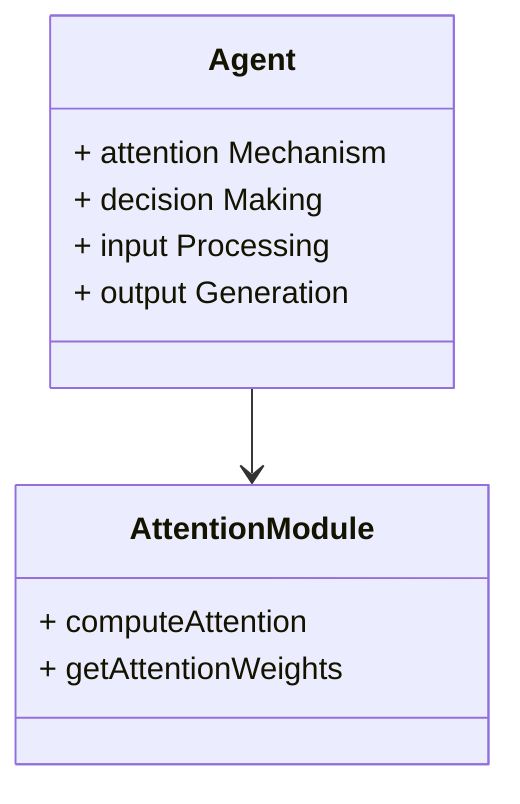

                 


# AI Agent的注意力机制：提升信息处理效率

> 关键词：AI Agent，注意力机制，信息处理效率，自注意力机制，图注意力机制，系统架构设计

> 摘要：注意力机制作为一种强大的信息处理工具，能够显著提升AI Agent的信息处理效率。本文从基础概念出发，详细分析了注意力机制的原理及其在AI Agent中的应用，通过系统架构设计和项目实战，展示了如何利用注意力机制优化信息处理流程。文章还对比了不同注意力机制的特征，并提供了实际案例和代码实现，帮助读者全面理解注意力机制的优势与应用场景。

---

# 第一部分: AI Agent与注意力机制的基础

## 第1章: AI Agent的背景与概念

### 1.1 问题背景
AI Agent（人工智能代理）是一种能够感知环境、自主决策并执行任务的智能体。随着数据量的爆炸式增长，如何高效处理信息成为AI Agent面临的主要挑战。

### 1.2 注意力机制的引入
注意力机制源于自然语言处理领域，通过模拟人类的注意力分配，帮助模型聚焦于重要的信息，从而提升处理效率。

### 1.3 AI Agent的应用场景
- **智能助手**：如Siri、Alexa，通过语音交互帮助用户完成任务。
- **推荐系统**：基于用户行为推荐相关内容。
- **自动驾驶**：实时处理传感器数据，做出驾驶决策。

---

# 第二部分: 注意力机制的核心原理

## 第2章: 自注意力机制的原理与实现

### 2.1 自注意力机制的定义
自注意力机制通过计算序列中各元素之间的关系，确定每个元素的关注权重。

### 2.2 核心公式
$$\text{Attention}(Q, K, V) = \text{softmax}\left(\frac{QK^T}{\sqrt{d_k}}\right)V$$

其中：
- $Q$、$K$、$V$分别是查询、键、值向量。
- $d_k$是键的维度。

### 2.3 实现步骤
1. **计算查询、键、值向量**：将输入序列映射为三个向量。
2. **计算注意力权重**：通过$QK^T$计算相似度，然后通过Softmax函数归一化。
3. **加权求和**：将注意力权重与值向量相乘，得到最终输出。

### 2.4 代码实现
```python
import torch

def self_attention(query, key, value):
    # 计算相似度
    scores = torch.matmul(query, key.transpose(-2, -1)) / torch.sqrt(torch.tensor(key.shape[-1]))
    # 计算注意力权重
    attention_weights = torch.softmax(scores, dim=-1)
    # 加权求和
    output = torch.matmul(attention_weights, value)
    return output, attention_weights
```

## 第3章: 图注意力机制的原理与实现

### 3.1 图注意力机制的定义
图注意力机制适用于图结构数据，通过计算节点之间的关系，确定每个节点的关注权重。

### 3.2 核心公式
$$\text{Graph Attention}(X, A) = \text{softmax}\left(A \cdot X X^T\right)X$$

其中：
- $X$是节点特征矩阵。
- $A$是邻接矩阵。

### 3.3 实现步骤
1. **输入图结构数据**：包括节点特征和邻接矩阵。
2. **计算节点相似度**：通过$XX^T$计算节点间的相似度。
3. **计算注意力权重**：通过Softmax函数归一化。
4. **加权求和**：将注意力权重与节点特征相乘，得到最终输出。

### 3.4 代码实现
```python
import torch

def graph_attention(X, A):
    # 计算相似度
    similarity = torch.mm(X, X.t()) 
    # 计算注意力权重
    attention_weights = torch.softmax(A * similarity, dim=-1)
    # 加权求和
    output = torch.mm(attention_weights, X)
    return output, attention_weights
```

---

# 第三部分: 系统架构设计与项目实战

## 第4章: 系统架构设计

### 4.1 系统功能模块
- **输入处理模块**：接收输入数据并进行预处理。
- **注意力计算模块**：实现自注意力或图注意力机制。
- **决策模块**：根据注意力结果做出决策。
- **输出模块**：生成最终输出结果。

### 4.2 系统架构图


## 第5章: 项目实战

### 5.1 项目介绍
实现一个基于注意力机制的文本摘要AI Agent，能够根据输入文本生成摘要。

### 5.2 核心代码实现
```python
class AttentionAgent:
    def __init__(self, vocab_size, embedding_dim):
        self.vocab_size = vocab_size
        self.embedding_dim = embedding_dim
        self.embedding = nn.Embedding(vocab_size, embedding_dim)
        self.query = nn.Parameter(torch.randn(embedding_dim, embedding_dim))
        self.key = nn.Parameter(torch.randn(embedding_dim, embedding_dim))
        self.value = nn.Parameter(torch.randn(embedding_dim, embedding_dim))

    def get_attention_weights(self, input_sequence):
        # 计算查询、键、值向量
        query = torch.matmul(self.query, input_sequence.unsqueeze(-1))
        key = torch.matmul(self.key, input_sequence.unsqueeze(-1))
        value = torch.matmul(self.value, input_sequence.unsqueeze(-1))
        # 计算相似度
        scores = torch.matmul(query, key.transpose(-2, -1)) / torch.sqrt(torch.tensor(key.shape[-1]))
        # 计算注意力权重
        attention_weights = torch.softmax(scores, dim=-1)
        return attention_weights

    def forward(self, input_sequence):
        attention_weights = self.get_attention_weights(input_sequence)
        output = torch.matmul(attention_weights, value)
        return output
```

### 5.3 案例分析
输入一段文本，AI Agent通过自注意力机制计算每个词的关注权重，生成摘要。

### 5.4 性能分析
- **计算效率**：注意力机制通过并行计算减少计算时间。
- **准确性**：注意力机制能够提高模型对重要信息的关注，提升处理结果的准确性。

---

# 第四部分: 总结与展望

## 第6章: 总结与最佳实践

### 6.1 总结
注意力机制作为一种高效的信息处理工具，能够显著提升AI Agent的信息处理效率。本文通过理论分析和实际案例，详细讲解了注意力机制的原理及其在AI Agent中的应用。

### 6.2 最佳实践
- **选择合适的注意力机制**：根据数据类型选择自注意力或图注意力机制。
- **优化模型参数**：通过调整模型参数提升注意力权重的准确性。
- **处理大规模数据**：利用并行计算和分布式训练优化计算效率。

## 第7章: 未来展望

### 7.1 拓展方向
- **多模态注意力机制**：结合文本、图像等多种数据类型，提升模型的综合处理能力。
- **动态注意力机制**：根据实时数据动态调整注意力权重，提升模型的适应性。

### 7.2 结语
随着AI技术的不断发展，注意力机制将在更多领域发挥重要作用。未来的研究将致力于开发更高效、更智能的注意力机制，推动AI Agent技术的进一步发展。

---

# 作者：AI天才研究院 & 禅与计算机程序设计艺术

