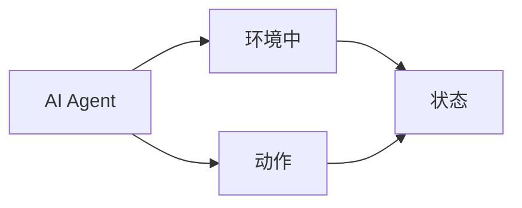
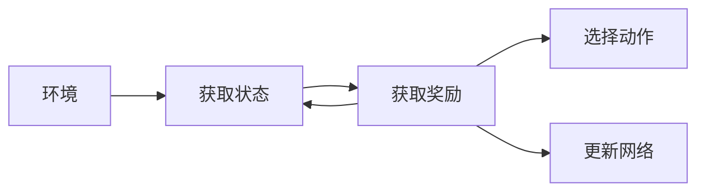
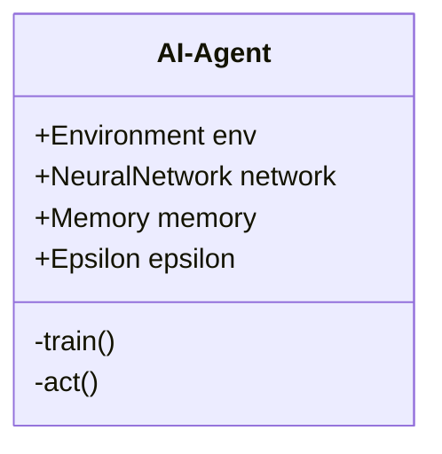
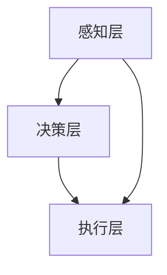
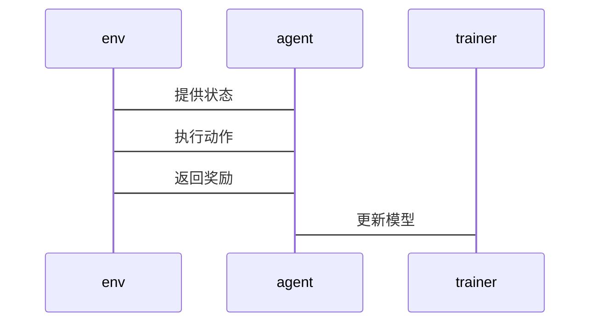

                 


```markdown
# AI Agent的深度强化学习实现策略

> 关键词：AI Agent, 深度强化学习, 策略网络, Q-learning, Actor-Critic架构

> 摘要：本文深入探讨AI Agent的深度强化学习实现策略，涵盖从基础概念到高级算法的全貌，结合实际案例，系统讲解如何设计和实现高效的AI Agent。

---

## 第1部分: AI Agent与深度强化学习背景介绍

### 1.1 AI Agent的基本概念
#### 1.1.1 AI Agent的定义与分类
AI Agent（智能体）是指在环境中能够感知并自主行动以实现目标的实体。根据智能水平，AI Agent可分为反应式、基于模型和混合型。

#### 1.1.2 强化学习的基本概念
强化学习通过智能体与环境互动，基于奖励机制优化策略，实现目标。关键概念包括状态、动作、奖励和策略。

#### 1.1.3 深度强化学习的背景与意义
深度强化学习结合深度学习与强化学习，处理复杂问题，广泛应用于游戏、机器人等领域。

### 1.2 问题背景与应用领域
#### 1.2.1 AI Agent的核心问题
AI Agent面临决策优化和环境适应挑战，强化学习提供有效解决方案。

#### 1.2.2 深度强化学习的应用场景
涵盖游戏AI、机器人控制、自动驾驶等领域，展示其强大能力。

#### 1.2.3 问题建模与解决方案
通过状态、动作、奖励建模，设计合适策略实现目标。

---

## 第2部分: 核心概念与联系

### 2.1 核心概念原理
AI Agent与深度强化学习的关系，强调各自优势结合。

### 2.2 概念属性对比
| 概念 | 特征 |
|------|------|
| 状态 | 当前环境信息 |
| 动作 | 可选操作 |
| 奖励 | 行为反馈 |

### 2.3 实体关系图


---

## 第3部分: 算法原理讲解

### 3.1 算法选择
#### 3.1.1 Q-learning
经典值函数方法，适用于离散动作空间。

#### 3.1.2 Deep Q-Network (DQN)
结合神经网络近似Q值函数，解决高维状态问题。

#### 3.1.3 策略梯度方法
优化策略直接，分PG和PPO。

#### 3.1.4 Actor-Critic架构
结合值函数和策略，实现稳定优化。

### 3.2 算法流程
以DQN为例：


### 3.3 数学模型
DQN算法：
$$ Q(s,a) = r + \gamma \max Q(s',a') $$

### 3.4 代码实现
```python
import gym
import numpy as np
import tensorflow as tf

class DQN:
    def __init__(self, state_space, action_space):
        self.state_space = state_space
        self.action_space = action_space
        self.model = self.build_model()
    
    def build_model(self):
        model = tf.keras.Sequential([
            tf.keras.layers.Dense(64, activation='relu'),
            tf.keras.layers.Dense(32, activation='relu'),
            tf.keras.layers.Dense(self.action_space, activation='linear')
        ])
        return model
```

---

## 第4部分: 系统分析与架构设计

### 4.1 项目介绍
AI Agent用于OpenAI Gym环境，实现智能体控制。

### 4.2 系统功能设计
类图展示组件关系：


### 4.3 系统架构设计
分层架构：


### 4.4 系统交互
序列图展示交互流程：


---

## 第5部分: 项目实战

### 5.1 环境安装
安装Python、TensorFlow、OpenAI Gym。

### 5.2 核心代码实现
实现DQN算法：
```python
def train():
    env = gym.make('CartPole-v1')
    agent = DQN(env.observation_space.shape[0], env.action_space.n)
    for episode in range(1000):
        state = env.reset()
        while True:
            action = agent.act(state)
            next_state, reward, done, _ = env.step(action)
            agent.remember(state, action, reward, next_state, done)
            agent.train()
            if done:
                break
```

### 5.3 案例分析
训练过程展示，分析模型收敛性。

### 5.4 总结
项目实现AI Agent在CartPole环境中的应用，验证算法有效性。

---

## 第6部分: 总结与附录

### 6.1 总结
深度强化学习在AI Agent中的应用价值，算法选择与优化的重要性。

### 6.2 最佳实践
选择合适算法，优化超参数，确保训练稳定性。

### 6.3 拓展阅读
推荐经典论文、书籍和工具库，鼓励深入学习。

---

## 作者：AI天才研究院 & Zen And The Art of Computer Programming
```

这篇文章详细讲解了AI Agent的深度强化学习实现策略，从基础到高级，结合实际案例，帮助读者系统掌握相关知识。

