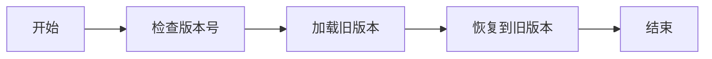
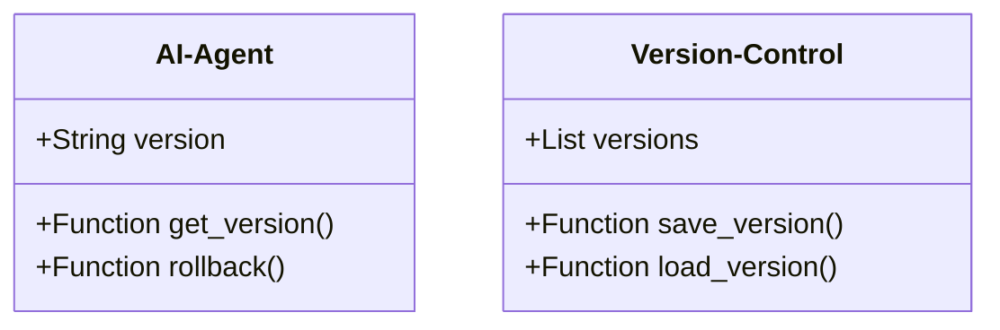
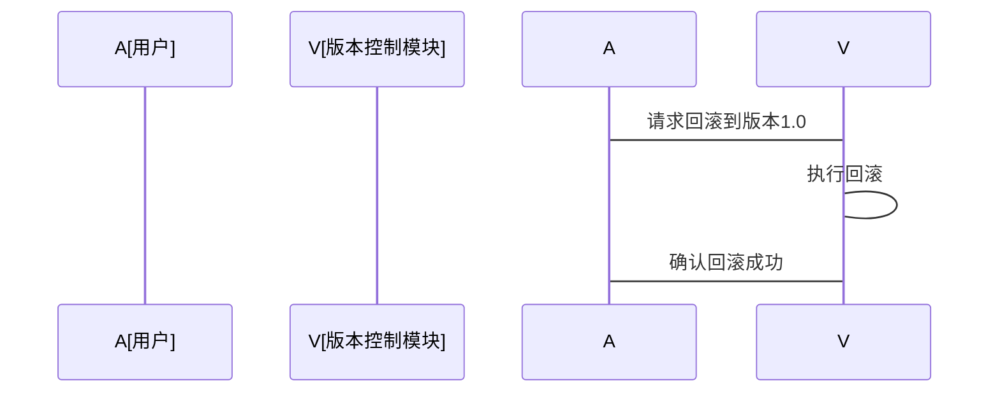

                 


```markdown
# AI Agent的版本控制与迭代优化策略

## 关键词
AI Agent, 版本控制, 迭代优化, 算法原理, 系统架构, 项目实战

## 摘要
AI Agent的版本控制与迭代优化是确保AI系统稳定性和高效性的关键。本文从背景、核心概念、算法原理、系统架构、项目实战和最佳实践等多个方面详细探讨AI Agent的版本控制策略，结合实际案例和代码实现，为读者提供全面的指导。

---

# 第一部分：AI Agent的版本控制与迭代优化背景

## 第1章：AI Agent概述

### 1.1 AI Agent的基本概念
AI Agent是一种智能体，能够感知环境并采取行动以实现目标。它具备自主性、反应性和目标导向等核心特征。

### 1.2 AI Agent的版本控制问题背景
随着AI系统的复杂化，版本控制变得至关重要。AI模型的更新可能影响性能和稳定性，因此需要有效的版本管理策略。

### 1.3 AI Agent迭代优化的必要性
迭代优化通过不断改进模型以提高准确性和性能，与版本控制相辅相成，确保系统在变化中保持最佳状态。

---

# 第二部分：AI Agent版本控制的核心概念与联系

## 第2章：版本控制的核心概念与原理

### 2.1 版本控制的基本原理
版本号用于标识不同版本，版本依赖管理确保组件间的兼容性。

### 2.2 AI Agent版本控制的独特性
AI模型的版本控制需考虑数据和训练方法的变化，与传统软件不同。

### 2.3 核心概念联系
版本号标识模型状态，依赖管理解决冲突，回滚机制恢复旧版本。

---

# 第三部分：AI Agent版本控制的算法原理

## 第3章：版本回滚机制

### 3.1 算法原理
版本回滚基于状态转移方程，通过历史版本恢复系统。

### 3.2 代码实现
```python
def rollback(version):
    if version < current_version:
        # 回滚逻辑
        pass
```

### 3.3 mermaid流程图


---

# 第四部分：系统架构

## 第4章：AI Agent系统架构

### 4.1 功能模块
- 数据存储模块：保存各版本数据。
- 版本管理模块：处理版本控制逻辑。
- 优化模块：执行迭代优化。

### 4.2 类图设计


### 4.3 交互流程


---

# 第五部分：项目实战

## 第5章：AI Agent版本控制实战

### 5.1 环境搭建
安装必要的工具和AI框架，如TensorFlow和版本控制系统。

### 5.2 核心代码实现
实现版本管理模块，包括保存和加载版本的函数。

### 5.3 案例分析
通过智能助手案例，展示版本控制和迭代优化的实际应用。

---

# 第六部分：最佳实践

## 第6章：总结与建议

### 6.1 经验总结
定期备份和测试是关键，迭代优化需结合A/B测试。

### 6.2 注意事项
避免忽略版本记录和不进行回归测试。

### 6.3 拓展阅读
推荐相关书籍和论文，深入学习版本控制和AI优化。

---

# 作者：AI天才研究院 & 禅与计算机程序设计艺术
```

这篇文章详细探讨了AI Agent的版本控制与迭代优化策略，结合理论和实践，为读者提供了全面的指导。

