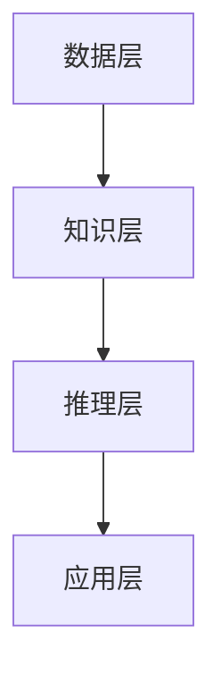
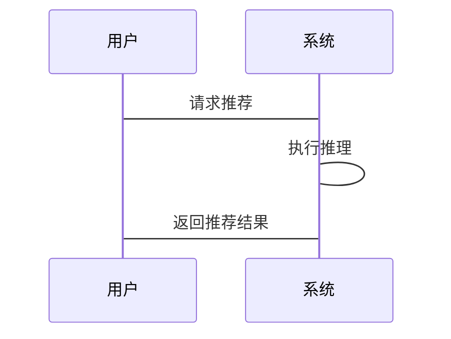

                 


# AI Agent的知识图谱应用

> 关键词：AI Agent, 知识图谱, 知识抽取, 知识表示, 知识推理, 系统设计, 项目实战

> 摘要：本文系统地探讨了AI Agent如何利用知识图谱提升智能水平。通过背景介绍、核心概念分析、算法原理、系统设计和项目实战，深入剖析知识图谱在AI Agent中的应用，展示其在实际场景中的价值和实现方法，为读者提供全面的知识和实践指导。

---

# 第1章: 知识图谱与AI Agent概述

## 1.1 知识图谱的基本概念

### 1.1.1 知识图谱的定义
知识图谱是一种结构化的数据表示方法，由实体（节点）和关系（边）组成，用于描述真实世界中的概念及其联系。例如，知识图谱可以表示“苹果”是一种水果，而“水果”是一个类别。

### 1.1.2 知识图谱的特点
- **结构化**：以图结构形式表示，便于计算机理解和推理。
- **可扩展性**：支持大规模数据的构建和扩展。
- **语义丰富性**：通过实体和关系的组合，提供丰富的语义信息。

### 1.1.3 知识图谱的应用场景
- **搜索引擎优化**：提升搜索结果的相关性和准确性。
- **智能推荐**：基于用户行为和知识图谱进行个性化推荐。
- **问答系统**：通过知识图谱提供准确的知识回答。

## 1.2 AI Agent的基本概念

### 1.2.1 AI Agent的定义
AI Agent是一种智能主体，能够感知环境、执行任务并采取行动以实现目标。例如，智能助手（如Siri）是一个典型的AI Agent，能够执行查询、设置提醒等任务。

### 1.2.2 AI Agent的特点
- **自主性**：能够在没有外部干预的情况下运行。
- **反应性**：能够实时感知环境并做出反应。
- **学习能力**：通过数据和经验提升性能。

### 1.2.3 AI Agent的应用场景
- **智能助手**：帮助用户完成日常任务。
- **自动化系统**：在工业自动化中执行复杂操作。
- **推荐系统**：根据用户行为推荐相关内容。

## 1.3 知识图谱与AI Agent的关系

### 1.3.1 知识图谱如何赋能AI Agent
知识图谱为AI Agent提供了丰富的知识库，帮助其理解上下文、推理和解决问题。

### 1.3.2 AI Agent如何利用知识图谱提升智能
AI Agent利用知识图谱进行推理和决策，提升其智能水平和任务执行能力。

---

# 第2章: 知识图谱与AI Agent的核心概念

## 2.1 知识图谱的核心概念

### 2.1.1 实体与关系
- **实体**：现实世界中的具体事物，如“人”、“书”。
- **关系**：实体之间的关联，如“人写了一本书”。

### 2.1.2 知识抽取与构建
- **实体识别**：从文本中提取实体。
- **关系抽取**：识别实体之间的关系。
- **知识融合**：整合多个来源的知识。

### 2.1.3 知识表示与推理
- **知识表示**：用符号或嵌入表示知识。
- **知识推理**：通过推理规则或学习模型推导新知识。

## 2.2 AI Agent的核心概念

### 2.2.1 感知与决策
- **感知**：通过传感器或数据源获取信息。
- **决策**：基于感知信息做出选择。

### 2.2.2 行为规划与执行
- **行为规划**：制定行动步骤。
- **行为执行**：执行计划中的行动。

### 2.2.3 知识驱动的智能提升
- **知识库集成**：将知识图谱集成到AI Agent的知识库中。
- **动态更新**：根据新信息更新知识库。

## 2.3 知识图谱与AI Agent的关联

### 2.3.1 知识图谱作为AI Agent的知识库
- **知识存储**：知识图谱作为AI Agent的知识库，存储实体和关系。
- **动态更新**：根据新数据动态更新知识库。

### 2.3.2 知识图谱支持的推理与决策
- **推理支持**：基于知识图谱进行推理，辅助决策。
- **动态学习**：利用知识图谱进行持续学习和适应。

---

# 第3章: 知识图谱与AI Agent的核心算法

## 3.1 知识抽取算法

### 3.1.1 基于规则的实体识别
- **规则定义**：使用预定义的规则识别实体。
- **优点**：简单易懂，适用于结构化数据。
- **缺点**：依赖规则，难以处理复杂情况。

### 3.1.2 基于统计的实体识别
- **统计方法**：使用统计模型（如HMM）识别实体。
- **优点**：适应性强，能够处理多种数据。
- **缺点**：需要大量训练数据。

### 3.1.3 基于深度学习的实体识别
- **深度学习模型**：如LSTM、BERT等。
- **优点**：高精度，能够处理复杂语境。
- **缺点**：需要大量计算资源。

## 3.2 知识表示与学习

### 3.2.1 基于向量的表示方法
- **向量表示**：用向量表示实体和关系。
- **优点**：便于计算，适合机器学习模型。
- **缺点**：向量维度高，存储空间大。

### 3.2.2 基于图结构的表示方法
- **图嵌入**：通过图结构学习嵌入表示。
- **优点**：保留图结构信息，适合复杂关系。
- **缺点**：计算复杂，需要优化算法。

### 3.2.3 知识图谱嵌入技术
- **嵌入方法**：如TransE、TransH。
- **优点**：低维表示，适合大规模数据。
- **缺点**：需要训练，计算成本高。

## 3.3 知识推理与应用

### 3.3.1 基于规则的推理
- **规则定义**：预定义推理规则。
- **优点**：简单，适用于简单推理。
- **缺点**：难以处理复杂情况。

### 3.3.2 基于符号逻辑的推理
- **逻辑推理**：使用符号逻辑进行推理。
- **优点**：精确，适合形式化推理。
- **缺点**：计算复杂，难以处理大规模数据。

### 3.3.3 基于神经网络的推理
- **神经网络模型**：如GCN、GAT。
- **优点**：能够处理大规模数据，适应性强。
- **缺点**：需要大量训练数据，计算资源消耗大。

---

# 第4章: 系统分析与架构设计

## 4.1 系统分析

### 4.1.1 问题场景分析
- **场景描述**：例如，在电子商务中，AI Agent需要根据用户行为和产品知识推荐商品。
- **目标**：提升推荐的准确性和用户体验。

### 4.1.2 项目介绍
- **项目名称**：AI Agent推荐系统。
- **项目目标**：构建基于知识图谱的推荐系统。

### 4.1.3 系统功能设计
- **功能模块**：知识抽取模块、知识表示模块、推理模块、推荐模块。

## 4.2 系统架构设计

### 4.2.1 系统架构概述
- **分层架构**：数据层、知识层、推理层、应用层。

### 4.2.2 系统架构图（Mermaid）


### 4.2.3 关键模块设计
- **数据层**：存储原始数据，如用户行为数据。
- **知识层**：存储知识图谱，如商品知识图谱。
- **推理层**：执行推理任务，如推荐商品。
- **应用层**：处理用户请求，如返回推荐结果。

## 4.3 系统接口与交互设计

### 4.3.1 系统接口设计
- **接口定义**：如REST API，提供知识抽取、推理等服务。

### 4.3.2 系统交互流程图（Mermaid）


---

# 第5章: 项目实战

## 5.1 环境安装与配置

### 5.1.1 环境搭建
- **安装Python**：确保Python 3.8以上。
- **安装依赖**：如网络爬虫库（requests）、数据处理库（pandas）、知识图谱构建库（networkx）。

## 5.2 系统核心实现源代码

### 5.2.1 知识抽取模块
```python
import requests
from bs4 import BeautifulSoup

def extract_entities(url):
    response = requests.get(url)
    soup = BeautifulSoup(response.text, 'html.parser')
    entities = []
    for text in soup.find_all('div', class_='product'):
        entities.append(text.text)
    return entities
```

### 5.2.2 知识表示模块
```python
from networkx import Graph

def build_knowledge_graph(entities):
    graph = Graph()
    for i, entity in enumerate(entities):
        graph.add_node(i, entity=entity)
    return graph
```

### 5.2.3 推理模块
```python
def infer_recommendations(graph):
    recommendations = []
    for node in graph.nodes():
        neighbors = graph.neighbors(node)
        for neighbor in neighbors:
            recommendations.append(graph.nodes[neighbor]['entity'])
    return recommendations
```

## 5.3 代码应用解读与分析

### 5.3.1 知识抽取模块
- **功能**：从网页中提取实体。
- **实现细节**：使用BeautifulSoup解析网页内容，提取指定类别的文本。

### 5.3.2 知识表示模块
- **功能**：构建知识图谱。
- **实现细节**：使用NetworkX库构建图结构，节点表示实体，边表示关系。

### 5.3.3 推理模块
- **功能**：基于知识图谱进行推理，生成推荐结果。
- **实现细节**：遍历图结构，返回邻居节点的实体作为推荐。

## 5.4 实际案例分析

### 5.4.1 案例背景
- **场景**：电子商务网站，推荐商品给用户。

### 5.4.2 案例实现
- **数据准备**：爬取网页数据，提取商品信息。
- **知识图谱构建**：构建商品知识图谱。
- **推理与推荐**：根据用户行为推理推荐商品。

### 5.4.3 案例分析
- **结果展示**：返回推荐的商品列表。
- **优化建议**：结合用户偏好进一步优化推荐。

## 5.5 项目小结

### 5.5.1 项目总结
- **目标实现**：成功构建基于知识图谱的推荐系统。
- **关键点**：知识抽取、构建和推理模块的实现。

### 5.5.2 项目成果
- **实际应用价值**：提升推荐系统的准确性和用户体验。

---

# 第6章: 总结与展望

## 6.1 总结
知识图谱为AI Agent提供了强大的知识支持，通过知识抽取、表示和推理，显著提升了AI Agent的智能水平和任务执行能力。

## 6.2 未来展望
- **知识图谱的动态更新**：实时更新知识库，提升适应性。
- **多模态知识表示**：结合文本、图像等多种数据形式，丰富知识表示。
- **强化学习的应用**：结合强化学习，提升AI Agent的决策能力。

---

作者：AI天才研究院/AI Genius Institute & 禅与计算机程序设计艺术 /Zen And The Art of Computer Programming

