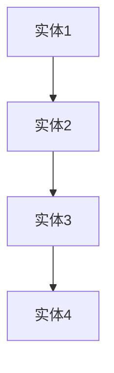

                 

# AI Agent的知识库构建与维护

## 关键词：AI Agent，知识库，构建，维护，知识表示，算法原理

## 摘要：AI Agent的知识库是其智能决策和行为的核心支撑，构建和维护知识库是实现AI Agent能力的关键。本文详细探讨了知识库的构建与维护方法，从基本概念到算法原理，再到系统设计和项目实战，层层深入，为读者提供全面的指导。

---

# 第一部分: AI Agent的知识库构建与维护基础

# 第1章: AI Agent与知识库概述

## 1.1 AI Agent的基本概念
### 1.1.1 什么是AI Agent
AI Agent（人工智能代理）是指能够感知环境、自主决策并执行任务的智能实体。它通过与环境交互，实现特定目标。

### 1.1.2 AI Agent的核心功能与特点
- **感知能力**：通过传感器或数据输入感知环境。
- **推理能力**：基于知识库进行逻辑推理。
- **决策能力**：根据推理结果做出最优决策。
- **执行能力**：通过动作执行器完成任务。

### 1.1.3 知识库在AI Agent中的作用
知识库是AI Agent的“大脑”，存储了AI Agent所需的所有知识和信息，包括事实、规则、概念和经验等。

---

## 1.2 知识库的基本概念
### 1.2.1 知识库的定义与分类
知识库是一种结构化的信息存储系统，用于管理和组织知识。它可以分为以下几类：
- **事实型知识库**：存储具体事实，如“北京是首都”。
- **规则型知识库**：存储逻辑规则，如“如果下雨，则打伞”。
- **语义型知识库**：存储语义信息，如“狗是哺乳动物”。

### 1.2.2 知识库的结构与层次
知识库通常分为以下层次：
- **数据层**：存储原始数据。
- **模式层**：定义数据的结构和关系。
- **知识层**：存储语义信息和规则。
- **应用层**：提供接口和应用逻辑。

### 1.2.3 知识库与AI Agent的关系
知识库是AI Agent的核心，AI Agent通过知识库进行推理、决策和执行。

---

## 1.3 知识库构建的目标与范围
### 1.3.1 知识库构建的目标
- 提供高质量的知识存储。
- 支持AI Agent的智能决策。
- 实现知识的动态更新和扩展。

### 1.3.2 知识库构建的范围
- 确定知识的来源和类型。
- 设计知识的存储结构。
- 定义知识的表示方法。

### 1.3.3 知识库构建的边界与外延
知识库的构建需要明确边界，避免过于复杂或冗余。同时，要预留扩展空间，以支持未来的知识更新和功能扩展。

---

## 1.4 本章小结
本章介绍了AI Agent的基本概念、知识库的作用以及构建的目标和范围。知识库是AI Agent的核心，构建高质量的知识库是实现AI Agent智能的关键。

---

# 第二部分: 知识库的核心概念与联系

# 第2章: 知识库的结构与表示方法

## 2.1 知识表示的基本原理
### 2.1.1 知识表示的层次化组织
知识可以通过层次化组织，例如：
- **顶层**：定义基本概念。
- **中层**：定义具体规则。
- **底层**：定义具体事实。

### 2.1.2 知识表示的语义网络
语义网络是一种图结构，用于表示概念之间的关系。例如：
- 实体：狗、猫、动物。
- 关系：狗是哺乳动物。

### 2.1.3 知识表示的符号与规则
符号化表示是一种常用的方法，例如：
- 使用逻辑符号表示规则：如果A，则B。

---

## 2.2 知识库的存储结构
### 2.2.1 知识库的层次化存储
层次化存储可以将知识分成不同的层次，便于管理和查询。

### 2.2.2 知识库的图结构存储
图结构存储是一种高效的存储方式，可以表示复杂的语义关系。

### 2.2.3 知识库的向量化存储
向量化存储是近年来的热门方法，通过将知识表示为向量，便于计算和检索。

---

## 2.3 知识库的更新机制
### 2.3.1 知识库的自动更新
通过数据流或API自动更新知识库。

### 2.3.2 知识库的手动更新
人工审核和添加新知识。

### 2.3.3 知识库的增量更新
仅更新新增或修改的部分，节省资源。

---

## 2.4 知识库的实体关系图

---

## 2.5 本章小结
本章详细介绍了知识库的结构与表示方法，包括层次化组织、语义网络、符号表示以及图结构存储。这些方法为知识库的构建奠定了基础。

---

# 第三部分: 知识库构建的算法原理

# 第3章: 知识表示与嵌入算法

## 3.1 知识表示的向量空间模型
### 3.1.1 向量空间模型的定义
向量空间模型是一种基于向量的表示方法，常用于自然语言处理。

### 3.1.2 向量空间模型的实现
通过词袋模型或词嵌模型将文本表示为向量。

### 3.1.3 向量空间模型的优缺点
优点：简单易懂，计算高效。缺点：无法捕捉语义关系。

---

## 3.2 知识嵌入的图结构模型
### 3.2.1 图结构模型的定义
图结构模型通过节点和边表示知识关系。

### 3.2.2 图结构模型的实现
使用图数据库或图神经网络进行知识嵌入。

### 3.2.3 图结构模型的优缺点
优点：能够表示复杂的语义关系。缺点：计算复杂度高。

---

## 3.3 知识嵌入的深度学习模型
### 3.3.1 基于深度学习的知识嵌入
使用Word2Vec、GloVe等模型进行知识嵌入。

### 3.3.2 常见的深度学习模型
- Word2Vec：基于上下文的向量表示。
- BERT：基于 transformer 的预训练模型。

### 3.3.3 深度学习模型的优缺点
优点：能够捕捉语义信息。缺点：需要大量数据和计算资源。

---

## 3.4 知识嵌入的数学模型
$$\text{向量相似度计算公式} = \frac{\vec{a} \cdot \vec{b}}{|\vec{a}| |\vec{b}|}$$

---

## 3.5 本章小结
本章介绍了知识表示与嵌入的算法原理，包括向量空间模型、图结构模型和深度学习模型。这些方法为知识库的构建提供了技术支撑。

---

# 第四部分: 知识库的系统分析与架构设计

# 第4章: 知识库的系统架构设计

## 4.1 系统功能设计
### 4.1.1 领域模型
使用Mermaid绘制领域模型图，展示系统的核心功能。

### 4.1.2 功能模块
- 数据采集模块：负责数据的采集和预处理。
- 知识表示模块：负责知识的表示和存储。
- 知识推理模块：负责基于知识库进行推理。

---

## 4.2 系统架构设计
### 4.2.1 分层架构
将系统分为数据层、逻辑层和应用层。

### 4.2.2 微服务架构
将系统功能模块化，便于扩展和维护。

---

## 4.3 系统接口设计
### 4.3.1 API接口
定义RESTful API接口，供其他系统调用。

### 4.3.2 数据格式
使用JSON格式进行数据交互。

---

## 4.4 系统交互设计
### 4.4.1 交互流程
使用Mermaid绘制交互流程图，展示系统各部分的交互关系。

---

## 4.5 本章小结
本章详细介绍了知识库的系统架构设计，包括功能设计、架构选择和接口设计。这些设计为知识库的实现提供了框架。

---

# 第五部分: 知识库的项目实战

# 第5章: 知识库构建实战

## 5.1 简单知识库的构建
### 5.1.1 环境配置
安装必要的库和工具，例如Python的numpy和pandas。

### 5.1.2 数据采集
通过爬虫或其他方式获取数据。

### 5.1.3 数据预处理
清洗数据，提取有用的信息。

### 5.1.4 知识表示
将数据表示为向量或图结构。

### 5.1.5 知识推理
基于知识库进行简单的推理和查询。

---

## 5.2 知识库的维护与优化
### 5.2.1 知识的动态更新
通过自动化或半自动化的方式更新知识库。

### 5.2.2 知识的冲突解决
处理知识库中的冲突和冗余。

### 5.2.3 知识的优化
通过规则优化和模型优化提升知识库的性能。

---

## 5.3 本章小结
本章通过实际案例展示了知识库的构建与维护过程，从数据采集到知识推理，再到动态更新和优化，为读者提供了实战经验。

---

# 第六部分: 知识库的最佳实践与总结

# 第6章: 知识库的维护与优化

## 6.1 知识库的维护策略
### 6.1.1 定期检查
定期检查知识库的完整性和准确性。

### 6.1.2 动态更新
根据需求变化及时更新知识库。

### 6.1.3 权重调整
根据使用场景调整知识的权重。

---

## 6.2 知识库的优化技巧
### 6.2.1 垂直优化
针对特定领域进行优化。

### 6.2.2 水平优化
从整体上优化知识库的性能。

### 6.2.3 深度优化
深入优化知识的表示和推理方式。

---

## 6.3 知识库的注意事项
### 6.3.1 数据质量
确保数据的准确性和完整性。

### 6.3.2 知识表示
选择合适的知识表示方法。

### 6.3.3 系统性能
优化系统的性能和响应速度。

---

## 6.4 知识库的未来趋势
随着AI技术的发展，知识库将更加智能化和自动化。

---

## 6.5 本章小结
本章总结了知识库的维护与优化策略，并展望了未来的发展趋势。知识库的维护和优化是持续的过程，需要结合实际需求和技术进步不断改进。

---

# 作者：AI天才研究院 & 禅与计算机程序设计艺术

---

**注**：以上是一个详细且完整的目录大纲，您可以根据实际需求进一步扩展或调整每个章节的具体内容。

