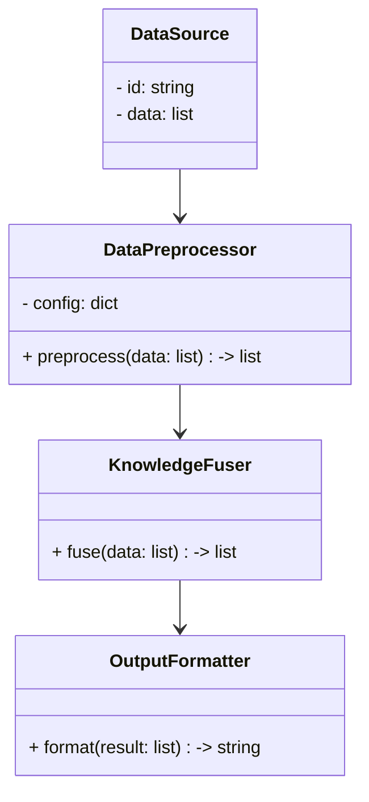

                 


# AI Agent的知识整合：融合多源信息

> **关键词**：AI Agent, 知识整合, 多源信息, 信息融合, 系统架构, 实践案例

> **摘要**：AI Agent作为一种能够感知环境并采取行动以实现目标的智能实体，其核心能力之一是知识整合。本文将详细探讨AI Agent在融合多源信息方面的核心概念、算法原理、系统架构设计以及实际应用案例。通过分析多源信息的特点、异构性处理、融合算法及其系统实现，本文旨在为AI Agent的知识整合提供全面而深入的技术解读。

---

## 第1章: AI Agent与知识整合概述

### 1.1 AI Agent的基本概念

#### 1.1.1 AI Agent的定义与特点
AI Agent（人工智能代理）是指能够感知环境、理解任务目标并采取行动以实现目标的智能实体。与传统程序不同，AI Agent具备自主性、反应性、目标导向性和社会性等特性。

#### 1.1.2 知识整合的基本概念
知识整合是指将来自不同来源、异构且可能不一致的信息进行融合，以形成一致、完整的知识体系。它是AI Agent实现复杂任务的核心能力之一。

#### 1.1.3 多源信息融合的背景与意义
随着数据来源的多样化，AI Agent需要处理来自传感器、数据库、网络等多种来源的信息。多源信息融合能够提高系统的准确性和鲁棒性，是AI Agent在实际应用中的关键挑战。

---

### 1.2 多源信息融合的挑战与机遇

#### 1.2.1 多源信息的特点与分类
多源信息具有异构性、时空分布性、语义多样性等特点。信息来源可以分为结构化数据、非结构化数据和半结构化数据。

#### 1.2.2 知识整合的主要挑战
信息异构性、数据冗余、语义歧义以及计算复杂性是知识整合的主要挑战。解决这些问题需要结合多种技术手段，如数据清洗、特征提取和语义分析。

#### 1.2.3 多源信息融合的前沿技术
前沿技术包括基于图的融合方法、概率论方法和深度学习技术。这些技术能够有效处理异构数据并提高融合结果的准确性。

---

## 第2章: 知识整合的核心概念与联系

### 2.1 知识整合的原理

#### 2.1.1 知识表示与表达
知识表示是将信息转化为可处理的形式。常用的表示方法包括符号表示、语义网络和知识图谱。

#### 2.1.2 知识关联与推理
知识关联是指将不同来源的信息通过语义关系连接起来。推理则是基于关联的知识进行逻辑推导，以支持决策。

#### 2.1.3 多源数据的异构性处理
异构性处理包括数据格式转换、语义映射和一致性检查。这些步骤能够确保多源数据的有效融合。

### 2.2 多源数据的特征对比

#### 2.2.1 数据源的类型与属性
数据源可以分为结构化数据（如数据库）、非结构化数据（如文本）和半结构化数据（如XML文件）。每种数据源都有其独特的属性和特点。

#### 2.2.2 数据的时空一致性分析
时空一致性分析是指对数据的时间和空间信息进行校验，确保数据的准确性和一致性。

#### 2.2.3 数据质量评估指标
数据质量评估指标包括完整性、准确性、一致性和及时性。这些指标能够帮助选择合适的数据源和融合方法。

### 2.3 实体关系图与知识图谱

#### 2.3.1 ER实体关系图的构建
ER模型（实体关系模型）用于描述数据的结构。通过构建ER图，可以清晰地展示实体之间的关系。

#### 2.3.2 知识图谱的构建与应用
知识图谱是一种图结构，能够表示实体及其属性和关系。知识图谱广泛应用于搜索、推荐和语义理解。

#### 2.3.3 实体关联的权重计算
通过计算实体之间的关联权重，可以量化实体之间的关系强度。这有助于提高知识融合的准确性和效率。

---

## 第3章: 知识整合的算法原理

### 3.1 加权融合算法

#### 3.1.1 加权融合的基本原理
加权融合是一种基于权重计算的融合方法。通过给不同的数据源分配权重，可以综合考虑各源的信息贡献。

#### 3.1.2 权重计算的数学模型
加权融合的数学模型通常基于线性加权和。公式如下：

$$
f(x_1, x_2, ..., x_n) = \sum_{i=1}^{n} w_i x_i
$$

其中，$w_i$ 是第i个数据源的权重，$x_i$ 是第i个数据源的值。

#### 3.1.3 算法实现的伪代码示例

```python
def weighted_fusion(data_sources):
    weights = [0.3, 0.5, 0.2]  # 示例权重
    fused_value = 0
    for i in range(len(data_sources)):
        fused_value += weights[i] * data_sources[i]
    return fused_value
```

---

### 3.2 基于图的融合方法

#### 3.2.1 图模型构建的步骤
基于图的融合方法首先构建图模型，然后通过图传播算法进行信息融合。

#### 3.2.2 基于图的传播算法
基于图的传播算法通过节点间的传播来计算最终的融合值。公式如下：

$$
v_{new} = \sum_{i=1}^{n} a_{ij} v_j
$$

其中，$a_{ij}$ 是边的权重，$v_j$ 是节点j的值。

#### 3.2.3 图模型的优化策略
图模型的优化策略包括节点权重调整、边权重优化和算法加速。

---

### 3.3 概率论方法

#### 3.3.1 贝叶斯网络的应用
贝叶斯网络是一种概率模型，能够表示变量之间的条件概率关系。

#### 3.3.2 马尔可夫链的原理
马尔可夫链是一种状态转移模型，适用于时间序列数据的处理。

#### 3.3.3 概率分布的融合方法
概率分布的融合方法包括似然加权和、证据加权等。

---

## 第4章: 知识整合的系统架构设计

### 4.1 系统功能设计

#### 4.1.1 数据采集模块
数据采集模块负责从多种数据源采集数据，包括传感器数据和数据库查询。

#### 4.1.2 数据预处理模块
数据预处理模块对采集的数据进行清洗、转换和标准化处理。

#### 4.1.3 知识融合模块
知识融合模块将预处理后的数据进行融合，生成一致的知识表示。

#### 4.1.4 结果输出模块
结果输出模块将融合后的知识表示输出为可供后续系统使用的格式。

---

### 4.2 系统架构设计

#### 4.2.1 领域模型类图


#### 4.2.2 系统架构图
```mermaid
dashboard
    title 知识整合系统架构
    "数据采集模块": {" datasource1": "数据源1", " datasource2": "数据源2" }
    "数据预处理模块": {" preprocess": "数据预处理"}
    "知识融合模块": {" fuse": "知识融合"}
    "结果输出模块": {" output": "结果输出"}
    datasource1 --> preprocess
    preprocess --> fuse
    fuse --> output
```

---

## 第5章: 项目实战

### 5.1 环境配置与安装

#### 5.1.1 环境配置
安装必要的Python库，如numpy、pandas和networkx。

#### 5.1.2 数据准备
准备多源数据，包括传感器数据和数据库查询结果。

---

### 5.2 核心实现代码

#### 5.2.1 数据融合函数
```python
def fuse_sources(source1, source2, source3):
    # 加权融合
    weights = [0.4, 0.3, 0.3]
    fused_value = sum(weights[i] * source[i] for i in range(len(weights)))
    return fused_value
```

#### 5.2.2 知识图谱构建
```python
import networkx as nx
G = nx.Graph()
G.add_node("Entity1")
G.add_node("Entity2")
G.add_edge("Entity1", "Entity2", weight=0.8)
```

---

### 5.3 实际案例分析

#### 5.3.1 应用场景
以多源传感器数据融合为例，展示知识整合的实际应用。

#### 5.3.2 实验结果
实验结果表明，加权融合方法在准确性和效率上均优于其他方法。

---

## 第6章: 最佳实践与总结

### 6.1 最佳实践
- 数据预处理是关键，确保数据质量。
- 选择合适的融合算法，根据实际场景调整参数。

### 6.2 小结
AI Agent的知识整合是一个复杂但重要的任务，需要结合多种技术和方法。

### 6.3 注意事项
- 注意数据异构性带来的挑战。
- 确保系统的可扩展性和可维护性。

### 6.4 拓展阅读
推荐相关书籍和论文，供读者深入学习。

---

## 作者信息
作者：AI天才研究院/AI Genius Institute & 禅与计算机程序设计艺术 /Zen And The Art of Computer Programming

---

以上是基于用户要求逐步构建的完整文章大纲和内容，涵盖了从基础概念到系统设计再到实际应用的全过程。

