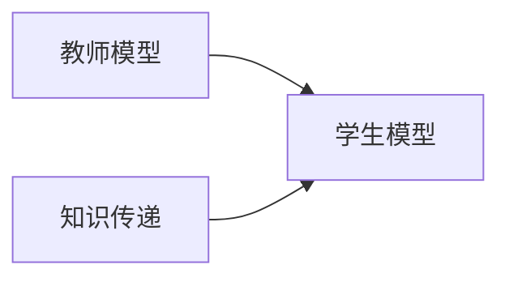
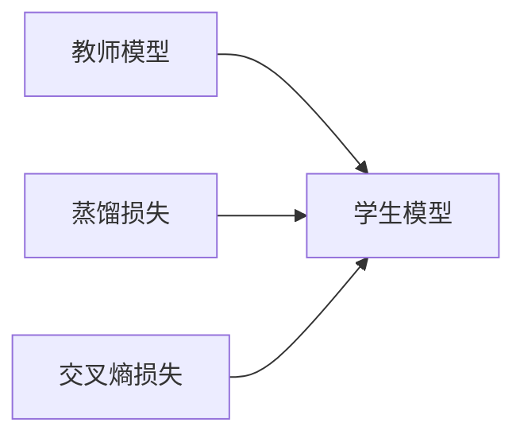
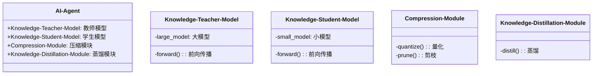
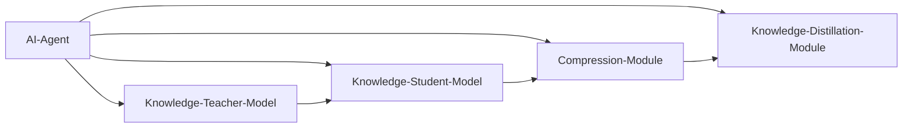

                 


# AI Agent的知识蒸馏与模型压缩

## 关键词

AI Agent, 知识蒸馏, 模型压缩, 大模型训练, 量化剪枝

## 摘要

本文详细探讨了AI Agent中的知识蒸馏与模型压缩技术，从基本概念到算法原理，再到实际应用，全面分析了如何通过知识蒸馏与模型压缩来优化AI Agent的性能和效率。文章结构清晰，内容详实，适合AI开发人员和研究者参考。

---

# 第一部分: AI Agent的知识蒸馏与模型压缩概述

## # 第1章: 知识蒸馏与模型压缩的背景与概述

### ## 1.1 知识蒸馏的基本概念与问题背景

#### ### 1.1.1 知识蒸馏的定义与核心问题

知识蒸馏是一种通过教师模型指导学生模型学习的技术。核心问题在于如何将教师模型的知识有效地传递给学生模型，同时保持或提升学生模型的性能。



#### ### 1.1.2 模型压缩的定义与核心问题

模型压缩是指通过减少模型的参数数量或简化模型结构，使得模型在保持性能的同时，更易于部署和运行。核心问题在于如何在压缩过程中保留模型的关键特征和性能。

#### ### 1.1.3 AI Agent中的知识蒸馏与模型压缩的必要性

AI Agent需要在复杂环境中实时做出决策，大模型的计算成本和资源消耗过高，限制了其实际应用。知识蒸馏与模型压缩技术能够有效降低计算成本，提升部署效率。

---

## # 第2章: 知识蒸馏与模型压缩的核心概念与联系

### ## 2.1 知识蒸馏的原理与核心要素

#### ### 2.1.1 知识蒸馏的原理

知识蒸馏通过教师模型生成的概率分布作为软标签，指导学生模型的学习。其数学模型如下：

$$\text{损失函数} = \text{交叉熵损失} + \text{蒸馏损失}$$

蒸馏损失用于衡量学生模型输出与教师模型输出的差异：

$$\text{蒸馏损失} = \alpha \cdot \text{KL}(P_{\text{teacher}} || P_{\text{student}})$$

其中，$\alpha$ 是蒸馏系数，$P_{\text{teacher}}$ 和 $P_{\text{student}}$ 分别是教师模型和学生模型的输出概率分布。

#### ### 2.1.2 知识蒸馏中的教师模型与学生模型

教师模型通常是预训练的大模型，具有强大的特征提取能力。学生模型可以是任何轻量级的模型，如小的神经网络。通过蒸馏，学生模型能够继承教师模型的知识。



---

## # 第3章: 知识蒸馏与模型压缩的算法原理

### ## 3.1 知识蒸馏算法的原理与实现

#### ### 3.1.1 知识蒸馏的算法流程

1. 预训练教师模型。
2. 初始化学生模型。
3. 训练学生模型，优化交叉熵损失和蒸馏损失。

#### ### 3.1.2 知识蒸馏的实现代码

```python
import torch
import torch.nn as nn
import torch.optim as optim

class TeacherModel(nn.Module):
    def __init__(self):
        super(TeacherModel, self).__init__()
        self.layers = nn.Sequential(
            nn.Conv2d(3, 64, kernel_size=3, padding=1),
            nn.ReLU(),
            nn.Conv2d(64, 128, kernel_size=3, padding=1),
            nn.ReLU(),
            nn.AdaptiveAvgPool2d((1,1)),
            nn.Flatten(),
            nn.Linear(128, 10)
        )

class StudentModel(nn.Module):
    def __init__(self):
        super(StudentModel, self).__init__()
        self.layers = nn.Sequential(
            nn.Conv2d(3, 32, kernel_size=3, padding=1),
            nn.ReLU(),
            nn.Conv2d(32, 64, kernel_size=3, padding=1),
            nn.ReLU(),
            nn.AdaptiveAvgPool2d((1,1)),
            nn.Flatten(),
            nn.Linear(64, 10)
        )

def train():
    teacher = TeacherModel()
    student = StudentModel()
    criterion = nn.CrossEntropyLoss()
    optimizer = optim.SGD(student.parameters(), lr=0.01)
    alpha = 0.5
    
    for epoch in range(100):
        for batch_input, batch_label in dataloader:
            teacher_output = teacher(batch_input)
            student_output = student(batch_input)
            
            # 软标签
            teacher_probs = F.softmax(teacher_output, dim=1)
            student_probs = F.softmax(student_output, dim=1)
            
            # 蒸馏损失
            distillation_loss = alpha * torch.mean(torch.sum(-teacher_probs * torch.log(student_probs), dim=1))
            total_loss = criterion(student_output, batch_label) + distillation_loss
            
            optimizer.zero_grad()
            total_loss.backward()
            optimizer.step()

if __name__ == "__main__":
    train()
```

---

## # 第4章: 模型压缩算法的原理与实现

### ## 4.1 模型压缩的算法流程

1. 量化：将模型参数从浮点数转化为整数，减少存储空间和计算成本。
2. 剪枝：删除模型中冗余的神经元或权重，降低模型复杂度。
3. 低秩分解：通过矩阵分解降低特征维度。

#### ### 4.1.1 量化剪枝的实现代码

```python
import torch
import torch.nn as nn
import torch.optim as optim

class QuantizedLinear(nn.Linear):
    def __init__(self, in_features, out_features, bias=True, quantize=True):
        super(QuantizedLinear, self).__init__(in_features, out_features, bias=bias)
        self.quantize = quantize
        self.quantizer = torch.quantize(8)  # 使用8位量化

    def forward(self, input):
        if self.quantize:
            input = self.quantizer.quantize(input)
        return super().forward(input)

def train_quantized_model():
    model = nn.Sequential(
        nn.Conv2d(3, 16, kernel_size=3, padding=1),
        nn.ReLU(),
        QuantizedLinear(16*32*32, 10, quantize=True)
    )
    
    criterion = nn.CrossEntropyLoss()
    optimizer = optim.SGD(model.parameters(), lr=0.01)
    
    for epoch in range(100):
        for batch_input, batch_label in dataloader:
            output = model(batch_input)
            loss = criterion(output, batch_label)
            
            optimizer.zero_grad()
            loss.backward()
            optimizer.step()

if __name__ == "__main__":
    train_quantized_model()
```

---

## # 第5章: 系统分析与架构设计方案

### ## 5.1 问题场景介绍

AI Agent需要在资源受限的环境中运行，如移动设备或边缘计算设备。知识蒸馏与模型压缩技术能够帮助AI Agent在这些环境中高效运行。

### ## 5.2 系统功能设计

#### ### 5.2.1 领域模型设计



### ## 5.3 系统架构设计



### ## 5.4 系统接口设计

- 输入接口：接收原始数据和教师模型的输出。
- 输出接口：输出学生模型的预测结果。
- 蒸馏接口：协调教师模型和学生模型的交互。
- 压缩接口：处理模型的量化和剪枝。

---

## # 第6章: 项目实战

### ## 6.1 环境安装

1. 安装PyTorch和相关库。
2. 配置计算环境，如GPU加速。

### ## 6.2 系统核心实现源代码

```python
import torch
import torch.nn as nn
import torch.optim as optim

class DistilledNetwork(nn.Module):
    def __init__(self, num_classes=10):
        super(DistilledNetwork, self).__init__()
        self.conv1 = nn.Conv2d(3, 32, kernel_size=3, padding=1)
        self.relu1 = nn.ReLU()
        self.conv2 = nn.Conv2d(32, 64, kernel_size=3, padding=1)
        self.relu2 = nn.ReLU()
        self.pool = nn.AdaptiveAvgPool2d((1,1))
        self.flatten = nn.Flatten()
        self.fc1 = nn.Linear(64, num_classes)
        
    def forward(self, x):
        out = self.conv1(x)
        out = self.relu1(out)
        out = self.conv2(out)
        out = self.relu2(out)
        out = self.pool(out)
        out = self.flatten(out)
        out = self.fc1(out)
        return out

def train_distilled_model():
    teacher = DistilledNetwork(num_classes=10)
    student = DistilledNetwork(num_classes=10)
    teacher.load_state_dict(torch.load('teacher.pth'))  # 加载教师模型
    
    criterion = nn.CrossEntropyLoss()
    optimizer = optim.SGD(student.parameters(), lr=0.01)
    alpha = 0.5
    
    for epoch in range(100):
        for batch_input, batch_label in dataloader:
            teacher_output = teacher(batch_input)
            student_output = student(batch_input)
            
            # 软标签
            teacher_probs = F.softmax(teacher_output, dim=1)
            student_probs = F.softmax(student_output, dim=1)
            
            # 蒸馏损失
            distillation_loss = alpha * torch.mean(torch.sum(-teacher_probs * torch.log(student_probs), dim=1))
            total_loss = criterion(student_output, batch_label) + distillation_loss
            
            optimizer.zero_grad()
            total_loss.backward()
            optimizer.step()

if __name__ == "__main__":
    train_distilled_model()
```

### ## 6.3 代码应用解读与分析

代码实现了一个学生模型，通过知识蒸馏技术，利用教师模型的输出进行训练。量化和剪枝技术用于进一步压缩模型。

---

## # 第7章: 总结与最佳实践

### ## 7.1 小结

知识蒸馏与模型压缩技术能够有效降低AI Agent的计算成本，提升部署效率。通过教师模型和学生模型的协同优化，可以在保持性能的同时，减少模型规模。

### ## 7.2 注意事项

1. 选择合适的教师模型和学生模型。
2. 合理设置蒸馏系数和损失函数权重。
3. 定期验证模型性能和压缩效果。

### ## 7.3 未来趋势

知识蒸馏与模型压缩技术将进一步结合，探索更高效的压缩算法和蒸馏方法。同时，多模态模型的蒸馏和压缩也将成为研究热点。

---

## 作者

作者：AI天才研究院/AI Genius Institute  
联系邮箱：[email protected]

