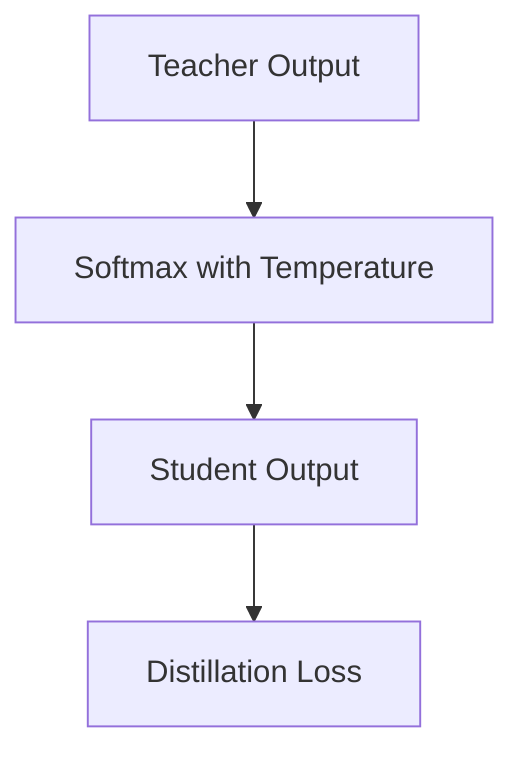
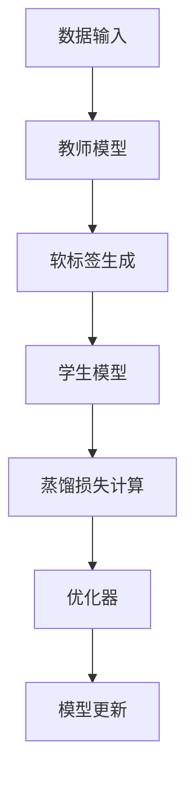
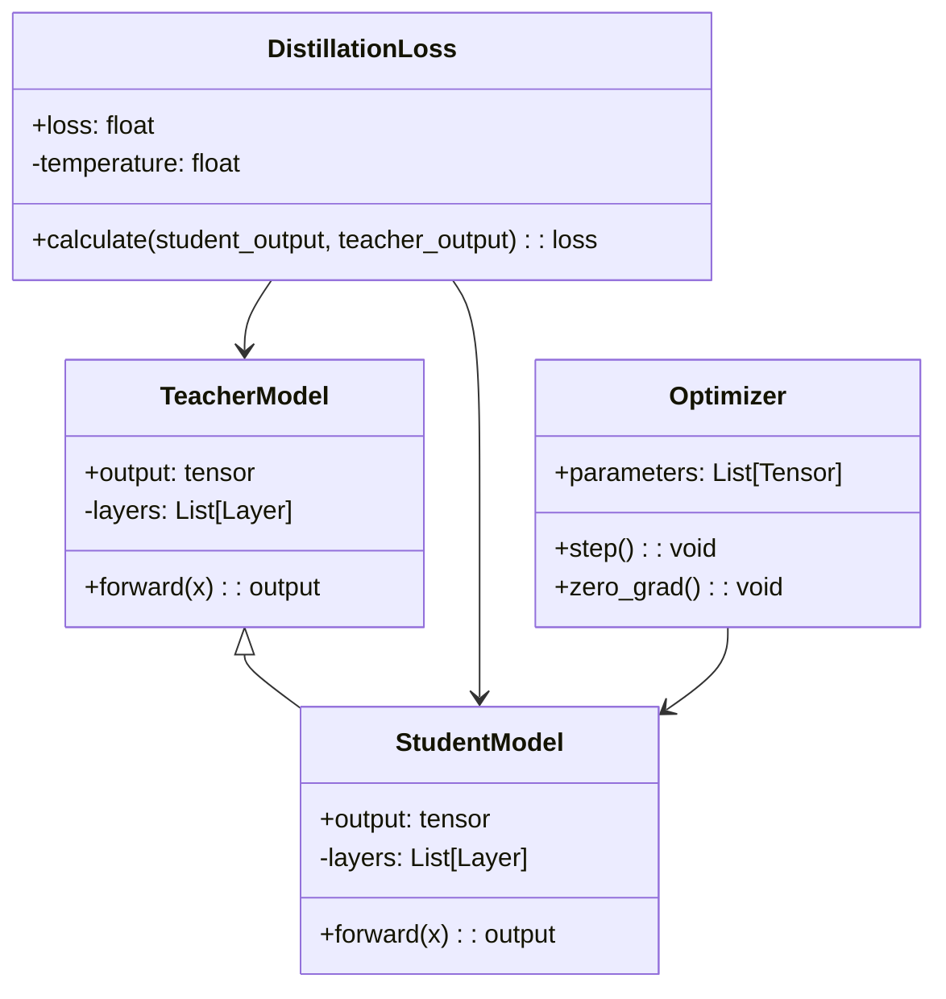
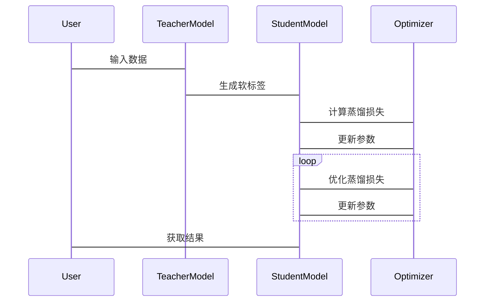

                 


# AI Agent的知识蒸馏技术应用

**关键词**：AI Agent, 知识蒸馏, 模型压缩, 深度学习, 人工智能, 知识迁移

**摘要**：知识蒸馏是一种将复杂的大模型知识迁移到小模型的技术，近年来在AI Agent领域得到了广泛应用。本文将从知识蒸馏的基本概念、核心原理、算法实现、系统设计、项目实战等多个方面，全面剖析知识蒸馏技术在AI Agent中的应用。通过详细讲解蒸馏过程、数学模型、代码实现和系统架构，本文为读者提供一个从理论到实践的完整知识体系。

---

# 第一部分: AI Agent的知识蒸馏技术背景

## 第1章: 知识蒸馏技术概述

### 1.1 知识蒸馏的起源与概念

知识蒸馏（Knowledge Distillation）是一种通过将复杂的大模型知识迁移到小模型的技术，旨在在资源受限的环境下保持模型的性能。其核心思想是将教师模型（Teacher Model）的“知识”通过蒸馏过程传递给学生模型（Student Model），使学生模型能够模仿教师模型的行为和决策。

**核心概念对比表**

| 概念          | 描述                                                                 |
|---------------|----------------------------------------------------------------------|
| 教师模型      | 高性能、大参数的复杂模型，提供指导性知识                                       |
| 学生模型      | 低资源、轻量级模型，通过蒸馏学习教师模型的知识                                 |
| 蒸馏损失      | 学生模型与教师模型之间的差异损失，用于衡量知识传递的效果                       |

### 1.2 AI Agent与知识蒸馏的结合

AI Agent是一种能够感知环境、执行任务并做出决策的智能实体。在AI Agent中，知识蒸馏技术主要用于将复杂的决策逻辑和知识迁移到轻量级的代理模型中，从而实现高效、实时的任务执行。

**AI Agent的知识蒸馏应用场景**

| 场景         | 描述                                                                 |
|--------------|----------------------------------------------------------------------|
| 智能客服     | 将大型NLP模型的知识迁移到轻量级代理，实现高效的对话处理                         |
| 自动驾驶     | 将复杂的路径规划知识迁移到边缘设备，实现低延迟的实时决策                       |
| 机器人控制   | 将高维运动规划模型的知识迁移到本地控制器，实现快速响应                         |

### 1.3 本章小结

知识蒸馏技术为AI Agent提供了一种高效的知识传递方法，能够在资源受限的环境中保持高性能。通过教师模型与学生模型的交互，AI Agent能够快速掌握复杂的决策逻辑，实现高效的任务执行。

---

# 第二部分: 知识蒸馏技术的核心原理

## 第2章: 知识蒸馏的基本原理

### 2.1 知识蒸馏的数学模型

知识蒸馏的核心是通过优化学生模型的输出概率分布，使其接近教师模型的输出概率分布。以下是蒸馏损失函数的数学表达式：

$$
L_{distill}(f_{S}(x), f_{T}(x)) = -\sum_{i} p_{T}(y|x_i) \log p_{S}(y|x_i)
$$

其中：
- $f_{S}(x)$ 表示学生模型的输出概率分布。
- $f_{T}(x)$ 表示教师模型的输出概率分布。
- $p_{T}(y|x_i)$ 表示教师模型在输入 $x_i$ 下的类别概率。
- $p_{S}(y|x_i)$ 表示学生模型在输入 $x_i$ 下的类别概率。

### 2.2 知识蒸馏的关键步骤

知识蒸馏的实现过程可以分为以下几个步骤：

1. **教师模型的构建与选择**：选择一个性能优秀的教师模型，并将其固定下来。
2. **学生模型的设计与训练**：设计一个轻量级的学生模型，并通过蒸馏损失函数对其进行训练。
3. **蒸馏过程中的温度调整**：通过调整温度参数，控制学生模型对教师模型知识的吸收程度。

**蒸馏过程的温度调整示意图**



### 2.3 本章小结

知识蒸馏的核心是通过优化学生模型的输出概率分布，使其接近教师模型的输出概率分布。通过数学模型和温度调整，可以实现高效的知識传递。

---

# 第三部分: 知识蒸馏技术的算法实现

## 第3章: 知识蒸馏算法的实现细节

### 3.1 知识蒸馏的实现流程

知识蒸馏的实现流程可以分为以下几个步骤：

1. **环境搭建**：安装所需的深度学习框架（如PyTorch）和相关库。
2. **模型定义**：定义教师模型和学生模型。
3. **数据准备**：准备用于蒸馏训练的数据集。
4. **蒸馏训练**：通过优化蒸馏损失函数，训练学生模型。
5. **模型评估**：评估学生模型的性能，确保其与教师模型的性能差距在可接受范围内。

**蒸馏训练的流程图**



### 3.2 知识蒸馏的Python实现

以下是一个简单的知识蒸馏算法实现示例：

```python
import torch
import torch.nn as nn
import torch.optim as optim

class TeacherModel(nn.Module):
    def __init__(self):
        super(TeacherModel, self).__init__()
        self.linear = nn.Linear(10, 5, bias=False)
    
    def forward(self, x):
        return torch.relu(self.linear(x))

class StudentModel(nn.Module):
    def __init__(self):
        super(StudentModel, self).__init__()
        self.linear = nn.Linear(10, 5, bias=False)
    
    def forward(self, x):
        return torch.relu(self.linear(x))

def distillation_loss(outputs_student, outputs_teacher, temperature=2):
    teacher_probs = torch.softmax(outputs_teacher / temperature, dim=1)
    student_probs = torch.softmax(outputs_student / temperature, dim=1)
    loss = -torch.sum(teacher_probs * torch.log(student_probs))
    return loss

# 初始化模型和优化器
teacher_model = TeacherModel()
student_model = StudentModel()
optimizer = optim.Adam(student_model.parameters(), lr=0.001)

# 蒸馏训练
for epoch in range(100):
    for batch_data in dataloader:
        # 前向传播
        teacher_outputs = teacher_model(batch_data)
        student_outputs = student_model(batch_data)
        # 计算蒸馏损失
        loss = distillation_loss(student_outputs, teacher_outputs)
        # 反向传播和优化
        optimizer.zero_grad()
        loss.backward()
        optimizer.step()
```

### 3.3 本章小结

通过上述代码示例，可以清晰地看到知识蒸馏的实现过程。教师模型和学生模型的交互，以及蒸馏损失的计算和优化，是实现知识蒸馏的核心步骤。

---

# 第四部分: 知识蒸馏技术的系统设计

## 第4章: 系统设计与实现

### 4.1 系统架构设计

AI Agent的知识蒸馏系统架构可以分为以下几个模块：

1. **数据预处理模块**：负责数据的收集、清洗和预处理。
2. **教师模型模块**：负责生成软标签。
3. **学生模型模块**：负责学习教师模型的知识。
4. **蒸馏训练模块**：负责优化蒸馏损失函数。
5. **模型评估模块**：负责评估学生模型的性能。

**系统架构类图**



### 4.2 系统交互设计

以下是系统交互的流程图：



### 4.3 本章小结

通过系统的架构设计和交互设计，可以清晰地看到知识蒸馏技术在AI Agent中的实现过程。各模块之间的协作和交互，是实现高效知识传递的关键。

---

# 第五部分: 项目实战

## 第5章: 项目实战与分析

### 5.1 项目背景

以智能客服场景为例，我们需要将大型NLP模型的知识迁移到轻量级的学生模型中，实现高效的对话处理。

### 5.2 环境搭建

1. **安装依赖**：
    ```bash
    pip install torch numpy pandas matplotlib
    ```

2. **数据准备**：
    ```python
    import pandas as pd

    data = pd.read_csv('dialogue_data.csv')
    ```

### 5.3 模型训练

```python
# 定义教师模型和学生模型
teacher_model = TeacherModel()
student_model = StudentModel()

# 定义优化器和损失函数
optimizer = optim.Adam(student_model.parameters(), lr=0.001)
criterion = nn.CrossEntropyLoss()

# 蒸馏训练
for epoch in range(100):
    for batch in dataloader:
        inputs, labels = batch
        # 前向传播
        teacher_outputs = teacher_model(inputs)
        student_outputs = student_model(inputs)
        # 计算损失
        loss = criterion(student_outputs, labels)
        # 反向传播和优化
        optimizer.zero_grad()
        loss.backward()
        optimizer.step()
```

### 5.4 模型部署

```python
# 加载训练好的学生模型
student_model.load_state_dict(torch.load('student_model.pth'))

# 定义推理函数
def inference(input):
    with torch.no_grad():
        output = student_model(input)
        return output.argmax(dim=1).item()

# 调用推理函数
inference(input_tensor)
```

### 5.5 项目小结

通过上述实战案例，可以清晰地看到知识蒸馏技术在智能客服场景中的应用。学生模型通过蒸馏教师模型的知识，实现了高效的对话处理。

---

# 第六部分: 最佳实践与总结

## 第6章: 最佳实践

### 6.1 知识蒸馏的注意事项

1. **温度参数的选择**：温度参数的大小会影响学生模型对教师模型知识的吸收程度，需要根据具体任务进行调整。
2. **数据质量**：高质量的数据是知识蒸馏成功的关键，需要对数据进行充分的清洗和预处理。
3. **模型选择**：教师模型的选择需要根据具体任务进行，选择性能优秀且适合蒸馏的模型。

### 6.2 小结

知识蒸馏技术为AI Agent提供了一种高效的知识传递方法，能够在资源受限的环境中保持高性能。通过教师模型与学生模型的交互，AI Agent能够快速掌握复杂的决策逻辑，实现高效的任务执行。

### 6.3 未来研究方向

1. **多教师蒸馏**：研究如何利用多个教师模型的知识进行蒸馏。
2. **自适应蒸馏**：研究如何根据任务需求自适应地调整蒸馏过程。
3. **跨模态蒸馏**：研究如何在不同模态之间进行知识蒸馏。

---

**作者：AI天才研究院/AI Genius Institute & 禅与计算机程序设计艺术 /Zen And The Art of Computer Programming**

