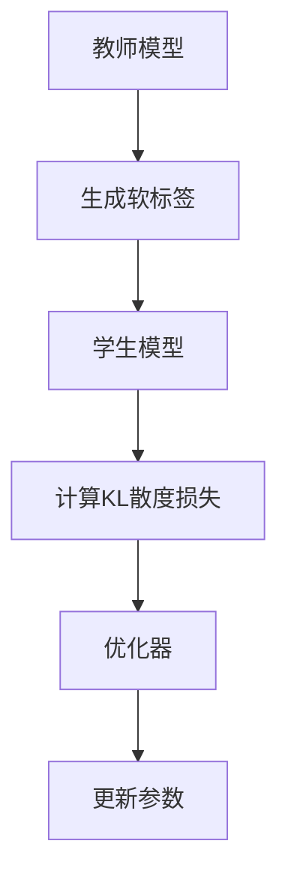
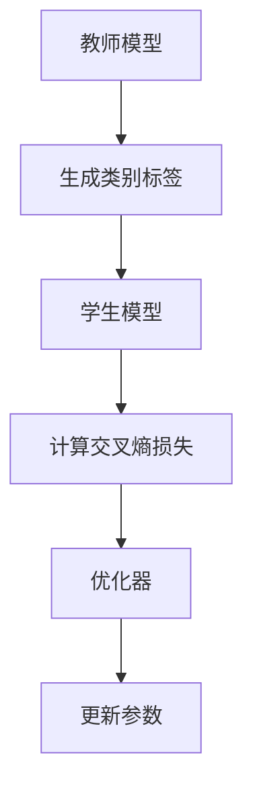
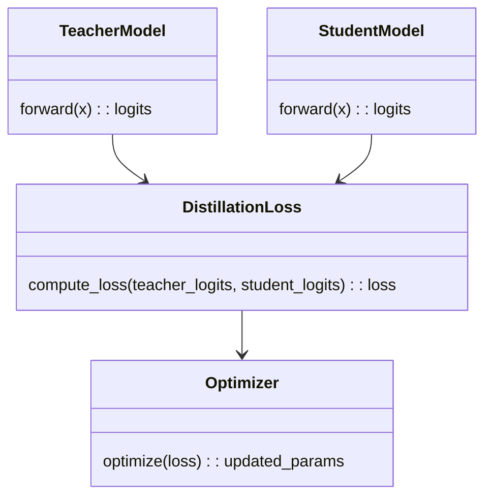
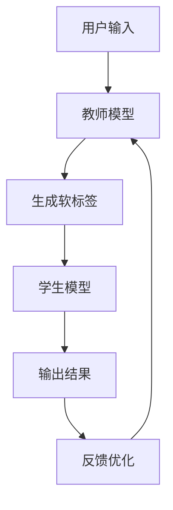
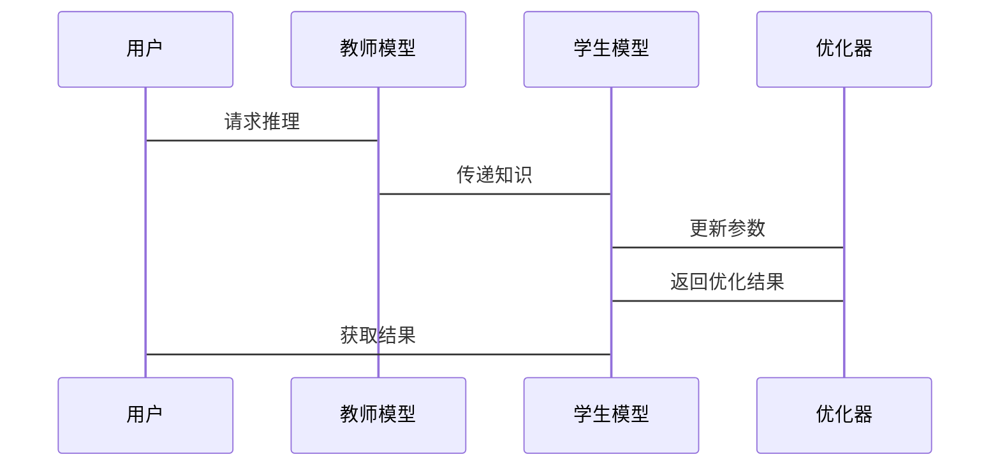

                 


# AI Agent的知识蒸馏：从大模型到轻量级模型

> 关键词：知识蒸馏，AI Agent，大模型，轻量级模型，模型压缩，迁移学习

> 摘要：本文深入探讨了AI Agent的知识蒸馏技术，从理论到实践，系统地介绍了如何将大模型的知识迁移到轻量级模型中。通过分析知识蒸馏的核心原理、算法实现、系统架构设计以及实际项目案例，本文为读者提供了从大模型到轻量级模型的完整技术路线图。

---

## 第一部分: AI Agent的知识蒸馏概述

### 第1章: 知识蒸馏的核心概念

#### 1.1 问题背景与目标
##### 1.1.1 大模型的局限性
大模型虽然在性能和准确性上表现出色，但其计算资源消耗巨大，难以在资源受限的场景中部署，例如移动设备或边缘计算环境。此外，大模型的复杂性使其难以解释和调试。

##### 1.1.2 轻量级模型的需求
轻量级模型因其低计算资源消耗、快速响应和易于部署的特点，在实际应用中备受关注。特别是在AI Agent领域，轻量级模型能够实现实时交互和本地推理，满足用户的实时需求。

##### 1.1.3 知识蒸馏的目标与意义
知识蒸馏的目标是将大模型的知识迁移到轻量级模型中，使轻量级模型在性能和准确性上接近甚至超越大模型。通过知识蒸馏，可以在保持或提升性能的同时，显著降低计算资源的消耗。

---

### 第2章: 知识蒸馏的核心原理

#### 2.1 知识蒸馏的原理概述
##### 2.1.1 教师模型与学生模型
知识蒸馏的核心是教师模型和学生模型的协作。教师模型通常是一个经过充分训练的大模型，负责提供知识；学生模型是一个较小的模型，负责学习教师模型的知识。

##### 2.1.2 知识蒸馏的关键步骤
1. **知识表示**：教师模型将知识以某种形式表示，例如概率分布或类别标签。
2. **知识传递**：学生模型通过优化目标函数，学习教师模型的知识。
3. **模型优化**：通过迭代优化，学生模型逐步逼近教师模型的性能。

##### 2.1.3 知识蒸馏的数学模型
知识蒸馏的损失函数通常由两部分组成：教师模型的损失和学生模型的损失。公式如下：
$$
\text{总损失} = \alpha \cdot \text{教师损失} + (1-\alpha) \cdot \text{学生损失}
$$
其中，$\alpha$ 是一个平衡系数，用于调节教师损失和学生损失的权重。

#### 2.2 知识蒸馏的主要方法
##### 2.2.1 软蒸馏（Soft Distillation）
软蒸馏通过概率分布的形式传递知识。教师模型输出的概率分布作为软标签，学生模型通过最小化预测概率与软标签之间的KL散度来学习。

##### 2.2.2 硬蒸馏（Hard Distillation）
硬蒸馏通过类别标签的形式传递知识。教师模型输出的类别标签作为硬标签，学生模型通过分类交叉熵损失来学习。

##### 2.2.3 知识蒸馏的优缺点对比
| 方法 | 优点 | 缺点 |
|------|------|------|
| 软蒸馏 | 更细粒度的知识传递 | 实现复杂，计算量大 |
| 硬蒸馏 | 实现简单，计算效率高 | 知识传递较为粗略 |

---

### 第3章: 知识蒸馏的算法实现

#### 3.1 软蒸馏算法的实现
##### 3.1.1 软蒸馏算法的流程图


##### 3.1.2 软蒸馏的数学模型
软蒸馏的损失函数如下：
$$
\text{损失函数} = -\sum_{i=1}^{n} y_i \log p_i
$$
其中，$y_i$ 是教师模型的预测概率，$p_i$ 是学生模型的预测概率。

##### 3.1.3 软蒸馏的Python实现示例
```python
import tensorflow as tf
from tensorflow import keras

def soft_distillation_loss(teacher_logits, student_logits):
    teacher_prob = tf.nn.softmax(teacher_logits)
    student_prob = tf.nn.softmax(student_logits)
    loss = tf.keras.losses.KullbackLeiblerDivergence()(teacher_prob, student_prob)
    return loss

# 示例用法
teacher_model = ...  # 教师模型
student_model = ...  # 学生模型

teacher_logits = teacher_model.predict(x)
student_logits = student_model.predict(x)
loss = soft_distillation_loss(teacher_logits, student_logits)
```

---

#### 3.2 硬蒸馏算法的实现
##### 3.2.1 硬蒸馏算法的流程图


##### 3.2.2 硬蒸馏的数学模型
硬蒸馏的损失函数如下：
$$
\text{损失函数} = \sum_{i=1}^{n} \text{CrossEntropy}(y_i, p_i)
$$
其中，$y_i$ 是教师模型的预测类别标签，$p_i$ 是学生模型的预测概率。

##### 3.2.3 硬蒸馏的Python实现示例
```python
import tensorflow as tf
from tensorflow import keras

def hard_distillation_loss(teacher_logits, student_logits):
    y_pred = tf.argmax(teacher_logits, axis=-1)
    loss = tf.keras.losses.SparseCategoricalCrossentropy()(y_pred, student_logits)
    return loss

# 示例用法
teacher_model = ...  # 教师模型
student_model = ...  # 学生模型

teacher_logits = teacher_model.predict(x)
student_logits = student_model.predict(x)
loss = hard_distillation_loss(teacher_logits, student_logits)
```

---

## 第二部分: 系统分析与架构设计

### 第4章: 系统架构设计

#### 4.1 问题场景介绍
以一个智能客服系统为例，系统需要在本地快速响应用户的问题，同时保持较高的准确率。由于计算资源的限制，无法直接使用大模型，因此需要通过知识蒸馏技术将大模型的知识迁移到轻量级模型中。

#### 4.2 系统功能设计
##### 4.2.1 领域模型设计


##### 4.2.2 系统架构设计


##### 4.2.3 接口设计与交互流程


---

## 第三部分: 项目实战与案例分析

### 第5章: 项目实战

#### 5.1 环境安装与配置
```bash
pip install tensorflow==2.5.0 keras==2.5.0 numpy==1.21.0
```

#### 5.2 知识蒸馏的核心实现
##### 5.2.1 软蒸馏的实现
```python
import tensorflow as tf
from tensorflow import keras

def soft_distillation_loss(teacher_logits, student_logits):
    teacher_prob = tf.nn.softmax(teacher_logits)
    student_prob = tf.nn.softmax(student_logits)
    loss = tf.keras.losses.KullbackLeiblerDivergence()(teacher_prob, student_prob)
    return loss

# 示例用法
teacher_model = keras.Sequential([
    keras.layers.Dense(128, activation='relu'),
    keras.layers.Dense(10, activation='softmax')
])

student_model = keras.Sequential([
    keras.layers.Dense(32, activation='relu'),
    keras.layers.Dense(10, activation='softmax')
])

# 训练学生模型
optimizer = tf.keras.optimizers.Adam(learning_rate=0.001)
loss_fn = soft_distillation_loss

# 假设我们已经有一个训练数据集(x_train, y_train)
# 使用教师模型进行预测
teacher_logits = teacher_model.predict(x_train)
# 使用学生模型进行预测
student_logits = student_model.predict(x_train)
# 计算损失
loss = loss_fn(teacher_logits, student_logits)
# 反向传播并优化
optimizer.minimize(loss, student_model.trainable_weights)
```

##### 5.2.2 硬蒸馏的实现
```python
import tensorflow as tf
from tensorflow import keras

def hard_distillation_loss(teacher_logits, student_logits):
    y_pred = tf.argmax(teacher_logits, axis=-1)
    loss = tf.keras.losses.SparseCategoricalCrossentropy()(y_pred, student_logits)
    return loss

# 示例用法
teacher_model = keras.Sequential([
    keras.layers.Dense(128, activation='relu'),
    keras.layers.Dense(10, activation='softmax')
])

student_model = keras.Sequential([
    keras.layers.Dense(32, activation='relu'),
    keras.layers.Dense(10, activation='softmax')
])

# 训练学生模型
optimizer = tf.keras.optimizers.Adam(learning_rate=0.001)
loss_fn = hard_distillation_loss

# 假设我们已经有一个训练数据集(x_train, y_train)
# 使用教师模型进行预测
teacher_logits = teacher_model.predict(x_train)
# 使用学生模型进行预测
student_logits = student_model.predict(x_train)
# 计算损失
loss = loss_fn(teacher_logits, student_logits)
# 反向传播并优化
optimizer.minimize(loss, student_model.trainable_weights)
```

#### 5.3 实际案例分析与优化
##### 5.3.1 案例分析
以一个图像分类任务为例，假设教师模型是一个ResNet50模型，学生模型是一个MobileNet模型。通过知识蒸馏，学生模型在保持较高准确率的同时，可以在移动设备上快速推理。

##### 5.3.2 模型优化与调优
1. **教师模型选择**：选择一个在目标任务上表现优秀的教师模型。
2. **蒸馏温度**：调整蒸馏温度$\tau$，通常在1到3之间，以平衡知识的细粒度传递。
3. **损失函数权重**：调整$\alpha$的值，以平衡教师损失和学生损失的影响。

---

## 第四部分: 最佳实践与小结

### 第6章: 最佳实践与注意事项

#### 6.1 小结
知识蒸馏是一种有效的模型压缩技术，能够将大模型的知识迁移到轻量级模型中。通过软蒸馏和硬蒸馏等方法，可以在保持或提升性能的同时，显著降低计算资源的消耗。

#### 6.2 注意事项
1. **教师模型选择**：选择一个在目标任务上表现优秀的教师模型。
2. **蒸馏温度**：调整蒸馏温度$\tau$，以平衡知识的细粒度传递。
3. **损失函数权重**：调整$\alpha$的值，以平衡教师损失和学生损失的影响。
4. **模型优化**：在蒸馏过程中，注意模型的收敛速度和最终性能。

#### 6.3 拓展阅读
1. Hinton, G., Vinyals, O., & Dean, J. (2015). Distilling the knowledge in neural networks.
2.压缩与蒸馏技术的相关书籍和论文。

---

## 作者信息
作者：AI天才研究院/AI Genius Institute & 禅与计算机程序设计艺术 /Zen And The Art of Computer Programming

---

以上是《AI Agent的知识蒸馏：从大模型到轻量级模型》的技术博客文章的完整大纲和内容。

