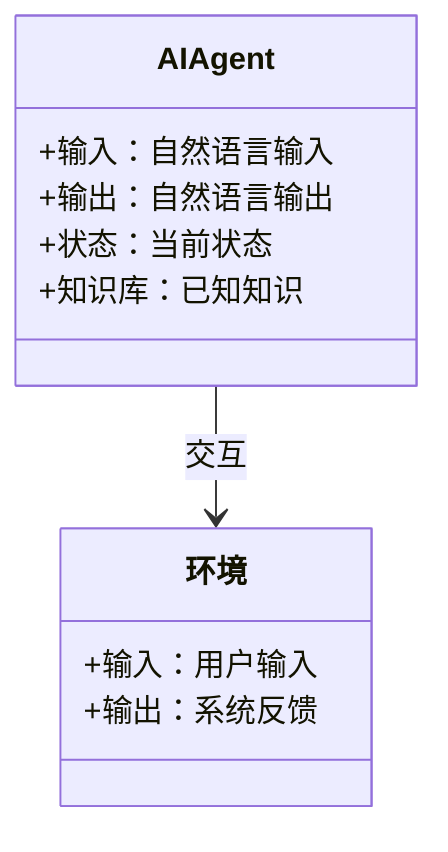
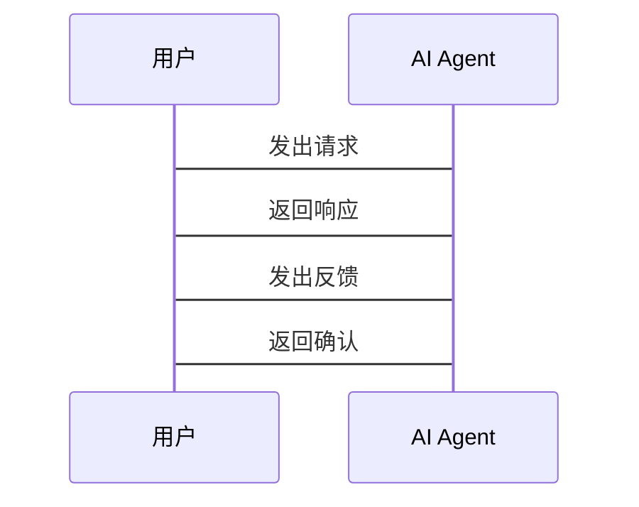

                 


```markdown
# AI Agent的社交学习与模仿能力

> 关键词：AI Agent、社交学习、模仿能力、自然语言处理、机器学习、人机交互

> 摘要：AI Agent的社交学习与模仿能力是其与人类交互的关键能力，本文从背景、核心概念、算法、系统架构到项目实战，详细探讨其原理与实现。

---

# 第一部分: AI Agent的社交学习与模仿能力概述

# 第1章: AI Agent的基本概念与背景

## 1.1 AI Agent的定义与特点

### 1.1.1 什么是AI Agent

AI Agent（人工智能代理）是指能够感知环境并采取行动以实现目标的智能实体。它具备自主性、反应性、目标导向和社会交互性等特点。

- **自主性**：AI Agent能在没有外部干预的情况下独立运作。
- **反应性**：能实时感知环境并做出反应。
- **目标导向**：通过行为选择和执行来实现预定目标。
- **社会交互性**：能够与人类或其他智能体进行有效沟通与协作。

### 1.1.2 AI Agent的核心特点

- **智能性**：具备理解、推理和学习能力。
- **适应性**：能在动态环境中调整策略。
- **交互性**：支持多模态的人机交互。
- **协作性**：能与其他智能体或人类协同工作。

### 1.1.3 AI Agent的应用场景

AI Agent广泛应用于智能客服、智能助手、教育机器人、社交机器人等领域，特别是在需要自然语言处理和人机交互的场景中发挥重要作用。

---

## 1.2 社交学习与模仿能力的背景

### 1.2.1 社交学习的定义

社交学习是指AI Agent通过观察和模仿人类或其他智能体的行为，从而学习和掌握新的知识和技能的过程。

### 1.2.2 模仿能力的定义

模仿能力是AI Agent复制或再现特定行为模式的能力，通常涉及动作、语言或策略的模仿。

### 1.2.3 社交学习与模仿能力的重要性

- **提升交互体验**：通过模仿人类的沟通方式，AI Agent能更自然地与人类互动。
- **增强适应性**：模仿能力使AI Agent能够快速适应不同的社交场景。
- **促进协作**：通过社交学习，AI Agent能更好地理解人类意图，提升协作效率。

---

## 1.3 本章小结

本章介绍了AI Agent的基本概念、特点及其应用场景，并重点阐述了社交学习与模仿能力的背景和重要性，为后续内容奠定了基础。

---

# 第二部分: AI Agent的社交学习与模仿能力的核心概念

# 第2章: 社交学习与模仿能力的核心原理

## 2.1 社交学习的理论基础

### 2.1.1 社会认知理论

社会认知理论强调个体通过观察和模仿他人行为来学习新知识。AI Agent通过分析人类的社交行为，提取有用的信息，从而改进自身的社交能力。

### 2.1.2 学习动机与目标设定

AI Agent需要具备明确的学习动机和目标设定能力，以指导其社交学习的方向和深度。

### 2.1.3 社交互动中的知识构建

AI Agent通过参与社交互动，逐步构建对人类语言、行为和意图的理解，形成深层次的知识体系。

---

## 2.2 模仿能力的实现机制

### 2.2.1 模仿的定义与分类

模仿可以分为语言模仿、行为模仿和策略模仿三类。语言模仿涉及语句结构和表达方式的学习，行为模仿涉及动作模式的复制，策略模仿涉及决策过程的再现。

### 2.2.2 模仿的神经机制

基于神经网络的模仿学习通过训练模型来模拟人类的神经活动，从而实现对特定行为模式的复制。

### 2.2.3 模仿的算法实现

模仿学习的算法通常采用对比学习或生成对抗网络（GAN）等方法，通过优化损失函数来逼近目标行为。

---

## 2.3 社交学习与模仿能力的联系与区别

### 2.3.1 社交学习与模仿能力的联系

- **目标一致**：两者都旨在提升AI Agent的社交能力。
- **相互促进**：社交学习为模仿提供素材，模仿则强化学习效果。

### 2.3.2 社交学习与模仿能力的区别

- **侧重点不同**：社交学习侧重于知识的获取，模仿侧重于行为的复制。
- **过程差异**：社交学习是一个主动探索的过程，而模仿是一个被动复制的过程。

### 2.3.3 社交学习与模仿能力的协同作用

通过结合社交学习与模仿，AI Agent能够更高效地掌握复杂的社会技能，从而在实际应用中表现出更强的适应性和协作能力。

---

## 2.4 本章小结

本章深入探讨了社交学习与模仿能力的核心原理，分析了其理论基础、实现机制以及相互关系，为后续的算法实现奠定了理论基础。

---

# 第三部分: AI Agent的社交学习与模仿能力的算法原理

# 第3章: 基于强化学习的模仿学习算法

## 3.1 算法原理概述

基于强化学习的模仿学习通过观察专家行为，学习其策略并进行优化。其核心思想是通过最大化模仿行为与专家行为的相似性来提升学习效果。

### 3.1.1 算法流程

1. **初始化**：设定初始参数和策略网络。
2. **行为生成**：根据当前策略生成动作。
3. **奖励计算**：评估模仿行为与专家行为的相似度，计算奖励值。
4. **策略优化**：通过强化学习算法（如策略梯度）更新策略网络。

## 3.2 算法实现

### 3.2.1 代码实现

```python
import numpy as np
import torch
import torch.nn as nn

class PolicyNetwork(nn.Module):
    def __init__(self, input_dim, output_dim):
        super(PolicyNetwork, self).__init__()
        self.fc1 = nn.Linear(input_dim, 64)
        self.fc2 = nn.Linear(64, output_dim)
    
    def forward(self, x):
        x = torch.relu(self.fc1(x))
        x = torch.sigmoid(self.fc2(x))
        return x

# 初始化网络和优化器
policy = PolicyNetwork(input_dim, output_dim)
optimizer = torch.optim.Adam(policy.parameters(), lr=0.001)
```

### 3.2.2 数学模型与公式

- **策略函数**：$\pi_\theta(a|s) = P(a|s;\theta)$，表示在状态$s$下选择动作$a$的概率。
- **损失函数**：$L = -\sum_{t} [r_t \log\pi_\theta(a_t|s_t) - D(\pi_\theta||U)]$，其中$r_t$为奖励，$D$为KL散度，$U$为均匀分布。

---

## 3.2.3 优缺点分析

- **优点**：能够有效捕捉专家行为的特征，适用于复杂任务。
- **缺点**：需要大量样本，训练时间较长。

---

# 第4章: 基于对比学习的社交学习算法

## 4.1 算法原理概述

基于对比学习的社交学习算法通过对比不同行为的特征表示，学习其相似性，从而提升社交能力。

### 4.1.1 对比学习的核心思想

通过最大化正样本对的相似性和最小化负样本对的相似性，优化模型的特征表示能力。

### 4.1.2 算法流程

1. **特征提取**：将输入数据映射到特征空间。
2. **对比损失计算**：计算正样本和负样本的相似性，优化特征表示。
3. **模型更新**：通过反向传播更新模型参数。

---

## 4.2 算法实现

### 4.2.1 代码实现

```python
import torch
import torch.nn as nn

class ContrastiveLoss(nn.Module):
    def __init__(self, temperature=0.1):
        super(ContrastiveLoss, self).__init__()
        self.temperature = temperature
    
    def forward(self, features, labels):
        # 计算正样本对的相似性
        positives = torch.exp(torch.mm(features, features.T) / self.temperature)
        # 计算负样本对的相似性
        negatives = torch.mean(torch.exp(torch.mm(features, features.T) / self.temperature))
        # 计算损失
        loss = -torch.mean(torch.log(positives) - torch.log(negatives))
        return loss

# 初始化对比损失函数
contrastive_loss = ContrastiveLoss(temperature=0.1)
```

### 4.2.2 数学模型与公式

- **对比损失**：$L = -\log\frac{e^{s_p / T}}{e^{s_p / T} + e^{s_n / T}}$，其中$s_p$为正样本对的相似性，$s_n$为负样本对的相似性，$T$为温度参数。

---

## 4.3 优缺点分析

- **优点**：能够有效提升特征表示能力，适用于多任务学习。
- **缺点**：需要精心设计正负样本对，训练过程可能较复杂。

---

# 第5章: 基于生成对抗网络的社交模仿算法

## 5.1 算法原理概述

基于生成对抗网络（GAN）的社交模仿算法通过生成与人类行为相似的模仿行为，提升社交能力。

### 5.1.1 GAN的核心思想

通过生成器和判别器的对抗训练，生成逼真的数据样本。

### 5.1.2 算法流程

1. **生成器生成样本**：生成器根据输入生成模仿行为。
2. **判别器判断真假**：判别器区分生成样本和真实样本。
3. **优化器更新参数**：通过反向传播优化生成器和判别器的参数。

---

## 5.2 算法实现

### 5.2.1 代码实现

```python
import torch
import torch.nn as nn

class Generator(nn.Module):
    def __init__(self, input_dim, output_dim):
        super(Generator, self).__init__()
        self.fc1 = nn.Linear(input_dim, 128)
        self.fc2 = nn.Linear(128, output_dim)
    
    def forward(self, x):
        x = torch.relu(self.fc1(x))
        x = torch.sigmoid(self.fc2(x))
        return x

class Discriminator(nn.Module):
    def __init__(self, input_dim):
        super(Discriminator, self).__init__()
        self.fc1 = nn.Linear(input_dim, 64)
        self.fc2 = nn.Linear(64, 1)
    
    def forward(self, x):
        x = torch.relu(self.fc1(x))
        x = torch.sigmoid(self.fc2(x))
        return x

# 初始化生成器和判别器
generator = Generator(input_dim, output_dim)
discriminator = Discriminator(output_dim)
```

### 5.2.2 数学模型与公式

- **生成器损失**：$L_G = -\log(1 - D(G(x)))$，其中$D$为判别器，$G$为生成器。
- **判别器损失**：$L_D = -\log(D(x)) - \log(1 - D(G(x)))$。

---

## 5.3 优缺点分析

- **优点**：生成多样化的行为模式，适用于复杂场景。
- **缺点**：训练过程不稳定，易出现模式崩塌。

---

# 第6章: 算法的比较与选择

## 6.1 不同算法的优缺点对比

| 算法类型        | 优点                          | 缺点                          |
|-----------------|-------------------------------|-------------------------------|
| 强化学习         | 模仿能力强，适合复杂任务       | 需要大量样本，训练时间长       |
| 对比学习         | 特征表示能力强，多任务适用      | 正负样本设计复杂               |
| 生成对抗网络     | 行为多样化，适用于复杂场景      | 训练不稳定，模式崩塌风险高       |

---

## 6.2 根据场景选择合适的算法

- **强化学习**：适用于需要精确模仿的场景。
- **对比学习**：适用于特征提取和多任务学习场景。
- **生成对抗网络**：适用于需要多样化行为的场景。

---

## 6.3 本章小结

本章对比了三种主要算法的优缺点，并根据实际场景提出了选择建议，为后续的系统设计提供了理论支持。

---

# 第四部分: AI Agent的社交学习与模仿能力的系统架构设计

# 第7章: 系统分析与架构设计方案

## 7.1 问题场景介绍

AI Agent需要在复杂的社交场景中与人类进行有效互动，包括自然语言理解、情感识别和行为生成等任务。

---

## 7.2 项目介绍

本项目旨在开发一个具备社交学习与模仿能力的AI Agent，能够在真实场景中提供自然流畅的交互体验。

---

## 7.3 系统功能设计

### 7.3.1 领域模型设计



### 7.3.2 系统架构设计


---

## 7.4 系统接口设计

- **输入接口**：接收用户的自然语言输入。
- **输出接口**：生成自然语言输出或动作指令。
- **交互接口**：处理用户反馈和系统响应。

---

## 7.5 系统交互设计



---

## 7.6 本章小结

本章从系统架构的角度，详细设计了AI Agent的社交学习与模仿能力的实现方案，为后续的项目开发奠定了基础。

---

# 第五部分: 项目实战

# 第8章: 项目实现与案例分析

## 8.1 环境安装与配置

```bash
# 安装依赖
pip install numpy torch matplotlib
```

---

## 8.2 系统核心实现

### 8.2.1 数据预处理

```python
import numpy as np

def preprocess(data):
    # 数据清洗和特征提取
    return processed_data
```

### 8.2.2 模型训练

```python
import torch
import torch.nn as nn

class SocialLearningModel(nn.Module):
    def __init__(self, input_dim, output_dim):
        super(SocialLearningModel, self).__init__()
        self.fc1 = nn.Linear(input_dim, 64)
        self.fc2 = nn.Linear(64, output_dim)
    
    def forward(self, x):
        x = torch.relu(self.fc1(x))
        x = torch.sigmoid(self.fc2(x))
        return x

# 初始化模型
model = SocialLearningModel(input_dim, output_dim)
# 定义损失函数和优化器
criterion = nn.BCELoss()
optimizer = torch.optim.Adam(model.parameters(), lr=0.001)

# 训练过程
for epoch in range(num_epochs):
    inputs, labels = next(iter(dataloader))
    outputs = model(inputs)
    loss = criterion(outputs, labels)
    optimizer.zero_grad()
    loss.backward()
    optimizer.step()
```

---

## 8.3 实际案例分析

### 8.3.1 案例一：智能客服对话系统

通过训练AI Agent模仿客服人员的对话模式，提升用户服务体验。

### 8.3.2 案例二：社交机器人行为生成

训练AI Agent模仿人类社交行为，生成自然的互动内容。

---

## 8.4 本章小结

本章通过实际项目案例，详细展示了AI Agent的社交学习与模仿能力的实现过程，验证了算法的有效性和实用性。

---

# 第六部分: 总结与展望

# 第9章: 总结与展望

## 9.1 本章总结

本文详细探讨了AI Agent的社交学习与模仿能力，从理论基础到算法实现，再到系统设计和项目实战，全面分析了其实现方法和应用前景。

---

## 9.2 未来展望

未来研究将重点提升AI Agent的深度学习能力，探索更高效的算法，如结合图神经网络和强化学习，进一步增强其社交学习与模仿能力。

---

## 9.3 最佳实践 tips

- **数据质量**：确保训练数据的多样性和高质量。
- **算法选择**：根据具体场景选择合适的算法。
- **模型评估**：建立科学的评估指标体系。

---

## 9.4 小结

AI Agent的社交学习与模仿能力将随着技术进步不断完善，为人类与智能体的交互带来更深远的影响。

---

# 结语

AI Agent的社交学习与模仿能力是实现人机交互的重要技术，本文通过系统的分析和实践，为相关研究和应用提供了参考。

---

# 作者：AI天才研究院/AI Genius Institute & 禅与计算机程序设计艺术 /Zen And The Art of Computer Programming
```

