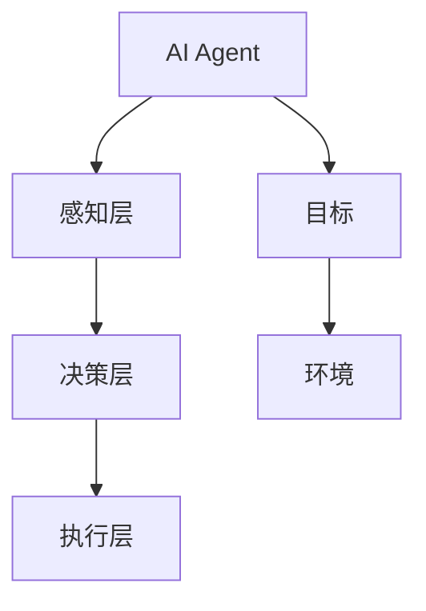
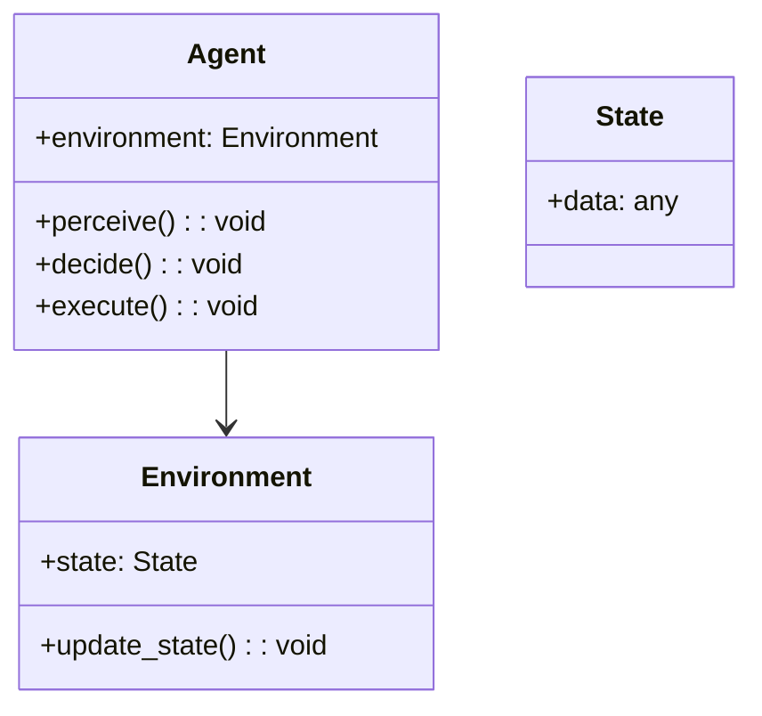
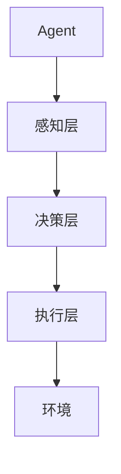
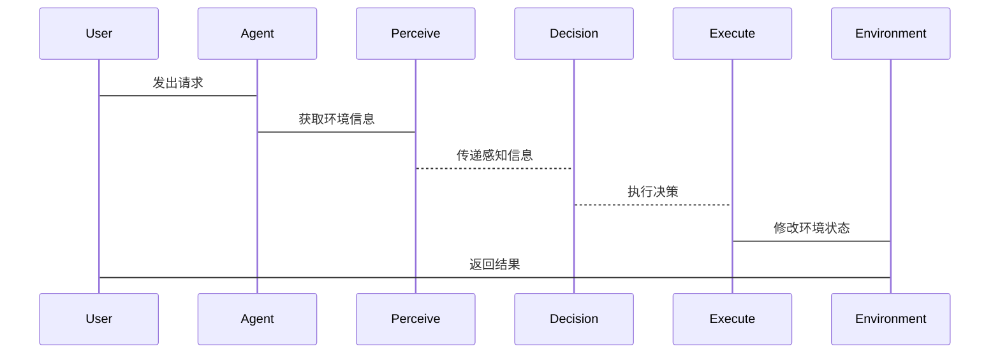

                 


# AI Agent的系统架构设计与实现

**关键词**：AI Agent，系统架构，算法原理，项目实战，系统设计

**摘要**：本文详细探讨AI Agent的系统架构设计与实现，涵盖其背景、核心概念、算法原理、系统架构设计、项目实战以及最佳实践。通过一步步的分析和推理，结合实际案例，深入剖析AI Agent的实现细节，帮助读者全面理解并掌握AI Agent的技术要点。

---

## 第1章 AI Agent的背景与概念

### 1.1 AI Agent的基本概念

AI Agent（人工智能代理）是指能够感知环境、自主决策并执行任务的智能实体。它通过传感器获取信息，利用推理能力做出决策，并通过执行器与环境交互。AI Agent的核心特点包括自主性、反应性、目标导向性和社会性。AI Agent的演进历程从简单的规则驱动模型逐步发展到复杂的深度学习和强化学习模型。

### 1.2 AI Agent的核心特点

- **自主性**：AI Agent能够在没有外部干预的情况下自主完成任务。
- **反应性**：能够实时感知环境变化并做出响应。
- **目标导向性**：基于明确的目标进行决策和行动。
- **社会性**：能够与其他AI Agent或人类进行协作或竞争。

### 1.3 AI Agent的演进历程

AI Agent的发展经历了三个阶段：
1. **规则驱动阶段**：基于预定义的规则进行简单的决策。
2. **学习驱动阶段**：利用机器学习技术从数据中学习决策策略。
3. **智能驱动阶段**：结合深度学习和强化学习，实现更复杂的智能行为。

### 1.4 AI Agent的应用场景

- **智能助手**：如Siri、Alexa等，帮助用户完成日常任务。
- **推荐系统**：基于用户行为推荐个性化内容。
- **自动驾驶**：通过感知环境和决策系统实现自动驾驶功能。

---

## 第2章 AI Agent的核心概念与联系

### 2.1 AI Agent的核心原理

AI Agent的核心原理包括感知、决策和执行三个环节：
1. **感知**：通过传感器获取环境信息。
2. **决策**：基于感知信息和目标进行推理，制定行动计划。
3. **执行**：通过执行器将决策转化为具体行动。

### 2.2 AI Agent的类型对比

AI Agent可以分为以下几种类型：

| 类型          | 描述                                      | 优点                          | 缺点                          |
|---------------|------------------------------------------|-------------------------------|-------------------------------|
| 反应式AI Agent | 基于当前感知做出即时反应                  | 响应速度快，适用于实时任务     | 无法处理复杂或长期任务         |
| 基于模型的AI Agent | 基于环境模型进行决策                   | 能够处理复杂任务，具有灵活性    | 计算资源消耗较大                |
| 混合型AI Agent | 结合反应式和基于模型的策略               | 结合了两者的优点                | 实现复杂性较高                 |

### 2.3 AI Agent的ER实体关系图



---

## 第3章 AI Agent的算法原理

### 3.1 常见AI Agent算法概述

AI Agent的核心算法包括路径规划算法、决策树算法和强化学习算法。

#### 3.1.1 Dijkstra算法

Dijkstra算法用于寻找图中两个节点之间的最短路径。

**数学模型**：
$$
\text{距离}(u, v) = \min_{k} (\text{距离}(u, k) + \text{权重}(k, v))
$$

**Python代码实现**：

```python
import heapq

def dijkstra(graph, start, goal):
    dist = {node: float('infinity') for node in graph}
    dist[start] = 0
    heap = [(0, start)]
    visited = set()

    while heap:
        current_dist, current_node = heapq.heappop(heap)
        if current_node in visited:
            continue
        visited.add(current_node)
        if current_node == goal:
            break
        for neighbor, weight in graph[current_node].items():
            if dist[neighbor] > current_dist + weight:
                dist[neighbor] = current_dist + weight
                heapq.heappush(heap, (dist[neighbor], neighbor))
    return dist[goal]
```

**流程图**：

```mermaid
graph TD
    A[start] --> B[优先队列]
    B --> C[current_dist, current_node]
    C --> D[current_node in visited?]
    D -->|no| E[visited.add(current_node)]
    E --> F[current_node == goal?]
    F -->|yes| G[break]
    F -->|no| H[遍历邻居]
    H --> I[更新dist[neighbor]]
    I --> J[将(neighbor, new_dist)推入堆]
```

---

## 第4章 AI Agent的系统架构设计

### 4.1 系统功能设计

AI Agent的系统功能包括：
1. **感知层**：负责信息的采集和处理。
2. **决策层**：基于感知信息进行决策。
3. **执行层**：将决策转化为具体行动。

**类图**：



### 4.2 系统架构设计

**整体架构图**：



### 4.3 系统接口设计

系统接口包括：
1. **感知接口**：获取环境信息。
2. **决策接口**：制定行动计划。
3. **执行接口**：执行具体任务。

### 4.4 系统交互设计

**交互流程图**：



---

## 第5章 项目实战：AI Agent的实现

### 5.1 环境配置

安装所需的依赖：
```bash
pip install numpy matplotlib
```

### 5.2 核心代码实现

```python
import numpy as np

class AI-Agent:
    def __init__(self, environment):
        self.environment = environment

    def perceive(self):
        # 获取环境信息
        return self.environment.get_state()

    def decide(self, state):
        # 基于状态进行决策
        return self.choose_action(state)

    def execute(self, action):
        # 执行具体操作
        self.environment.execute_action(action)

def main():
    environment = Environment()
    agent = AI-Agent(environment)
    while True:
        state = agent.perceive()
        action = agent.decide(state)
        agent.execute(action)

if __name__ == "__main__":
    main()
```

### 5.3 代码解读与分析

- **AI-Agent类**：负责与环境交互，实现感知、决策和执行。
- **perceive方法**：获取环境信息。
- **decide方法**：基于感知信息进行决策。
- **execute方法**：执行具体操作。

### 5.4 实际案例分析

通过一个简单的路径规划案例，展示AI Agent的实现过程：

```python
graph TD
    Agent --> Perceive
    Perceive --> Decision
    Decision --> Execute
    Execute --> Environment
```

---

## 第6章 最佳实践与总结

### 6.1 最佳实践 tips

- **模块化设计**：将系统划分为感知、决策和执行模块。
- **数据处理**：确保感知数据的准确性和完整性。
- **算法优化**：根据具体场景选择合适的算法。

### 6.2 小结

本文详细探讨了AI Agent的系统架构设计与实现，从背景介绍到项目实战，全面剖析了AI Agent的核心概念和实现细节。

### 6.3 注意事项

- **数据安全**：确保感知数据的安全性。
- **系统稳定性**：保证系统的稳定性和可靠性。
- **算法可解释性**：提升算法的可解释性，便于调试和优化。

### 6.4 拓展阅读

- 推荐阅读《人工智能：一种现代的方法》和《机器学习实战》。

---

**作者**：AI天才研究院/AI Genius Institute & 禅与计算机程序设计艺术 /Zen And The Art of Computer Programming

---

这篇文章全面覆盖了AI Agent的系统架构设计与实现，从理论到实践，层层深入，帮助读者掌握AI Agent的核心技术。

