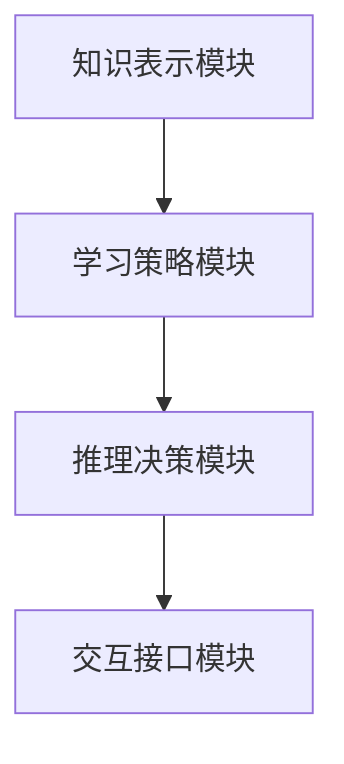

                 


# AI Agent的终身学习系统设计

> **关键词**：AI Agent，终身学习，自适应推理，知识更新，经验驱动，系统架构

> **摘要**：  
本文详细探讨了AI Agent的终身学习系统设计，从基本概念到系统架构，再到算法实现和项目实战，系统性地阐述了如何构建一个能够持续学习和适应复杂环境的AI系统。文章通过理论分析、架构设计、算法实现和实际案例，全面解析了终身学习系统的核心要素、设计原则和实现方法，为AI开发者和研究人员提供了实践指导。

---

## 第1章: AI Agent与终身学习概述

### 1.1 AI Agent的基本概念

#### 1.1.1 AI Agent的定义  
AI Agent（智能体）是指能够在环境中感知、推理、决策和行动的智能系统。它通过与环境交互，实现特定目标，如问题解决、数据处理或用户服务。Agent可以是软件程序、机器人或其他智能系统。

#### 1.1.2 AI Agent的核心特征  
AI Agent具有以下核心特征：  
- **自主性**：能够在没有外部干预的情况下独立运作。  
- **反应性**：能够实时感知环境并做出反应。  
- **目标导向**：基于目标驱动行为和决策。  
- **学习能力**：能够通过经验改进性能。

#### 1.1.3 终身学习的定义与特点  
终身学习是指系统能够不断从新数据和环境中学习，持续改进性能，适应变化的能力。其特点包括：  
- **持续性**：学习是一个持续的过程，而非一次性任务。  
- **自适应性**：能够根据新数据调整模型和策略。  
- **泛化性**：能够在多种场景下有效应用所学知识。

---

### 1.2 终身学习系统的核心概念

#### 1.2.1 终身学习系统的背景与问题背景  
随着环境的变化和数据的增加，传统的静态模型无法适应新场景。终身学习系统通过动态更新，能够持续优化性能，解决动态环境下的问题。

#### 1.2.2 终身学习系统的属性特征对比  
| 特性               | 终身学习系统         | 非终身学习系统     |
|--------------------|----------------------|--------------------|
| 学习能力           | 具备持续学习能力     | 学习一次，无法更新 |
| 适应性             | 高度适应环境变化     | 适应性有限         |
| 知识更新           | 支持在线更新         | 知识固定           |

#### 1.2.3 终身学习系统的边界与外延  
终身学习系统的边界在于其学习机制和更新能力。外延包括与外部数据源、API和用户的交互。

---

### 1.3 终身学习系统的核心要素组成

#### 1.3.1 知识表示与更新机制  
知识表示是系统理解数据的关键。终身学习系统需要通过知识表示模型，将新数据整合到现有知识中，避免知识遗忘。

#### 1.3.2 经验积累与学习策略  
系统通过经验积累，优化学习策略，提升性能。经验可以是任务完成情况、用户反馈或环境数据。

#### 1.3.3 自适应推理与决策能力  
系统能够根据新数据和环境变化，动态调整推理和决策过程，确保在动态环境中保持高效。

---

## 第2章: 终身学习系统的原理与架构

### 2.1 终身学习系统的原理

#### 2.1.1 知识表示模型  
知识表示模型将数据转化为系统能够理解的形式。常用的模型包括图模型、向量表示和符号逻辑。

#### 2.1.2 经验驱动的更新机制  
系统通过经验驱动模型更新，持续优化性能。更新机制包括参数调整、模型重训和知识整合。

#### 2.1.3 自适应推理算法  
自适应推理算法根据新数据调整推理过程，确保系统在动态环境中保持准确性。

---

### 2.2 终身学习系统的架构设计

#### 2.2.1 系统功能模块划分  
系统分为知识表示、学习策略、推理决策和交互接口四个模块。

#### 2.2.2 系统架构的Mermaid图  


#### 2.2.3 模块之间的交互关系  
模块之间通过数据传递和方法调用进行交互。知识表示模块提供数据，学习策略模块优化模型，推理决策模块生成决策，交互接口模块与外部环境交互。

---

## 第3章: 终身学习系统的算法原理

### 3.1 终身学习算法的核心原理

#### 3.1.1 知识表示与更新算法  
知识表示算法将数据转换为系统可理解的形式，更新算法动态调整知识库。

#### 3.1.2 经验驱动的模型优化  
模型优化算法通过经验数据，调整模型参数，提升性能。

#### 3.1.3 自适应推理的数学模型  
自适应推理算法根据新数据，动态调整推理过程，确保准确性。

---

### 3.2 终身学习算法的数学模型

#### 3.2.1 损失函数与优化器  
损失函数衡量模型预测与真实值的差异，优化器（如梯度下降）调整参数，最小化损失。

#### 3.2.2 知识更新的数学公式  
知识更新公式：  
$$ w_{t+1} = w_t + \alpha (y_t - \hat{y}_t) $$  
其中，$w_t$ 是当前参数，$\alpha$ 是学习率，$y_t$ 是真实值，$\hat{y}_t$ 是预测值。

#### 3.2.3 自适应推理的公式推导  
自适应推理公式：  
$$ p(a|e) = \frac{p(e|a)p(a)}{p(e)} $$  
其中，$p(a|e)$ 是在证据$e$下的假设$a$的概率。

---

## 第4章: 终身学习系统的系统分析与设计

### 4.1 系统分析

#### 4.1.1 问题场景介绍  
系统需要在动态环境中，通过学习和推理，完成任务。

#### 4.1.2 项目目标与范围  
项目目标是设计一个能够持续学习的AI Agent，范围包括知识表示、学习策略和推理决策。

#### 4.1.3 系统需求分析  
系统需求包括知识更新、自适应推理和高效交互。

---

### 4.2 系统功能设计

#### 4.2.1 知识表示与更新模块  
模块功能包括数据预处理、知识表示和知识更新。

#### 4.2.2 经验积累与学习模块  
模块功能包括数据收集、经验分析和策略优化。

#### 4.2.3 自适应推理与决策模块  
模块功能包括推理计算、决策生成和结果反馈。

---

### 4.3 系统架构设计

#### 4.3.1 系统架构的Mermaid图  


#### 4.3.2 模块之间的交互关系  
模块之间通过数据传递和方法调用进行交互。

---

## 第5章: 终身学习系统的项目实战

### 5.1 环境安装与配置

#### 5.1.1 开发环境的选择  
推荐使用Python和相关库（如TensorFlow、PyTorch）。

#### 5.1.2 依赖库的安装  
安装必要的库：`pip install numpy tensorflow pandas`。

---

### 5.2 系统核心实现源代码

#### 5.2.1 知识表示模块  
```python
class KnowledgeRepresentation:
    def __init__(self):
        self.data = []
```

#### 5.2.2 学习策略模块  
```python
class LearningStrategy:
    def update_model(self, data):
        # 更新模型
        pass
```

#### 5.2.3 推理决策模块  
```python
class InferenceDecision:
    def make_decision(self, input):
        # 生成决策
        pass
```

---

## 第6章: 总结与展望

### 6.1 最佳实践 tips  
- 定期更新模型，保持系统性能。  
- 使用高效的数据处理方法，提升学习效率。  

### 6.2 小结  
本文详细探讨了AI Agent的终身学习系统设计，从基本概念到系统架构，再到算法实现和项目实战，全面解析了终身学习系统的核心要素和设计原则。

### 6.3 注意事项  
- 确保数据质量和多样性，避免模型过拟合。  
- 定期监控系统性能，及时调整参数。

### 6.4 拓展阅读  
推荐阅读相关领域的书籍和论文，深入学习终身学习系统的设计方法。

---

**作者：AI天才研究院/AI Genius Institute & 禅与计算机程序设计艺术 /Zen And The Art of Computer Programming**

