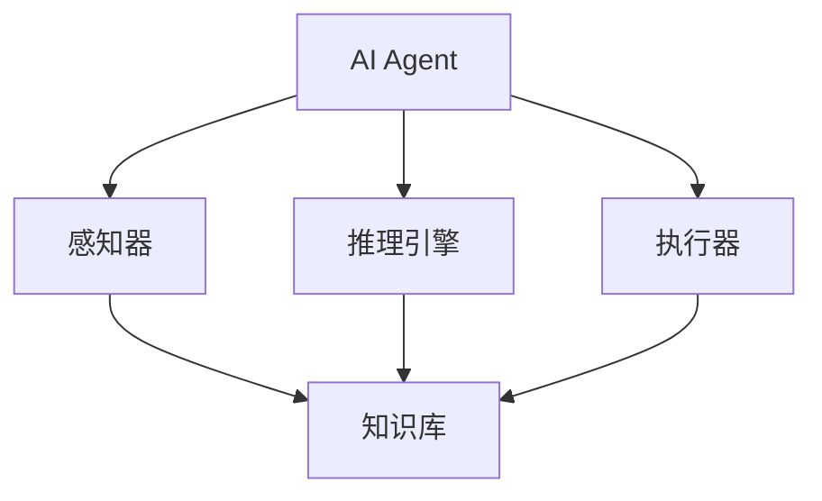
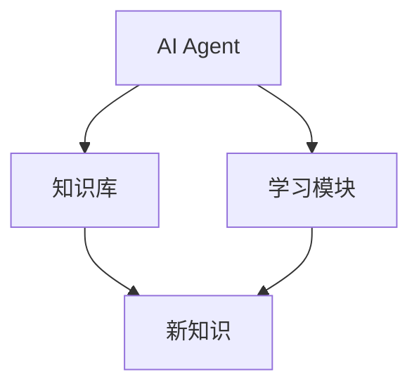
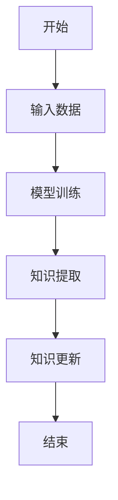
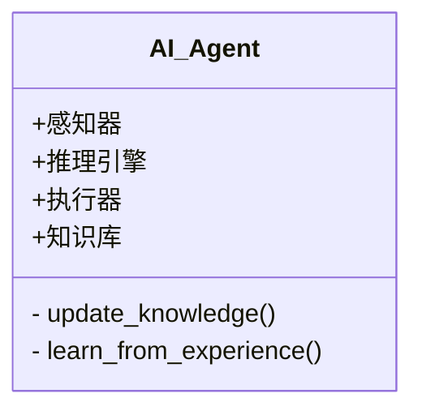
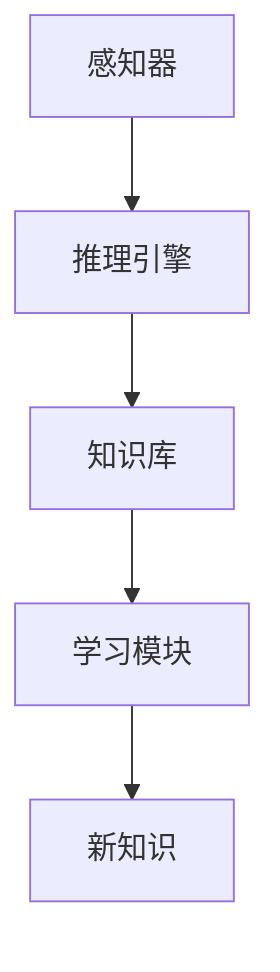
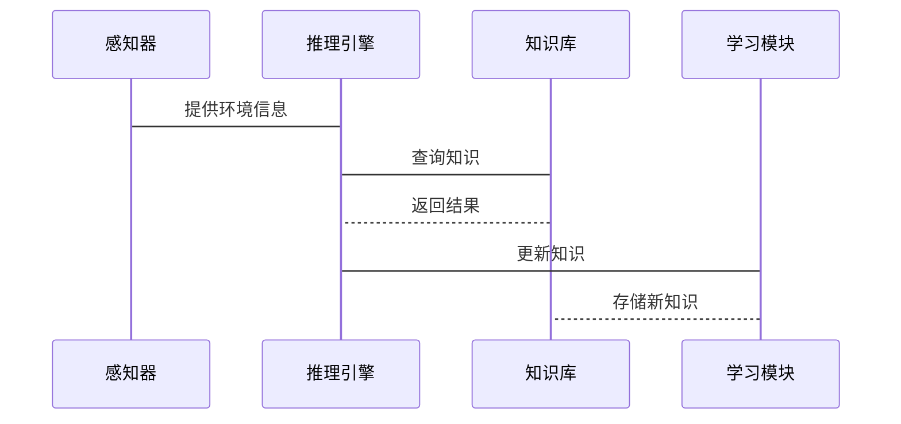

                 


# AI Agent的终身学习：持续适应新知识

## 关键词：AI Agent, 终身学习, 自动学习系统, 智能代理, 知识更新, 模型蒸馏

## 摘要：AI Agent的终身学习是指智能代理在不断变化的环境中持续吸收新知识、更新技能的能力。本文将详细探讨AI Agent的终身学习机制，从背景、核心概念到算法原理、系统架构，再到项目实战，层层深入，为读者提供全面的理解和实践指导。

---

# 第1章: AI Agent与终身学习的背景介绍

## 1.1 问题背景与描述

### 1.1.1 AI Agent的基本概念
AI Agent（智能代理）是指能够感知环境、自主决策并执行任务的智能系统。它可以是一个软件程序，也可以是一个物理机器人，其核心目标是通过感知和行动来优化目标函数。

### 1.1.2 终身学习的核心问题
终身学习是指AI Agent在面对不断变化的环境时，能够持续学习新知识、适应新任务的能力。这种能力使得AI Agent能够应对多样化的应用场景，如自然语言处理、图像识别和自动驾驶等。

### 1.1.3 问题的解决思路
要实现AI Agent的终身学习，需要结合机器学习、知识表示和自适应控制等多种技术。通过设计高效的算法和架构，AI Agent能够动态更新其知识库，适应新环境的变化。

## 1.2 问题的边界与外延

### 1.2.1 AI Agent的边界
AI Agent的边界主要在于其感知和行动的能力。它依赖于环境中的传感器输入和执行器输出，因此其能力受限于这些接口的设计。

### 1.2.2 终身学习的外延
终身学习的外延包括在线学习、增量学习和自适应学习等多种形式。AI Agent的终身学习能力可以看作是这些学习方式的综合应用。

### 1.2.3 相关概念的对比
以下是终身学习与相关概念的对比：

| 概念       | 描述                                                                 |
|------------|----------------------------------------------------------------------|
| 在线学习   | 数据按顺序到达，模型在每次数据到达时更新。                           |
| 增量学习   | 在新数据上逐步学习，避免重新训练整个模型。                           |
| 自适应学习 | 系统能够根据反馈调整其行为和模型参数。                               |

## 1.3 概念结构与核心要素

### 1.3.1 AI Agent的构成
AI Agent通常由以下部分组成：
1. **感知器**：负责从环境中获取信息。
2. **知识库**：存储AI Agent已知的知识和经验。
3. **推理引擎**：根据知识库中的信息进行推理和决策。
4. **执行器**：根据决策结果执行具体操作。

### 1.3.2 终身学习的核心要素
终身学习的核心要素包括：
1. **知识表示**：如何将新知识高效地表示为模型可理解的形式。
2. **学习策略**：选择合适的学习算法和策略。
3. **更新机制**：如何将新知识整合到现有模型中。

### 1.3.3 概念之间的关系
以下是AI Agent和终身学习之间关系的示意图：



## 1.4 本章小结
本章介绍了AI Agent的基本概念和终身学习的核心问题，明确了其边界和外延。通过对比相关概念，我们理解了终身学习在AI Agent中的重要性。

---

# 第2章: 终身学习的核心概念与联系

## 2.1 核心概念原理

### 2.1.1 知识表示的原理
知识表示是终身学习的关键步骤。常用的表示方法包括符号表示和分布式表示。符号表示通过逻辑规则明确知识，而分布式表示（如向量表示）则通过语义向量捕捉知识的语义信息。

### 2.1.2 知识更新的机制
知识更新的机制包括模型蒸馏和经验重放。模型蒸馏通过将旧知识迁移到新模型中实现知识更新，经验重放则通过重新学习历史经验来增强模型的泛化能力。

### 2.1.3 知识整合的方法
知识整合的方法包括增量学习和迁移学习。增量学习逐步更新模型，而迁移学习则将已有知识迁移到新任务中。

## 2.2 核心概念的属性对比

| 模型       | 特征                 |
|------------|----------------------|
| 模型蒸馏   | 知识迁移能力强         |
| 经验重放   | 利用历史数据提升性能   |
| 增量学习   | 确保模型的实时更新     |

## 2.3 ER实体关系图
以下是AI Agent的终身学习系统中实体关系的ER图：



## 2.4 本章小结
本章详细探讨了终身学习的核心概念和其在AI Agent中的应用，通过对比分析，明确了不同模型的特点和适用场景。

---

# 第3章: 终身学习的算法原理

## 3.1 算法原理概述

### 3.1.1 模型蒸馏的原理
模型蒸馏是一种将知识从旧模型迁移到新模型的技术。通过教师模型指导学生模型，实现知识的高效传递。

### 3.1.2 经验重放的机制
经验重放通过存储和重放历史经验，增强模型对稀疏事件的学习能力，提升模型的泛化能力。

### 3.1.3 知识蒸馏的步骤
知识蒸馏的步骤包括：教师模型生成软标签，学生模型基于软标签进行学习，最终实现知识的迁移。

## 3.2 算法流程图



## 3.3 算法实现代码

```python
def lifelong_learning_model():
    # 模型初始化
    model = initialize_model()
    # 训练过程
    train_model(model, data)
    # 知识蒸馏
    distill_knowledge(model, new_data)
    return model
```

## 3.4 本章小结
本章详细讲解了模型蒸馏和经验重放的算法原理，并通过流程图和代码示例，展示了终身学习的核心步骤。

---

# 第4章: 系统分析与架构设计

## 4.1 问题场景介绍
AI Agent的终身学习系统需要在动态变化的环境中实时更新知识库，确保模型的准确性和高效性。

## 4.2 系统功能设计

### 4.2.1 领域模型
以下是AI Agent的领域模型：



### 4.2.2 系统架构
AI Agent的终身学习系统的架构如下：



### 4.2.3 系统交互
以下是系统交互的序列图：



## 4.3 本章小结
本章详细分析了AI Agent的终身学习系统的架构设计，明确了各个模块的功能和交互方式。

---

# 第5章: 项目实战

## 5.1 环境安装
安装所需的依赖库，如TensorFlow、Keras和scikit-learn。

## 5.2 系统核心实现

### 5.2.1 知识库的构建
知识库的构建包括数据的收集、清洗和预处理。

### 5.2.2 学习模块的实现
学习模块的实现包括模型的训练和更新。

### 5.2.3 更新机制的实现
更新机制的实现包括模型蒸馏和经验重放的具体代码。

## 5.3 代码实现与解读

```python
def update_knowledge(model, new_data):
    # 更新知识库
    for data_point in new_data:
        model.update(data_point)
    return model
```

## 5.4 案例分析
通过具体案例分析，展示AI Agent在终身学习中的实际应用。

## 5.5 本章小结
本章通过实战项目，详细讲解了AI Agent的终身学习系统的实现过程。

---

# 第6章: 最佳实践与注意事项

## 6.1 最佳实践 tips
1. 定期更新知识库，保持模型的准确性。
2. 选择合适的算法和模型，提高学习效率。
3. 合理设计系统架构，确保系统的可扩展性。

## 6.2 小结
通过本文的详细讲解，读者可以全面理解AI Agent的终身学习机制，并在实际应用中加以利用。

## 6.3 注意事项
1. 注意数据的质量和多样性，避免过拟合。
2. 确保系统的安全性和稳定性，防止数据泄露和系统崩溃。

## 6.4 拓展阅读
推荐阅读相关领域的最新论文和技术博客，保持对AI Agent终身学习技术的关注。

---

# 作者：AI天才研究院 & 禅与计算机程序设计艺术

---

通过以上结构，您可以根据需要进一步扩展每个部分的内容，确保文章的完整性和深度。希望这篇文章对您理解AI Agent的终身学习有所帮助！

