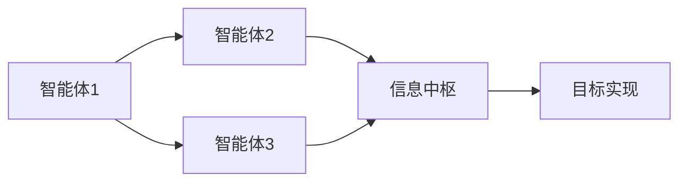
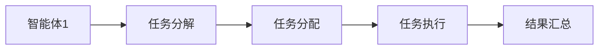
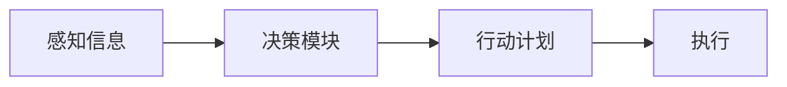

                 


# AI Agent的群体智能涌现机制研究

## 关键词：AI Agent, 群体智能, 涌现机制, 分布式计算, 多智能体协作

## 摘要：本文探讨AI Agent的群体智能涌现机制，从基本概念到算法实现，再到系统架构，全面分析其原理与应用。通过实际案例和项目实战，揭示群体智能在AI Agent中的实现方法和未来发展方向。

---

## 第一部分: AI Agent的群体智能概述

### 第1章: AI Agent与群体智能基础

#### 1.1 AI Agent的基本概念

- **1.1.1 AI Agent的定义**
  - AI Agent（人工智能代理）是能够感知环境并采取行动以实现目标的实体。
  - 代理类型：简单反射型、基于模型的反射型、目标驱动型、效用驱动型。

- **1.1.2 AI Agent的核心特征**
  - 感知环境：通过传感器获取信息。
  - 行动：通过执行器与环境交互。
  - 决策：基于感知信息做出决策。
  - 学习：通过经验改进性能。

- **1.1.3 群体智能的定义**
  - 群体智能是多个智能体协作解决问题的智能形式。
  - 群体智能依赖于个体间的信息共享和协同。

#### 1.2 群体智能的定义与特点

- **1.2.1 群体智能的定义**
  - 群体智能是通过多个简单智能体的协作实现复杂目标的智能形式。

- **1.2.2 群体智能的核心特征**
  - 分布式：智能体独立决策。
  - 协作性：通过通信实现目标。
  - 涌现性：群体智能超越个体智能。

- **1.2.3 群体智能与个体智能的区别**
  - 群体智能依赖协作，个体智能独立决策。
  - 群体智能涌现复杂行为，个体智能行为简单。

#### 1.3 群体智能的涌现机制

- **1.3.1 涌现机制的定义**
  - 涌现机制是通过个体简单行为和互动产生复杂整体行为的过程。

- **1.3.2 涌现机制的核心特征**
  - 非线性：整体行为无法由个体行为线性推导。
  - 分布式：无中心控制。
  - 动态性：行为随环境变化而变化。

- **1.3.3 涌现机制的分类**
  - 基于规则的涌现：个体遵循简单规则。
  - 基于学习的涌现：通过学习产生新行为。
  - 基于进化的方法：通过适应环境产生新行为。

### 1.2 群体智能在AI Agent中的问题背景

#### 1.2.1 群体智能在AI Agent中的关键问题

- 多智能体协作：如何协调多个AI Agent的行为。
- 通信机制：如何高效传递信息。
- 协作目标：如何实现共同目标。

#### 1.2.2 群体智能在AI Agent中的挑战

- 信息过载：过多信息导致处理困难。
- 协调复杂性：多智能体协作复杂。
- 动态环境：环境变化需要快速适应。

#### 1.2.3 群体智能在AI Agent中的研究意义

- 提高系统鲁棒性：通过分布式协作增强系统稳定性。
- 提升决策能力：利用群体智慧做出更好决策。
- 开拓新应用：群体智能在分布式系统中的应用潜力。

---

## 第二部分: 群体智能的机制与模型

### 第3章: 群体智能的机制分析

#### 3.1 群体智能的通信机制

- **3.1.1 群体智能的通信方式**
  - 直接通信：智能体之间直接交换信息。
  - 间接通信：通过中间媒介传递信息。

- **3.1.2 群体智能的通信协议**
  - 基于消息传递：使用特定格式交换信息。
  - 基于信号传递：通过信号指示行为。

- **3.1.3 群体智能的通信模型**
  - 模型：智能体通过消息传递信息，消息内容包括状态和意图。



#### 3.2 群体智能的协作机制

- **3.2.1 群体智能的协作方式**
  - 并行协作：多个智能体同时处理任务。
  - 串行协作：按顺序完成任务。

- **3.2.2 群体智能的协作协议**
  - 请求-响应协议：智能体请求帮助并响应请求。
  - 负载均衡协议：智能体根据负载分配任务。

- **3.2.3 群体智能的协作模型**
  - 模型：多个智能体根据任务分解协作，共同完成目标。



#### 3.3 群体智能的决策机制

- **3.3.1 群体智能的决策方式**
  - 基于规则的决策：遵循预定义规则。
  - 基于学习的决策：通过机器学习模型做出决策。

- **3.3.2 群体智能的决策协议**
  - 共识协议：智能体达成一致决策。
  - 投票机制：通过投票决定行动。

- **3.3.3 群体智能的决策模型**
  - 模型：智能体基于环境信息和历史数据做出决策。



### 第4章: 群体智能的数学模型与算法

#### 4.1 群体智能的数学模型

- **4.1.1 群体智能的基本模型**
  - 模型：多个智能体通过协作实现目标，每个智能体有状态和动作空间。

- **4.1.2 群体智能的数学表达**
  - 个体智能体：$i \in \{1, 2, ..., n\}$
  - 状态：$s_i \in S$
  - 行动：$a_i \in A$
  - 协作目标：$G$

- **4.1.3 群体智能的模型参数**
  - 参数：通信频率、协作强度、决策时间。

#### 4.2 群体智能的算法原理

- **4.2.1 群体智能的算法步骤**
  1. 初始化：设定智能体数量和初始状态。
  2. 信息交换：智能体之间交换信息。
  3. 信息处理：处理信息，做出决策。
  4. 行动：执行决策。
  5. 评估：评估结果，调整策略。

- **4.2.2 群体智能的算法实现**
  ```python
  class Agent:
      def __init__(self, id):
          self.id = id
          self.state = initial_state
          
      def receive_message(self, message):
          # 处理消息
          pass
      
      def send_message(self, message):
          # 发送消息
          pass
      
      def decide_action(self):
          # 基于状态做出决策
          pass

  class GroupIntelligence:
      def __init__(self, num_agents):
          self.agents = [Agent(i) for i in range(num_agents)]
          
      def run(self):
          while True:
              for agent in self.agents:
                  agent.receive_message()
              for agent in self.agents:
                  agent.decide_action()
                  agent.send_message()
  ```

- **4.2.3 群体智能的算法模型**
  - 模型：智能体通过信息交换和协作完成任务。

---

## 第三部分: 群体智能的系统分析与架构设计

### 第5章: 群体智能的系统分析

#### 5.1 问题场景介绍

- 多智能体协作：多个AI Agent协同完成复杂任务。
- 通信与协调：智能体之间需要高效通信和协调。
- 动态环境：环境变化需要快速适应。

#### 5.2 系统功能设计

- **功能模块**：
  - 通信模块：处理信息交换。
  - 协作模块：协调智能体行为。
  - 决策模块：做出决策。
  
- **领域模型**：
  ```mermaid
  classDiagram
      class Agent {
          id: int
          state: string
          action: string
      }
      class GroupIntelligence {
          agents: list
          communication: Communication
      }
      GroupIntelligence --> Agent
      GroupIntelligence --> Communication
  ```

#### 5.3 系统架构设计

- **系统架构**：
  ```mermaid
  graph LR
      GroupIntelligence --> Agent1
      GroupIntelligence --> Agent2
      GroupIntelligence --> Agent3
      Agent1 --> Communication
      Agent2 --> Communication
      Agent3 --> Communication
  ```

#### 5.4 系统接口设计

- **通信接口**：
  - `send_message(message)`：发送消息。
  - `receive_message()`：接收消息。

- **协作接口**：
  - `request Assistance(task)`：请求帮助。
  - `respond Assistance()`：响应请求。

#### 5.5 系统交互设计

- **交互流程**：
  ```mermaid
  sequenceDiagram
      participant A: Agent1
      participant B: Agent2
      participant C: 信息中枢
      A -> C: 发送消息
      C -> B: 接收消息
      B -> C: 发送消息
      C -> A: 接收消息
  ```

### 第6章: 群体智能的项目实战

#### 6.1 环境安装

- **安装依赖**：
  - Python 3.8+
  - 导航工具：如ROS（Robot Operating System）。

- **安装步骤**：
  ```bash
  pip install numpy
  pip install matplotlib
  pip install pydot
  ```

#### 6.2 核心代码实现

- **实现通信模块**：
  ```python
  import socket

  class Communication:
      def __init__(self):
          self.socket = socket.socket(socket.AF_INET, socket.SOCK_STREAM)
          self.socket.bind(('localhost', 1234))
          self.socket.listen(5)
          self.clients = []

      def accept(self):
          while True:
              client, addr = self.socket.accept()
              self.clients.append(client)
              # 处理客户端连接
  ```

- **实现协作模块**：
  ```python
  class Collaboration:
      def __init__(self, agents):
          self.agents = agents

      def coordinate(self):
          for agent in self.agents:
              agent.receive_message()
          for agent in self.agents:
              agent.decide_action()
              agent.send_message()
  ```

- **实现决策模块**：
  ```python
  class Decision:
      def decide(self, state):
          if state == 'start':
              return 'proceed'
          elif state == 'blocked':
              return 'wait'
          else:
              return 'abort'
  ```

#### 6.3 案例分析与代码解读

- **案例场景**：
  - 任务：多个AI Agent协作完成环境监测。
  - 实现：每个Agent负责监测不同区域，通过通信模块传递数据，协作模块协调行动。

- **代码分析**：
  ```python
  agents = [Agent(i) for i in range(5)]
  comm = Communication()
  coord = Collaboration(agents)
  coord.coordinate()
  ```

#### 6.4 项目小结

- **实现总结**：
  - 成功实现了AI Agent的通信、协作和决策机制。
  - 群体智能通过分布式协作实现了复杂任务。

---

## 第四部分: 总结与展望

### 第7章: 总结与展望

#### 7.1 最佳实践 tips

- 确保通信机制高效可靠。
- 合理设计协作协议。
- 使用适当的学习算法提升决策能力。

#### 7.2 小结

- 本文详细分析了AI Agent的群体智能涌现机制。
- 通过理论分析和项目实践，展示了群体智能的强大能力。

#### 7.3 注意事项

- 群体智能系统需要处理大量数据，确保数据安全。
- 设计通信协议时考虑系统的可扩展性。

#### 7.4 拓展阅读

- 推荐阅读分布式计算相关书籍。
- 关注群体智能领域的最新研究进展。

---

## 作者：AI天才研究院/AI Genius Institute & 禅与计算机程序设计艺术 /Zen And The Art of Computer Programming

---

这篇文章从基本概念到算法实现，再到系统架构，全面探讨了AI Agent的群体智能涌现机制。通过实际案例和项目实战，深入分析了群体智能的实现方法和未来发展方向，为读者提供了丰富的理论和实践指导。

