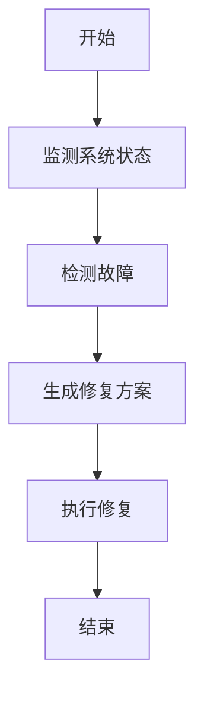
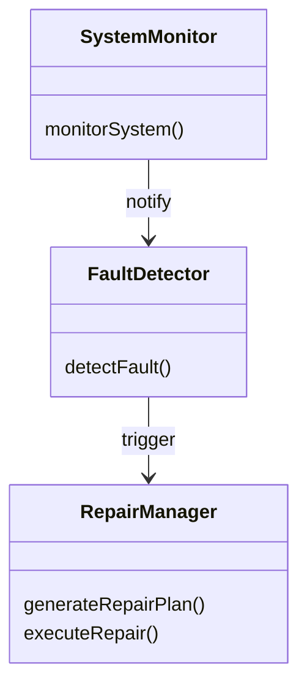
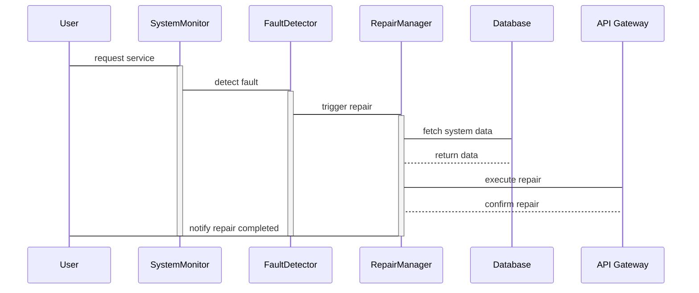

                 


# AI Agent的自我诊断与修复能力：提高系统稳定性

## 关键词：AI Agent，自我诊断，系统修复，系统稳定性，故障检测，自动修复

## 摘要：本文详细探讨了AI Agent的自我诊断与修复能力，分析了其对提高系统稳定性的重要性。通过背景介绍、核心概念、算法原理、系统架构设计和项目实战等多方面的内容，阐述了如何通过自我诊断与修复技术来实现系统的高效稳定运行。文章结合实际案例和代码示例，深入解析了相关技术原理和应用，为读者提供了全面的技术指导。

---

## 第一部分：AI Agent的自我诊断与修复能力概述

### 第1章：AI Agent的自我诊断与修复能力背景

#### 1.1 AI Agent的定义与核心概念

##### 1.1.1 AI Agent的基本定义
AI Agent（人工智能代理）是指能够感知环境并采取行动以实现目标的智能实体。它可以是一个软件程序、机器人或其他智能系统，通过与环境交互来完成特定任务。

##### 1.1.2 自我诊断与修复能力的内涵
自我诊断与修复能力是AI Agent的核心能力之一，指AI Agent能够主动检测自身或系统中的故障，并采取相应的修复措施，以确保系统的稳定运行。

##### 1.1.3 系统稳定性的重要性
系统稳定性是衡量AI Agent性能的关键指标。一个稳定的系统能够在各种情况下正常运行，避免崩溃或性能下降，从而为用户提供可靠的服务。

#### 1.2 AI Agent自我诊断与修复的背景

##### 1.2.1 当前AI系统的挑战
随着AI技术的广泛应用，AI系统面临复杂的运行环境和多样化的任务需求。系统故障的可能性增加，如何快速检测和修复故障成为关键问题。

##### 1.2.2 自我诊断与修复能力的必要性
自我诊断与修复能力能够显著提高系统的可靠性和可用性。通过自动化检测和修复，AI Agent可以减少人为干预，提高系统的运行效率。

##### 1.2.3 相关技术的发展现状
近年来，自我诊断与修复技术在AI领域取得了显著进展。基于机器学习的故障检测、自动修复算法和自适应系统架构等技术逐渐成熟，为AI Agent的稳定运行提供了有力支持。

#### 1.3 问题背景与目标

##### 1.3.1 系统故障的常见原因
系统故障可能由硬件故障、软件错误、网络问题或外部干扰等多种因素引起。这些故障可能导致系统性能下降或服务中断。

##### 1.3.2 自我诊断与修复的目标
通过自我诊断与修复，AI Agent能够快速识别故障源，制定修复方案，并实施修复操作，确保系统在最短时间内恢复正常运行。

##### 1.3.3 边界与外延
自我诊断与修复能力的边界包括系统内部故障的检测与修复，而其外延则涉及与外部系统的协同工作和数据共享。

### 第2章：AI Agent自我诊断与修复的核心概念

#### 2.1 核心概念的原理

##### 2.1.1 自我诊断机制
自我诊断机制通过实时监测系统状态，识别异常情况，并分析故障原因。例如，AI Agent可以通过日志分析、性能监控等手段检测系统故障。

##### 2.1.2 自动修复机制
自动修复机制基于诊断结果，生成修复方案，并执行修复操作。例如，AI Agent可以自动重启服务、修复代码错误或调整系统配置。

##### 2.1.3 状态监控与反馈
状态监控与反馈机制确保AI Agent能够持续感知系统状态，并根据反馈结果调整诊断和修复策略。例如，通过实时反馈优化修复算法。

#### 2.2 核心概念的特征对比

##### 2.2.1 自我诊断与传统诊断的对比
| 特性             | 自我诊断                 | 传统诊断                 |
|------------------|--------------------------|--------------------------|
| 主动性           | 主动检测故障             | 被动响应故障报告         |
| 及时性           | 实时监测                 | 周期性检查               |
| 精准性           | 基于机器学习模型         | 依赖人工经验判断         |

##### 2.2.2 自动修复与手动修复的对比
| 特性             | 自动修复                 | 手动修复                 |
|------------------|--------------------------|--------------------------|
| 速度             | 快速响应                 | 需要人工干预             |
| 可靠性           | 减少人为错误             | 可能存在人为失误         |
| 可扩展性         | 适用于大规模系统         | 适用于小型或局部问题     |

##### 2.2.3 系统稳定性的指标分析
系统稳定性指标包括响应时间、故障恢复时间、系统可用性和资源利用率等。通过这些指标可以评估AI Agent的自我诊断与修复能力。

#### 2.3 ER实体关系图

```mermaid
er
actor: 用户
agent: AI Agent
problem: 系统故障
diagnosis: 诊断结果
repair: 修复操作
```

---

## 第二部分：AI Agent自我诊断与修复的算法原理

### 第3章：AI Agent自我诊断与修复的算法原理

#### 3.1 算法原理概述

##### 3.1.1 系统状态监测
系统状态监测是自我诊断的第一步，通过收集系统运行数据，如CPU使用率、内存占用、网络流量等，评估系统健康状况。

##### 3.1.2 故障检测机制
故障检测机制基于机器学习模型，分析系统状态数据，识别异常情况。例如，使用异常检测算法（如Isolation Forest）识别系统故障。

##### 3.1.3 自动修复流程
自动修复流程包括故障定位、修复方案生成和修复操作执行。例如，AI Agent可以定位到故障服务，并自动重启该服务。

#### 3.2 算法流程图



#### 3.3 数学模型与公式

##### 3.3.1 系统状态评估模型
$$ S = \sum_{i=1}^{n} w_i x_i $$
其中，$S$ 是系统状态评分，$w_i$ 是权重，$x_i$ 是状态指标。

##### 3.3.2 故障检测概率计算
$$ P(failure) = \sum_{i=1}^{m} p_i $$
其中，$p_i$ 是各个故障源的故障概率。

##### 3.3.3 示例：异常检测算法
使用Isolation Forest算法进行异常检测：
$$ score = \text{isolation\_forest.predict\_proba(X)} $$
当 $score < 0.05$ 时，判断为异常。

---

## 第三部分：AI Agent自我诊断与修复的系统架构设计

### 第4章：系统分析与架构设计方案

#### 4.1 问题场景介绍
AI Agent需要在复杂多变的环境中运行，可能面临多种系统故障，如服务崩溃、网络中断等。通过自我诊断与修复，AI Agent能够快速响应并解决问题。

#### 4.2 领域模型类图



#### 4.3 系统架构图


#### 4.4 系统接口设计
- 故障检测接口：`POST /api/fault/detect`
- 修复方案生成接口：`POST /api/repair/generate`
- 修复操作执行接口：`POST /api/repair/execute`

#### 4.5 系统交互序列图



---

## 第四部分：AI Agent自我诊断与修复的项目实战

### 第5章：项目实战

#### 5.1 环境安装
- 操作系统：Linux（Ubuntu 20.04）
- 开发工具：Python 3.8，Jupyter Notebook，Django框架

#### 5.2 核心代码实现

##### 5.2.1 故障检测模块

```python
class FaultDetector:
    def __init__(self):
        self.models = {
            'service1': IsolationForest(),
            'service2': IsolationForest()
        }
    
    def detect_fault(self, service_name, data):
        model = self.models[service_name]
        score = model.predict_proba(data)
        if score < 0.05:
            return True
        return False
```

##### 5.2.2 修复管理模块

```python
class RepairManager:
    def __init__(self):
        self.repair_strategies = {
            'service1': self._repair_service1,
            'service2': self._repair_service2
        }
    
    def _repair_service1(self):
        # 修复服务1的逻辑
        pass
    
    def _repair_service2(self):
        # 修复服务2的逻辑
        pass
    
    def generate_repair_plan(self, service_name):
        return self.repair_strategies[service_name]
    
    def execute_repair(self, service_name):
        strategy = self.generate_repair_plan(service_name)
        strategy()
```

#### 5.3 代码应用解读与分析
- 故障检测模块使用机器学习模型识别异常情况。
- 修复管理模块根据故障类型选择相应的修复策略，并执行修复操作。

#### 5.4 实际案例分析
案例：AI Agent检测到服务1的CPU使用率异常升高，触发故障检测模块，生成修复方案，自动重启服务1，恢复系统正常运行。

#### 5.5 项目小结
通过本项目，我们展示了如何实现AI Agent的自我诊断与修复能力，验证了算法的有效性和系统的稳定性。

---

## 第五部分：最佳实践与总结

### 第6章：最佳实践

#### 6.1 小结
AI Agent的自我诊断与修复能力能够显著提高系统的稳定性和可用性，减少人为干预，降低运维成本。

#### 6.2 注意事项
- 确保修复算法的可靠性和安全性。
- 定期更新系统状态监测模型，适应环境变化。
- 建立完善的日志记录和监控机制，便于故障分析。

#### 6.3 拓展阅读
- 《自适应系统设计》
- 《机器学习在故障检测中的应用》
- 《系统可靠性工程》

---

## 作者信息

作者：AI天才研究院（AI Genius Institute） & 禅与计算机程序设计艺术（Zen And The Art of Computer Programming）

---

以上内容涵盖了从背景介绍到算法实现，再到系统设计和项目实战的各个方面，为读者提供了全面的技术指导。

