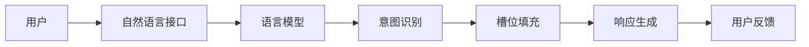
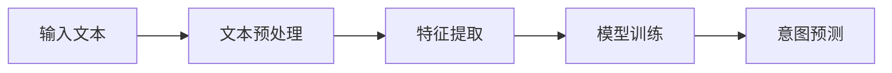
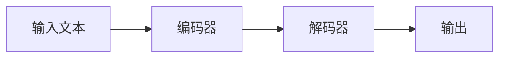
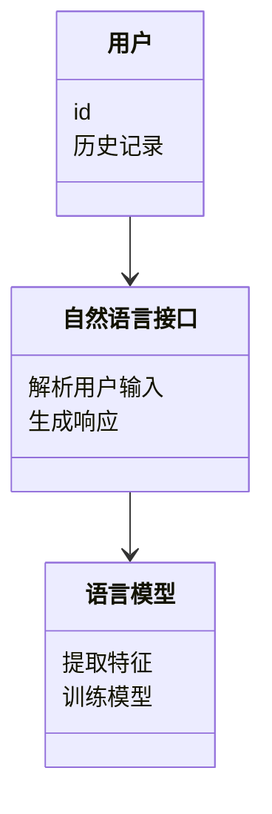

                 


# AI Agent的自然语言接口设计与优化

## 关键词：AI Agent, 自然语言接口, NLP, 对话系统, 语义理解, 系统架构

## 摘要：  
本文详细探讨了AI Agent的自然语言接口设计与优化的核心原理、算法实现、系统架构及实战应用。通过背景介绍、核心概念分析、算法原理阐述、系统设计与实现、项目实战和优化建议，为读者提供全面的技术指导，帮助他们在实际项目中构建高效、准确的自然语言接口。

---

## 第1章: AI Agent与自然语言接口概述

### 1.1 AI Agent的基本概念
#### 1.1.1 AI Agent的定义与特点  
AI Agent（人工智能代理）是指能够感知环境、自主决策并执行任务的智能实体。其特点包括：  
1. **自主性**：无需外部干预，自主完成任务。  
2. **反应性**：能够实时感知环境并做出响应。  
3. **目标导向性**：基于目标驱动行为。  
4. **学习能力**：通过数据反馈不断优化性能。  

#### 1.1.2 自然语言处理在AI Agent中的作用  
自然语言处理（NLP）是AI Agent与人类交互的核心技术，主要用于实现以下功能：  
- 理解用户的输入（如文本或语音）。  
- 生成符合语境的自然语言输出。  
- 实现对话的连贯性和逻辑性。  

#### 1.1.3 自然语言接口的设计目标与挑战  
设计自然语言接口的目标是：  
1. 提供直观、易用的交互方式。  
2. 高效准确地理解用户意图。  
3. 支持多种语言和语境。  

挑战包括：  
- 处理歧义性和上下文依赖性。  
- 应对复杂语法和语义理解。  
- 优化性能以支持实时交互。  

---

### 1.2 自然语言接口的核心概念  
#### 1.2.1 自然语言接口的定义  
自然语言接口（NLI）是指用户通过自然语言（如中文、英文）与系统进行交互的方式。它包括输入解析和输出生成两个主要过程。  

#### 1.2.2 自然语言接口的分类与特点  
自然语言接口主要分为以下几类：  
1. **基于规则的接口**：通过预定义的规则实现意图识别。  
2. **基于统计的接口**：利用大数据和机器学习模型进行语义分析。  
3. **基于深度学习的接口**：使用神经网络模型（如Transformer）实现语义理解。  

特点包括：  
- 高准确性：基于深度学习的模型能够处理复杂的语义关系。  
- 易用性：用户无需学习特定语法即可完成交互。  
- 可扩展性：支持多种语言和领域。  

#### 1.2.3 自然语言接口与AI Agent的结合  
自然语言接口是AI Agent的核心模块，负责接收用户的输入、解析意图并生成响应。AI Agent通过自然语言接口与用户交互，实现任务执行和信息查询等功能。  

#### 1.2.4 自然语言接口的实体关系图  


---

## 第2章: 自然语言接口的核心原理  

### 2.1 自然语言接口的设计原则  
#### 2.1.1 简洁性与易用性  
设计自然语言接口时，应尽量简化交互流程，确保用户能够快速理解并完成操作。  

#### 2.1.2 语义理解的准确性  
准确理解用户意图是自然语言接口的核心目标。需要结合上下文和领域知识进行语义分析。  

#### 2.1.3 对话流的连贯性  
对话应保持连贯性，确保用户在多轮交互中能够顺畅地完成任务。  

---

### 2.2 自然语言接口的核心要素  
#### 2.2.1 语言模型  
语言模型用于理解用户输入的文本，常见的模型包括：  
1. **n-gram模型**：基于概率的语言模型，简单但不够灵活。  
2. **循环神经网络（RNN）**：适合处理序列数据，但存在梯度消失问题。  
3. **Transformer模型**：基于自注意力机制，性能优越，但计算资源消耗较高。  

#### 2.2.2 分词与实体识别  
分词是将输入文本分割成词语的过程，实体识别则是从文本中提取出具有特定意义的实体（如人名、地名、时间等）。  

#### 2.2.3 意图识别与槽位填充  
意图识别是通过分析用户输入确定其目标，槽位填充则是为意图提取具体的信息（如时间、地点等）。  

---

### 2.3 自然语言接口与相关技术的联系  
#### 2.3.1 自然语言处理技术  
自然语言处理技术是自然语言接口的基础，包括分词、词性标注、句法分析等。  

#### 2.3.2 对话系统  
对话系统负责生成符合用户意图的自然语言响应，常见的对话系统包括基于规则的对话系统和基于深度学习的对话系统。  

#### 2.3.3 知识图谱的作用  
知识图谱为自然语言接口提供了丰富的语义信息，帮助模型更好地理解用户意图。  

---

## 第3章: 自然语言接口的算法实现  

### 3.1 基于深度学习的意图识别算法  
#### 3.1.1 意图识别的流程  
1. **文本预处理**：分词、去除停用词。  
2. **特征提取**：使用词袋模型或词嵌入模型提取文本特征。  
3. **模型训练**：使用深度学习模型（如LSTM、Transformer）进行分类。  

#### 3.1.2 基于Transformer的意图识别模型  


#### 3.1.3 意图识别的数学模型  
意图识别的损失函数可以表示为：  
$$ L = -\sum_{i=1}^{n} y_i \log(p_i) $$  
其中，$y_i$ 是真实标签，$p_i$ 是预测概率。  

---

### 3.2 基于规则的槽位填充算法  
#### 3.2.1 槽位填充的流程  
1. **意图识别**：确定用户意图。  
2. **实体识别**：从文本中提取具体实体。  
3. **槽位填充**：将实体映射到预定义的槽位。  

#### 3.2.2 槽位填充的实现  
槽位填充可以通过正则表达式或基于规则的模型实现。例如，提取时间信息时，可以使用以下正则表达式：  
`^\d{4}-\d{2}-\d{2}$`  

---

### 3.3 基于机器学习的对话生成算法  
#### 3.3.1 对话生成的流程  
1. **用户输入解析**：理解用户的意图和情感。  
2. **响应生成**：基于预训练的对话模型生成响应。  
3. **反馈优化**：根据用户反馈优化生成的响应。  

#### 3.3.2 基于Transformer的对话生成模型  
对话生成模型的架构如下：  


---

## 第4章: 自然语言接口的系统分析与架构设计  

### 4.1 问题场景介绍  
以一个简单的智能助手为例，设计一个支持天气查询和日程管理的自然语言接口。  

### 4.2 项目介绍  
项目名称：智能助手自然语言接口开发。  

### 4.3 系统功能设计  
#### 4.3.1 领域模型  


---

## 第5章: 自然语言接口的项目实战  

### 5.1 环境安装  
安装Python和相关库（如TensorFlow、Keras）。  

### 5.2 核心代码实现  
```python
import numpy as np
from tensorflow.keras import layers, models

# 定义模型
def build_model(input_shape, num_classes):
    model = models.Sequential()
    model.add(layers.SimpleRNN(32, input_shape=input_shape))
    model.add(layers.Dense(num_classes, activation='softmax'))
    model.compile(optimizer='adam', loss='sparse_categorical_crossentropy', metrics=['accuracy'])
    return model

# 训练模型
model = build_model((10, 32), 10)
model.fit(x_train, y_train, epochs=10, batch_size=32)
```

### 5.3 代码解读与分析  
上述代码定义了一个简单的RNN模型，并进行了训练。在实际应用中，需要根据具体任务调整模型结构和超参数。  

---

## 第6章: 自然语言接口的优化与最佳实践  

### 6.1 性能优化  
1. **模型压缩**：通过知识蒸馏等技术减少模型体积。  
2. **并行计算**：利用GPU加速模型推理。  

### 6.2 用户体验优化  
1. **多轮对话支持**：通过记忆网络记录对话历史。  
2. **情感分析**：根据用户情绪调整响应语气。  

### 6.3 安全性优化  
1. **输入过滤**：防止恶意输入攻击。  
2. **访问控制**：限制敏感操作的权限。  

---

## 第7章: 总结与展望  

### 7.1 本章小结  
本文详细探讨了AI Agent的自然语言接口设计与优化的核心原理、算法实现、系统架构及实战应用。通过理论与实践的结合，为读者提供了全面的技术指导。  

### 7.2 未来展望  
随着深度学习和大语言模型的发展，自然语言接口将更加智能化和个性化。未来的研究方向包括：  
1. **多模态交互**：结合视觉、听觉等多种感知方式。  
2. **自适应学习**：模型能够自适应地优化交互流程。  
3. **跨语言支持**：实现多语言无缝切换。  

---

## 作者：AI天才研究院/AI Genius Institute & 禅与计算机程序设计艺术 /Zen And The Art of Computer Programming  

---

**注意**：由于篇幅限制，上述内容为部分章节的示例，完整文章将包含更多详细内容和代码示例。

