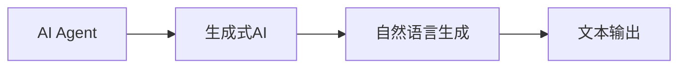
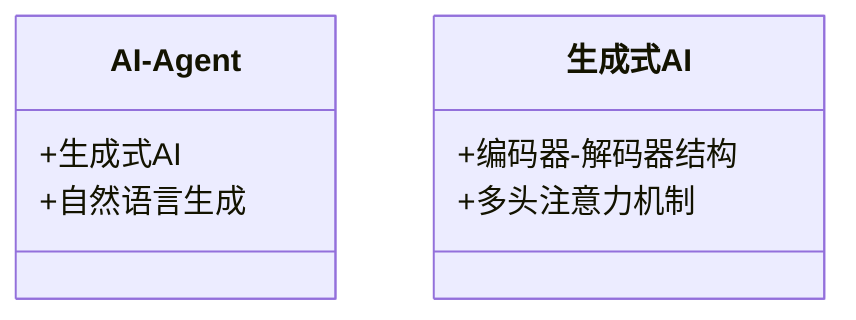
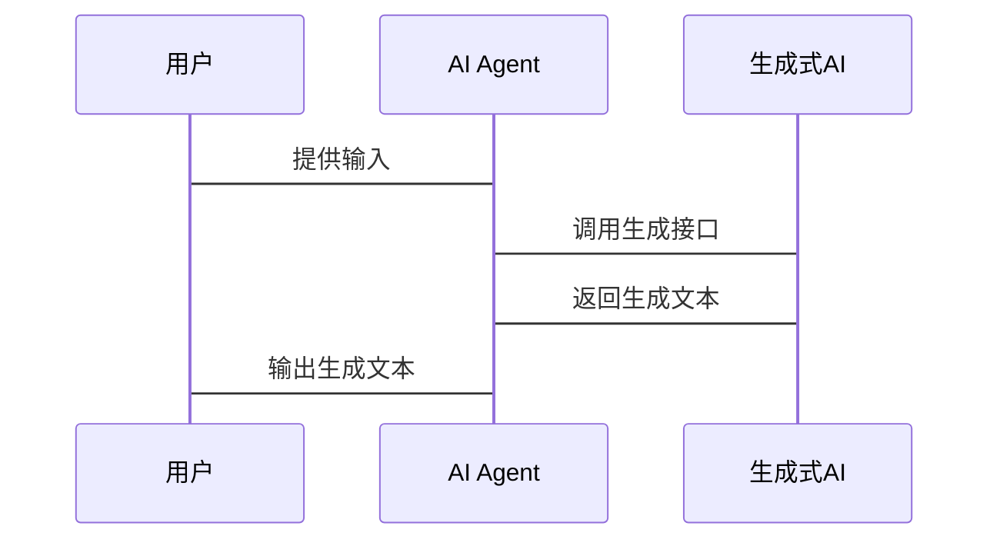

                 


# AI Agent的自然语言生成优化

> 关键词：AI Agent, 自然语言生成, 生成式AI, 强化学习, 对话系统, Transformer模型, GPT

> 摘要：本文深入探讨AI Agent在自然语言生成中的优化策略，涵盖生成式AI的核心概念、算法原理、系统架构设计以及实战案例。通过对比分析、数学推导和代码实现，详细讲解优化方法和应用场景，为AI Agent的自然语言生成优化提供理论和实践指导。

---

# 第一部分: AI Agent的自然语言生成优化背景与基础

## 第1章: AI Agent与自然语言生成概述

### 1.1 AI Agent的基本概念

#### 1.1.1 AI Agent的定义与特点
AI Agent（智能体）是指能够感知环境、自主决策并执行任务的智能系统。其特点包括：自主性、反应性、目标导向、社会性以及学习能力。AI Agent在自然语言生成中的应用，使其能够与人类进行更自然的交互。

#### 1.1.2 自然语言生成的定义与目标
自然语言生成（Natural Language Generation, NLG）是指将结构化数据转换为自然语言文本的过程。其目标是生成准确、流畅且符合语境的文本，同时满足用户需求。

#### 1.1.3 AI Agent在自然语言生成中的作用
AI Agent通过自然语言生成技术，能够将复杂的数据信息转化为易于理解的文本，提升人机交互的自然性和用户体验。

### 1.2 问题背景与解决方法

#### 1.2.1 当前自然语言生成的挑战
- 生成文本的质量与准确性不足。
- 对上下文的理解能力有限。
- 对多语言和多文化场景的支持不足。

#### 1.2.2 AI Agent优化的必要性
- 提升生成文本的流畅性和准确性。
- 增强上下文理解和对话能力。
- 实现多语言和多场景的支持。

#### 1.2.3 解决方案的思路与框架
- 引入强化学习和对抗训练优化生成模型。
- 构建多模态数据融合机制。
- 设计高效的对话管理和反馈机制。

## 第2章: 自然语言生成的核心概念与联系

### 2.1 生成式AI的原理

#### 2.1.1 生成式模型的原理
生成式AI通过学习数据分布，生成符合数据规律的新样本。其核心是解码过程，常用模型包括GAN和Transformer。

#### 2.1.2 强化学习在生成式AI中的应用
强化学习通过奖励机制优化生成策略，提升生成文本的质量和多样性。

#### 2.1.3 对话系统与生成式AI的关系
对话系统依赖生成式AI生成回复，而生成式AI通过对话系统的反馈进一步优化生成策略。

### 2.2 核心概念对比表

| 概念                | 生成式AI              | 判别式AI              |
|---------------------|-----------------------|-----------------------|
| 目标                | 生成新样本            | 分类或判别样本         |
| 常用模型            | GAN, Transformer       | CNN, SVM              |
| 应用场景            | 文本生成, 对话系统     | 分类, 检索            |

### 2.3 ER实体关系图



---

# 第二部分: 自然语言生成优化的算法原理

## 第3章: 生成式模型的算法原理

### 3.1 Transformer模型的原理

#### 3.1.1 Transformer的结构与特点
- **编码器-解码器结构**：编码器将输入序列转换为上下文向量，解码器生成输出序列。
- **自注意力机制**：捕捉输入序列中各部分之间的依赖关系。
- **多头注意力机制**：通过多个子空间的注意力计算，增强模型的表达能力。

#### 3.1.2 自注意力机制的数学推导
自注意力机制的计算公式如下：
$$
\text{Attention}(Q, K, V) = \text{softmax}\left(\frac{QK^T}{\sqrt{d_k}}\right)V
$$

其中：
- \( Q \)：查询矩阵
- \( K \)：键矩阵
- \( V \)：值矩阵
- \( d_k \)：键的维度

#### 3.1.3 多头注意力机制的实现
多头注意力机制通过并行计算多个子空间的注意力，公式如下：
$$
\text{Multi-Head}(Q, K, V) = \text{Concat}(\text{Head}_1, \text{Head}_2, ..., \text{Head}_n)
$$
其中，\( n \) 是多头的数量。

### 3.2 GPT模型的优化与改进

#### 3.2.1 GPT模型的训练流程
GPT模型通过自监督学习，在大规模文本数据上预训练，生成与上下文相关的文本。

#### 3.2.2 模型的调参与优化策略
- 参数初始化：采用大规模预训练。
- 模型剪枝：通过剪枝技术减少参数数量。
- 知识蒸馏：将大模型的知识迁移到小模型。

#### 3.2.3 模型的评估与改进方向
- 评估指标：使用BLEU、ROUGE等指标评估生成质量。
- 改进方向：引入外部知识库，增强对话能力。

## 第4章: 强化学习在生成优化中的应用

### 4.1 强化学习的基本原理

#### 4.1.1 强化学习的三要素
- **状态空间**：环境的状态表示。
- **动作空间**：智能体可执行的动作。
- **奖励函数**：对智能体行为的反馈。

#### 4.1.2 基于强化学习的生成策略
- **策略网络**：生成动作的概率分布。
- **价值函数**：评估状态的优劣。

#### 4.1.3 强化学习与生成式AI的结合
通过强化学习优化生成策略，提升生成文本的质量和多样性。

---

# 第三部分: 系统分析与架构设计方案

## 第5章: 自然语言生成系统的架构设计

### 5.1 项目介绍

#### 5.1.1 项目背景
本项目旨在优化AI Agent的自然语言生成能力，提升生成文本的质量和用户体验。

### 5.2 系统功能设计

#### 5.2.1 领域模型


### 5.3 系统架构设计

#### 5.3.1 系统架构


### 5.4 系统接口设计

#### 5.4.1 接口定义
- 输入接口：接收用户输入和上下文信息。
- 输出接口：生成自然语言文本并返回。

### 5.5 系统交互流程

#### 5.5.1 交互流程


---

# 第四部分: 项目实战

## 第6章: 自然语言生成优化的实现

### 6.1 环境安装

```bash
pip install transformers
pip install torch
pip install numpy
```

### 6.2 核心代码实现

#### 6.2.1 生成式AI模型实现

```python
import torch
import torch.nn as nn

class Transformer(nn.Module):
    def __init__(self, d_model, n_head, dff):
        super().__init__()
        self.mha = nn.MultiheadAttention(d_model, n_head)
        self.fc = nn.Linear(d_model, dff)
        self.dropout = nn.Dropout(0.1)

    def forward(self, x, mask):
        out = self.mha(x, x, x, mask=mask)
        out = self.dropout(out)
        out = self.fc(out)
        return out
```

#### 6.2.2 强化学习优化策略

```python
def reinforce_learning(replay_buffer):
    optimizer = torch.optim.Adam(model.parameters())
    for batch in replay_buffer:
        optimizer.zero_grad()
        outputs = model(batch.states)
        loss = calculate_loss(outputs, batch.rewards)
        loss.backward()
        optimizer.step()
```

### 6.3 实际案例分析

#### 6.3.1 案例分析
- **输入**：用户查询“今天的天气如何？”
- **生成文本**：根据天气API返回数据生成回复。

### 6.4 优化策略分析

#### 6.4.1 优化点
- 模型调优：调整超参数，优化生成质量。
- 数据增强：引入更多样化的训练数据。
- 模型蒸馏：将大模型的知识迁移到小模型。

---

# 第五部分: 最佳实践与小结

## 第7章: 总结与展望

### 7.1 最佳实践 tips
- 定期优化模型参数。
- 引入多模态数据增强。
- 设计高效的反馈机制。

### 7.2 小结
本文详细探讨了AI Agent的自然语言生成优化策略，通过理论分析和代码实现，为实际应用提供了指导。

### 7.3 注意事项
- 注意模型的可解释性。
- 保护用户数据隐私。
- 提升系统的鲁棒性。

### 7.4 拓展阅读
- 推荐阅读《生成式AI的数学与实践》和《强化学习入门》。

---

作者：AI天才研究院/AI Genius Institute & 禅与计算机程序设计艺术 /Zen And The Art of Computer Programming

