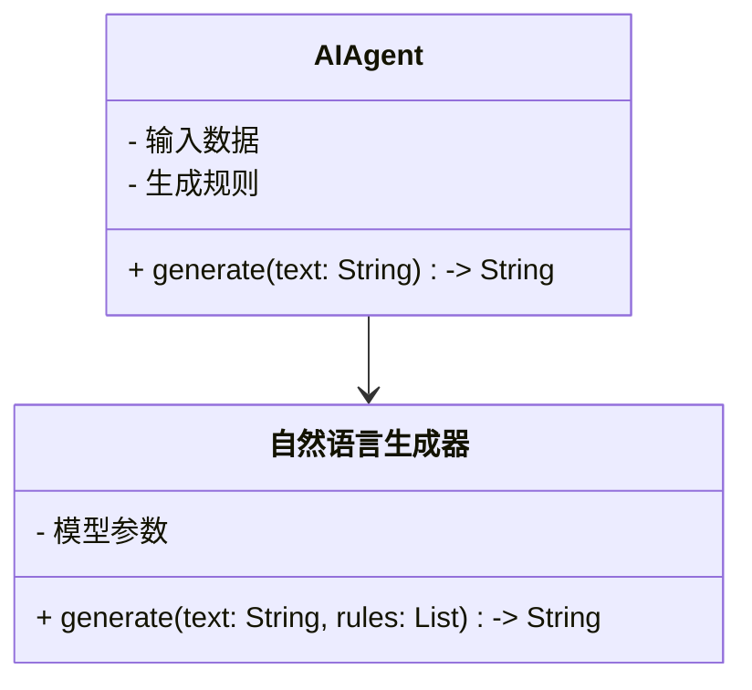
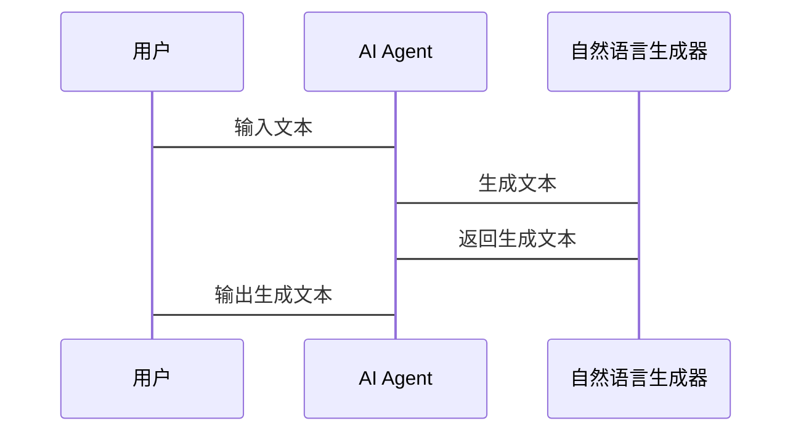

                 


# 第一部分: AI Agent的自然语言生成技术背景与核心概念

# 第1章: AI Agent与自然语言生成技术概述

## 1.1 AI Agent的基本概念
### 1.1.1 AI Agent的定义与分类
AI Agent，即人工智能代理，是指在计算机系统中能够感知环境并采取行动以实现目标的实体。根据智能水平，AI Agent可以分为基于规则的代理、基于模型的代理、基于Q-learning的代理和基于神经网络的代理。

### 1.1.2 自然语言生成技术的定义
自然语言生成（Natural Language Generation, NLG）是指将结构化的数据转换为自然语言文本的过程。它是自然语言处理（NLP）的重要组成部分，广泛应用于聊天机器人、文本摘要、机器翻译等领域。

### 1.1.3 AI Agent与自然语言生成的关系
AI Agent通过集成自然语言生成技术，能够以自然语言的形式与人类进行交互，从而提高用户体验和系统的智能化水平。自然语言生成为AI Agent提供了与人类进行有效沟通的能力，而AI Agent则为自然语言生成技术提供了应用场景和反馈机制。

## 1.2 自然语言生成技术的背景与现状
### 1.2.1 自然语言生成技术的发展历程
自然语言生成技术起源于20世纪50年代，经历了从基于规则的生成到基于统计模型，再到基于深度学习的生成的演变。近年来，随着Transformer模型的提出，自然语言生成技术取得了突破性进展。

### 1.2.2 当前技术的主要特点
当前的自然语言生成技术具有以下特点：生成速度快、生成结果质量高、可定制化、支持多模态生成等。

### 1.2.3 自然语言生成技术的应用场景
自然语言生成技术广泛应用于聊天机器人、文本摘要、机器翻译、内容生成等领域。

## 1.3 AI Agent在自然语言生成中的作用
### 1.3.1 AI Agent作为生成主体的角色
AI Agent通过集成自然语言生成技术，能够以自然语言的形式与人类进行交互，提高用户体验和系统的智能化水平。

### 1.3.2 自然语言生成技术对AI Agent的支撑
自然语言生成技术为AI Agent提供了与人类进行有效沟通的能力，从而增强了AI Agent的交互能力和用户体验。

### 1.3.3 两者的结合与发展趋势
AI Agent与自然语言生成技术的结合将推动人机交互向更自然、更智能的方向发展，未来将更加注重生成内容的多样性和可解释性。

## 1.4 本章小结
本章介绍了AI Agent和自然语言生成技术的基本概念，探讨了两者的结合与发展趋势，为后续章节的深入分析奠定了基础。

---

# 第2章: 自然语言生成技术的核心概念与原理

## 2.1 自然语言生成技术的核心概念
### 2.1.1 生成式AI的基本原理
生成式AI通过训练大规模的数据集，学习语言的模式和结构，从而能够生成符合语法规则的自然语言文本。

### 2.1.2 Transformer模型在生成中的应用
Transformer模型通过自注意力机制和前馈网络，能够有效地捕捉文本中的长距离依赖关系，从而生成连贯的自然语言文本。

### 2.1.3 概率生成与确定性生成的对比
概率生成方法通过计算每个可能的输出的概率分布，选择概率最高的输出；确定性生成方法则直接生成唯一的输出，通常基于规则或预定义的模板。

## 2.2 自然语言生成技术的关键属性
### 2.2.1 生成的多样性
生成的多样性是指生成系统能够生成多种不同的表达方式，以满足不同的语境和用户需求。

### 2.2.2 生成的准确性
生成的准确性是指生成的文本内容符合语法规则，并且能够准确表达输入的意图或信息。

### 2.2.3 生成的可解释性
生成的可解释性是指生成系统能够提供生成结果背后的原因和逻辑，以便用户理解和信任生成内容。

## 2.3 自然语言生成技术的实体关系图
```mermaid
graph TD
A[生成主体] --> B[生成目标]
C[输入数据] --> B[生成目标]
D[生成规则] --> B[生成目标]
E[输出结果] <-- B[生成目标]
```

## 2.4 本章小结
本章详细介绍了自然语言生成技术的核心概念和关键属性，并通过实体关系图展示了生成过程中的各个要素及其相互关系。

---

# 第3章: AI Agent的自然语言生成技术算法原理

## 3.1 基于Transformer的生成算法
### 3.1.1 Transformer模型的结构
Transformer模型由编码器和解码器两个部分组成，编码器负责将输入序列编码为一个固定长度的向量，解码器负责将编码后的向量解码为输出序列。

### 3.1.2 解码器的生成机制
解码器通过自注意力机制和前馈网络，逐步生成输出序列中的每个字符或词。

### 3.1.3 注意力机制的作用
注意力机制使得模型能够关注输入序列中重要的部分，从而生成更连贯和相关的文本。

## 3.2 基于扩散模型的生成算法
### 3.2.1 扩散模型的基本原理
扩散模型通过逐步添加噪声到数据中，学习如何逐步去除噪声，最终生成高质量的文本。

### 3.2.2 步骤分解
扩散模型包括两个阶段：正向过程和反向过程。正向过程逐步将数据转化为噪声，反向过程逐步从噪声中恢复数据。

### 3.2.3 与Transformer模型的对比
扩散模型与Transformer模型在生成方式和训练目标上有明显不同，扩散模型更注重生成过程的平滑性和多样性。

## 3.3 算法实现的数学模型
### 3.3.1 Transformer模型的数学公式
$$
\text{Attention}(Q, K, V) = \text{softmax}\left(\frac{QK^T}{\sqrt{d_k}}\right)V
$$

其中，$Q$、$K$、$V$分别是查询、键和值向量，$d_k$是向量的维度。

### 3.3.2 扩散模型的数学公式
扩散模型的正向过程可以表示为：
$$
x_{t} = \sqrt{\beta_t}\epsilon + (1-\beta_t)^{1/2}\epsilon_{t-1}
$$

其中，$\epsilon$是噪声，$\beta_t$是第$t$步的扩散系数。

---

# 第4章: 系统分析与架构设计

## 4.1 问题场景介绍
我们考虑一个基于AI Agent的自然语言生成系统，该系统需要能够根据用户的输入生成自然语言文本，并能够根据上下文进行智能对话。

## 4.2 系统功能设计
### 4.2.1 领域模型


### 4.2.2 系统架构设计
```mermaid
graph TD
A[AI Agent] --> B[自然语言生成器]
C[输入数据] --> A
D[生成规则] --> A
E[输出结果] <-- B
```

### 4.2.3 系统接口设计
系统主要提供以下接口：
- `generate(input_text: String) -> String`: 根据输入文本生成自然语言输出。
- `set_rules(rules: List)`: 设置生成规则。

### 4.2.4 系统交互


---

# 第5章: 项目实战

## 5.1 环境安装
需要安装以下工具和库：
- Python 3.8+
- PyTorch 1.9+
- Transformers库 4.10+
- Mermaid工具

## 5.2 系统核心实现源代码
### 5.2.1 Transformer模型的实现
```python
import torch
from torch import nn

class Transformer(nn.Module):
    def __init__(self, d_model, nhead, dropout=0.1):
        super(Transformer, self).__init__()
        self.encoder = nn.TransformerEncoder(
            nn.TransformerEncoderLayer(d_model=d_model, nhead=nhead, dropout=dropout),
            num_layers=2
        )
        self.decoder = nn.TransformerDecoder(
            nn.TransformerDecoderLayer(d_model=d_model, nhead=nhead, dropout=dropout),
            num_layers=2
        )

    def forward(self, src, tgt):
        enc_output = self.encoder(src)
        dec_output = self.decoder(tgt, enc_output)
        return dec_output
```

### 5.2.2 扩散模型的实现
```python
import torch
from torch import nn

class DiffusionModel(nn.Module):
    def __init__(self, d_model, nhead, dropout=0.1):
        super(DiffusionModel, self).__init__()
        self.transformer = Transformer(d_model, nhead, dropout)
        self.noise_scheduler = ...
        self.diffusion_steps = ...

    def forward(self, x, t):
        timesteps = t.view(-1, 1, 1).expand_as(x)
        x_noised = self.noise_scheduler.add_noise(x, t)
        output = self.transformer(x_noised, x)
        return output
```

## 5.3 实际案例分析
以一个简单的对话生成为例，用户输入“今天天气怎么样？”，系统生成“今天天气很好，阳光明媚。”

## 5.4 项目小结
本章通过实际项目展示了AI Agent自然语言生成技术的实现过程，包括环境搭建、代码实现和案例分析。

---

# 第6章: 最佳实践与拓展阅读

## 6.1 最佳实践
- 在实际应用中，建议结合具体场景优化生成规则和模型参数。
- 定期更新模型和规则，以保持生成内容的质量和相关性。

## 6.2 小结
本章总结了AI Agent自然语言生成技术的核心内容，并提供了实际应用的建议。

## 6.3 注意事项
- 生成内容的质量依赖于模型的训练数据和生成规则。
- 需要注意生成内容的多样性和可解释性。

## 6.4 拓展阅读
建议进一步阅读以下内容：
- "Attention Is All You Need"（论文）
- "Diffusion Models Are Flows"（论文）
- "The Transformer Architecture"（书籍）

---

# 作者
作者：AI天才研究院/AI Genius Institute  
作者：禅与计算机程序设计艺术 /Zen And The Art of Computer Programming

