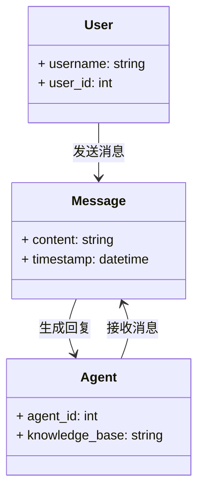
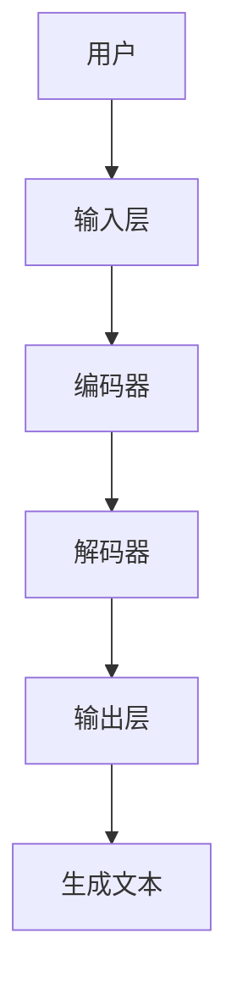
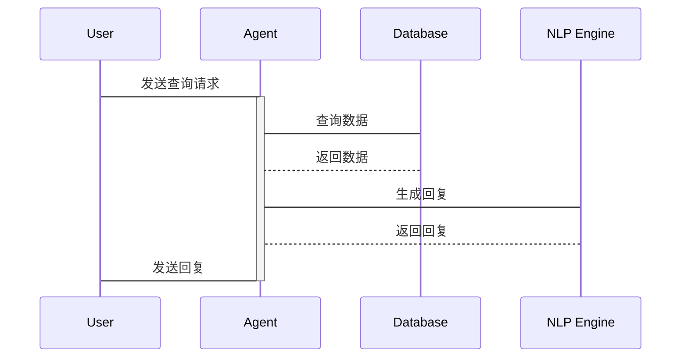

                 


# AI Agent的自然语言生成能力开发

> 关键词：AI Agent, 自然语言生成, 生成式模型, 深度学习, Transformer, 转换式模型

> 摘要：本文将深入探讨AI Agent的自然语言生成能力的开发，从背景介绍、核心概念、算法原理、系统架构设计到项目实战，全面解析自然语言生成的关键技术与实现方法。通过详细的理论分析与实践指导，帮助读者理解并掌握AI Agent自然语言生成的核心能力。

---

## 第一部分: AI Agent的自然语言生成能力开发背景介绍

### 第1章: AI Agent与自然语言生成概述

#### 1.1 AI Agent的基本概念
##### 1.1.1 AI Agent的定义与特点
- **定义**: AI Agent是一种智能体，能够感知环境、执行任务并做出决策。
- **特点**:
  - 自主性: 能够独立决策。
  - 反应性: 能够实时响应环境变化。
  - 社会性: 能够与其他Agent或人类进行交互。
  - 学习性: 能够通过经验改进性能。

##### 1.1.2 自然语言生成的定义与特点
- **定义**: 自然语言生成（Natural Language Generation, NLG）是将结构化数据转换为自然语言文本的过程。
- **特点**:
  - 可解释性: 生成的内容需要易于理解。
  - 相关性: 生成的内容应与上下文相关。
  - 多样性: 能够生成多种表达方式。

##### 1.1.3 AI Agent与自然语言生成的关系
- AI Agent通过自然语言生成能力，能够以人类可理解的方式进行交互。
- 自然语言生成是AI Agent实现人机交互的核心技术之一。

#### 1.2 AI Agent自然语言生成的背景与应用
##### 1.2.1 自然语言生成技术的发展历程
- 从基于规则的生成到基于统计模型的生成，再到当前的深度学习生成。
- 从简单的文本生成到复杂的对话生成。

##### 1.2.2 AI Agent在自然语言生成中的应用领域
- **智能对话系统**: 如智能客服、虚拟助手。
- **内容生成系统**: 如新闻自动生成、报告生成。
- **教育辅助系统**: 如智能辅导系统。

##### 1.2.3 当前技术的挑战与未来趋势
- **挑战**:
  - 生成内容的可控制性与可解释性。
  - 多语言与多模态生成的复杂性。
- **未来趋势**:
  - 更加个性化和情境化的生成。
  - 更高效的生成模型与推理能力。

### 第2章: AI Agent自然语言生成的核心问题

#### 2.1 自然语言生成的关键问题
##### 2.1.1 生成内容的准确性和相关性
- 如何确保生成的内容既准确又符合上下文。

##### 2.1.2 生成过程的可解释性与可控制性
- 如何让生成过程透明且易于控制。

##### 2.1.3 多模态与多语言生成的挑战
- 跨语言生成与多模态生成的技术难点。

#### 2.2 AI Agent自然语言生成的核心要素
##### 2.2.1 数据驱动的生成模型
- 基于大量数据训练的生成模型。

##### 2.2.2 任务驱动的生成策略
- 根据具体任务调整生成策略。

##### 2.2.3 知识驱动的生成优化
- 结合外部知识库优化生成内容。

---

## 第二部分: 自然语言生成的数学模型与算法原理

### 第3章: 自然语言生成的数学模型

#### 3.1 生成式模型的基本原理
##### 3.1.1 概率生成模型
- **公式**: $$P(y|x) = \prod_{i=1}^n P(y_i|y_{<i},x)$$
  - 其中，$x$是输入，$y$是生成的序列。

##### 3.1.2 转换式模型
- **公式**: $$y = f(x)$$
  - $f$是映射函数。

#### 3.2 基于Transformer的自然语言生成算法
##### 3.2.1 Transformer模型的结构
- **编码器**: 将输入序列编码为上下文向量。
- **解码器**: 根据编码器输出生成目标序列。

##### 3.2.2 解码器的生成机制
- **解码步骤**: 
  1. 输入初始向量。
  2. 通过自注意力机制生成当前词。
  3. 将生成的词作为输入，重复直到达到最大长度。

##### 3.2.3 注意力机制的数学公式
- **注意力权重计算**:
  $$\text{Attention}(Q, K, V) = \text{softmax}\left(\frac{QK^T}{\sqrt{d_k}}\right)V$$

#### 3.3 自然语言生成的优化算法
##### 3.3.1 梯度下降与Adam优化器
- **Adam优化器公式**:
  $$\theta_{t+1} = \theta_t - \alpha \frac{\rho_1 m_t + \rho_2 n_t}{\epsilon + g_t^2}$$
  - 其中，$m_t$是梯度的移动平均，$n_t$是梯度平方的移动平均。

##### 3.3.2 贝叶斯推断与变分推断
- **贝叶斯推断**: 通过概率模型进行推断。
- **变分推断**: 通过近似分布来优化推断。

---

## 第三部分: AI Agent自然语言生成系统的架构设计

### 第4章: 系统架构与实现

#### 4.1 项目场景介绍
- **目标**: 实现一个基于AI Agent的智能对话系统。

#### 4.2 系统功能设计
##### 4.2.1 领域模型设计


##### 4.2.2 系统架构设计


##### 4.2.3 接口设计
- **输入接口**: 接收用户输入。
- **输出接口**: 生成并返回自然语言文本。

#### 4.3 交互流程设计


---

## 第四部分: 项目实战与优化

### 第5章: 项目实战

#### 5.1 环境安装
- **Python版本**: 3.8及以上。
- **依赖库安装**:
  ```bash
  pip install transformers torch datasets
  ```

#### 5.2 核心代码实现
##### 5.2.1 模型定义
```python
import torch
import torch.nn as nn
import torch.nn.functional as F

class TransformerDecoder(nn.Module):
    def __init__(self, vocab_size, d_model=512, n_head=8, d_ff=2048):
        super().__init__()
        self.embedding = nn.Embedding(vocab_size, d_model)
        self.decode_layers = nn.ModuleList([
            nn.TransformerDecoderLayer(d_model, n_head, d_ff)
            for _ in range(1)
        ])
        self.output = nn.Linear(d_model, vocab_size)

    def forward(self, x, memory):
        x = self.embedding(x)
        x = self.decode_layers[0](x, memory)
        x = self.output(x)
        return x
```

##### 5.2.2 训练与推理
```python
# 训练
optimizer = Adam(model.parameters(), lr=0.001)
criterion = nn.CrossEntropyLoss()

for epoch in range(num_epochs):
    for batch in data_loader:
        inputs, targets = batch
        outputs = model(inputs, memory)
        loss = criterion(outputs, targets)
        loss.backward()
        optimizer.step()
        optimizer.zero_grad()

# 推理
def generate_text(model, start_token, max_length):
    with torch.no_grad():
        current = start_token
        for _ in range(max_length):
            outputs = model(current, memory)
            predicted = torch.argmax(outputs, dim=-1)
            current = predicted
            yield predicted.item()
```

#### 5.3 代码应用解读与分析
- **模型定义**: 使用Transformer解码器实现自然语言生成。
- **训练过程**: 通过反向传播与优化器更新模型参数。
- **推理过程**: 根据输入生成目标序列。

#### 5.4 实际案例分析
- **案例**: 基于AI Agent的智能对话系统。

---

## 第五部分: 最佳实践与总结

### 第6章: 最佳实践

#### 6.1 小结
- 自然语言生成是AI Agent实现人机交互的核心技术。
- 通过深度学习模型与优化算法，可以显著提升生成效果。

#### 6.2 注意事项
- 数据质量直接影响生成效果。
- 模型的可解释性与可控制性需要重点关注。

#### 6.3 拓展阅读
- 推荐阅读《Attention Is All You Need》论文。
- 关注最新的生成模型研究，如PaLM、GPT-4等。

---

## 作者信息

作者：AI天才研究院/AI Genius Institute & 禅与计算机程序设计艺术 /Zen And The Art of Computer Programming

