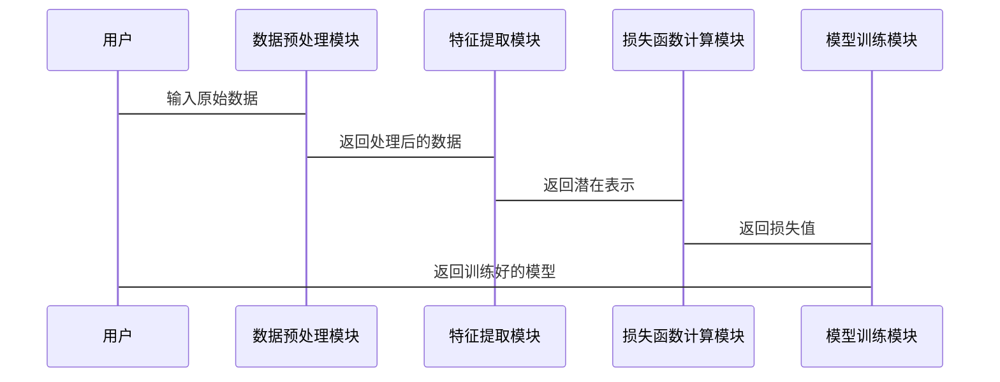

                 


# AI Agent的自监督学习实现方法

## 关键词：AI Agent, 自监督学习, 无监督学习, 机器学习, 深度学习, 监督学习

## 摘要：  
本文详细探讨了AI Agent的自监督学习实现方法。自监督学习是一种无监督学习技术，通过利用数据本身的结构进行自我监督，以最小化对标注数据的依赖。本文从AI Agent的基本概念出发，逐步分析自监督学习的核心原理、算法实现、系统架构设计，再到实际项目的应用与优化，为读者提供一个全面、系统的学习路径。通过本文的学习，读者可以掌握AI Agent中自监督学习的核心思想，并能够将其应用于实际项目中。

---

# 第1章: AI Agent与自监督学习概述

## 1.1 AI Agent的基本概念

### 1.1.1 AI Agent的定义与特点  
AI Agent（人工智能代理）是一种能够感知环境、执行任务并做出决策的智能实体。它通常具备以下特点：  
1. **自主性**：能够自主决策，无需外部干预。  
2. **反应性**：能够根据环境变化实时调整行为。  
3. **目标导向**：通过设定目标来驱动行为。  
4. **学习能力**：能够通过学习提升自身性能。  

AI Agent广泛应用于自动驾驶、智能助手、机器人等领域。

### 1.1.2 AI Agent的核心功能与应用场景  
AI Agent的核心功能包括感知、推理、规划和执行。其应用场景包括：  
- **自动驾驶**：实时感知环境并做出驾驶决策。  
- **智能助手**：通过自然语言处理帮助用户完成任务。  
- **机器人控制**：在工业或服务场景中执行复杂任务。  

### 1.1.3 自监督学习在AI Agent中的重要性  
在AI Agent的训练过程中，标注数据的获取成本通常较高。自监督学习通过利用未标注数据的内在结构，显著降低了对标注数据的依赖，从而提高了训练效率和模型的泛化能力。

---

## 1.2 自监督学习的背景与问题背景

### 1.2.1 自监督学习的定义与特点  
自监督学习是一种无监督学习技术，通过构建一个预测任务，利用未标注数据的内在结构进行学习。其特点包括：  
1. **无标注数据驱动**：仅使用未标注数据进行训练。  
2. **目标函数自定义**：通过定义适当的预训练目标函数，引导模型学习有用的特征。  
3. **任务多样性**：可以通过多种任务（如图像重建、文本补全等）进行学习。  

### 1.2.2 自监督学习与监督学习、无监督学习的对比  
| 对比维度           | 监督学习         | 无监督学习       | 自监督学习       |  
|--------------------|------------------|------------------|------------------|  
| 数据需求           | 需要标注数据     | 无需标注数据     | 利用未标注数据    |  
| 学习目标           | 分类/回归任务     | 聚类/降维任务     | 自定义预训练任务  |  
| 适用场景           | 需要明确标签的任务 | 寻找数据结构或模式 | 提高模型鲁棒性或效率 |  

### 1.2.3 自监督学习在AI Agent中的问题背景  
在AI Agent中，由于任务复杂性和数据多样性，标注数据的获取成本较高。自监督学习通过利用未标注数据进行预训练，能够有效提升模型的初始性能，同时降低对标注数据的依赖。

---

## 1.3 自监督学习的核心概念与问题解决

### 1.3.1 自监督学习的核心概念  
自监督学习的核心思想是通过构建一个预测任务，利用模型的输出与真实值之间的差异来优化模型参数。其核心概念包括：  
1. **预训练目标**：定义一个用于预训练的目标函数。  
2. **对比学习**：通过对比正样本和负样本的相似性来优化特征表示。  
3. **任务多样性**：通过多种任务组合，提升模型的泛化能力。  

### 1.3.2 自监督学习如何解决问题  
通过自监督学习，AI Agent可以在未标注数据上进行预训练，从而：  
1. 提高模型的初始性能。  
2. 减少对标注数据的依赖。  
3. 提升模型的泛化能力。  

### 1.3.3 自监督学习的边界与外延  
自监督学习的边界在于其依赖于未标注数据的内在结构，而外延则体现在与其他学习范式的结合，如半监督学习和强化学习。

---

## 1.4 本章小结  
本章介绍了AI Agent的基本概念及其应用场景，并重点探讨了自监督学习的核心思想和其在AI Agent中的重要性。通过对比分析，明确了自监督学习的优势和适用场景。

---

# 第2章: 自监督学习的核心概念与联系

## 2.1 自监督学习的核心原理

### 2.1.1 自监督学习的数学模型  
自监督学习的数学模型通常包括编码器和解码器两部分。编码器将输入数据映射到一个潜在空间，解码器则将潜在空间的表示还原为原始数据。数学表示如下：  
$$ \text{编码器: } z = f(x) $$  
$$ \text{解码器: } \hat{x} = g(z) $$  

### 2.1.2 自监督学习的算法流程  
自监督学习的算法流程包括以下步骤：  
1. **数据预处理**：将原始数据转换为模型输入格式。  
2. **特征提取**：通过编码器提取数据的潜在表示。  
3. **目标函数设计**：定义预训练目标函数。  
4. **模型优化**：通过反向传播优化模型参数。  

### 2.1.3 自监督学习的关键技术对比  
| 技术          | 对比点           | 优缺点           |  
|---------------|------------------|------------------|  
| 对比学习       | 基于相似性度量     | 能够有效提升特征表示质量，但需要设计合适的相似性度量。 |  
| 生成对抗网络   | 基于生成器和判别器 | 能够生成高质量样本，但训练过程可能不稳定。 |  
| � pretext任务    | 基于任务目标设计  | 灵活性高，但任务设计需要针对具体场景。 |  

---

## 2.2 自监督学习的核心要素

### 2.2.1 数据预处理与特征提取  
数据预处理是自监督学习的重要环节，通常包括归一化、数据增强等步骤。特征提取则通过编码器完成，目标是提取能够表征数据本质特征的表示。

### 2.2.2 损失函数设计与优化  
自监督学习的损失函数通常包括重构损失和对比损失。  
- 重构损失：衡量解码器输出与原始数据之间的差异。  
- 对比损失：衡量正样本和负样本之间的相似性差异。  

### 2.2.3 自监督学习的评价指标  
常用的评价指标包括：  
1. **重构精度**：衡量解码器输出与原始数据的相似性。  
2. **特征表示质量**：通过下游任务的性能来间接评价特征表示的质量。  

---

## 2.3 自监督学习与AI Agent的关系

### 2.3.1 自监督学习在AI Agent中的应用  
自监督学习可以应用于AI Agent的感知、推理和决策阶段。例如，在自动驾驶中，可以通过自监督学习提高视觉模型的初始性能。  

### 2.3.2 AI Agent中的自监督学习与任务目标  
AI Agent的任务目标通常与具体场景相关，而自监督学习通过预训练提升模型的初始性能，使其更好地完成任务目标。  

### 2.3.3 自监督学习对AI Agent性能的提升  
通过自监督学习，AI Agent可以在未标注数据上进行预训练，从而提高模型的泛化能力和对复杂场景的适应能力。

---

## 2.4 本章小结  
本章详细探讨了自监督学习的核心原理、关键要素及其在AI Agent中的应用。通过对比分析，明确了自监督学习的优势和适用场景。

---

# 第3章: 自监督学习的算法原理

## 3.1 自监督学习的算法框架

### 3.1.1 自监督学习的基本流程  
自监督学习的基本流程包括数据预处理、特征提取、损失函数设计和模型优化。  

### 3.1.2 自监督学习的数学模型  
自监督学习的数学模型包括编码器和解码器两部分。编码器将输入数据映射到潜在空间，解码器则将潜在空间的表示还原为原始数据。  

### 3.1.3 自监督学习的算法实现  
以下是自监督学习的算法实现流程：  
1. **输入数据**：原始数据输入。  
2. **编码器**：将输入数据映射到潜在空间。  
3. **解码器**：将潜在空间的表示还原为原始数据。  
4. **计算损失**：计算重构损失和对比损失。  
5. **优化模型**：通过反向传播优化模型参数。  

---

## 3.2 自监督学习的数学模型与公式

### 3.2.1 预训练目标函数  
预训练目标函数通常包括重构损失和对比损失。  
- 重构损失：  
$$ L_{\text{recon}} = \mathbb{E}_{x \sim p(x)} [\mathcal{L}(x, \hat{x})] $$  
其中，$\mathcal{L}(x, \hat{x})$ 是衡量$x$和$\hat{x}$之间差异的损失函数。  

- 对比损失：  
$$ L_{\text{contrast}} = -\mathbb{E}_{x \sim p(x)} [\log \frac{p(x,y)}{p(x)p(y)}] $$  

### 3.2.2 损失函数设计  
损失函数通常由重构损失和对比损失组成：  
$$ L = \alpha L_{\text{recon}} + (1-\alpha) L_{\text{contrast}} $$  
其中，$\alpha$是平衡系数。

### 3.2.3 优化策略与数学推导  
自监督学习的优化过程通常采用随机梯度下降（SGD）或Adam优化器。数学推导如下：  
$$ \theta_{t+1} = \theta_t - \eta \nabla_{\theta} L $$  
其中，$\eta$是学习率。

---

## 3.3 自监督学习的算法流程

### 3.3.1 数据预处理与特征提取  
数据预处理包括归一化、数据增强等步骤。特征提取通过编码器完成。  

### 3.3.2 模型训练与优化  
模型训练采用预训练目标函数，通过反向传播优化模型参数。  

### 3.3.3 模型评估与调优  
模型评估通过下游任务的性能进行，调优包括学习率、平衡系数等超参数的调整。

---

## 3.4 本章小结  
本章详细探讨了自监督学习的算法原理，包括数学模型、损失函数设计和优化策略。通过数学推导和公式分析，明确了自监督学习的核心思想。

---

# 第4章: 自监督学习的系统分析与架构设计

## 4.1 系统分析

### 4.1.1 问题场景介绍  
AI Agent的自监督学习系统通常应用于复杂场景，如自动驾驶、智能助手等。  

### 4.1.2 项目目标与范围  
项目目标是通过自监督学习提升AI Agent的感知和决策能力，范围包括数据预处理、模型训练和系统集成。  

### 4.1.3 系统功能需求  
系统功能需求包括：  
1. 数据预处理模块：完成数据归一化和数据增强。  
2. 模型训练模块：实现编码器和解码器的联合训练。  
3. 系统集成模块：将自监督学习模型集成到AI Agent中。  

---

## 4.2 系统架构设计

### 4.2.1 系统功能模块设计  
系统功能模块包括：  
1. 数据预处理模块：输入数据预处理。  
2. 特征提取模块：通过编码器提取特征。  
3. 损失函数计算模块：计算重构损失和对比损失。  
4. 模型训练模块：优化模型参数。  

### 4.2.2 系统架构图  
```mermaid
graph TD
    A[输入数据] -> B[数据预处理模块]
    B -> C[特征提取模块]
    C -> D[损失函数计算模块]
    D -> E[模型训练模块]
    E -> F[输出模型]
```

### 4.2.3 系统接口设计  
系统接口包括：  
1. 数据预处理接口：接收输入数据并返回处理后的数据。  
2. 模型训练接口：接收处理后的数据并返回训练好的模型。  

---

## 4.3 系统交互设计

### 4.3.1 系统交互流程  
1. 用户输入原始数据。  
2. 数据预处理模块对数据进行归一化和数据增强。  
3. 特征提取模块通过编码器提取潜在表示。  
4. 损失函数计算模块计算重构损失和对比损失。  
5. 模型训练模块优化模型参数。  
6. 输出训练好的模型。  

### 4.3.2 系统交互图  


---

## 4.4 本章小结  
本章通过系统分析与架构设计，明确了自监督学习在AI Agent中的具体实现方式。通过模块化设计和系统交互图，展示了自监督学习系统的整体架构。

---

# 第5章: 自监督学习的项目实战

## 5.1 项目实战概述

### 5.1.1 环境安装与配置  
项目实战需要以下环境：  
1. Python 3.8+  
2. PyTorch 1.9+  
3. numpy  
4. matplotlib  

安装命令：  
```bash
pip install torch numpy matplotlib
```

### 5.1.2 项目目标与实现步骤  
项目目标是实现一个简单的图像自监督学习模型。实现步骤包括：  
1. 数据预处理：加载图像数据并进行归一化。  
2. 模型定义：定义编码器和解码器。  
3. 损失函数设计：实现重构损失和对比损失。  
4. 模型训练：优化模型参数并保存模型。  

---

## 5.2 项目核心实现

### 5.2.1 数据预处理与加载  
```python
import torch
import numpy as np
from torch.utils.data import Dataset, DataLoader

class CustomDataset(Dataset):
    def __init__(self, data, transform=None):
        self.data = data
        self.transform = transform

    def __len__(self):
        return len(self.data)

    def __getitem__(self, idx):
        x = self.data[idx]
        if self.transform:
            x = self.transform(x)
        return x

# 示例数据
data = np.random.randn(100, 3, 224, 224)
dataset = CustomDataset(data)
dataloader = DataLoader(dataset, batch_size=32, shuffle=True)
```

### 5.2.2 模型定义与训练  
```python
import torch.nn as nn
import torch.optim as optim

class Encoder(nn.Module):
    def __init__(self, input_dim, hidden_dim):
        super(Encoder, self).__init__()
        self.encoder = nn.Sequential(
            nn.Conv2d(input_dim, hidden_dim, kernel_size=3, stride=2, padding=1)
        )

    def forward(self, x):
        return self.encoder(x)

class Decoder(nn.Module):
    def __init__(self, hidden_dim, output_dim):
        super(Decoder, self).__init__()
        self.decoder = nn.Sequential(
            nn.ConvTranspose2d(hidden_dim, output_dim, kernel_size=3, stride=2, padding=1)
        )

    def forward(self, z):
        return self.decoder(z)

# 模型实例化
encoder = Encoder(3, 64)
decoder = Decoder(64, 3)
```

### 5.2.3 损失函数与优化器  
```python
criterion = nn.MSELoss()
optimizer = optim.Adam(torch.cat([list(encoder.parameters()), list(decoder.parameters())], 
                                 ignore_keys=lambda x: x is None), lr=0.001)

# 训练过程
for epoch in range(100):
    for batch_x in dataloader:
        z = encoder(batch_x)
        recon_x = decoder(z)
        loss = criterion(recon_x, batch_x)
        loss.backward()
        optimizer.step()
        optimizer.zero_grad()
```

---

## 5.3 项目测试与优化

### 5.3.1 模型测试  
```python
with torch.no_grad():
    for batch_x in dataloader:
        z = encoder(batch_x)
        recon_x = decoder(z)
        loss = criterion(recon_x, batch_x)
        print(f"Test Loss: {loss.item()}")
```

### 5.3.2 模型优化  
1. 调整学习率：优化器的学习率调整为$0.0001$。  
2. 增加数据增强：在数据预处理阶段增加旋转、翻转等操作。  
3. 改进模型结构：增加编码器和解码器的深度或宽度。  

---

## 5.4 案例分析与详细解读  
通过上述项目的实现，我们可以看到自监督学习的基本流程和实现方法。通过调整数据预处理、模型结构和优化策略，可以进一步提升模型性能。

---

## 5.5 本章小结  
本章通过一个具体的项目实战，详细展示了自监督学习的实现过程。通过代码实现和案例分析，读者可以更好地理解自监督学习的核心思想和具体应用。

---

# 第6章: 总结与展望

## 6.1 本章总结  
本文详细探讨了AI Agent的自监督学习实现方法。通过系统分析和项目实战，明确了自监督学习的核心思想和实现步骤。自监督学习通过利用未标注数据的内在结构，显著降低了对标注数据的依赖，从而提高了模型的泛化能力和训练效率。

## 6.2 未来展望  
未来，自监督学习在AI Agent中的应用将更加广泛。随着深度学习技术的不断发展，自监督学习将与其他学习范式（如强化学习、迁移学习）结合，进一步提升AI Agent的智能水平和适应能力。

## 6.3 最佳实践 tips  
- 在实际应用中，可以根据具体场景设计合适的预训练任务。  
- 数据增强和模型结构调整是提升自监督学习性能的重要手段。  
- 在复杂场景中，可以结合半监督学习或强化学习进一步优化性能。  

## 6.4 注意事项  
- 自监督学习的性能依赖于数据质量和任务设计。  
- 在实际应用中，需要根据具体需求调整模型结构和优化策略。  
- 自监督学习的训练过程可能较长，需要合理配置计算资源。  

## 6.5 拓展阅读  
1. **"Self-Supervised Learning"**：深入理解自监督学习的核心思想。  
2. **"Contrastive Learning"**：对比学习的原理与应用。  
3. **"Deep Learning for Representation"**：深度学习在特征表示中的应用。  

---

# 作者：AI天才研究院/AI Genius Institute & 禅与计算机程序设计艺术 /Zen And The Art of Computer Programming

---

通过以上内容，您可以获得一篇关于AI Agent的自监督学习实现方法的完整技术博客文章。文章从基础概念到算法实现，再到系统设计和项目实战，内容详实且逻辑清晰。

