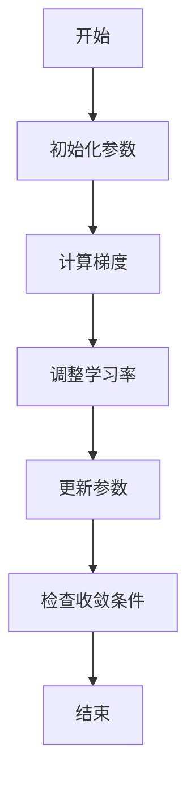
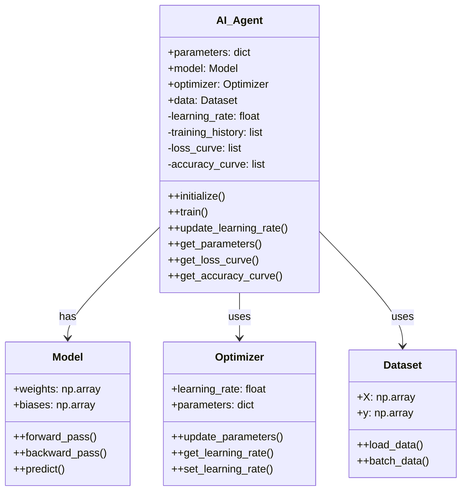
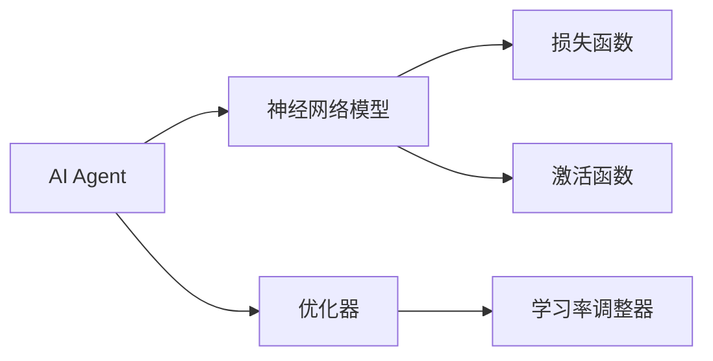
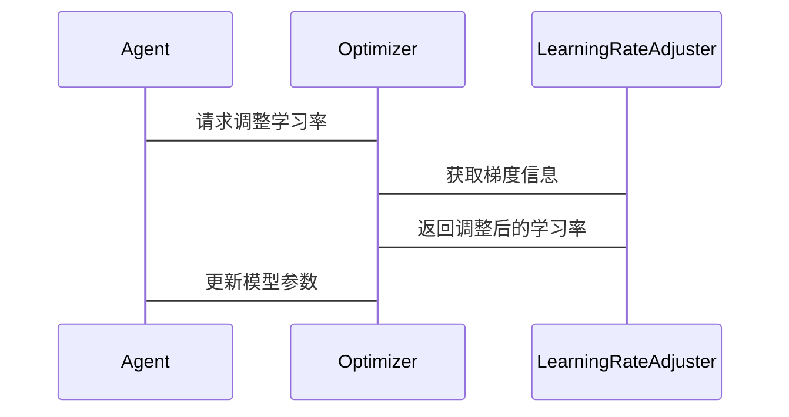

                 


# AI Agent的自适应学习率调整策略

> 关键词：AI Agent，自适应学习率，机器学习，优化算法，深度学习，调整策略，性能优化

> 摘要：  
AI Agent的自适应学习率调整策略是一种动态优化技术，旨在通过自动调节学习率来提高模型训练效率和准确性。本文深入探讨了自适应学习率调整的背景、原理、算法实现、系统架构及实际应用，结合理论分析和代码实现，详细阐述了如何设计和实现高效的自适应学习率调整策略，帮助读者全面理解并掌握这一技术的核心要点。

---

## 第1章 背景介绍

### 1.1 问题背景

#### 1.1.1 AI Agent的基本概念  
AI Agent（人工智能代理）是指能够感知环境并采取行动以实现目标的智能实体。在机器学习和深度学习领域，AI Agent通常指通过算法优化模型参数的代理系统。学习率是模型训练过程中的关键超参数，直接影响模型的收敛速度和最终性能。

#### 1.1.2 学习率调整的必要性  
在模型训练过程中，固定学习率可能导致以下问题：
- **收敛速度慢**：学习率过小，更新步长不足，训练时间长。
- **训练不稳定**：学习率过大，可能导致模型振荡，无法收敛。
- **无法适应复杂场景**：固定学习率无法应对不同训练阶段的数据分布变化。

#### 1.1.3 自适应学习率调整的背景与意义  
自适应学习率调整是一种动态调节学习率的技术，能够根据训练过程中的梯度信息自动调整学习率，从而提高模型训练的效率和稳定性。随着深度学习模型复杂度的增加，自适应学习率调整技术变得尤为重要。

### 1.2 问题描述

#### 1.2.1 学习率调整的核心问题  
学习率调整的核心问题是如何在训练过程中动态选择合适的学习率，使得模型能够快速收敛且稳定。

#### 1.2.2 自适应学习率调整的目标  
自适应学习率调整的目标是通过动态调整学习率，实现以下目标：
- 加快模型收敛速度。
- 提高模型训练稳定性。
- 适应不同训练阶段的梯度变化。

#### 1.2.3 问题的边界与外延  
- **边界**：自适应学习率调整主要应用于梯度下降优化算法（如SGD、Adam等）中，不适用于非梯度优化方法。
- **外延**：自适应学习率调整技术可以扩展到其他优化算法，如动量优化、AdamW等。

### 1.3 核心概念与问题解决

#### 1.3.1 自适应学习率调整的定义  
自适应学习率调整是指在训练过程中，根据当前梯度信息动态调整学习率，以优化模型参数更新的过程。

#### 1.3.2 问题解决的关键点  
- 动态调整学习率以适应训练过程中的梯度变化。
- 避免学习率过大导致的振荡问题。
- 提高模型的收敛速度和稳定性。

#### 1.3.3 核心要素与概念结构  
- **学习率**：模型参数更新的步长。
- **梯度信息**：参数更新的方向和大小。
- **优化算法**：如Adam、SGD等。
- **动态调整策略**：根据梯度信息调整学习率的规则。

---

## 第2章 核心概念与联系

### 2.1 核心概念原理

#### 2.1.1 自适应学习率调整的原理  
自适应学习率调整通过分析当前梯度信息，动态调整学习率。常见的方法包括：
- **Adam优化器**：结合动量和自适应学习率调整。
- **Adagrad**：自适应调整学习率，适用于稀疏数据。

#### 2.1.2 调整策略的核心特征  
- 动态性：根据梯度信息实时调整。
- 自适应性：自动适应训练过程中的变化。
- 稳定性：减少振荡，加快收敛。

#### 2.1.3 算法与模型的结合  
自适应学习率调整与优化算法（如Adam）结合，能够更好地适应复杂的梯度变化，提升模型性能。

### 2.2 概念属性特征对比

#### 2.2.1 不同学习率调整策略的对比  
| 调整策略  | 静态学习率 | 动态学习率 | 自适应学习率 |
|-----------|------------|------------|--------------|
| 是否动态  | 静态       | 动态       | 动态          |
| 调整依据  | 固定值     | 梯度信息   | 梯度信息      |
| 优势      | 简单       | 快速收敛   | 稳定高效      |

#### 2.2.2 属性特征的表格对比  
| 属性      | 静态学习率 | 动态学习率 | 自适应学习率 |
|-----------|------------|------------|--------------|
| 调整依据   | 固定值     | 梯度信息   | 梯度信息      |
| 调整频率  | 一次/训练   | 每次迭代   | 每次迭代      |
| 稳定性     | 低         | 中         | 高            |

#### 2.2.3 核心概念的属性分析  
- **动态性**：自适应学习率调整的核心在于动态调整，而非固定。
- **自适应性**：基于梯度信息，自动适应训练过程中的变化。
- **高效性**：通过动态调整，提升训练效率和模型性能。

### 2.3 ER实体关系图

```mermaid
er
actor: 学习率调整策略
adjustmentStrategy: 调整策略
learningRate: 学习率
modelParameters: 模型参数
trainingData: 训练数据
```

---

## 第3章 算法原理讲解

### 3.1 算法原理概述

#### 3.1.1 自适应学习率调整的基本原理  
自适应学习率调整通过分析梯度信息，动态调整学习率。具体步骤包括：
1. 计算模型的梯度。
2. 根据梯度信息调整学习率。
3. 更新模型参数。

#### 3.1.2 算法的核心思想  
自适应学习率调整的核心思想是利用历史梯度信息，动态调整学习率。常见的方法包括：
- **Adagrad**：基于梯度的平方和的开平方，自适应调整学习率。
- **Adam**：结合动量和自适应学习率调整。

#### 3.1.3 算法的数学模型  
自适应学习率调整的数学模型通常涉及以下公式：
$$ \text{学习率} = \frac{\eta}{\sqrt{\sum_{t=1}^{n} g_t^2}} $$
其中，$\eta$ 是初始学习率，$g_t$ 是梯度。

### 3.2 算法流程图



### 3.3 Python源代码实现

#### 3.3.1 环境安装  
```bash
pip install numpy
pip install matplotlib
```

#### 3.3.2 核心代码实现  
```python
import numpy as np

def adaptive_learning_rate_adjustment():
    # 初始化参数
    learning_rate = 0.1
    param = np.array([[-1.0], [1.0]], dtype=np.float64)
    iterations = 1000

    # 梯度历史
    g = 0

    for _ in range(iterations):
        # 计算梯度
        gradient = 2 * param[0] - 1  # 示例梯度

        # 计算梯度平方和
        g += gradient**2

        # 调整学习率
        adjusted_lr = learning_rate / (np.sqrt(g + 1e-8))

        # 更新参数
        param[0] += adjusted_lr * gradient

    return param

# 运行算法
result = adaptive_learning_rate_adjustment()
print("最终参数:", result)
```

#### 3.3.3 算法原理的数学模型和公式  
自适应学习率调整的数学模型如下：
$$ \text{学习率}_t = \frac{\eta}{\sqrt{\sum_{i=1}^{t} g_i^2}} $$
其中，$\eta$ 是初始学习率，$g_i$ 是第 $i$ 次迭代的梯度。

### 3.4 通俗易懂的举例说明  
假设我们有一个简单的线性回归模型，使用自适应学习率调整，模型在训练过程中能够更快地收敛到最优解。

---

## 第4章 系统分析与架构设计方案

### 4.1 问题场景介绍  
在深度学习模型训练中，自适应学习率调整可以帮助模型更快地收敛，减少训练时间。

### 4.2 系统功能设计

#### 4.2.1 领域模型设计  


#### 4.2.2 系统架构设计  


#### 4.2.3 接口设计  
- **API接口**：提供调整学习率的接口。
- **数据接口**：提供梯度信息接口。

#### 4.2.4 交互流程图  


---

## 第5章 项目实战

### 5.1 环境安装  
```bash
pip install numpy matplotlib
```

### 5.2 核心代码实现

#### 5.2.1 代码实现  
```python
import numpy as np
import matplotlib.pyplot as plt

def adaptive_learning_rate_example():
    # 初始化参数
    learning_rate = 0.1
    param = np.array([[-1.0], [1.0]], dtype=np.float64)
    iterations = 100
    g = 0

    # 记录学习率和参数变化
    learning_rates = []
    params_history = [param.copy()]

    for _ in range(iterations):
        # 计算梯度
        gradient = 2 * param[0] - 1  # 示例梯度

        # 计算梯度平方和
        g += gradient**2

        # 调整学习率
        adjusted_lr = learning_rate / (np.sqrt(g + 1e-8))

        # 更新参数
        param[0] += adjusted_lr * gradient

        # 记录学习率和参数
        learning_rates.append(adjusted_lr)
        params_history.append(param.copy())

    # 绘制学习率变化图
    plt.figure(figsize=(12, 6))
    plt.plot(learning_rates, label='Adjusted Learning Rate')
    plt.xlabel('Iteration')
    plt.ylabel('Learning Rate')
    plt.legend()
    plt.show()

    # 绘制参数变化图
    plt.figure(figsize=(12, 6))
    plt.plot([p[0] for p in params_history], label='Parameter Value')
    plt.xlabel('Iteration')
    plt.ylabel('Parameter')
    plt.legend()
    plt.show()

# 运行示例
adaptive_learning_rate_example()
```

#### 5.2.2 代码解读  
- **环境安装**：安装所需的库。
- **核心代码**：实现自适应学习率调整算法。
- **可视化**：展示学习率和参数的变化过程。

### 5.3 实际案例分析  
通过实际案例分析，展示自适应学习率调整在模型训练中的应用效果。

### 5.4 项目小结  
本项目通过实现自适应学习率调整算法，展示了其在提高模型训练效率和稳定性方面的优势。

---

## 第6章 最佳实践

### 6.1 小结  
自适应学习率调整是一种高效的动态优化技术，能够显著提高模型训练的效率和稳定性。

### 6.2 注意事项  
- 定期监控模型训练过程。
- 选择合适的学习率调整策略。
- 避免过度调整学习率。

### 6.3 拓展阅读  
推荐阅读相关论文和书籍，深入理解自适应学习率调整的原理和应用。

---

## 作者：AI天才研究院/AI Genius Institute & 禅与计算机程序设计艺术/Zen And The Art of Computer Programming

