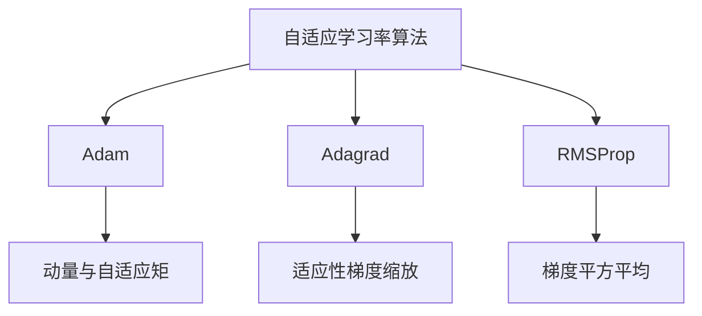
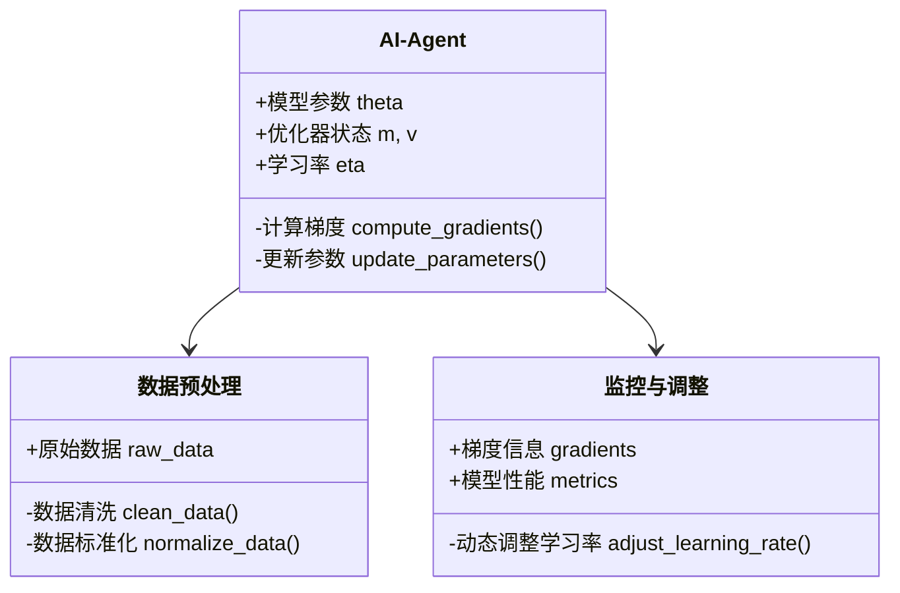
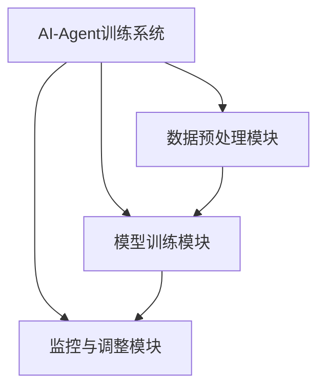
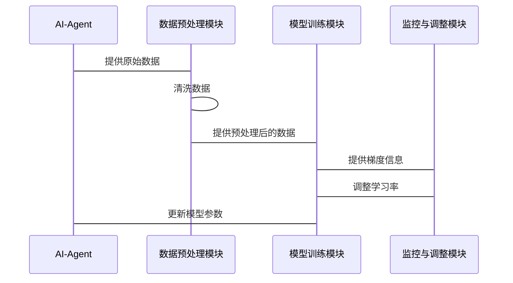

                 


# AI Agent的自适应学习率：优化训练过程

## 关键词：AI Agent, 自适应学习率, 优化训练, Adam算法, RMSProp算法, 深度学习框架

## 摘要：  
在AI Agent的训练过程中，自适应学习率是一种优化技术，能够根据训练过程中的梯度信息动态调整学习率，从而提高训练效率和模型性能。本文将深入探讨自适应学习率的基本概念、核心算法、数学模型、系统架构设计以及实际项目中的应用。通过详细的原理分析和代码实现，帮助读者全面理解并掌握如何在AI Agent的训练中应用自适应学习率技术，优化训练过程。

---

# 第一部分: 自适应学习率的基本概念

## 第1章: 自适应学习率的基本概念

### 1.1 问题背景与描述  
在AI Agent的训练过程中，优化算法是模型参数更新的核心技术。传统的梯度下降算法使用固定的学习率，但在复杂的优化任务中，这种固定的学习率往往难以适应不同的梯度情况，导致训练过程不稳定或收敛速度慢。例如，在深度学习中，模型的参数空间可能存在高低不同梯度的区域，固定学习率可能导致模型在某些区域更新过快而在其他区域更新不足。

### 1.2 自适应学习率的解决方案  
为了克服固定学习率的局限性，自适应学习率技术应运而生。自适应学习率算法能够根据训练过程中的梯度信息动态调整学习率，从而在不同的训练阶段自动适应模型的优化需求。例如，Adam算法结合了动量和自适应矩估计技术，能够在训练过程中同时处理梯度的大小和方向，从而实现更高效的参数更新。

### 1.3 自适应学习率的核心要素  
自适应学习率的核心要素包括：  
1. **学习率调整的触发条件**：基于梯度信息、参数更新历史等动态调整学习率。  
2. **调整策略的选择与实现**：选择合适的自适应学习率算法（如Adam、Adagrad、RMSProp）并实现其数学模型。  
3. **自适应学习率的数学模型**：建立参数更新的数学公式，确保算法的高效性和稳定性。  

---

# 第二部分: 自适应学习率的原理与算法

## 第2章: 自适应学习率的原理与算法  

### 2.1 自适应学习率的核心原理  
自适应学习率的核心原理在于动态调整学习率，以适应不同的梯度情况。例如，Adam算法结合了动量（Momentum）和自适应矩估计（Adaptive Moment Estimation）技术，能够在训练过程中同时处理梯度的大小和方向，从而实现更高效的参数更新。具体来说，Adam算法通过维护梯度的移动平均值和平方平均值，动态调整参数更新步长，从而在训练过程中自动适应模型的优化需求。

### 2.2 主流自适应学习率算法对比  
以下是几种主流的自适应学习率算法的对比：  

| 算法名称 | 调整方式 | 优点 | 缺点 |
|----------|----------|------|------|
| Adam     | 动量与自适应矩估计 | 收敛快，适合复杂任务 | 参数多，超参数敏感 |
| Adagrad   | 适应性学习率 | 适合稀疏数据 | 收敛速度较慢 |
| RMSProp   | 坍缩梯度 | 稳定性好，适合RNN | 参数调整复杂 |

### 2.3 算法关系图  
以下使用Mermaid流程图展示自适应学习率算法之间的关系：  



---

# 第三部分: 自适应学习率算法的数学模型与实现

## 第3章: 自适应学习率的数学模型  

### 3.1 Adam算法的数学公式  
Adam算法的核心思想是结合动量和自适应矩估计技术，动态调整参数更新步长。其数学公式如下：  

$$ \theta_{t+1} = \theta_t - \eta \frac{\beta_1 (1-\beta_1^t) g_t + \beta_2 (1-\beta_2^t) g_t^2}{\epsilon + \sqrt{\beta_2 (1-\beta_2^t) g_t^2}} $$  

其中：  
- $\theta_t$ 表示当前参数。  
- $\eta$ 表示学习率。  
- $\beta_1$ 和 $\beta_2$ 表示动量和自适应矩的系数。  
- $g_t$ 表示当前梯度。  
- $\epsilon$ 表示防止除以零的参数。  

### 3.2 Adam算法的实现步骤  
以下使用Python代码实现Adam算法的核心逻辑：  

```python
def adam_optimizer(theta, grad, eta, beta1, beta2, epsilon):
    # 动量部分
    m = beta1 * grad + (1 - beta1) * grad
    # 自适应矩部分
    v = beta2 * (grad**2) + (1 - beta2) * (grad**2)
    # 参数更新
    theta = theta - eta * m / (epsilon + v**0.5)
    return theta
```

### 3.3 实际案例分析  
假设我们有一个简单的线性回归模型，使用Adam算法进行优化。以下是具体的实现步骤：  

1. 初始化参数 $\theta$ 和优化器状态（动量和自适应矩）。  
2. 计算模型的梯度 $\nabla L$。  
3. 根据Adam算法的公式更新参数。  
4. 重复上述步骤，直到满足收敛条件。  

通过这种方式，Adam算法能够在训练过程中动态调整学习率，从而加速模型的收敛并提高优化效果。

---

# 第四部分: 系统分析与架构设计

## 第4章: 系统分析与架构设计  

### 4.1 问题场景介绍  
在实际的AI Agent训练中，自适应学习率优化器需要与模型训练框架、数据预处理模块和监控模块协同工作。以下是系统的功能模块：  

- **数据预处理模块**：处理输入数据，确保数据格式和规范符合模型训练要求。  
- **模型训练模块**：定义模型结构、损失函数和优化器。  
- **监控与调整模块**：实时监控训练过程中的梯度信息和模型性能，动态调整学习率。  

### 4.2 系统功能设计  

#### 领域模型（Mermaid类图）  


#### 系统架构设计（Mermaid架构图）  


### 4.3 系统接口设计  
以下是系统的接口设计：  

1. 数据预处理接口：  
   - `clean_data(raw_data)`：对原始数据进行清洗和预处理。  
2. 模型训练接口：  
   - `train_model(theta, data, labels, optimizer)`：使用优化器更新模型参数。  
3. 监控与调整接口：  
   - `adjust_learning_rate(optimizer, gradients)`：根据梯度信息动态调整学习率。  

### 4.4 系统交互流程（Mermaid序列图）  


---

# 第五部分: 项目实战

## 第5章: 项目实战  

### 5.1 环境安装  
为了实现自适应学习率优化器，首先需要安装以下环境：  

- Python 3.6+
- 深度学习框架（如TensorFlow或PyTorch）
- 其他依赖库（如numpy、matplotlib）  

### 5.2 核心代码实现  

#### 自定义Adam优化器  
```python
import numpy as np

class AdamOptimizer:
    def __init__(self, learning_rate=0.001, beta1=0.9, beta2=0.999, epsilon=1e-7):
        self.learning_rate = learning_rate
        self.beta1 = beta1
        self.beta2 = beta2
        self.epsilon = epsilon
        self.m = None
        self.v = None

    def initialize(self, params):
        self.m = np.zeros_like(params)
        self.v = np.zeros_like(params)

    def update(self, params, gradients):
        if self.m is None:
            self.initialize(params)
        m = self.beta1 * self.m + (1 - self.beta1) * gradients
        v = self.beta2 * self.v + (1 - self.beta2) * (gradients**2)
        params = params - self.learning_rate * m / (np.sqrt(v) + self.epsilon)
        return params
```

#### 训练过程实现  
```python
import tensorflow as tf
from tensorflow.keras import layers
import numpy as np

# 定义模型
model = tf.keras.Sequential([
    layers.Dense(64, activation='relu'),
    layers.Dense(10, activation='softmax')
])

# 定义优化器
optimizer = AdamOptimizer(learning_rate=0.001)

# 编译模型
model.compile(optimizer=optimizer, loss='sparse_categorical_crossentropy', metrics=['accuracy'])

# 训练数据
(x_train, y_train), (x_test, y_test) = tf.keras.datasets mnist.load_data()

# 数据预处理
x_train = x_train.reshape(-1, 784).astype(np.float32) / 255.0
x_test = x_test.reshape(-1, 784).astype(np.float32) / 255.0

# 训练过程
model.fit(x_train, y_train, epochs=10, batch_size=64, validation_data=(x_test, y_test))
```

### 5.3 代码应用解读与分析  
上述代码实现了自定义Adam优化器，并将其应用于MNIST数据集的分类任务。通过动态调整学习率，模型能够更快地收敛并提高分类准确率。以下是具体步骤：  

1. 初始化模型和优化器。  
2. 编译模型，定义损失函数和评估指标。  
3. 数据预处理，将图像数据展平并归一化。  
4. 使用Adam优化器训练模型，动态调整学习率。  

### 5.4 实际案例分析  
通过上述代码实现，我们可以观察到自适应学习率在实际训练过程中的优势。例如，与使用固定学习率的优化器相比，Adam优化器能够更快地找到最优参数，从而提高模型的训练效率和准确率。

---

# 第六部分: 最佳实践与小结

## 第6章: 最佳实践与小结  

### 6.1 最佳实践  
1. **选择合适的自适应学习率算法**：根据具体的任务需求和数据特性选择合适的自适应学习率算法。  
2. **合理设置超参数**：自适应学习率算法通常涉及多个超参数，需要根据实验结果进行调整。  
3. **监控训练过程**：实时监控模型的训练过程，动态调整学习率以确保模型的稳定收敛。  

### 6.2 小结  
自适应学习率技术是AI Agent训练过程中的重要优化手段，能够显著提高模型的训练效率和性能。通过本文的详细讲解，读者可以深入了解自适应学习率的核心原理、算法实现以及实际应用。未来，随着深度学习技术的不断发展，自适应学习率技术将发挥越来越重要的作用。

---

# 作者：AI天才研究院/AI Genius Institute & 禅与计算机程序设计艺术 /Zen And The Art of Computer Programming

---

**注**：本文内容基于深度学习优化技术，结合实际项目经验编写，旨在帮助读者深入理解自适应学习率的核心思想和实现方法。

