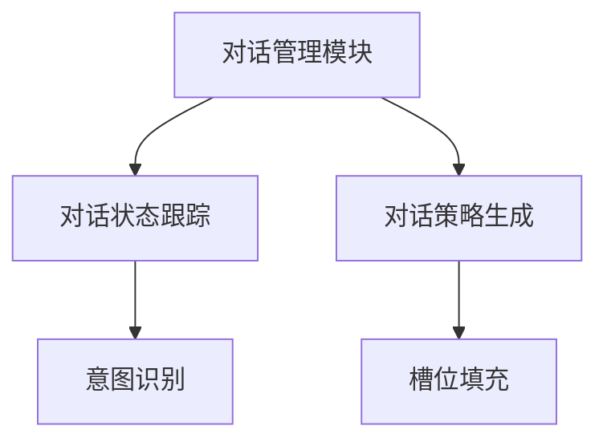

                 


# AI Agent的自适应对话管理系统

> 关键词：AI Agent，自适应对话管理，对话状态跟踪，意图识别，槽位填充，对话策略

> 摘要：本文深入探讨了AI Agent在自适应对话管理中的应用，从核心概念、算法原理到系统架构，再到项目实战，全面解析了如何实现高效、智能的对话管理系统。通过详细的技术分析和实际案例，本文为读者提供了从理论到实践的完整指南。

---

## 第1章: AI Agent与自适应对话管理概述

### 1.1 AI Agent的基本概念

#### 1.1.1 什么是AI Agent
AI Agent（人工智能代理）是指能够感知环境、自主决策并执行任务的智能实体。AI Agent可以是软件程序、机器人或其他智能系统，其核心目标是通过与环境交互来实现特定目标。

#### 1.1.2 AI Agent的分类
AI Agent可以根据智能水平、应用场景和交互方式分为以下几类：
- **反应式AI Agent**：基于当前感知做出反应，不依赖历史信息。
- **认知式AI Agent**：具备推理、规划和学习能力，能够处理复杂任务。
- **协作式AI Agent**：能够与其他Agent或人类进行协作，共同完成任务。
- **自主式AI Agent**：能够在无外部干预的情况下独立运行。

#### 1.1.3 AI Agent的核心特征
- **自主性**：能够自主决策。
- **反应性**：能够感知环境并实时响应。
- **目标导向**：以实现特定目标为导向。
- **学习能力**：能够通过经验改进性能。

### 1.2 自适应对话管理的背景与意义

#### 1.2.1 对话管理的基本概念
对话管理是指在人与机器或机器与机器之间的对话过程中，系统能够理解对话内容、跟踪对话状态，并生成合适的回复。传统的对话管理通常基于固定的规则，而现代的自适应对话管理则更加灵活，能够根据对话上下文动态调整策略。

#### 1.2.2 自适应对话管理的定义
自适应对话管理是一种动态调整对话策略和对话状态的管理方式，能够根据对话历史、用户意图和上下文信息实时优化对话流程。

#### 1.2.3 自适应对话管理的应用场景
- **智能客服**：通过自适应对话管理，智能客服能够更准确地理解用户需求，提供更高效的解决方案。
- **语音助手**：如Siri、Alexa等，通过自适应对话管理实现更自然的交互。
- **机器人对话**：在社交机器人或教育机器人中，自适应对话管理能够提升用户体验。

---

## 第2章: 自适应对话管理的核心概念

### 2.1 对话状态管理

#### 2.1.1 对话状态的定义
对话状态是指在对话过程中，系统对当前对话内容的理解和记忆。它通常包括用户意图、当前话题、上下文信息等。

#### 2.1.2 对话状态的表示方法
对话状态可以用以下几种方式表示：
- **状态机**：通过状态转移表示对话的进展。
- **上下文变量**：通过一组变量记录对话中的关键信息。
- **概率分布**：用概率模型表示对话状态的可能性。

#### 2.1.3 对话状态的更新机制
对话状态的更新通常基于用户的输入和系统生成的回复。系统通过解析用户的意图和上下文信息，动态更新对话状态。

### 2.2 意图识别与槽位填充

#### 2.2.1 意图识别的基本原理
意图识别是指通过分析用户的输入，确定用户的意图或目标。常见的意图识别方法包括基于规则的匹配和基于机器学习的分类。

#### 2.2.2 槽位填充的实现方法
槽位填充是指在识别用户意图后，提取与意图相关的具体信息（如时间、地点、人物等）。槽位填充通常基于自然语言处理技术和模式匹配。

#### 2.2.3 意图识别与槽位填充的结合
意图识别和槽位填充通常是协同工作的。系统首先识别用户的意图，然后提取与意图相关的槽位信息，以便生成更准确的回复。

### 2.3 对话策略

#### 2.3.1 对话策略的分类
对话策略可以根据目标和决策方式分为以下几类：
- **基于规则的策略**：通过预定义的规则生成回复。
- **基于模型的策略**：通过机器学习模型生成回复。
- **混合策略**：结合规则和模型的策略。

#### 2.3.2 基于规则的对话策略
基于规则的对话策略通过预定义的规则生成回复。这种方法简单易懂，适用于任务简单、规则明确的场景。

#### 2.3.3 基于模型的对话策略
基于模型的对话策略通过机器学习模型生成回复。这种方法能够处理复杂场景，但需要大量数据和计算资源。

### 2.4 本章小结

---

## 第3章: 自适应对话管理的算法原理

### 3.1 基于HMM的对话状态跟踪

#### 3.1.1 隐马尔可夫模型的基本原理
隐马尔可夫模型（HMM）是一种统计模型，常用于时间序列数据的分析。HMM假设数据是由一个隐含的状态序列生成的。

#### 3.1.2 HMM在对话状态跟踪中的应用
HMM可以用于对话状态跟踪，通过分析用户的输入和系统回复，推断对话的状态。

#### 3.1.3 HMM的优缺点分析
- **优点**：简单易懂，计算效率高。
- **缺点**：对数据的依赖性强，难以处理复杂场景。

### 3.2 基于DNN的对话状态跟踪

#### 3.2.1 深度神经网络的基本原理
深度神经网络（DNN）是一种多层神经网络，能够通过非线性变换捕捉数据的复杂特征。

#### 3.2.2 DNN在对话状态跟踪中的应用
DNN可以用于对话状态跟踪，通过分析用户的输入和系统回复，生成更准确的状态表示。

#### 3.2.3 DNN的优缺点分析
- **优点**：能够处理复杂场景，精度高。
- **缺点**：计算资源消耗大，训练时间长。

### 3.3 对比分析

#### 3.3.1 HMM与DNN的对比
- **计算效率**：HMM计算效率高，DNN计算效率低。
- **处理能力**：HMM适用于简单场景，DNN适用于复杂场景。

#### 3.3.2 适用场景分析
- **HMM适用场景**：任务简单、规则明确的对话场景。
- **DNN适用场景**：复杂、多变的对话场景。

### 3.4 本章小结

---

## 第4章: 系统架构设计

### 4.1 系统架构概述

#### 4.1.1 系统功能模块
- **对话管理模块**：负责对话状态跟踪和对话策略生成。
- **自然语言处理模块**：负责意图识别和槽位填充。
- **知识库模块**：存储对话相关知识和数据。

#### 4.1.2 系统架构图


#### 4.1.3 系统交互流程
1. 用户输入：用户输入对话内容。
2. 意图识别：系统识别用户的意图。
3. 对话状态跟踪：系统跟踪对话状态。
4. 槽位填充：系统提取槽位信息。
5. 对话策略生成：系统生成回复策略。
6. 回复生成：系统生成回复内容。
7. 反馈：用户对系统回复进行反馈。

### 4.2 系统实现细节

#### 4.2.1 对话管理模块
- **对话状态跟踪**：基于HMM或DNN实现。
- **对话策略生成**：基于规则或模型生成回复。

#### 4.2.2 自然语言处理模块
- **意图识别**：基于机器学习模型实现。
- **槽位填充**：基于模式匹配或机器学习实现。

#### 4.2.3 知识库模块
- **知识存储**：存储对话相关知识和数据。
- **知识检索**：根据对话内容检索相关知识。

### 4.3 本章小结

---

## 第5章: 项目实战

### 5.1 项目背景

#### 5.1.1 项目目标
实现一个基于自适应对话管理的智能客服系统。

#### 5.1.2 项目需求
- **用户输入**：用户输入问题。
- **意图识别**：识别用户的意图。
- **槽位填充**：提取相关槽位信息。
- **对话管理**：跟踪对话状态，生成回复。

### 5.2 环境安装

#### 5.2.1 安装Python
```bash
# 安装Python
brew install python
```

#### 5.2.2 安装依赖库
```bash
pip install numpy
pip install scikit-learn
pip install matplotlib
```

### 5.3 核心代码实现

#### 5.3.1 对话管理模块

##### 对话状态跟踪
```python
import numpy as np

def h

