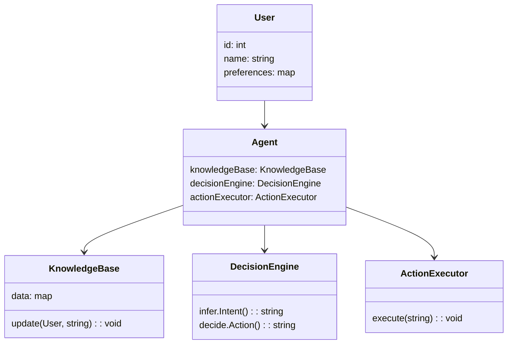
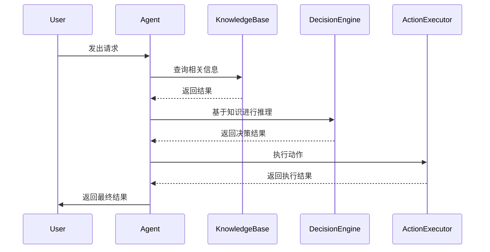

                 


# AI Agent的认知架构：模拟人类思维过程

**关键词**：AI Agent，认知架构，知识表示，推理机制，决策过程，人类思维模拟

**摘要**：本文详细探讨AI Agent的认知架构，从背景、核心概念到实现方法，系统性地分析其如何模拟人类思维过程。文章内容涵盖AI Agent的基本概念、认知架构的原理、知识表示与推理、决策机制、系统架构设计以及项目实战，帮助读者全面理解AI Agent的认知架构及其在实际应用中的表现。

---

## 第1章: AI Agent的基本概念与背景

### 1.1 AI Agent的定义与特点

#### 1.1.1 什么是AI Agent
AI Agent（人工智能代理）是指能够感知环境并采取行动以实现目标的智能实体。与传统程序不同，AI Agent具备自主性、反应性和目标导向性，能够动态适应环境的变化。

#### 1.1.2 AI Agent的核心特点
- **自主性**：AI Agent能够自主决策，无需外部干预。
- **反应性**：能够实时感知环境并做出反应。
- **目标导向性**：通过目标驱动行动，优化决策过程。
- **学习能力**：能够通过经验改进性能。

#### 1.1.3 AI Agent与传统AI的区别
传统AI依赖于固定的规则和程序，而AI Agent具备动态决策和自主学习的能力，能够适应复杂环境的变化。

---

### 1.2 AI Agent的发展历程

#### 1.2.1 AI Agent的起源
AI Agent的概念起源于20世纪50年代，早期的研究主要集中在逻辑推理和问题求解上。

#### 1.2.2 AI Agent技术的发展阶段
- **早期阶段**：基于规则的AI Agent，主要用于简单任务。
- **发展阶段**：引入机器学习和自然语言处理技术，提升智能化水平。
- **当前阶段**：结合深度学习和强化学习，实现更复杂的认知任务。

#### 1.2.3 当前AI Agent技术的现状
现代AI Agent结合了多种技术，包括自然语言处理、计算机视觉和强化学习，能够处理复杂任务。

---

### 1.3 AI Agent的应用场景

#### 1.3.1 智能助手
AI Agent在智能助手中的应用广泛，如 Siri 和 Alexa。

#### 1.3.2 智能推荐系统
基于用户行为分析的推荐系统，如 Netflix 和 Amazon 的推荐系统。

#### 1.3.3 自动驾驶中的应用
自动驾驶汽车中的路径规划和决策系统。

#### 1.3.4 其他典型应用场景
- 智能客服
- 智能监控系统
- 自动交易系统

---

## 第2章: AI Agent的认知架构原理

### 2.1 认知架构的基本概念

#### 2.1.1 认知架构的定义
认知架构是指AI Agent内部用于处理信息、推理和决策的结构和机制。

#### 2.1.2 认知架构的核心要素
- **知识表示**：AI Agent对环境和任务的理解。
- **推理机制**：基于知识做出推论。
- **决策过程**：根据推理结果做出决策。

#### 2.1.3 认知架构的层次结构
- **感知层**：处理输入数据。
- **认知层**：知识表示与推理。
- **决策层**：制定行动计划。

---

### 2.2 AI Agent的认知模型

#### 2.2.1 知识表示与推理
知识表示是AI Agent理解世界的基础，常用的方法包括符号逻辑、语义网络和知识图谱。

#### 2.2.2 感知与理解
AI Agent通过感知环境信息，如视觉、听觉等，理解当前状态。

#### 2.2.3 决策与行动
基于理解和推理结果，AI Agent制定行动计划并执行。

---

### 2.3 认知架构的数学模型

#### 2.3.1 知识表示的数学模型
知识可以表示为图结构，节点代表实体，边代表关系。

#### 2.3.2 推理机制的数学模型
推理可以基于逻辑规则，如一阶逻辑。

#### 2.3.3 决策过程的数学模型
决策可以基于概率论，如马尔可夫决策过程。

---

## 第3章: AI Agent的认知过程与人类思维的模拟

### 3.1 人类思维过程的分解

#### 3.1.1 感知与认知
人类通过感官获取信息，并在大脑中进行处理。

#### 3.1.2 学习与记忆
人类通过记忆存储信息，并通过学习不断优化认知能力。

#### 3.1.3 推理与决策
人类通过逻辑推理和经验判断做出决策。

#### 3.1.4 行为与反馈
人类根据决策结果采取行动，并根据反馈调整行为。

---

### 3.2 AI Agent如何模拟人类思维

#### 3.2.1 知识表示与人类记忆的对应
AI Agent的知识表示与人类记忆的结构化存储有相似之处。

#### 3.2.2 推理过程与人类逻辑思维的对应
AI Agent的推理机制类似于人类的逻辑推理。

#### 3.2.3 决策机制与人类决策的对应
AI Agent的决策过程基于概率论和强化学习，与人类决策有相似之处。

---

### 3.3 AI Agent认知过程的局限性

#### 3.3.1 当前AI Agent认知能力的局限
AI Agent在复杂环境下的适应性和创造力有限。

#### 3.3.2 与人类思维的差异
AI Agent缺乏情感和主观意识，无法完全模拟人类思维。

#### 3.3.3 未来发展的方向
未来AI Agent将更加注重情感计算和人机协作。

---

## 第4章: AI Agent的认知模型构建

### 4.1 知识表示与知识库设计

#### 4.1.1 知识表示的多种形式
- 符号逻辑
- 语义网络
- 知识图谱

#### 4.1.2 知识库的构建方法
- 数据抽取与清洗
- 知识融合
- 知识推理

#### 4.1.3 知识图谱的构建与应用
知识图谱通过图结构表示实体间的关系，广泛应用于搜索和推荐系统。

---

### 4.2 推理机制的设计

#### 4.2.1 逻辑推理
基于一阶逻辑的推理，适用于规则明确的任务。

#### 4.2.2 概率推理
基于贝叶斯网络的推理，适用于不确定性的环境。

#### 4.2.3 类比推理
通过类比推理解决新问题，如医疗诊断系统。

---

### 4.3 决策机制的设计

#### 4.3.1 基于规则的决策
适用于简单任务，如交通灯控制。

#### 4.3.2 基于机器学习的决策
适用于复杂任务，如自动驾驶。

#### 4.3.3 基于强化学习的决策
通过试错优化决策策略，如游戏AI。

---

## 第5章: AI Agent的系统分析与架构设计

### 5.1 问题场景介绍

#### 5.1.1 案例背景
以智能助手为例，设计一个能够理解用户需求并提供服务的AI Agent。

---

### 5.2 系统功能设计

#### 5.2.1 领域模型设计
使用Mermaid类图展示系统中的主要实体及其关系。



---

#### 5.2.2 系统架构设计
使用Mermaid架构图展示系统的整体架构。


---

#### 5.2.3 系统接口设计
使用Mermaid序列图展示系统接口的交互流程。



---

## 第6章: AI Agent的项目实战

### 6.1 环境安装

#### 6.1.1 安装Python
```bash
python --version
pip install --upgrade pip
```

#### 6.1.2 安装必要的库
```bash
pip install numpy
pip install matplotlib
pip install scikit-learn
```

---

### 6.2 系统核心实现源代码

#### 6.2.1 知识表示
```python
class KnowledgeBase:
    def __init__(self):
        self.data = {}

    def update(self, key, value):
        self.data[key] = value
```

#### 6.2.2 推理引擎
```python
class DecisionEngine:
    def __init__(self):
        pass

    def infer(self, knowledge):
        # 简单推理逻辑
        return "intent"
```

#### 6.2.3 决策过程
```python
class ActionExecutor:
    def __init__(self):
        pass

    def execute(self, action):
        print(f"执行动作：{action}")
```

---

### 6.3 代码应用解读与分析

#### 6.3.1 知识库的更新
```python
kb = KnowledgeBase()
kb.update("user preference", "movie")
```

#### 6.3.2 推理引擎的应用
```python
engine = DecisionEngine()
intent = engine.infer(kb.data)
```

#### 6.3.3 决策过程的实现
```python
action = "recommend movies"
executor = ActionExecutor()
executor.execute(action)
```

---

### 6.4 实际案例分析和详细讲解

#### 6.4.1 案例背景
设计一个简单的智能助手，能够根据用户输入推荐电影。

#### 6.4.2 案例实现
```python
# 简单的电影推荐系统
class MovieRecommendationAgent:
    def __init__(self):
        self.kb = KnowledgeBase()
        self.executor = ActionExecutor()

    def recommend_movie(self, user_info):
        # 简单的推理逻辑
        self.kb.update("user preference", user_info)
        intent = "recommend movies"
        self.executor.execute(intent)
```

#### 6.4.3 案例分析
- 知识库存储用户偏好。
- 推理引擎根据知识库内容生成推荐意图。
- 执行器根据意图执行推荐动作。

---

## 第7章: 最佳实践、小结、注意事项和拓展阅读

### 7.1 最佳实践

- **数据质量**：确保知识库中的数据准确可靠。
- **算法选择**：根据任务需求选择合适的算法。
- **系统优化**：定期优化推理和决策过程。

### 7.2 小结

本文系统性地探讨了AI Agent的认知架构，从背景、核心概念到实现方法，详细分析了其如何模拟人类思维过程。通过实际案例分析，展示了AI Agent在实际应用中的潜力。

### 7.3 注意事项

- AI Agent的决策过程依赖于数据和算法，需注意数据偏差和算法偏见。
- 在实际应用中，需考虑系统的实时性和响应速度。

### 7.4 拓展阅读

- 《人工智能：一种现代的方法》
- 《机器学习实战》
- 《深度学习》

---

## 作者

作者：AI天才研究院/AI Genius Institute  
& 禅与计算机程序设计艺术/Zen And The Art of Computer Programming

