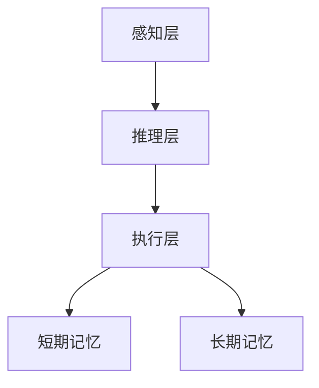

                 


# AI Agent的记忆机制：短期与长期记忆的实现

## 关键词：AI Agent, 记忆机制, 短期记忆, 长期记忆, 缓存, 持久化存储

## 摘要：AI Agent需要具备记忆能力，以便在复杂环境中进行有效决策。短期记忆和长期记忆的实现是关键，短期记忆用于处理近期信息，长期记忆用于持久存储知识。本文将详细探讨这两种记忆机制的实现方法，包括算法原理、系统架构设计和项目实战。

---

## 第1章: AI Agent与记忆机制概述

### 1.1 AI Agent的基本概念
AI Agent是一种能够感知环境、自主决策并执行任务的智能实体，广泛应用于自动驾驶、智能助手等领域。

### 1.2 记忆机制的重要性
记忆机制帮助AI Agent保留过去经验，提升决策能力。短期记忆处理即时信息，长期记忆保存持久知识。

### 1.3 短期记忆与长期记忆的定义
- **短期记忆**：临时存储最近信息，容量有限，更新快。
- **长期记忆**：持久存储重要信息，容量大，用于复杂决策。

---

## 第2章: 短期记忆机制的实现

### 2.1 短期记忆的缓存策略
- **LRU算法**：基于访问时间，淘汰最少使用的数据。
- **FIFO算法**：先进先出，按顺序淘汰数据。
- **智能型策略**：根据数据价值动态调整。

### 2.2 缓存一致性问题
- **缓存击穿**：热门数据导致缓存失效，解决方案包括互斥锁和永不过期。
- **数据一致性**：通过分布式锁和版本控制确保数据一致性。

### 2.3 短期记忆的实现代码
```python
from collections import OrderedDict

class LRU_Cache:
    def __init__(self, max_size):
        self.cache = OrderedDict()
        self.max_size = max_size

    def get(self, key):
        if key in self.cache:
            # Move to end to mark as recently used
            self.cache.move_to_end(key)
            return self.cache[key]
        return None

    def put(self, key, value):
        if key in self.cache:
            self.cache.move_to_end(key)
            self.cache[key] = value
        else:
            self.cache[key] = value
            if len(self.cache) > self.max_size:
                self.cache.popitem(last=False)
```

---

## 第3章: 长期记忆机制的实现

### 3.1 持久化存储技术
- **关系型数据库**：如MySQL，适合结构化数据存储。
- **分布式存储**：如Redis，支持大规模数据存储。
- **文件存储**：适合非结构化数据，如日志文件。

### 3.2 知识图谱构建
知识图谱通过图数据库（如Neo4j）构建，表示实体间的关系，支持高效查询。

### 3.3 长期记忆的持久化代码
```python
from neo4j import GraphDatabase

class KnowledgeGraph:
    def __init__(self, uri, user, password):
        self.driver = GraphDatabase.driver(uri, auth=(user, password))

    def save_entity(self, entity_name, properties):
        session = self.driver.session()
        session.write_transaction(lambda tx: tx.create_node('Entity', properties))
        session.close()

    def get_entity(self, entity_name):
        session = self.driver.session()
        result = session.read_transaction(lambda tx: tx.find_nodes('Entity', 'name', entity_name))
        session.close()
        return result.records
```

---

## 第4章: 短期记忆与长期记忆的结合

### 4.1 协同机制
短期记忆中的重要信息自动提升到长期记忆，长期记忆指导短期记忆的选择。

### 4.2 整合策略
- **时间戳策略**：基于时间判断信息的重要性。
- **内容相似度**：基于语义相似性进行整合。

### 4.3 动态平衡
根据任务需求调整短期和长期记忆的容量，确保高效利用。

---

## 第5章: 系统架构与设计

### 5.1 系统架构图
使用Mermaid图展示系统架构，包括感知层、推理层和执行层。



### 5.2 接口设计
- **获取短期记忆**：`get_short_term_memory(key)`
- **更新长期记忆**：`update_long_term_memory(key, value)`

### 5.3 交互流程
使用Mermaid序列图展示AI Agent与记忆机制的交互流程。

---

## 第6章: 项目实战

### 6.1 环境安装
安装Python、Redis和Neo4j，配置相关库。

### 6.2 核心代码实现
实现短期记忆的LRU缓存和长期记忆的知识图谱存储。

### 6.3 案例分析
以智能客服为例，展示短期和长期记忆的实际应用。

### 6.4 项目小结
总结实现过程，指出优化方向。

---

## 第7章: 总结与展望

### 7.1 总结
AI Agent的记忆机制分为短期和长期，各有其实现方法和应用场景。

### 7.2 展望
未来研究方向包括更智能的缓存策略和更高效的存储技术。

---

## 附录

### 附录A: 参考文献
列出相关文献和资源。

### 附录B: 工具资源
推荐相关工具和技术资源。

---

## 作者：AI天才研究院 & 禅与计算机程序设计艺术

---

通过以上章节的详细分析和代码示例，读者可以全面理解AI Agent的短期和长期记忆机制，并掌握其实现方法。

