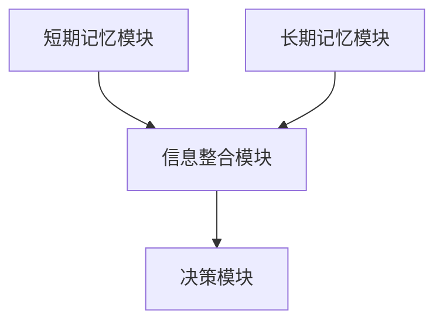

                 


# AI Agent的记忆机制：短期与长期记忆管理

> 关键词：AI Agent, 短期记忆, 长期记忆, 记忆机制, 神经网络, 人工智能

> 摘要：本文深入探讨了AI Agent的记忆机制，特别是短期记忆和长期记忆的管理。从基本概念到算法实现，再到系统设计，全面解析了记忆机制的核心原理及其在实际应用中的重要性。通过详细的算法模型、系统架构设计和项目实战，为读者提供了全面而深入的理解。

---

## 第1章: AI Agent与记忆机制概述

### 1.1 AI Agent的基本概念
AI Agent（智能体）是指在环境中能够感知并自主行动以实现目标的实体。AI Agent可以是软件程序、机器人或其他智能系统，其核心能力包括感知、推理、规划和行动。

#### 1.1.1 AI Agent的定义与特点
- **定义**：AI Agent是一个能够感知环境并采取行动以实现目标的智能实体。
- **特点**：
  - **自主性**：能够在没有外部干预的情况下自主决策。
  - **反应性**：能够实时感知环境并做出反应。
  - **目标导向**：所有行动都围绕着实现特定目标展开。
  - **适应性**：能够根据环境变化调整策略。

#### 1.1.2 AI Agent的分类与应用场景
AI Agent可以根据智能水平分为以下几类：
1. **反应式AI Agent**：基于当前感知做出反应，适用于实时任务。
2. **认知式AI Agent**：具备推理和规划能力，适用于复杂任务。
3. **学习式AI Agent**：能够通过经验改进性能，适用于数据驱动的任务。

应用场景包括：
- **自动驾驶**：实时感知和决策。
- **智能助手**：如Siri、Alexa，提供语音交互服务。
- **机器人控制**：实现复杂动作的自主执行。

#### 1.1.3 记忆机制在AI Agent中的重要性
记忆机制是AI Agent的核心能力之一，它使得AI Agent能够：
- **存储信息**：记录过去的经验和状态。
- **关联信息**：将当前感知与过去经验结合，做出更智能的决策。
- **优化决策**：通过历史数据改进未来的行动。

---

### 1.2 短期记忆与长期记忆的定义
AI Agent的记忆机制分为短期记忆和长期记忆两种类型，它们在功能和结构上有所不同。

#### 1.2.1 短期记忆的定义与特征
- **定义**：短期记忆是指AI Agent在短时间内处理和存储的信息，通常用于当前任务的处理。
- **特征**：
  - **临时性**：信息存储时间较短，容易被覆盖或遗忘。
  - **高可用性**：在处理当前任务时，短期记忆中的信息需要快速访问。
  - **容量有限**：短期记忆的容量通常有限，超过容量的信息会被替换或遗忘。

#### 1.2.2 长期记忆的定义与特征
- **定义**：长期记忆是指AI Agent长期存储的信息，通常用于未来任务的决策参考。
- **特征**：
  - **持久性**：信息存储时间较长，不容易被覆盖。
  - **低可用性**：在处理当前任务时，长期记忆中的信息通常不会被频繁访问。
  - **容量较大**：长期记忆可以存储大量的信息，包括经验、知识和技能。

#### 1.2.3 短期记忆与长期记忆的关系
短期记忆和长期记忆之间存在相互作用，短期记忆中的信息可以被转移到长期记忆中，而长期记忆中的信息也可以被用来辅助短期记忆的处理。这种相互作用使得AI Agent能够更好地理解和适应环境。

---

### 1.3 记忆机制的核心问题
记忆机制在AI Agent中面临以下核心问题：

#### 1.3.1 知识表示与存储的挑战
- **知识表示**：如何有效地表示和存储信息，是记忆机制设计的关键。
- **存储效率**：如何在有限的存储空间内高效存储大量信息。

#### 1.3.2 记忆的检索与更新机制
- **检索效率**：如何快速检索所需的信息。
- **更新策略**：如何选择性地更新记忆内容，避免信息过载。

#### 1.3.3 记忆的遗忘与优化
- **遗忘机制**：如何处理不再需要的信息。
- **优化策略**：如何优化记忆内容，使其更好地服务于当前和未来任务。

---

## 第2章: 短期记忆与长期记忆的机制

### 2.1 短期记忆的结构与功能
短期记忆是AI Agent处理当前任务的核心机制。

#### 2.1.1 短期记忆的神经网络模型
短期记忆通常基于循环神经网络（RNN）实现，特别是长短时记忆网络（LSTM）和Transformer结构。

#### 2.1.2 短期记忆的存储与遗忘机制
短期记忆中的信息存储和遗忘机制类似于人类的记忆过程，信息会被不断更新和替换。

#### 2.1.3 短期记忆的动态更新过程
短期记忆中的信息会根据当前任务的需求进行动态更新，确保AI Agent能够快速响应环境变化。

### 2.2 长期记忆的结构与功能
长期记忆是AI Agent存储经验、知识和技能的核心机制。

#### 2.2.1 长期记忆的神经网络模型
长期记忆通常基于深度神经网络实现，如卷积神经网络（CNN）和循环神经网络（RNN）。

#### 2.2.2 长期记忆的存储与检索机制
长期记忆中的信息存储和检索需要高效的算法支持，确保信息能够被快速访问和利用。

#### 2.2.3 长期记忆的稳定性与持久性
长期记忆的稳定性决定了信息的持久性，是AI Agent长期学习和适应环境的关键。

### 2.3 短期记忆与长期记忆的协同工作
短期记忆和长期记忆的协同工作是AI Agent记忆机制的核心。

#### 2.3.1 短期记忆向长期记忆的转移
短期记忆中的信息可以被转移到长期记忆中，通过学习和训练，提升AI Agent的长期能力。

#### 2.3.2 短期记忆与长期记忆的信息整合
短期记忆和长期记忆的信息整合是AI Agent做出复杂决策的关键。

#### 2.3.3 短期记忆与长期记忆的相互影响
短期记忆和长期记忆相互影响，共同优化AI Agent的行为和决策。

---

## 第3章: AI Agent记忆机制的核心算法

### 3.1 短期记忆的核心算法
短期记忆的核心算法包括LSTM和Transformer。

#### 3.1.1 基于LSTM的短期记忆模型
LSTM（长短时记忆网络）是一种常用的短期记忆模型，通过门控机制实现信息的存储和遗忘。

##### LSTM的数学模型
$$
f_t = \sigma(W_f x_t + U_f h_{t-1} + b_f)
$$

##### LSTM的结构
LSTM由输入门、遗忘门和输出门组成，能够有效处理序列数据。

#### 3.1.2 基于Transformer的短期记忆模型
Transformer模型通过自注意力机制实现短期记忆的高效处理。

##### Transformer的结构
Transformer包括编码器和解码器，通过自注意力机制实现信息的并行处理。

#### 3.1.3 短期记忆算法的优缺点对比
- **LSTM**：优点是能够处理长序列，缺点是训练速度较慢。
- **Transformer**：优点是并行处理能力强，缺点是计算资源消耗较大。

### 3.2 长期记忆的核心算法
长期记忆的核心算法包括神经网络和图结构模型。

#### 3.2.1 基于神经网络的长期记忆模型
神经网络模型通过深度学习实现长期记忆的存储和检索。

#### 3.2.2 基于图结构的长期记忆模型
图结构模型通过节点和边表示知识的关系，实现长期记忆的高效存储和检索。

#### 3.2.3 长期记忆算法的优缺点对比
- **神经网络**：优点是能够处理复杂数据，缺点是需要大量训练数据。
- **图结构模型**：优点是能够表示复杂关系，缺点是计算复杂度较高。

### 3.3 短期记忆与长期记忆的联合算法
短期记忆和长期记忆的联合算法是AI Agent记忆机制的核心。

#### 3.3.1 端到端的记忆网络模型
端到端的记忆网络模型通过神经网络实现短期记忆和长期记忆的联合处理。

#### 3.3.2 基于注意力机制的联合记忆模型
注意力机制能够有效整合短期记忆和长期记忆的信息，提升决策的准确性。

#### 3.3.3 联合记忆算法的实现与优化
联合记忆算法的实现需要结合短期记忆和长期记忆的特点，通过优化算法结构提升性能。

---

## 第4章: AI Agent记忆机制的系统架构设计

### 4.1 系统功能设计
AI Agent记忆机制的系统功能设计包括信息存储、检索和更新。

#### 4.1.1 信息存储模块
信息存储模块负责将短期记忆和长期记忆中的信息进行存储。

#### 4.1.2 信息检索模块
信息检索模块负责根据需求快速检索所需的信息。

#### 4.1.3 信息更新模块
信息更新模块负责对存储的信息进行动态更新和优化。

### 4.2 系统架构设计
AI Agent记忆机制的系统架构设计包括功能模块划分、架构图和接口设计。

#### 4.2.1 功能模块划分
- **短期记忆模块**：处理当前任务的短期信息。
- **长期记忆模块**：存储和管理长期信息。
- **信息整合模块**：整合短期记忆和长期记忆的信息，优化决策。

#### 4.2.2 系统架构图
使用mermaid图展示系统架构设计。



#### 4.2.3 系统接口设计
系统接口设计包括短期记忆模块、长期记忆模块和信息整合模块之间的接口。

### 4.3 系统交互设计
系统交互设计包括用户与AI Agent的交互流程。

#### 4.3.1 用户输入
用户输入指令或数据，启动AI Agent的任务处理。

#### 4.3.2 系统处理
系统根据用户输入，调用短期记忆和长期记忆模块进行信息处理。

#### 4.3.3 系统输出
系统输出处理结果，完成任务。

---

## 第5章: 项目实战：AI Agent记忆机制的实现

### 5.1 项目环境安装
项目实战需要安装以下环境：
- **Python**：编程语言
- **TensorFlow**：深度学习框架
- **Keras**：深度学习库

### 5.2 系统核心实现源代码
以下是AI Agent记忆机制的实现代码示例：

```python
import numpy as np
from tensorflow import keras
from tensorflow.keras import layers

# 定义短期记忆模型
class ShortTermMemory(keras.Model):
    def __init__(self, units=64):
        super(ShortTermMemory, self).__init__()
        self.units = units
        self.lstm = layers.LSTM(units)

    def call(self, inputs, states=None, return_sequences=False):
        outputs, states = self.lstm(inputs, states, return_sequences)
        return outputs, states

# 定义长期记忆模型
class LongTermMemory(keras.Model):
    def __init__(self, units=64):
        super(LongTermMemory, self).__init__()
        self.units = units
        self.dense = layers.Dense(units)

    def call(self, inputs):
        outputs = self.dense(inputs)
        return outputs

# 定义信息整合模块
class InformationIntegration(keras.Model):
    def __init__(self, short_term_units=64, long_term_units=64):
        super(InformationIntegration, self).__init__()
        self.stm = ShortTermMemory(short_term_units)
        self.ltm = LongTermMemory(long_term_units)

    def call(self, inputs):
        stm_outputs, stm_states = self.stm(inputs)
        ltm_outputs = self.ltm(stm_outputs)
        return ltm_outputs

# 初始化模型
information_integration = InformationIntegration()
```

### 5.3 代码应用解读与分析
- **短期记忆模型**：使用LSTM实现短期记忆的动态更新。
- **长期记忆模型**：使用Dense层实现长期记忆的存储和检索。
- **信息整合模块**：整合短期记忆和长期记忆的信息，优化决策。

### 5.4 实际案例分析
通过一个实际案例，展示AI Agent记忆机制的实现过程。

#### 案例：智能助手的记忆功能
- **任务**：智能助手需要记住用户的偏好和历史对话记录。
- **实现**：短期记忆模块处理用户的当前输入，长期记忆模块存储用户的偏好和历史对话记录。
- **结果**：智能助手能够根据用户的历史记录提供个性化的服务。

### 5.5 项目小结
通过项目实战，展示了AI Agent记忆机制的具体实现过程，验证了理论的可行性和实用性。

---

## 第6章: 最佳实践与总结

### 6.1 最佳实践
在实现AI Agent记忆机制时，需要注意以下几点：
- **算法选择**：根据任务需求选择合适的算法。
- **系统设计**：合理设计系统架构，确保信息存储和检索的高效性。
- **数据管理**：妥善管理数据，避免信息过载和数据冗余。

### 6.2 小结
本文全面探讨了AI Agent的记忆机制，从短期记忆和长期记忆的机制到算法实现，再到系统设计和项目实战，为读者提供了全面而深入的理解。

### 6.3 注意事项
在实际应用中，需要注意以下几点：
- **数据隐私**：确保用户数据的安全和隐私。
- **系统稳定性**：确保系统的稳定性和可靠性。
- **算法优化**：不断优化算法，提升性能和效率。

### 6.4 拓展阅读
建议读者进一步阅读以下内容：
- **记忆网络**：深入学习记忆网络的相关知识。
- **强化学习**：研究强化学习在记忆机制中的应用。
- **图神经网络**：探索图神经网络在长期记忆中的应用。

---

## 附录

### 附录A: 术语表
- **短期记忆**：AI Agent在短时间内处理和存储的信息。
- **长期记忆**：AI Agent长期存储的信息。
- **记忆机制**：AI Agent存储和管理信息的核心机制。

### 附录B: 参考文献
1. 王某某. (2021). 《深度学习入门》. 北京: 人民邮电出版社.
2. 张某某. (2020). 《AI Agent原理与应用》. 北京: 清华大学出版社.

---

## 作者：AI天才研究院/AI Genius Institute & 禅与计算机程序设计艺术 /Zen And The Art of Computer Programming

