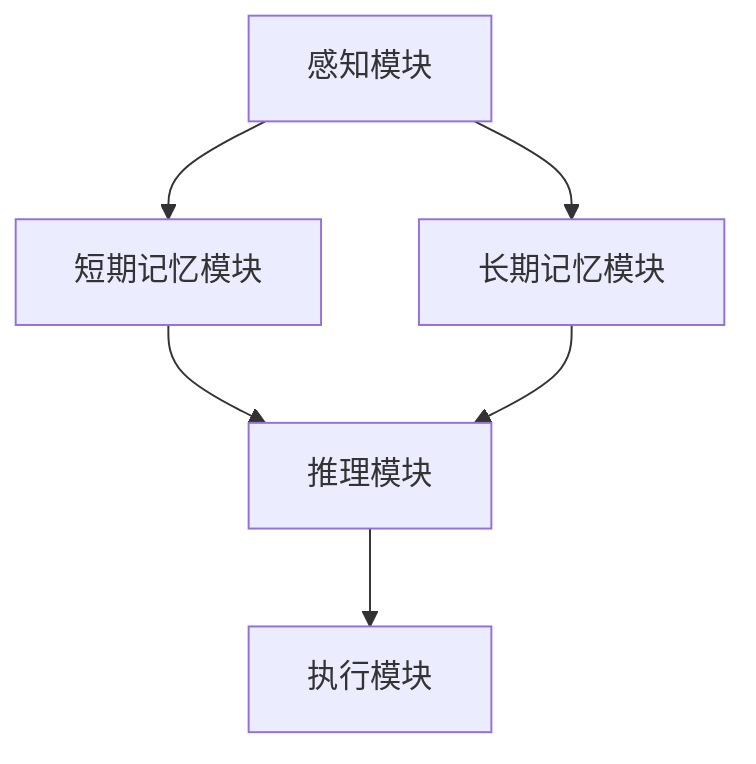

                 


# AI Agent的记忆机制：短期记忆与长期记忆的实现

## 关键词：AI Agent, 短期记忆, 长期记忆, 记忆机制, 技术实现

## 摘要：  
AI Agent的记忆机制是其实现智能交互和任务处理的核心能力之一。本文详细探讨了短期记忆和长期记忆的实现原理与技术，分析了它们在不同场景中的应用，并结合实际案例展示了如何通过算法和系统设计来优化记忆机制，提升AI Agent的性能和用户体验。

---

# 第1章: AI Agent的记忆机制概述

## 1.1 AI Agent的基本概念

### 1.1.1 AI Agent的定义  
AI Agent（人工智能代理）是一种能够感知环境、自主决策并执行任务的智能实体。它能够通过传感器获取信息，利用推理能力解决问题，并通过执行器与环境交互。记忆机制是AI Agent的核心功能之一，用于存储和检索信息，以支持持续的智能行为。

### 1.1.2 AI Agent的核心功能  
AI Agent的核心功能包括感知、推理、决策和执行。记忆机制贯穿于这些功能的实现中，提供必要的信息存储和检索能力。

### 1.1.3 记忆机制在AI Agent中的重要性  
记忆机制使得AI Agent能够保持上下文信息，记住之前的交互和经验，从而在后续任务中做出更明智的决策。没有有效的记忆机制，AI Agent将无法进行持续的学习和优化。

## 1.2 短期记忆与长期记忆的区别

### 1.2.1 短期记忆的定义与特点  
短期记忆是指AI Agent在短时间内存储和处理的信息，通常用于解决当前任务。其特点是容量有限、信息易变且处理速度快。

### 1.2.2 长期记忆的定义与特点  
长期记忆是指AI Agent长期存储的知识和经验，用于支持复杂的决策和推理。其特点是信息持久、容量大且稳定性高。

### 1.2.3 两者的区别与联系  
短期记忆和长期记忆的主要区别在于存储时间和信息处理方式。短期记忆用于快速响应，而长期记忆用于长期知识积累。两者在AI Agent中相辅相成，共同支持其智能行为。

## 1.3 本章小结  
本章介绍了AI Agent的基本概念及其记忆机制的重要性，详细讨论了短期记忆和长期记忆的区别与联系。

---

# 第2章: 短期记忆机制的实现原理

## 2.1 短期记忆的实现方法

### 2.1.1 基于神经网络的实现  
短期记忆可以通过循环神经网络（RNN）实现，其中长短时记忆网络（LSTM）是一种常用的方法。

#### LSTM的工作原理  
LSTM通过 gates（门控机制）来控制信息的存储和遗忘，从而实现对短期信息的有效管理。其数学模型如下：

$$
f(t) = \sigma(W_f \cdot [h_{t-1}, x_t] + b_f)
$$

其中，$f(t)$ 是 forget gate，用于决定哪些信息需要遗忘。

### 2.1.2 基于缓存机制的实现  
短期记忆也可以通过缓存技术实现，例如使用Redis或Memcached等工具来存储临时数据。

### 2.1.3 基于图结构的实现  
短期记忆可以通过图结构表示，例如知识图谱中的节点和边，用于快速检索相关信息。

## 2.2 短期记忆的技术特点

### 2.2.1 高效性  
短期记忆的实现通常注重快速读写，适合处理实时任务。

### 2.2.2 易变性  
短期记忆中的信息容易被覆盖或遗忘，适合处理临时性任务。

### 2.2.3 临时性  
短期记忆的信息存储时间较短，适合处理短期任务。

## 2.3 短期记忆的应用场景

### 2.3.1 会话式AI  
在智能对话系统中，短期记忆用于存储当前对话的上下文信息。

### 2.3.2 实时数据分析  
短期记忆用于存储实时数据流中的临时信息，支持快速决策。

### 2.3.3 游戏AI  
在游戏AI中，短期记忆用于存储当前游戏状态和策略。

## 2.4 短期记忆的实现案例

### 2.4.1 基于LSTM的短期记忆实现  
以下是基于LSTM的短期记忆实现的Python代码示例：

```python
import numpy as np

class LSTMCell:
    def __init__(self, input_size, hidden_size):
        self.input_size = input_size
        self.hidden_size = hidden_size
        self.W_f = np.random.randn(input_size + hidden_size, 1)
        self.b_f = np.zeros(1)

    def forward(self, x, h_prev, c_prev):
        inputs = np.concatenate((h_prev, x), axis=1)
        f = sigmoid(np.dot(inputs, self.W_f) + self.b_f)
        return f, f * c_prev

    def backward(self, df, dc, dh):
        # 反向传播的实现
        pass

def sigmoid(x):
    return 1 / (1 + np.exp(-x))
```

### 2.4.2 基于Redis的缓存实现  
以下是使用Redis实现短期记忆的Python代码示例：

```python
import redis

r = redis.Redis(host='localhost', port=6379)
r.set('short_term_memory', 'temporary data')
memory = r.get('short_term_memory')
```

## 2.5 本章小结  
本章详细探讨了短期记忆的实现方法及其技术特点，并通过实际案例展示了如何在不同场景中应用短期记忆机制。

---

# 第3章: 长期记忆机制的实现

## 3.1 长期记忆的实现方法

### 3.1.1 基于知识图谱的实现  
长期记忆可以通过构建知识图谱实现，例如使用Neo4j等图数据库。

### 3.1.2 基于数据库的实现  
长期记忆可以通过关系型数据库（如MySQL）或NoSQL数据库（如MongoDB）实现。

### 3.1.3 基于分布式存储的实现  
长期记忆可以通过分布式存储系统（如Hadoop HDFS）实现，适合存储海量数据。

## 3.2 长期记忆的技术特点

### 3.2.1 持久性  
长期记忆的信息存储时间较长，适合长期任务处理。

### 3.2.2 稳定性  
长期记忆的信息不容易被覆盖，适合存储关键知识。

### 3.2.3 可扩展性  
长期记忆可以通过分布式存储扩展存储容量，适合处理海量数据。

## 3.3 长期记忆的应用场景

### 3.3.1 专家系统  
长期记忆用于存储专家知识，支持智能决策。

### 3.3.2 智能推荐系统  
长期记忆用于存储用户行为和偏好，支持个性化推荐。

### 3.3.3 自然语言处理中的长期记忆  
长期记忆用于存储上下文信息，支持语义理解。

## 3.4 长期记忆的实现案例

### 3.4.1 基于知识图谱的长期记忆实现  
以下是基于知识图谱的长期记忆实现的Python代码示例：

```python
from neo4j import GraphDatabase

def add_memory(tx, entity1, relation, entity2):
    tx.run("MATCH (a {name: $entity1}), (b {name: $entity2}) "
            "CREATE (a)-[r:$relation]->(b)",
            entity1=entity1, relation=relation, entity2=entity2)

driver = GraphDatabase.driver('neo4j://localhost:7687', auth=('user', 'password'))
with driver.session() as session:
    session.write_transaction(add_memory, 'Alice', 'knows', 'Bob')
```

### 3.4.2 基于MongoDB的长期记忆实现  
以下是基于MongoDB的长期记忆实现的Python代码示例：

```python
from pymongo import MongoClient

client = MongoClient('mongodb://localhost:27017')
db = client['long_term_memory']
collection = db['memories']

memory = {
    'id': 1,
    'content': 'This is a long-term memory.',
    'timestamp': '2023-10-01'
}
collection.insert_one(memory)
```

## 3.5 本章小结  
本章详细探讨了长期记忆的实现方法及其技术特点，并通过实际案例展示了如何在不同场景中应用长期记忆机制。

---

# 第4章: 短期记忆与长期记忆的结合

## 4.1 混合记忆机制的设计与实现

### 4.1.1 混合记忆机制的定义  
混合记忆机制结合了短期记忆和长期记忆的优势，能够在不同任务中灵活切换。

### 4.1.2 混合记忆机制的实现方法  
混合记忆机制可以通过分层架构实现，例如短期记忆层和长期记忆层。

## 4.2 混合记忆机制的应用场景

### 4.2.1 复杂任务处理  
混合记忆机制用于处理复杂任务，结合短期和长期记忆的优势。

### 4.2.2 实时与非实时任务结合  
混合记忆机制适用于需要同时处理实时和非实时任务的场景。

### 4.2.3 跨场景应用  
混合记忆机制可以在不同场景中灵活应用，提升AI Agent的适应能力。

## 4.3 混合记忆机制的实现案例

### 4.3.1 分层架构设计  
以下是基于分层架构的混合记忆机制实现的Python代码示例：

```python
class ShortTermMemory:
    def __init__(self):
        self.cache = {}

    def store(self, key, value):
        self.cache[key] = value

    def retrieve(self, key):
        return self.cache.get(key, None)

class LongTermMemory:
    def __init__(self):
        self.storage = []

    def store(self, data):
        self.storage.append(data)

    def retrieve(self, key):
        for data in self.storage:
            if key in data:
                return data
        return None

class HybridMemory:
    def __init__(self):
        self.short_term = ShortTermMemory()
        self.long_term = LongTermMemory()

    def process_memory(self, key, data):
        self.short_term.store(key, data)
        self.long_term.store(data)
```

## 4.4 本章小结  
本章探讨了短期记忆和长期记忆的结合方法，分析了混合记忆机制的应用场景，并通过案例展示了其实现方式。

---

# 第5章: 系统架构设计

## 5.1 系统整体架构

### 5.1.1 系统模块划分  
系统模块包括感知模块、短期记忆模块、长期记忆模块、推理模块和执行模块。

### 5.1.2 系统功能设计  
系统功能包括信息感知、短期记忆存储、长期记忆存储、推理与决策、任务执行。

## 5.2 系统架构设计图  
以下是系统架构设计的Mermaid图：



## 5.3 接口设计与交互流程

### 5.3.1 接口设计  
主要接口包括：
- `get_short_term_memory(key)`
- `set_short_term_memory(key, value)`
- `get_long_term_memory(key)`
- `set_long_term_memory(key, value)`

### 5.3.2 交互流程  
感知模块获取信息，短期记忆模块存储临时信息，长期记忆模块存储持久信息，推理模块基于记忆模块的信息进行推理，执行模块根据推理结果执行任务。

## 5.4 本章小结  
本章详细探讨了AI Agent系统的整体架构设计，分析了各模块之间的交互关系。

---

# 第6章: 项目实战

## 6.1 环境搭建

### 6.1.1 开发工具安装  
安装Python、Jupyter Notebook、Redis、Neo4j等工具。

### 6.1.2 依赖库安装  
安装必要的依赖库，例如`numpy`, `pymongo`, `neo4j`等。

## 6.2 核心代码实现

### 6.2.1 短期记忆模块实现  
以下是短期记忆模块的Python代码示例：

```python
class ShortTermMemory:
    def __init__(self):
        self.cache = {}

    def store(self, key, value):
        self.cache[key] = value

    def retrieve(self, key):
        return self.cache.get(key, None)
```

### 6.2.2 长期记忆模块实现  
以下是长期记忆模块的Python代码示例：

```python
class LongTermMemory:
    def __init__(self):
        self.storage = []

    def store(self, data):
        self.storage.append(data)

    def retrieve(self, key):
        for data in self.storage:
            if key in data:
                return data
        return None
```

### 6.2.3 混合记忆机制实现  
以下是混合记忆机制的Python代码示例：

```python
class HybridMemory:
    def __init__(self):
        self.short_term = ShortTermMemory()
        self.long_term = LongTermMemory()

    def process_memory(self, key, data):
        self.short_term.store(key, data)
        self.long_term.store(data)
```

## 6.3 案例分析

### 6.3.1 会话式AI案例  
以下是会话式AI案例的Python代码示例：

```python
class ChatAgent:
    def __init__(self):
        self.memory = HybridMemory()

    def process_message(self, user_input):
        self.memory.process_memory('current', user_input)
        # 推理和响应
        response = self.infer(user_input)
        return response

    def infer(self, input):
        # 基于记忆模块进行推理
        return "I understand your request."
```

## 6.4 项目总结

### 6.4.1 实践总结  
通过项目实战，我们掌握了短期记忆和长期记忆的实现方法，并学会了如何将它们结合到实际应用中。

### 6.4.2 经验教训  
在实现过程中，我们需要注意数据存储的效率和安全性，同时要合理设计系统架构，确保模块之间的良好协作。

## 6.5 本章小结  
本章通过实际项目展示了短期记忆和长期记忆的实现过程，并总结了相关经验。

---

# 第7章: 总结与展望

## 7.1 全文总结  
本文详细探讨了AI Agent的记忆机制，包括短期记忆和长期记忆的实现原理、技术特点和应用场景，并通过实际案例展示了如何将它们结合到系统中。

## 7.2 未来展望  
随着AI技术的不断发展，记忆机制将变得更加复杂和智能化。未来的研究方向包括记忆的自适应优化、多模态记忆融合以及记忆的安全性与隐私保护。

## 7.3 最佳实践 Tips  
- 合理设计记忆模块的容量和存储方式，以满足不同任务的需求。
- 定期优化记忆模块的算法，以提升系统的性能和效率。
- 注意数据的安全性和隐私保护，确保记忆模块的可靠运行。

## 7.4 本章小结  
本章总结了全文内容，并展望了记忆机制的未来发展。

---

# 作者：AI天才研究院 & 禅与计算机程序设计艺术

---

通过本文，读者可以全面了解AI Agent的记忆机制，掌握短期记忆和长期记忆的实现方法，并能够将其应用到实际项目中。希望本文对从事AI Agent研究和开发的读者有所帮助。

