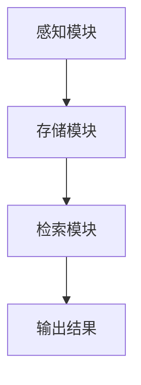
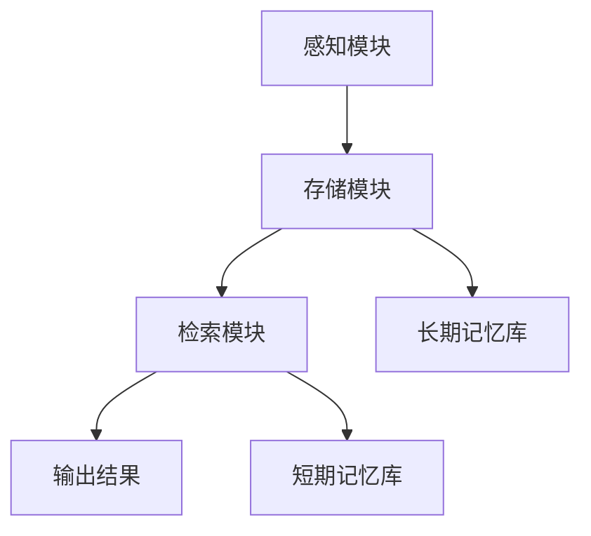
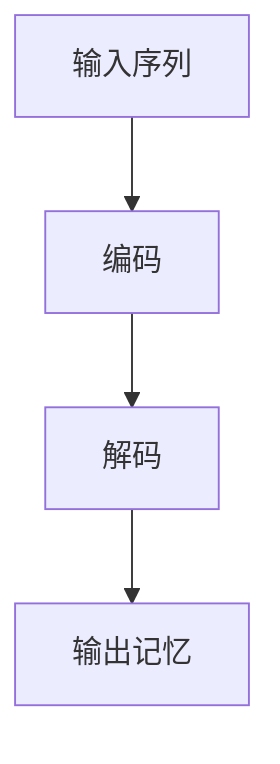
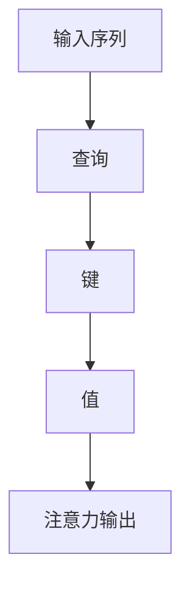
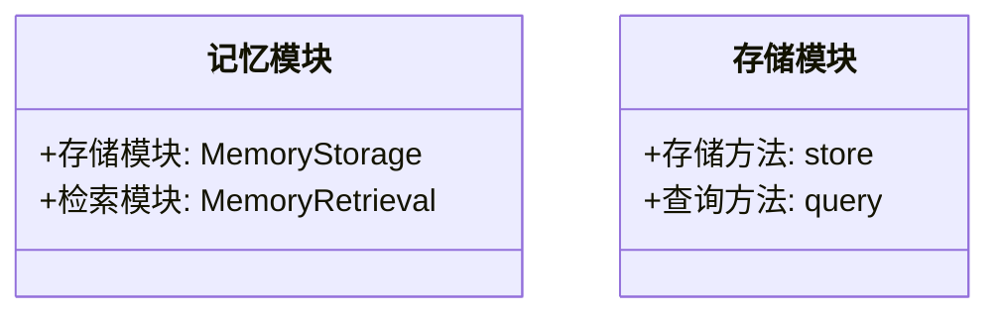
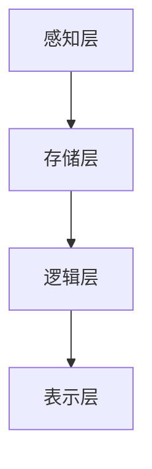
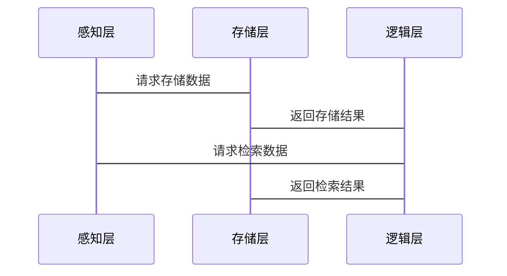

                 


# AI Agent的记忆机制：设计与实现

**关键词：** AI Agent, 记忆机制, 知识存储, 算法原理, 系统架构, 项目实战

**摘要：**  
本文系统地探讨了AI Agent的记忆机制的设计与实现，从核心概念、算法原理到系统架构，结合实际案例进行深入分析。文章首先介绍了AI Agent记忆机制的背景和基本概念，然后详细阐述了记忆机制的核心原理和算法实现，接着从系统架构的角度分析了记忆机制的实现方案，最后通过项目实战展示了记忆机制的应用，并总结了最佳实践和未来发展方向。

---

# 第1章: AI Agent与记忆机制的背景介绍

## 1.1 问题背景与描述
### 1.1.1 AI Agent的基本概念
AI Agent（智能体）是指在环境中能够感知并自主行动以实现目标的实体。记忆机制是AI Agent的核心能力之一，用于存储和检索相关信息，支持其决策和行动。

### 1.1.2 记忆机制在AI Agent中的作用
记忆机制使AI Agent能够记住过去的交互、环境状态和任务相关信息，从而提高其智能性和适应性。

### 1.1.3 当前AI Agent记忆机制的挑战与问题
当前记忆机制面临的主要挑战包括信息存储的效率、信息检索的准确性以及多模态数据的整合等问题。

## 1.2 问题解决与边界定义
### 1.2.1 AI Agent记忆机制的核心目标
记忆机制的核心目标是实现高效的信息存储和检索，支持AI Agent的持续学习和自适应能力。

### 1.2.2 记忆机制的边界与外延
记忆机制的边界包括信息存储的范围、存储的粒度以及检索的精度。外延则涉及与其他AI模块（如感知和决策模块）的协同工作。

### 1.2.3 相关概念的对比分析
| 概念 | 描述 | 区别 |
|------|------|------|
| 知识存储 | 存储结构化或非结构化知识 | 侧重于信息的组织和检索 |
| 状态记忆 | 存储环境状态 | 侧重于实时状态的更新 |
| 长期记忆 | 存储持久性信息 | 侧重于长期信息的保留和检索 |

## 1.3 核心概念与结构
### 1.3.1 记忆机制的组成要素
记忆机制由感知模块、存储模块和检索模块组成，分别负责信息的输入、存储和输出。

### 1.3.2 实体关系图（ER图）设计


## 1.4 本章小结
本章介绍了AI Agent记忆机制的背景、作用和挑战，并通过对比分析和ER图设计，明确了记忆机制的核心概念和组成结构。

---

# 第2章: AI Agent记忆机制的核心原理

## 2.1 记忆机制的基本原理
### 2.1.1 基于神经网络的记忆模型
基于神经网络的记忆模型，如LSTM和Transformer，通过循环结构或注意力机制实现信息的记忆和检索。

### 2.1.2 基于符号逻辑的记忆模型
基于符号逻辑的记忆模型通过规则和语义网络实现信息的存储和推理。

### 2.1.3 混合记忆模型的优缺点
混合记忆模型结合了神经网络和符号逻辑的优点，但在实现复杂性和计算效率上存在一定挑战。

## 2.2 记忆机制的实现方式
### 2.2.1 基于图结构的知识存储
通过图结构存储知识，节点表示实体，边表示实体之间的关系，支持复杂的关联推理。

### 2.2.2 基于向量空间的表示方法
向量空间模型将信息表示为高维向量，通过向量的相似度计算实现信息检索。

### 2.2.3 基于时间序列的记忆回放
时间序列记忆回放通过顺序回放历史数据，增强模型对时间依赖关系的学习能力。

## 2.3 核心概念的联系与对比
### 2.3.1 不同记忆机制的对比分析
| 方法 | 优点 | 缺点 |
|------|------|------|
| LSTM | 长期依赖关系处理能力强 | 易遗忘旧信息 |
| Transformer | 并行计算效率高 | 对长序列处理效果差 |
| 图神经网络 | 支持复杂关联推理 | 计算复杂度高 |

### 2.3.2 实体关系图（ER图）的优化设计


## 2.4 本章小结
本章详细阐述了AI Agent记忆机制的核心原理，包括基于神经网络、符号逻辑和混合模型的实现方式，并通过对比分析和ER图优化设计，明确了不同记忆机制的特点和适用场景。

---

# 第3章: AI Agent记忆机制的算法原理

## 3.1 算法原理概述
### 3.1.1 基于LSTM的序列记忆模型
LSTM通过记忆门控机制，有效捕捉序列数据中的长期依赖关系。

### 3.1.2 基于Transformer的注意力机制
Transformer通过自注意力机制，实现对输入序列中关键信息的聚焦。

### 3.1.3 基于图神经网络的知识图谱记忆
图神经网络通过节点嵌入和边关系建模，支持复杂知识图谱的推理和检索。

## 3.2 算法流程图设计
### 3.2.1 基于LSTM的记忆模型流程图


### 3.2.2 基于Transformer的注意力机制流程图


## 3.3 数学模型与公式
### 3.3.1 LSTM的记忆门控机制
$$ f_{\text{ gates}}(x_t, h_{t-1}) = \sigma(W_x x_t + W_h h_{t-1} + b) $$
其中，$\sigma$表示sigmoid函数，$W_x$和$W_h$是参数矩阵，$b$是偏置项。

### 3.3.2 注意力机制的权重计算
$$ \text{softmax}(\frac{q \cdot k^T}{\sqrt{d}}) $$
其中，$q$是查询向量，$k$是键向量，$d$是向量维度。

## 3.4 本章小结
本章通过详细讲解LSTM、Transformer和图神经网络的算法原理，结合流程图和数学公式，展示了记忆机制的核心实现方法。

---

# 第4章: AI Agent记忆机制的系统架构设计

## 4.1 系统分析与功能设计
### 4.1.1 问题场景介绍
AI Agent需要在复杂环境中完成任务，如智能客服、自动驾驶等，需要高效的内存存取机制。

### 4.1.2 系统功能需求
- 信息存储与检索
- 知识表示与推理
- 时间序列数据处理

### 4.1.3 领域模型（类图设计）


## 4.2 系统架构设计
### 4.2.1 分层架构设计
- 数据层：负责数据的存储和管理
- 逻辑层：负责业务逻辑的实现
- 表示层：负责用户交互和结果展示

### 4.2.2 系统架构图（Mermaid）


## 4.3 系统接口与交互
### 4.3.1 系统接口设计
- API接口：提供RESTful API，支持HTTP请求
- 数据接口：支持JSON格式的数据交互

### 4.3.2 交互流程（Mermaid序列图）


## 4.4 本章小结
本章通过系统架构设计，明确了记忆机制在AI Agent中的实现方式，包括分层架构、接口设计和交互流程。

---

# 第5章: AI Agent记忆机制的项目实战

## 5.1 项目环境与工具安装
### 5.1.1 开发环境配置
- 操作系统：Linux/Windows/macOS
- 开发工具：PyCharm/VS Code
- 依赖库安装：numpy, pandas, scikit-learn, pytorch

## 5.2 核心代码实现
### 5.2.1 LSTM模型实现
```python
import torch
import torch.nn as nn

class LSTMModel(nn.Module):
    def __init__(self, input_size, hidden_size):
        super(LSTMModel, self).__init__()
        self.lstm = nn.LSTM(input_size, hidden_size)
        self.hidden_size = hidden_size

    def forward(self, input):
        outputs, (hn, cn) = self.lstm(input)
        return outputs
```

### 5.2.2 注意力机制实现
```python
import torch
import torch.nn as nn

class AttentionModel(nn.Module):
    def __init__(self, input_size, hidden_size):
        super(AttentionModel, self).__init__()
        self.query = nn.Linear(input_size, hidden_size)
        self.key = nn.Linear(input_size, hidden_size)
        self.value = nn.Linear(input_size, hidden_size)

    def forward(self, x):
        q = self.query(x)
        k = self.key(x)
        v = self.value(x)
        attn_weights = nn.functional.softmax((q @ k.transpose(-1, -2)) / (hidden_size ** 0.5), dim=-1)
        output = (attn_weights @ v)
        return output
```

## 5.3 项目案例分析与实现
### 5.3.1 案例分析
以智能客服系统为例，设计一个基于记忆机制的对话历史存储与检索系统。

### 5.3.2 实现步骤
1. 数据预处理：将对话历史转换为向量表示
2. 模型训练：训练记忆模型，实现对话历史的存储和检索
3. 系统集成：将记忆模块集成到智能客服系统中，实现对话历史的实时更新和检索

## 5.4 项目优化与测试
### 5.4.1 性能优化
- 使用缓存技术优化检索速度
- 采用分布式存储提高存储效率

### 5.4.2 测试与验证
- 功能测试：验证记忆模块的存储和检索功能
- 性能测试：测试系统的处理能力和响应时间

## 5.5 本章小结
本章通过项目实战，展示了记忆机制在实际应用中的实现过程，包括环境配置、代码实现和案例分析。

---

# 第6章: AI Agent记忆机制的最佳实践与优化

## 6.1 最佳实践 tips
### 6.1.1 系统设计中的注意事项
- 合理设计存储结构，避免数据冗余
- 优化检索算法，提高检索效率
- 定期清理无效数据，减少存储压力

### 6.1.2 代码实现中的注意事项
- 使用高效的数据结构，如哈希表和树结构
- 采用异步处理，提高系统性能
- 注意数据安全，防止数据泄露

## 6.2 性能优化与扩展
### 6.2.1 基于分布式存储的扩展
通过分布式存储技术，提升系统的存储容量和访问速度。

### 6.2.2 基于并行计算的优化
利用多线程和多进程技术，提高系统的计算效率。

## 6.3 拓展阅读
### 6.3.1 相关技术领域
- 分布式系统
- 大数据存储
- 机器学习

### 6.3.2 推荐书籍与论文
- 《分布式系统：概念与设计》
- 《深度学习》

## 6.4 本章小结
本章总结了AI Agent记忆机制在设计和实现中的最佳实践，提出了性能优化和扩展的建议，并推荐了相关领域的拓展学习内容。

---

# 第7章: 总结与展望

## 7.1 内容总结
本文系统地探讨了AI Agent记忆机制的设计与实现，从背景介绍、核心原理到系统架构和项目实战，全面阐述了记忆机制的关键技术。

## 7.2 未来展望
未来，随着AI技术的不断发展，记忆机制将在以下几个方面得到进一步优化：
1. **高效存储技术**：探索新型存储介质和存储算法，提升信息存储效率。
2. **智能检索算法**：研究更高效的检索算法，提高信息检索的准确性和速度。
3. **多模态数据整合**：实现对文本、图像、语音等多种数据的整合存储和检索。

## 7.3 展望与挑战
AI Agent记忆机制的发展将面临更多复杂场景的挑战，如动态环境下的自适应学习、多模态数据的高效处理等。

## 7.4 本章小结
本章总结了全文的主要内容，并展望了记忆机制在未来的发展方向和挑战。

---

# 作者：AI天才研究院/AI Genius Institute & 禅与计算机程序设计艺术 /Zen And The Art of Computer Programming

