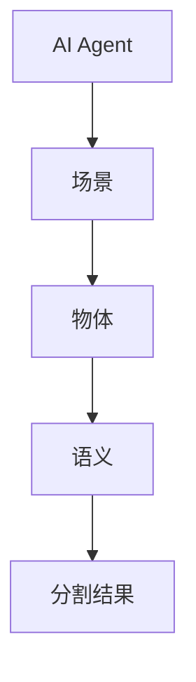
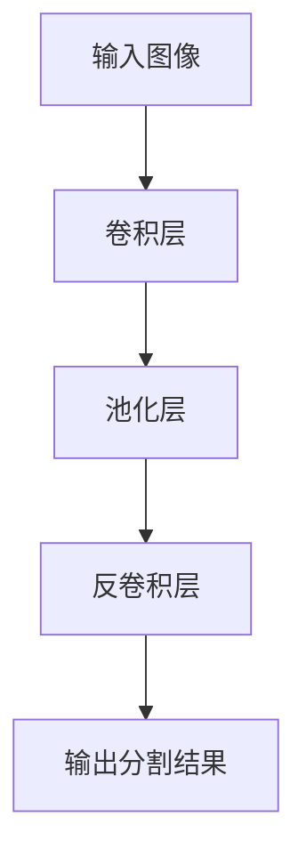
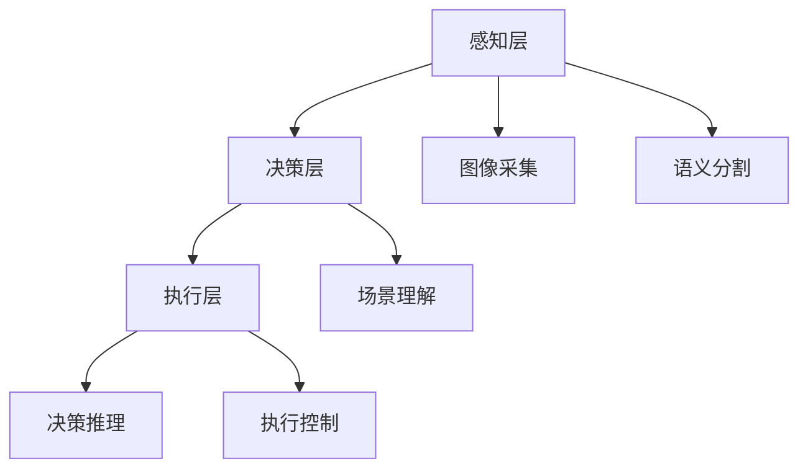

                 


# AI Agent的语义分割与场景理解

> 关键词：AI Agent，语义分割，场景理解，计算机视觉，深度学习

> 摘要：本文深入探讨AI Agent在语义分割与场景理解中的应用，从核心概念到算法原理，再到系统架构和项目实战，全面解析如何通过这些技术提升AI Agent的智能水平。文章内容详实，逻辑清晰，结合理论与实践，为读者提供有价值的指导和参考。

---

## 第一部分: AI Agent的语义分割与场景理解概述

### 第1章: AI Agent与语义分割概述

#### 1.1 AI Agent的基本概念
AI Agent（人工智能代理）是指在计算机系统中，能够感知环境、自主决策并执行任务的智能实体。它可以是一个软件程序，也可以是一个物理设备，其核心目标是通过感知和行动与环境交互，完成特定任务。

**1.1.1 AI Agent的定义**  
AI Agent是一种能够感知环境、理解任务需求，并通过自主决策和行动来实现目标的智能系统。它可以分为**反应式代理**（基于当前感知做出反应）和**认知式代理**（具备推理和规划能力）。

**1.1.2 AI Agent的核心特征**  
- **自主性**：无需外部干预，自主决策。
- **反应性**：能够感知环境并实时调整行为。
- **目标导向性**：所有行动均以实现特定目标为导向。
- **学习能力**：通过经验改进性能。

**1.1.3 AI Agent的应用场景**  
AI Agent广泛应用于自动驾驶、智能助手、机器人、推荐系统等领域。例如，自动驾驶中的AI Agent需要实时感知道路、车辆和行人，做出决策并执行驾驶动作。

---

#### 1.2 语义分割的基本概念
语义分割是计算机视觉领域的重要任务，旨在为图像中的每个像素分配一个类别标签，例如“人”、“车”、“树”等。它是实现AI Agent场景理解的关键技术之一。

**1.2.1 什么是语义分割**  
语义分割不仅关注“是什么”（目标检测），还关注“在哪里”（像素级分割）。例如，在一张城市道路图像中，语义分割不仅要识别出“车”，还要标出车在图像中的具体位置。

**1.2.2 语义分割的关键技术**  
- **卷积神经网络（CNN）**：通过多层卷积提取图像特征。
- **反卷积（上采样）**：将特征图恢复到原图分辨率。
- **损失函数**：如交叉熵损失、Dice损失等。

**1.2.3 语义分割的应用领域**  
- **自动驾驶**：识别道路、车辆、行人等。
- **医学图像分析**：分割肿瘤、器官等。
- **视频监控**：识别和跟踪目标。

---

#### 1.3 场景理解的基本概念
场景理解是指AI Agent能够理解图像中多个物体之间的关系及其上下文信息，从而更好地完成任务。

**1.3.1 场景理解的定义**  
场景理解是通过分析图像中的物体、场景和上下文信息，推断出场景的整体含义。例如，在一张厨房图像中，场景理解不仅要知道有“炉子”和“水槽”，还要理解它们的位置关系。

**1.3.2 场景理解的核心任务**  
- **场景解析**：识别图像中的物体并标注。
- **场景重建**：构建场景的3D模型。
- **场景推理**：理解场景中物体之间的关系。

**1.3.3 场景理解的应用价值**  
- **增强AI Agent的决策能力**：通过理解场景，AI Agent可以做出更合理的决策。
- **提升用户体验**：在智能助手、AR/VR等领域提供更个性化的服务。

---

#### 1.4 本章小结
本章介绍了AI Agent、语义分割和场景理解的基本概念，并分析了它们在实际应用中的重要性。AI Agent需要通过语义分割和场景理解来实现更高级的智能任务。

---

## 第二部分: AI Agent的语义分割与场景理解的核心概念

### 第2章: 语义分割与场景理解的核心概念

#### 2.1 语义分割与场景理解的关系
语义分割是场景理解的基础，而场景理解为语义分割提供了上下文信息。两者相互依存，共同提升AI Agent的感知能力。

**2.1.1 语义分割在场景理解中的作用**  
语义分割为场景理解提供了精确的像素级分割信息，帮助AI Agent更好地理解场景内容。

**2.1.2 场景理解对语义分割的提升**  
场景理解通过分析上下文信息，可以提高语义分割的准确率，尤其是在处理遮挡和模糊区域时。

---

#### 2.2 语义分割与目标检测的对比
语义分割和目标检测都是计算机视觉中的关键任务，但两者在目标定位和分割方式上有显著区别。

**2.2.1 语义分割与目标检测的区别**  
| 比较项 | 语义分割 | 目标检测 |
|--------|----------|----------|
| 输出形式 | 像素级分割 | 区域级检测 |
| 精度要求 | 高 | 中 |
| 应用场景 | 细粒度分析 | 快速定位 |

**2.2.2 语义分割与目标检测的联系**  
语义分割可以看作是目标检测的“升级版”，因为它不仅识别目标，还标注目标的具体位置。

---

#### 2.3 场景理解的层次模型
场景理解可以分为多个层次，从低级的特征提取到高级的语义分析。

**2.3.1 基于层次的场景理解模型**  
- **低级层次**：提取颜色、纹理等特征。
- **中级层次**：识别物体和区域。
- **高级层次**：理解场景语义。

**2.3.2 场景理解的层次划分**  
场景理解是一个逐步递进的过程，从感知到理解，需要多个层次的协同工作。

---

#### 2.4 核心概念对比表格
| 概念 | 语义分割 | 场景理解 |
|------|----------|----------|
| 定义 | 像素级分类 | 上下文理解 |
| 输入 | 图像 | 图像+上下文 |
| 输出 | 类别标签 | 场景描述 |

---

#### 2.5 ER实体关系图


---

#### 2.6 本章小结
本章详细分析了语义分割与场景理解的核心概念，并通过对比和图表展示了它们之间的关系。理解这些概念是实现AI Agent语义分割与场景理解的关键。

---

## 第三部分: AI Agent的语义分割与场景理解的算法原理

### 第3章: 语义分割算法原理

#### 3.1 基于CNN的语义分割
基于卷积神经网络的语义分割是目前最常用的实现方式。

**3.1.1 卷积神经网络简介**  
CNN通过多层卷积提取图像特征，每一层的输出表示不同层次的特征。

**3.1.2 基于CNN的语义分割流程**  
1. **特征提取**：通过CNN提取图像特征。
2. **上采样**：将特征图恢复到原图分辨率。
3. **像素分类**：对每个像素进行分类。

---

#### 3.2 FCN网络结构
FCN（全卷积网络）是一种经典的语义分割模型。

**3.2.1 FCN的网络架构**  
FCN通过移除全连接层，将CNN转换为全卷积网络，从而实现像素级分割。

**3.2.2 FCN的反卷积层**  
反卷积层（Deconvolution）用于将特征图恢复到原图分辨率。

---

#### 3.3 U-Net模型
U-Net是一种广泛应用于医学图像分割的模型。

**3.3.1 U-Net的结构特点**  
U-Net由编码器和解码器组成，编码器提取特征，解码器恢复分辨率并进行分割。

**3.3.2 U-Net的损失函数**  
U-Net通常使用交叉熵损失函数。

**3.3.3 U-Net的训练流程**  
1. 数据预处理：图像和标签的归一化。
2. 模型训练：使用随机梯度下降优化损失函数。
3. 模型推理：输入图像，输出分割结果。

---

#### 3.4 模型训练流程图


---

#### 3.5 本章小结
本章详细介绍了语义分割的算法原理，包括FCN和U-Net的网络结构，以及训练流程。这些算法为AI Agent实现语义分割提供了坚实的基础。

---

## 第四部分: AI Agent的语义分割与场景理解的系统架构

### 第4章: 系统架构设计

#### 4.1 系统整体架构
AI Agent的系统架构包括感知层、决策层和执行层。

**4.1.1 感知层**  
负责环境感知，包括图像采集和语义分割。

**4.1.2 决策层**  
基于感知层的信息，进行场景理解和决策。

**4.1.3 执行层**  
根据决策层的指令，执行具体动作。

---

#### 4.2 系统功能设计
系统功能包括图像采集、语义分割、场景理解、决策推理和执行控制。

**4.2.1 图像采集**  
通过摄像头等设备采集环境图像。

**4.2.2 语义分割**  
对图像进行语义分割，获取物体的像素级信息。

**4.2.3 场景理解**  
结合分割结果和上下文信息，理解场景含义。

**4.2.4 决策推理**  
基于场景理解，做出决策。

**4.2.5 执行控制**  
根据决策，执行具体动作。

---

#### 4.3 系统架构图


---

#### 4.4 本章小结
本章设计了一个AI Agent的系统架构，包括感知层、决策层和执行层，并详细描述了各层的功能。

---

## 第五部分: AI Agent的语义分割与场景理解的项目实战

### 第5章: 项目实战

#### 5.1 环境配置
项目需要以下环境：

- **Python**：3.6+
- **深度学习框架**：TensorFlow或PyTorch
- **图像处理库**：OpenCV
- **数据集**：COCO或ADE20k

---

#### 5.2 代码实现
以下是一个基于U-Net的语义分割实现示例：

```python
import tensorflow as tf
from tensorflow.keras.layers import Input, Conv2D, UpSampling2D, concatenate

def unet_model(input_shape, num_classes):
    inputs = Input(input_shape)
    conv1 = Conv2D(64, 3, padding='same', activation='relu')(inputs)
    pool1 = MaxPooling2D(pool_size=(2, 2))(conv1)
    
    conv2 = Conv2D(128, 3, padding='same', activation='relu')(pool1)
    pool2 = MaxPooling2D(pool_size=(2, 2))(conv2)
    
    conv3 = Conv2D(256, 3, padding='same', activation='relu')(pool2)
    pool3 = MaxPooling2D(pool_size=(2, 2))(conv3)
    
    conv4 = Conv2D(512, 3, padding='same', activation='relu')(pool3)
    pool4 = MaxPooling2D(pool_size=(2, 2))(conv4)
    
    conv5 = Conv2D(1024, 3, padding='same', activation='relu')(pool4)
    
    up6 = UpSampling2D(size=(2, 2))(conv5)
    up6 = concatenate([up6, conv4])
    conv6 = Conv2D(512, 3, padding='same', activation='relu')(up6)
    
    up7 = UpSampling2D(size=(2, 2))(conv6)
    up7 = concatenate([up7, conv3])
    conv7 = Conv2D(256, 3, padding='same', activation='relu')(up7)
    
    up8 = UpSampling2D(size=(2, 2))(conv7)
    up8 = concatenate([up8, conv2])
    conv8 = Conv2D(128, 3, padding='same', activation='relu')(up8)
    
    up9 = UpSampling2D(size=(2, 2))(conv8)
    up9 = concatenate([up9, conv1])
    conv9 = Conv2D(64, 3, padding='same', activation='relu')(up9)
    
    output = Conv2D(num_classes, 1, activation='softmax')(conv9)
    
    return Model(inputs=inputs, outputs=output)
```

---

#### 5.3 案例分析
以自动驾驶场景为例，AI Agent通过语义分割识别道路、车辆和行人，从而做出决策。

---

#### 5.4 本章小结
本章通过一个具体的项目实战，详细展示了AI Agent的语义分割实现过程，包括环境配置和代码实现。

---

## 第六部分: 总结与展望

### 第6章: 总结与展望

#### 6.1 本章总结
本文详细探讨了AI Agent的语义分割与场景理解技术，从核心概念到算法原理，再到系统架构和项目实战，为读者提供了全面的指导。

---

#### 6.2 未来展望
随着深度学习技术的进步，AI Agent的语义分割与场景理解将更加智能化。未来的研究方向包括：

- **多模态融合**：结合语音、图像等多种模态信息。
- **实时性优化**：提升语义分割的实时性能。
- **自适应学习**：增强模型的自适应能力。

---

## 作者：AI天才研究院/AI Genius Institute & 禅与计算机程序设计艺术 /Zen And The Art of Computer Programming

---

**摘要：**  
本文深入探讨了AI Agent的语义分割与场景理解技术，从理论到实践，为读者提供了系统的指导。通过本文，读者可以全面理解AI Agent在语义分割与场景理解中的应用，并掌握相关的核心算法和系统设计方法。

