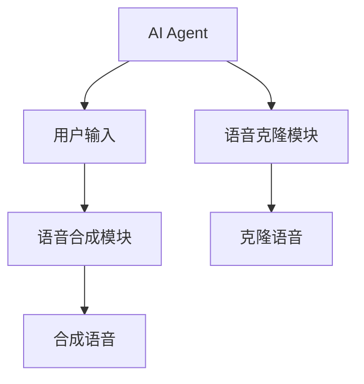
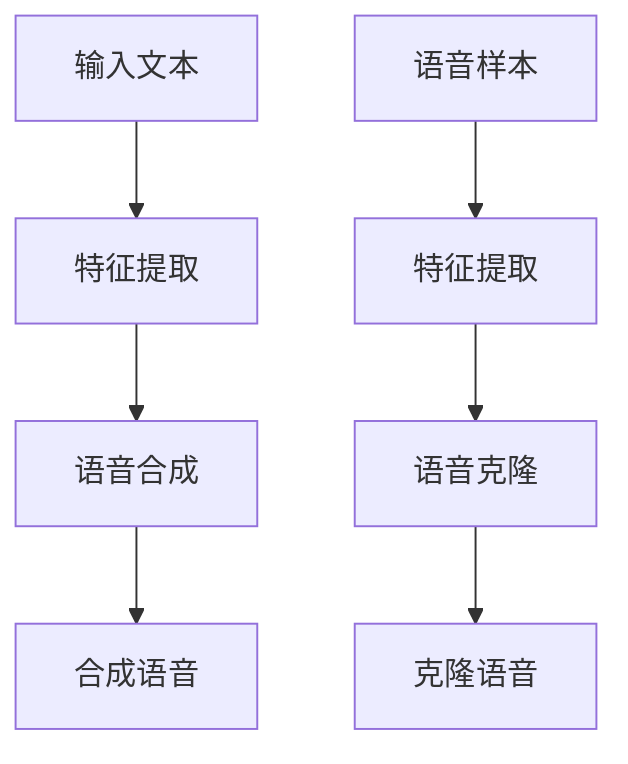
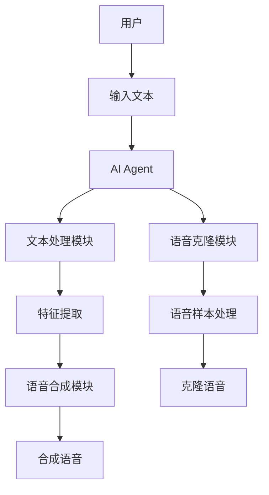

                 


```markdown
# AI Agent的语音合成与克隆能力实现

> 关键词：AI Agent、语音合成、语音克隆、深度学习、TTS、语音生成

> 摘要：本文详细探讨了AI Agent在语音合成与克隆能力实现方面的技术细节。通过分析语音合成与克隆的核心概念、算法原理、系统架构以及项目实战，结合深度学习技术，为读者提供了全面而深入的技术解析。

---

## 第一部分：AI Agent的语音合成与克隆概述

### 第1章：AI Agent与语音合成克隆的背景介绍

#### 1.1 AI Agent的基本概念
- **AI Agent的定义**：AI Agent是指具有智能交互能力的软件实体，能够通过自然语言处理、语音识别等技术与用户进行交互。
- **AI Agent的特点**：智能化、个性化、实时性、可扩展性。
- **AI Agent的应用场景**：智能音箱、虚拟助手、客服系统等。

#### 1.2 语音合成与克隆技术的背景
- **语音合成技术的发展历程**：从基于规则的TTS到深度学习驱动的端到端模型。
- **语音克隆技术的现状与挑战**：基于GAN和变自编码器的语音克隆技术逐渐成熟，但面临数据依赖性和鲁棒性问题。
- **语音合成与克隆在AI Agent中的应用前景**：提升用户体验，实现个性化语音交互。

### 第2章：AI Agent语音合成与克隆的核心概念与联系

#### 2.1 核心概念原理
- **语音合成**：将文本转换为语音，常用技术包括TTS（文本到语音）和波形生成模型（如Wavenet）。
- **语音克隆**：模仿特定人的语音，常用技术包括基于VAE和GAN的语音克隆方法。
- **AI Agent中的结合**：通过语音合成和克隆技术，AI Agent可以实现个性化语音输出，提升用户体验。

#### 2.2 核心概念属性特征对比表
| 概念       | 输入   | 输出   | 核心技术          |
|------------|--------|--------|-------------------|
| 语音合成   | 文本    | 语音   | TTS（文本到语音） |
| 语音克隆   | 语音样本 | 语音   | VAE（变自编码器） |

#### 2.3 ER实体关系图（Mermaid流程图）


### 第3章：AI Agent语音合成与克隆的算法原理

#### 3.1 语音合成算法原理
- **TTS模型**：基于LSTM和条件随机场的端到端TTS模型。
  ```latex
  $$p(w_i | w_{<i}, z) = \text{softmax}(W_{s_t} + b_s)$$
  ```
- **波形生成模型**：如Wavenet，通过自注意力机制生成高质量语音。
  ```latex
  $$p(x_t | x_{<t}) = \text{softmax}(W_{attn}(h_t) + b_{attn})$$
  ```

#### 3.2 语音克隆算法原理
- **基于VAE的语音克隆**：利用变自编码器提取语音特征，生成相似语音。
  ```latex
  $$q(z|x) = \mathcal{N}(z|\mu_x, \sigma_x)$$
  ```
- **基于GAN的语音克隆**：使用生成对抗网络，生成逼真的语音样本。
  ```latex
  $$\mathcal{L}_{\text{adv}} = \mathbb{E}_{x,y}[\log D(x,y)] + \mathbb{E}_{x,z}[\log (1 - D(x,g(x,z)))]$$
  ```

#### 3.3 算法流程图（Mermaid）


## 第二部分：系统分析与架构设计

### 第4章：AI Agent语音合成与克隆的系统架构

#### 4.1 系统功能设计
- **领域模型**：包括文本处理模块、语音合成模块、语音克隆模块。
  ```mermaid
  classDiagram
      class 文本处理模块 {
          输入文本
          转换为特征
      }
      class 语音合成模块 {
          文本特征
          生成语音
      }
      class 语音克隆模块 {
          语音特征
          生成克隆语音
      }
      文本处理模块 --> 语音合成模块
      文本处理模块 --> 语音克隆模块
  ```

#### 4.2 系统架构设计
- **系统架构图**：
  ```mermaid
  graph TD
      A[用户] --> B[AI Agent]
      B --> C[文本处理模块]
      C --> D[语音合成模块]
      C --> E[语音克隆模块]
      D --> F[合成语音]
      E --> G[克隆语音]
  ```

#### 4.3 系统接口设计
- **API接口**：
  - 文本处理模块：提供文本转特征接口。
  - 语音合成模块：提供特征转语音接口。
  - 语音克隆模块：提供语音样本转克隆语音接口。

#### 4.4 系统交互流程图（Mermaid）


## 第三部分：项目实战

### 第5章：AI Agent语音合成与克隆的实现

#### 5.1 环境安装
- **Python版本**：Python 3.8及以上。
- **依赖库**：TensorFlow、Keras、Librosa、PyTorch等。

#### 5.2 核心实现代码
```python
# 示例代码：简单的语音克隆系统
import librosa
import numpy as np
import tensorflow as tf
from tensorflow.keras import layers

# 加载语音样本
audio_path = "sample_audio.wav"
audio, sr = librosa.load(audio_path, sr=16000)
audio_feature = librosa.feature.mfcc(y=audio, sr=sr)

# 定义VAE模型
class VariationalAutoencoder:
    def __init__(self, input_shape, latent_dim):
        self.input_shape = input_shape
        self.latent_dim = latent_dim
        self.encoder = self.build_encoder()
        self.decoder = self.build_decoder()
    
    def build_encoder(self):
        encoder = tf.keras.Sequential([
            layers.Dense(128, activation='relu'),
            layers.Dense(64, activation='relu'),
            layers.Dense(self.latent_dim * 2, activation='relu')
        ])
        return encoder
    
    def build_decoder(self):
        decoder = tf.keras.Sequential([
            layers.Dense(64, activation='relu'),
            layers.Dense(128, activation='relu'),
            layers.Dense(np.prod(self.input_shape), activation='sigmoid')
        ])
        return decoder
    
    def call(self, x):
        z_mean, z_logvar = self.encoder(x)
        z = z_mean + tf.exp(0.5 * z_logvar) * tf.random.normal([tf.shape(x)[0], self.latent_dim])
        return self.decoder(z)

# 训练VAE模型
vae = VariationalAutoencoder(audio_feature.shape[1], latent_dim=10)
vae.compile(optimizer='adam', loss='binary_crossentropy')
vae.fit(audio_feature, audio_feature, epochs=10, batch_size=32)
```

#### 5.3 功能解读与分析
- **代码实现**：定义了一个简单的变自编码器模型，用于语音特征的编码和解码。
- **训练过程**：通过VAE模型对语音特征进行训练，提取潜在特征，生成克隆语音。
- **实际案例分析**：加载语音样本，提取MFCC特征，训练VAE模型，生成克隆语音。

#### 5.4 项目小结
- **实现效果**：简单实现了基于VAE的语音克隆系统，能够生成相似的语音。
- **优化方向**：引入GAN技术，提升语音生成的逼真度和多样性。

## 第四部分：最佳实践与总结

### 第6章：AI Agent语音合成与克隆的最佳实践

#### 6.1 实践技巧
- **数据预处理**：确保语音数据的质量和多样性。
- **模型调优**：选择合适的超参数，优化模型性能。
- **系统集成**：将语音合成与克隆模块集成到AI Agent中，提供流畅的用户体验。

#### 6.2 小结
- **总结**：通过本文的详细讲解，读者可以掌握AI Agent中语音合成与克隆的核心技术，理解其算法原理和系统架构。
- **未来展望**：随着深度学习技术的不断发展，AI Agent的语音合成与克隆能力将更加智能化和个性化。

#### 6.3 注意事项
- **数据隐私**：处理语音数据时，需注意用户隐私保护。
- **模型泛化能力**：避免模型过拟合，提升其泛化能力。

#### 6.4 拓展阅读
- **推荐书籍**：《Deep Learning》、《神经网络与深度学习》。
- **推荐论文**：相关领域的最新研究论文。

---

# 作者：AI天才研究院/AI Genius Institute & 禅与计算机程序设计艺术 /Zen And The Art of Computer Programming
```

