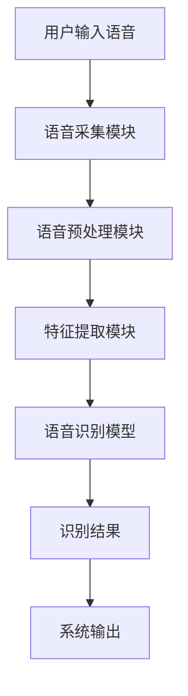
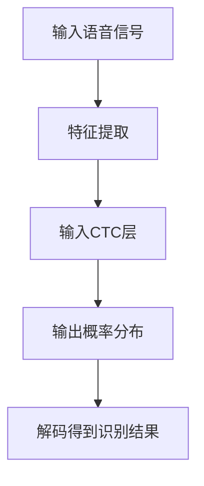
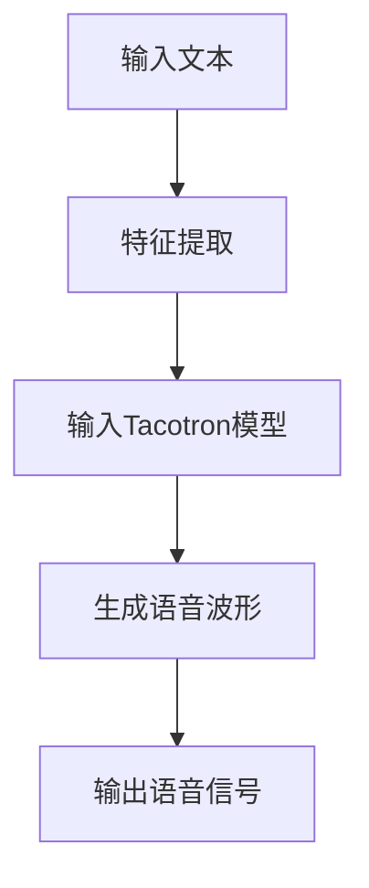
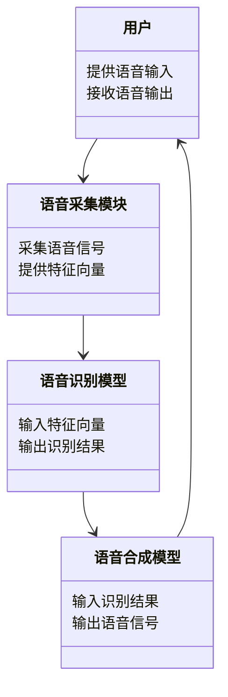
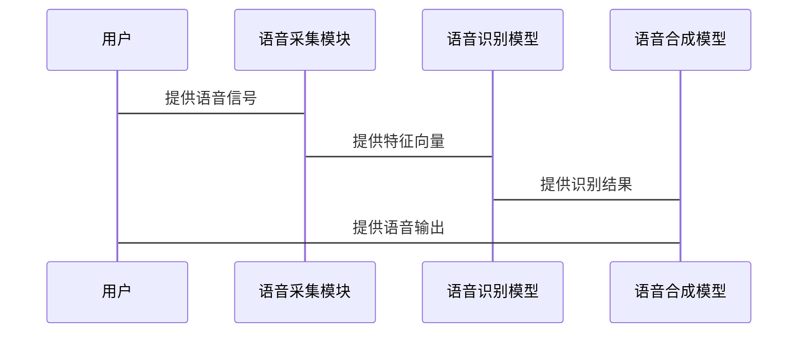

                 


# AI Agent的语音识别与合成技术

> 关键词：AI Agent, 语音识别, 语音合成, 语音信号处理, 深度学习, 语音交互

> 摘要：本文深入探讨AI Agent在语音识别与合成技术中的应用，分析其核心算法原理、系统架构设计以及实际项目实现。通过结合理论与实践，帮助读者全面理解AI Agent如何通过语音技术实现人机交互。

---

# 第1章: AI Agent与语音技术的背景介绍

## 1.1 AI Agent的基本概念
### 1.1.1 AI Agent的定义与核心要素
AI Agent（人工智能代理）是指能够感知环境并采取行动以实现目标的智能实体。它通常具备以下核心要素：
- **自主性**：能够自主决策。
- **反应性**：能够实时感知环境并做出反应。
- **目标导向**：基于目标驱动行为。
- **学习能力**：能够通过经验改进性能。

AI Agent可以是软件程序、机器人或其他智能系统，广泛应用于自动驾驶、智能助手、智能家居等领域。

### 1.1.2 AI Agent的分类与应用场景
AI Agent可以根据智能水平分为**反应式AI Agent**和**认知式AI Agent**：
- **反应式AI Agent**：基于当前感知做出实时反应，适用于实时交互场景。
- **认知式AI Agent**：具备复杂推理和规划能力，适用于需要决策优化的场景。

AI Agent的应用场景包括：
1. 智能助手（如Siri、Alexa）。
2. 自动驾驶系统。
3. 智能客服。
4. 智慧城市中的智能终端设备。

### 1.1.3 语音技术在AI Agent中的重要性
语音技术是AI Agent实现人机交互的核心技术之一。通过语音识别（ASR）和语音合成（TTS），AI Agent能够以自然的方式与人类进行交互。语音技术的准确性和实时性直接影响用户体验和系统的实用性。

---

## 1.2 语音识别与合成技术的背景
### 1.2.1 语音识别技术的发展历程
语音识别技术经历了从简单模板匹配到深度学习的演变：
- **早期阶段**：基于模板匹配的语音识别，适用于特定场景。
- **发展阶段**：基于隐马尔可夫模型（HMM）的语音识别，成为主流技术。
- **现代阶段**：基于深度学习（如RNN、Transformer）的语音识别，显著提升准确性和鲁棒性。

### 1.2.2 语音合成技术的演进
语音合成技术从简单的波形合成发展到基于深度学习的端到端生成：
- **早期阶段**：基于规则的语音合成，生成质量较低。
- **发展阶段**：基于统计模型（如MPG、SMB）的语音合成，实现较好音质。
- **现代阶段**：基于深度学习（如Tacotron、FastSpeech）的语音合成，实现自然流畅的语音生成。

### 1.2.3 AI Agent中语音技术的结合与创新
AI Agent将语音识别与合成技术结合，实现了**语音交互闭环**：
- **语音识别**：将人类语音转化为文本，作为AI Agent的输入。
- **语音合成**：将AI Agent的输出（文本或指令）转化为人类可听的语音。

这种结合使AI Agent能够实现**自然流畅的语音对话**，极大地提升了用户体验。

---

## 1.3 本章小结
### 1.3.1 AI Agent的核心概念总结
AI Agent是一种能够自主感知环境并采取行动的智能实体，其核心要素包括自主性、反应性、目标导向和学习能力。

### 1.3.2 语音技术在AI Agent中的关键作用
语音技术是AI Agent实现人机交互的核心技术，语音识别与合成技术的结合使AI Agent能够实现自然流畅的语音交互。

---

# 第2章: 语音识别与合成的核心概念与联系

## 2.1 语音识别技术原理
### 2.1.1 语音信号的基本特征
语音信号的关键特征包括：
- **时域特征**：声音的幅度、频率随时间的变化。
- **频域特征**：声音的频谱分布。
- **时频特征**：声音在时域和频域的联合特征。

### 2.1.2 语音识别的关键步骤
语音识别的流程包括：
1. **语音采集**：通过麦克风采集语音信号。
2. **预处理**：包括降噪、端点检测等。
3. **特征提取**：提取语音信号的特征向量。
4. **模型训练**：基于特征向量训练语音识别模型。
5. **语音解码**：将特征向量输入模型，得到最终的识别结果。

### 2.1.3 常见的语音识别算法对比
以下是常见语音识别算法的对比：

| **算法名称**       | **特点**                                                                 |
|--------------------|--------------------------------------------------------------------------|
| 隐马尔可夫模型（HMM） | 基于状态转移和概率模型，适用于小词汇量场景。                              |
| 长短期记忆网络（LSTM） | 基于序列建模，能够捕捉长距离依赖关系。                                    |
| Transformer         | 基于自注意力机制，性能优异，但计算资源消耗较大。                            |

---

## 2.2 语音合成技术原理
### 2.2.1 文本到语音的基本流程
语音合成的流程包括：
1. **文本预处理**：包括分词、标点处理等。
2. **语音生成**：基于深度学习模型生成语音波形。
3. **语音后处理**：包括音调调整、语速控制等。

### 2.2.2 合成语音的质量评估标准
语音合成的质量评估可以从以下几个方面进行：
- **音调准确性**：生成语音的音调是否与输入文本一致。
- **语速自然度**：生成语音的语速是否流畅自然。
- **音色一致性**：生成语音的音色是否统一。

### 2.2.3 基于深度学习的语音合成方法
基于深度学习的语音合成方法主要包括：
- **基于单元的语音合成**：将语音分割成基本单元（如音素），然后进行拼接。
- **基于统计模型的语音合成**：基于统计模型生成语音。
- **基于深度学习的端到端语音合成**：如Tacotron、FastSpeech等模型，能够直接从文本生成高质量的语音。

---

## 2.3 语音识别与合成的系统架构
### 2.3.1 系统整体架构图（Mermaid流程图）


### 2.3.2 核心模块之间的关系（ER实体关系图）
```mermaid
erDiagram
    +++++++ +++++++ +++++++
    用户 <----> 语音采集模块
    语音采集模块 <----> 特征提取模块
    特征提取模块 <----> 语音识别模型
    语音识别模型 <----> 识别结果
```

---

## 2.4 本章小结
### 2.4.1 核心概念的总结
语音识别与合成技术是AI Agent实现语音交互的核心技术，语音识别负责将语音信号转化为文本，语音合成负责将文本转化为语音。

### 2.4.2 语音识别与合成技术的联系与区别
- **联系**：语音识别与合成技术共同构成了语音交互的闭环。
- **区别**：语音识别是将语音信号转化为文本，而语音合成是将文本转化为语音信号。

---

# 第3章: 语音识别与合成的算法原理

## 3.1 语音识别算法
### 3.1.1 隐马尔可夫模型（HMM）原理
隐马尔可夫模型是一种基于状态转移和概率的语音识别模型。其核心思想是将语音信号分解为一系列状态，每个状态对应一个音素。

### 3.1.2 基于深度学习的语音识别（如CTC、Transformer）
- **CTC（Connectionist Temporal Classification）**：将语音信号直接输入神经网络，输出概率分布。
- **Transformer**：基于自注意力机制，能够捕捉长距离依赖关系。

### 3.1.3 算法流程图（Mermaid）


## 3.2 语音合成算法
### 3.2.1 基于单元的语音合成
基于单元的语音合成将语音信号分割成基本单元（如音素），然后通过拼接生成目标语音。

### 3.2.2 基于统计模型的语音合成
基于统计模型的语音合成通过统计模型生成语音波形。

### 3.2.3 基于深度学习的端到端语音合成（如Tacotron、FastSpeech）
- **Tacotron**：基于神经网络直接从文本生成语音。
- **FastSpeech**：基于Transformer架构，生成高质量的语音。

### 3.2.4 算法流程图（Mermaid）


---

## 3.3 算法实现与对比
### 3.3.1 语音识别与合成算法的优缺点对比（表格形式）
| **算法名称**       | **优点**                              | **缺点**                              |
|--------------------|---------------------------------------|---------------------------------------|
| HMM                | 实现简单，适用于小词汇量场景          | 无法处理复杂场景，准确率有限          |
| CTC                | 实现简单，能够处理长序列数据          | 对抗噪声能力较弱                    |
| Transformer          | 准确率高，能够捕捉长距离依赖          | 计算资源消耗较大                    |

### 3.3.2 代码实现示例（Python）
以下是一个简单的语音识别代码示例：
```python
import numpy as np
from sklearn import neighbors

# 示例代码：基于K近邻算法的语音识别
def feature_extraction(audio_signal):
    # 提取特征向量
    features = np.mean(audio_signal, axis=1)
    return features

def main():
    # 加载训练数据
    train_features = np.load('train_features.npy')
    train_labels = np.load('train_labels.npy')
    
    # 训练K近邻模型
    model = neighbors.KNeighborsClassifier()
    model.fit(train_features, train_labels)
    
    # 测试语音识别
    test_signal = np.array([...])  # 测试语音信号
    test_features = feature_extraction(test_signal)
    predicted_label = model.predict(test_features)
    
    print("识别结果:", predicted_label)

if __name__ == "__main__":
    main()
```

### 3.3.3 数学模型与公式（Latex）
语音识别的数学模型可以表示为：
$$
P(w|x) = \frac{P(x|w)P(w)}{P(x)}
$$
其中，$P(w|x)$ 是条件概率，表示在输入语音$x$下，输出单词$w$的概率。

---

## 3.4 本章小结
### 3.4.1 算法原理的总结
语音识别与合成技术的算法原理各有特点，深度学习的引入显著提升了语音交互的准确性和自然度。

### 3.4.2 语音识别与合成算法的对比
基于深度学习的算法在准确率和鲁棒性方面具有明显优势，但计算资源消耗较大。

---

# 第4章: 系统分析与架构设计

## 4.1 问题场景介绍
本章将通过一个智能助手的开发案例，分析语音识别与合成技术在AI Agent中的应用。

## 4.2 系统功能设计
### 4.2.1 领域模型（Mermaid类图）


### 4.2.2 系统架构设计（Mermaid架构图）


---

## 4.3 系统接口设计
### 4.3.1 语音采集模块接口
- **输入**：用户语音信号
- **输出**：特征向量

### 4.3.2 语音识别模型接口
- **输入**：特征向量
- **输出**：识别结果

### 4.3.3 语音合成模型接口
- **输入**：识别结果
- **输出**：语音信号

---

## 4.4 系统交互设计（Mermaid序列图）


---

## 4.5 本章小结
### 4.5.1 系统功能设计总结
通过领域模型和架构图，我们清晰地展示了AI Agent中语音识别与合成技术的系统架构。

### 4.5.2 系统交互设计总结
系统交互设计确保了各模块之间的协同工作，实现了语音交互的闭环。

---

# 第5章: 项目实战——基于深度学习的智能助手开发

## 5.1 环境安装
### 5.1.1 安装Python环境
- 安装Python 3.8及以上版本。
- 安装必要的Python包：TensorFlow、Keras、 librosa 等。

### 5.1.2 安装深度学习框架
- 安装TensorFlow或Keras。

## 5.2 系统核心实现源代码
### 5.2.1 语音采集模块
```python
import librosa

def record_audio(duration=5):
    # 采样率
    sr = 16000
    # 采集音频
    audio, _ = librosa.load('input.wav', sr=sr, duration=duration)
    return audio
```

### 5.2.2 语音识别模型
```python
import tensorflow as tf
from tensorflow.keras import layers

model = tf.keras.Sequential([
    layers.Conv2D(32, (3,3), activation='relu', input_shape=(None, 160, 1)),
    layers.MaxPooling2D((2,2)),
    layers.Conv2D(64, (3,3), activation='relu'),
    layers.MaxPooling2D((2,2)),
    layers.Flatten(),
    layers.Dense(128, activation='relu'),
    layers.Dense(num_classes, activation='softmax')
])
```

### 5.2.3 语音合成模型
```python
import tensorflow as tf
from tensorflow.keras import layers

model = tf.keras.Sequential([
    layers.Embedding(input_dim=vocabulary_size, output_dim=256),
    layers.TransformerDecoder(layers.TransformerDecoderLayer(dmodel=256, nhead=4), num_layers=2),
    layers.Dense(units=1, activation='sigmoid')
])
```

## 5.3 代码应用解读与分析
### 5.3.1 语音采集模块解读
- **功能**：采集用户语音信号并保存为.wav格式文件。
- **关键代码**：`librosa.load('input.wav', sr=sr, duration=duration)`。

### 5.3.2 语音识别模型解读
- **模型结构**：基于卷积神经网络的语音识别模型。
- **关键代码**：`layers.Conv2D(32, (3,3), activation='relu')`。

### 5.3.3 语音合成模型解读
- **模型结构**：基于Transformer的语音合成模型。
- **关键代码**：`layers.TransformerDecoder(layers.TransformerDecoderLayer(dmodel=256, nhead=4), num_layers=2)`。

## 5.4 实际案例分析
通过实际案例分析，我们展示了基于深度学习的智能助手如何实现语音交互。

---

## 5.5 本章小结
### 5.5.1 项目实现总结
通过项目实战，我们详细讲解了AI Agent中语音识别与合成技术的实现过程。

### 5.5.2 代码实现与分析
代码实现展示了如何基于深度学习框架（如TensorFlow）实现语音识别与合成模块。

---

# 第6章: 最佳实践与注意事项

## 6.1 开发中的注意事项
- **数据质量**：语音数据的质量直接影响模型的性能。
- **模型优化**：通过数据增强、模型剪枝等技术优化模型性能。
- **实时性要求**：在实时应用中，需要考虑计算资源的限制。

## 6.2 实际应用中的注意事项
- **噪声处理**：在实际场景中，需要对噪声进行有效处理。
- **多语言支持**：支持多种语言的语音识别与合成。
- **隐私保护**：在处理语音数据时，需要考虑隐私保护问题。

## 6.3 项目总结
通过本项目，我们深入探讨了AI Agent中语音识别与合成技术的实现过程，并总结了相关经验与教训。

## 6.4 拓展阅读
- **推荐阅读书籍**：
  - 《Deep Learning》—— Ian Goodfellow
  - 《语音信号处理》——李俊杰
- **推荐阅读论文**：
  - "Attention Is All You Need" —— Vaswani et al.

---

# 作者：AI天才研究院/AI Genius Institute & 禅与计算机程序设计艺术 /Zen And The Art of Computer Programming

