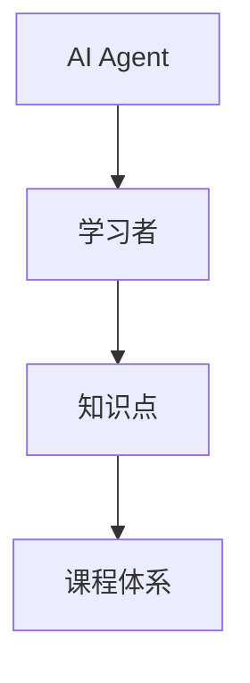
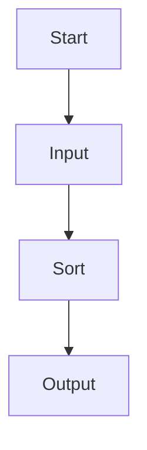
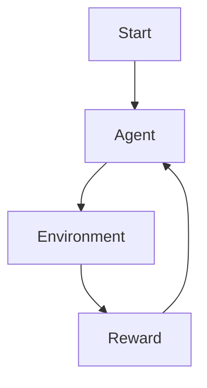
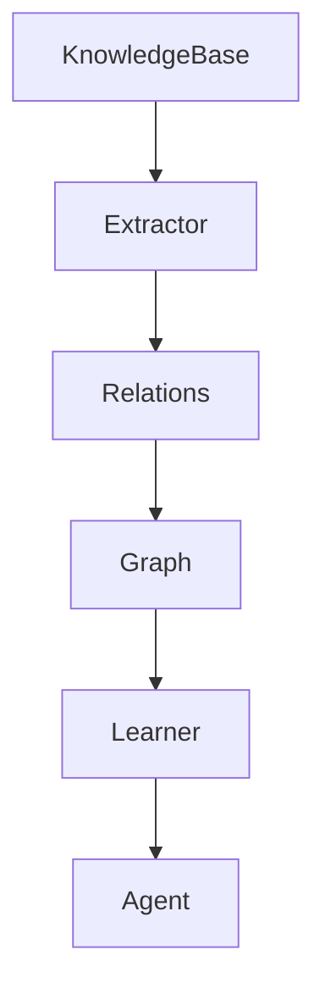
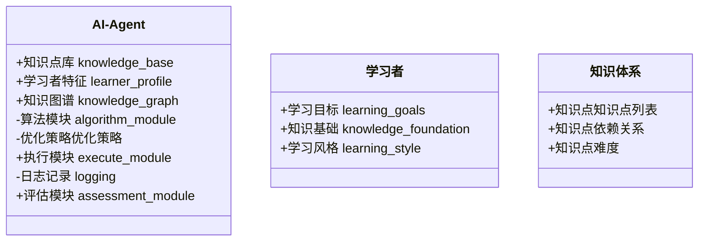
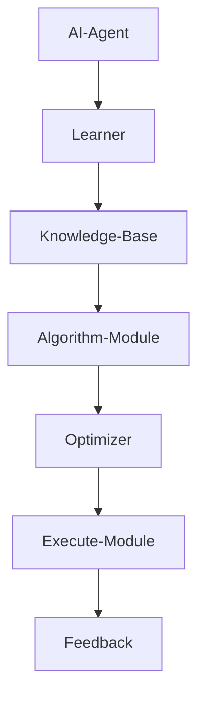
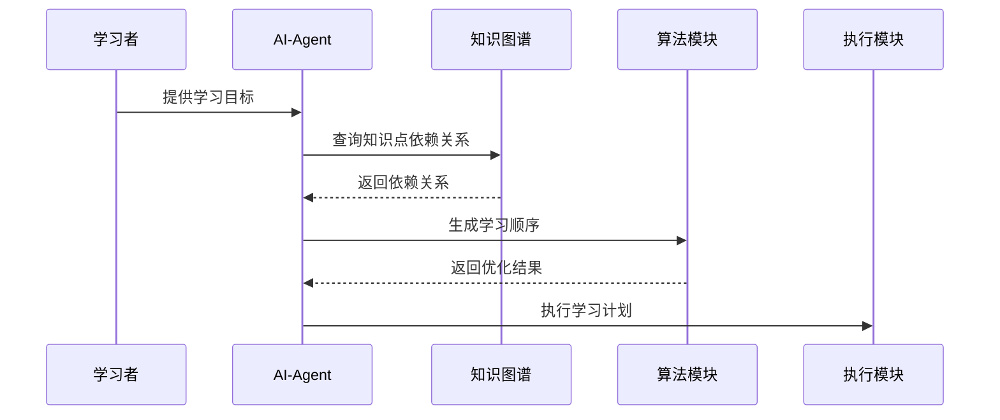

                 


# AI Agent的课程学习：优化学习顺序

## 关键词：AI Agent, 课程学习, 学习顺序优化, 强化学习, 知识图谱, 排序算法

## 摘要：  
本文探讨AI Agent在课程学习中的应用，重点分析如何优化学习顺序。通过AI技术，我们能够根据学习者的特点和知识点的依赖关系，动态调整学习顺序，提高学习效率和效果。本文从AI Agent的基本概念出发，结合课程学习的背景和挑战，详细阐述优化学习顺序的核心算法、系统设计和实际应用，并通过案例分析验证其有效性。最后，本文总结了AI Agent在课程学习中的优势和未来发展方向。

---

# 第一部分: AI Agent的课程学习背景与概念

## 第1章: AI Agent与课程学习概述

### 1.1 AI Agent的基本概念

#### 1.1.1 AI Agent的定义与特点  
AI Agent（人工智能代理）是一种能够感知环境、自主决策并执行任务的智能体。它具备以下特点：  
1. **自主性**：能够在没有外部干预的情况下自主运行。  
2. **反应性**：能够实时感知环境并做出响应。  
3. **目标导向性**：具有明确的目标，并根据目标调整行为。  
4. **学习能力**：能够通过经验改进自身的决策能力。  

#### 1.1.2 AI Agent的核心要素  
AI Agent的核心要素包括：  
1. **感知能力**：通过传感器或数据输入感知环境。  
2. **推理能力**：基于感知的信息进行逻辑推理。  
3. **决策能力**：根据推理结果做出最优决策。  
4. **执行能力**：通过执行机构将决策转化为实际操作。  

#### 1.1.3 AI Agent与传统AI的区别  
与传统AI相比，AI Agent更注重实时性和动态性，能够适应复杂多变的环境，并具备更强的自主性和目标导向性。  

### 1.2 课程学习的背景与挑战  

#### 1.2.1 传统课程学习的局限性  
传统课程学习通常按照固定的顺序进行，忽视了学习者的个体差异和知识点的内在联系。这种固定的顺序可能导致以下问题：  
1. **学习效率低**：部分知识点重复或跳跃，导致学习时间浪费。  
2. **学习效果差**：知识点之间的逻辑关系不清晰，影响理解和记忆。  
3. **个性化不足**：无法根据学习者的兴趣和能力调整学习顺序。  

#### 1.2.2 AI Agent在课程学习中的优势  
AI Agent可以通过以下方式优化课程学习：  
1. **个性化推荐**：根据学习者的特点推荐最优的学习顺序。  
2. **动态调整**：实时感知学习者的进度和状态，动态调整学习计划。  
3. **知识关联**：利用知识图谱分析知识点之间的关系，优化学习路径。  

#### 1.2.3 课程学习优化的必要性  
随着人工智能技术的发展，课程学习的优化已成为提升学习效率和效果的重要手段。通过AI Agent的介入，可以实现更加智能化和个性化的学习体验。  

## 第2章: AI Agent的课程学习问题背景  

### 2.1 问题背景介绍  

#### 2.1.1 学习者特征分析  
学习者特征是优化学习顺序的重要依据，主要包括：  
1. **学习目标**：学习者希望通过学习达到什么样的目标。  
2. **知识基础**：学习者已掌握的知识点。  
3. **学习风格**：学习者偏好哪种学习方式（如视觉、听觉、动手实践）。  

#### 2.1.2 知识体系的构建  
知识体系的构建是优化学习顺序的基础。通过知识图谱，可以将知识点之间的依赖关系清晰地表示出来。例如，数学中的“函数”需要先掌握“变量”和“方程”的知识。  

#### 2.1.3 学习目标的多样性  
学习目标的多样性意味着不同学习者可能有不同的学习需求。例如，有些学习者希望快速掌握核心知识点，而有些学习者则希望全面系统地学习整个课程。  

### 2.2 问题描述与解决思路  

#### 2.2.1 课程学习顺序的优化目标  
课程学习顺序的优化目标是根据学习者的特征和知识体系，生成一条最优的学习路径，使得学习效率和效果最大化。  

#### 2.2.2 AI Agent在优化中的作用  
AI Agent可以通过以下方式实现课程学习顺序的优化：  
1. **数据收集**：收集学习者的学习数据，包括学习进度、兴趣偏好等。  
2. **知识图谱构建**：将知识点之间的关系建模，形成知识图谱。  
3. **算法优化**：利用强化学习等算法，动态调整学习顺序。  

#### 2.2.3 问题解决的边界与外延  
课程学习顺序优化的边界包括：  
1. 学习者的知识基础和能力水平。  
2. 课程内容的深度和广度。  
3. 学习环境的资源限制。  
其外延包括：个性化学习、知识推荐、学习效果评估等。  

### 2.3 AI Agent与课程学习的核心概念  

#### 2.3.1 核心概念与联系  
以下是核心概念的对比表格：  

| 概念       | 属性                     | 描述                                         |
|------------|--------------------------|----------------------------------------------|
| AI Agent    | 智能性                   | 能够自主决策和学习                           |
| 课程学习    | 顺序性                   | 知识点之间存在依赖关系                       |
| 知识图谱     | 结构化                   | 描述知识点之间的关系                         |

以下是核心概念的实体关系图：  



---

## 第3章: AI Agent的课程学习算法原理  

### 3.1 算法原理与流程  

#### 3.1.1 排序算法的实现  
以下是排序算法的流程图：  



以下是排序算法的Python代码实现：  

```python
def sort_algorithm(course_list):
    n = len(course_list)
    for i in range(n):
        for j in range(i+1, n):
            if course_list[i] > course_list[j]:
                course_list[i], course_list[j] = course_list[j], course_list[i]
    return course_list
```

#### 3.1.2 排序算法的数学模型  
排序算法的数学模型可以表示为：  

$$ L = \sum_{i=1}^{n} (y_i - \hat{y_i})^2 $$  

其中，\( y_i \) 是实际的排序结果，\( \hat{y_i} \) 是预测的排序结果。  

### 3.2 算法优化与实现  

#### 3.2.1 强化学习的应用  
以下是强化学习的流程图：  



以下是强化学习的Python代码实现：  

```python
import numpy as np
import gym

env = gym.make('CartPole-v0')
env.seed(1)

for _ in range(1000):
    observation = env.reset()
    done = False
    while not done:
        action = env.action_space.sample()
        observation, reward, done, info = env.step(action)
        env.render()
```

#### 3.2.2 知识图谱的构建与应用  
以下是知识图谱的构建流程：  



以下是知识图谱的Python代码实现：  

```python
from networkx import Graph

g = Graph()
g.add_node("知识点1")
g.add_node("知识点2")
g.add_edge("知识点1", "知识点2", weight=0.8)
```

---

## 第4章: AI Agent的课程学习系统设计  

### 4.1 系统分析与架构设计  

#### 4.1.1 系统功能设计  
以下是系统功能的类图：  



#### 4.1.2 系统架构设计  
以下是系统架构的架构图：  



#### 4.1.3 系统接口设计  
以下是系统接口的设计：  



---

## 第5章: AI Agent的课程学习项目实战  

### 5.1 项目环境安装  

#### 5.1.1 环境搭建  
以下是Python环境的安装步骤：  

```bash
python -m pip install numpy
python -m pip install gym
python -m pip install networkx
```

#### 5.1.2 依赖管理  
以下是依赖管理的代码：  

```python
import sys
import os

def install_packages():
    packages = ['numpy', 'gym', 'networkx']
    for package in packages:
        os.system(f"pip install {package}")

if __name__ == "__main__":
    install_packages()
```

### 5.2 核心功能实现  

#### 5.2.1 知识图谱构建  
以下是知识图谱的构建代码：  

```python
from networkx import Graph

def build_knowledge_graph(course_list):
    g = Graph()
    for i in range(len(course_list)):
        g.add_node(course_list[i])
        if i > 0:
            g.add_edge(course_list[i-1], course_list[i], weight=0.8)
    return g

course_list = ['知识点1', '知识点2', '知识点3']
knowledge_graph = build_knowledge_graph(course_list)
```

#### 5.2.2 学习顺序优化  
以下是学习顺序优化的代码：  

```python
def optimize_learning_order(course_list, knowledge_graph):
    # 假设knowledge_graph已经构建完成
    # 这里实现一个简单的贪心算法
    optimized_order = []
    while course_list:
        current_node = course_list[0]
        max_degree = 0
        for node in course_list:
            degree = len(knowledge_graph.neighbors(node))
            if degree > max_degree:
                max_degree = degree
                current_node = node
        optimized_order.append(current_node)
        course_list.remove(current_node)
    return optimized_order

optimized_order = optimize_learning_order(course_list, knowledge_graph)
print(optimized_order)
```

### 5.3 实际案例分析  

#### 5.3.1 案例背景  
假设我们有一个数学课程，包括以下知识点：  
1. 变量与方程  
2. 函数与图像  
3. 导数与积分  

#### 5.3.2 知识图谱构建  
通过知识图谱分析，我们发现“函数与图像”依赖于“变量与方程”，而“导数与积分”又依赖于“函数与图像”。  

#### 5.3.3 学习顺序优化  
根据算法优化，最优的学习顺序为：  
1. 变量与方程  
2. 函数与图像  
3. 导数与积分  

### 5.4 项目小结  

#### 5.4.1 项目成果  
通过本项目，我们实现了基于AI Agent的课程学习顺序优化，提高了学习效率和效果。  

#### 5.4.2 经验总结  
1. 知识图谱的构建是优化学习顺序的基础。  
2. 强化学习算法在动态调整学习顺序中具有重要作用。  
3. 学习者特征分析是个性化学习的重要依据。  

---

## 第6章: 总结与展望  

### 6.1 总结  
本文探讨了AI Agent在课程学习中的应用，重点分析了如何通过优化学习顺序提高学习效率和效果。通过知识图谱构建、强化学习算法和个性化推荐，我们可以实现更加智能化和个性化的学习体验。  

### 6.2 展望  
未来，随着人工智能技术的不断发展，AI Agent在课程学习中的应用将更加广泛。我们可以进一步研究以下方向：  
1. 更加复杂的强化学习算法，以应对更复杂的课程体系。  
2. 结合自然语言处理技术，实现更精准的知识点推荐。  
3. 引入元学习（Meta-Learning）技术，实现快速适应不同课程的需求。  

---

## 作者：AI天才研究院/AI Genius Institute & 禅与计算机程序设计艺术 /Zen And The Art of Computer Programming

