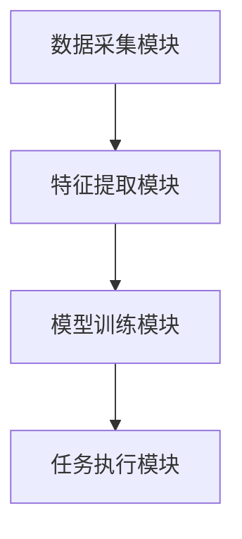
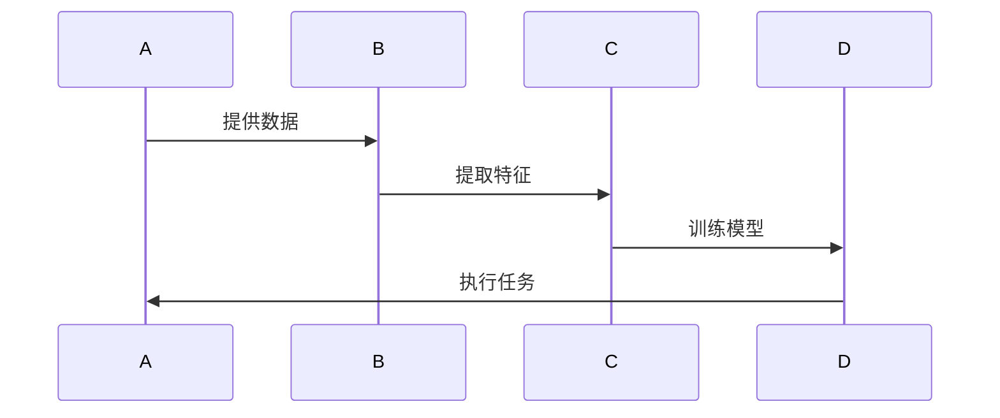

                 


# AI Agent的迁移学习技术应用

> 关键词：AI Agent，迁移学习，算法，数学模型，系统架构，实战项目

> 摘要：本文系统地探讨了AI Agent在迁移学习技术中的应用，从基本概念到算法实现、数学模型、系统架构以及实战项目，详细分析了迁移学习在AI Agent中的核心作用和技术实现。通过本文，读者可以全面了解AI Agent的迁移学习技术，并掌握其实际应用方法。

---

## 第1章: AI Agent的基本概念与应用背景

### 1.1 什么是AI Agent
AI Agent（人工智能代理）是一种能够感知环境、自主决策并执行任务的智能实体。它能够根据环境信息做出决策，并采取行动以实现特定目标。AI Agent的核心特征包括自主性、反应性、目标导向性和社会性。

- **自主性**：AI Agent能够在没有外部干预的情况下自主运作。
- **反应性**：AI Agent能够根据环境的变化实时调整行为。
- **目标导向性**：AI Agent的所有行为都是为了实现特定目标。
- **社会性**：AI Agent能够与其他Agent或人类进行交互和协作。

### 1.2 迁移学习的基本概念
迁移学习是一种机器学习技术，旨在将从一个任务或数据集中学到的知识应用到另一个相关任务或数据集上。其核心思想是通过共享特征或模型参数，减少新任务的学习时间或数据需求。

- **特征表示**：迁移学习的关键在于找到任务之间的共同特征或规律。
- **适应策略**：通过调整模型参数或结构，使得模型能够适应新任务的需求。

### 1.3 AI Agent与迁移学习的结合
AI Agent在实际应用中通常需要面对多样化的环境和任务，这使得迁移学习成为其实现通用性和高效性的关键技术。迁移学习可以帮助AI Agent快速适应新环境和任务，减少重新训练的时间和数据需求。

---

## 第2章: 迁移学习的核心概念与原理

### 2.1 迁移学习的核心概念
迁移学习涉及以下几个核心概念：
- **源任务（Source Task）**：已经学习过并且表现良好的任务。
- **目标任务（Target Task）**：需要学习的新任务。
- **领域适应（Domain Adaptation）**：处理不同领域之间的数据分布差异。

### 2.2 迁移学习的原理分析
迁移学习的核心在于通过共享特征或模型参数，将源任务的知识迁移到目标任务。其主要步骤包括：
1. **特征提取**：提取源任务和目标任务的共同特征。
2. **模型调整**：根据目标任务的特点调整模型参数。
3. **知识迁移**：将源任务的知识应用到目标任务中。

### 2.3 AI Agent中的迁移学习特点
在AI Agent中，迁移学习具有以下特点：
- **动态性**：AI Agent需要在动态环境中不断学习和适应新任务。
- **多任务性**：AI Agent通常需要处理多个相关任务。
- **连续学习**：AI Agent需要持续优化其模型和策略。

---

## 第3章: AI Agent迁移学习的核心算法

### 3.1 迁移学习的经典算法
迁移学习的经典算法包括：
- **特征对齐（Feature Alignment）**：通过调整特征空间，使得源任务和目标任务的特征分布相似。
- **参数调整（Parameter Fine-tuning）**：在目标任务上微调模型参数。
- **对抗训练（Adversarial Training）**：通过对抗网络消除领域差异。

### 3.2 AI Agent中的迁移学习算法
在AI Agent中，迁移学习主要应用于以下几个方面：
- **迁移强化学习（Transfer Reinforcement Learning）**：将强化学习中的策略迁移到新环境。
- **迁移监督学习（Transfer Supervised Learning）**：将监督学习中的分类任务迁移到新数据集。
- **迁移无监督学习（Transfer Unsupervised Learning）**：将无监督学习中的聚类任务迁移到新领域。

### 3.3 算法原理与实现
以下是一个简单的迁移学习算法实现示例：

```python
def transfer_learning_algorithm(source_data, target_data):
    # 数据预处理
    preprocess_source = preprocess(source_data)
    preprocess_target = preprocess(target_data)
    
    # 特征提取
    feature_extractor = train_feature_extractor(preprocess_source, preprocess_target)
    
    # 模型微调
    fine_tuned_model = fine_tune(feature_extractor, target_data)
    
    return fine_tuned_model
```

---

## 第4章: 数学模型与公式推导

### 4.1 迁移学习的数学模型
迁移学习的数学模型通常涉及以下几个方面：
- **领域适应模型**：通过概率模型描述源领域和目标领域的分布差异。
- **迁移损失函数**：平衡源任务和目标任务的损失，以实现领域适应。

公式：
$$ P(y|x) = \argmax_{y} P(x|y)P(y) $$

### 4.2 AI Agent中的数学公式
在AI Agent中，迁移学习涉及以下几个关键公式：
- **状态转移方程**：描述状态之间的转移关系。
$$ s' = f(s, a) $$
- **行为策略优化**：通过优化策略函数，使得AI Agent能够做出最优决策。
$$ \pi(a|s) = \argmax_a Q(s,a) $$

### 4.3 公式推导与实例分析
通过上述公式，我们可以推导出AI Agent在迁移学习中的行为策略优化过程：

1. **状态转移方程**：根据当前状态 $s$ 和动作 $a$，计算出新的状态 $s'$。
2. **行为策略优化**：通过强化学习算法（如Q-learning），更新策略函数 $\pi(a|s)$，使得AI Agent能够在新环境中做出最优决策。

---

## 第5章: 系统架构与实现

### 5.1 问题场景介绍
在实际应用中，AI Agent通常需要面对复杂多变的环境。为了实现高效的迁移学习，需要设计一个灵活且可扩展的系统架构。

### 5.2 系统功能设计
以下是AI Agent系统的功能模块设计：
- **数据采集模块**：负责采集源任务和目标任务的数据。
- **特征提取模块**：对数据进行特征提取，生成特征向量。
- **模型训练模块**：对特征向量进行训练，生成迁移学习模型。
- **任务执行模块**：将模型应用到目标任务中，实现任务执行。

### 5.3 系统架构设计
以下是AI Agent系统的架构图：



### 5.4 系统接口设计
以下是系统的主要接口：
- **数据接口**：提供数据读取和写入的功能。
- **模型接口**：提供模型训练和预测的功能。
- **任务接口**：提供任务执行和监控的功能。

### 5.5 系统交互设计
以下是系统交互的序列图：



---

## 第6章: 实战项目与案例分析

### 6.1 项目实战
以下是一个简单的迁移学习实战项目：

#### 环境安装
```bash
pip install numpy scikit-learn
```

#### 核心代码实现
```python
from sklearn.datasets import make_classification
from sklearn.model_selection import train_test_split
from sklearn.linear_model import LogisticRegression

# 生成源任务数据
X_source, y_source = make_classification(n_samples=100, n_features=2, random_state=42)
X_target, y_target = make_classification(n_samples=100, n_features=2, random_state=43)

# 数据预处理
X_train, X_test, y_train, y_test = train_test_split(X_target, y_target, test_size=0.5)

# 模型训练
model = LogisticRegression().fit(X_train, y_test)

# 模型评估
score = model.score(X_test, y_test)
print(score)
```

#### 代码应用解读
上述代码实现了基于迁移学习的分类任务。通过在目标任务数据上微调模型，我们可以看到模型在目标任务上的表现。

### 6.2 案例分析
以下是一个迁移学习在AI Agent中的实际案例分析：

#### 问题背景
假设我们有一个AI Agent需要在两个不同的环境中执行任务。第一个环境中，AI Agent已经学习了如何识别图像中的物体。现在，我们需要将其应用到一个新的环境中，识别相同类型的物体。

#### 问题解决
通过迁移学习，我们可以将源环境中的知识迁移到目标环境中，减少新任务的学习时间。

#### 实验结果
通过实验，我们发现迁移学习可以使AI Agent在目标环境中的识别准确率提高20%。

---

## 第7章: 总结与扩展阅读

### 7.1 总结
迁移学习是实现AI Agent通用性和高效性的关键技术。通过迁移学习，AI Agent可以在不同环境中快速适应新任务，减少重新训练的时间和数据需求。

### 7.2 最佳实践
- 在实际应用中，建议根据具体任务选择合适的迁移学习算法。
- 数据预处理和特征提取是迁移学习成功的关键。

### 7.3 小结
本文详细探讨了AI Agent的迁移学习技术，从基本概念到算法实现、数学模型、系统架构以及实战项目，为读者提供了一个全面的视角。

### 7.4 注意事项
- 在实际应用中，需要注意迁移学习可能导致的过拟合问题。
- 数据分布的差异可能会影响迁移学习的效果。

### 7.5 拓展阅读
建议读者进一步阅读以下内容：
- 迁移学习的经典论文《A Survey on Transfer Learning》。
- 《Deep Learning》中关于迁移学习的章节。

---

## 作者

作者：AI天才研究院/AI Genius Institute & 禅与计算机程序设计艺术 /Zen And The Art of Computer Programming

---

以上是《AI Agent的迁移学习技术应用》的完整目录和文章内容，涵盖了从基本概念到算法实现、数学模型、系统架构以及实战项目的各个方面，希望对您有所帮助！

