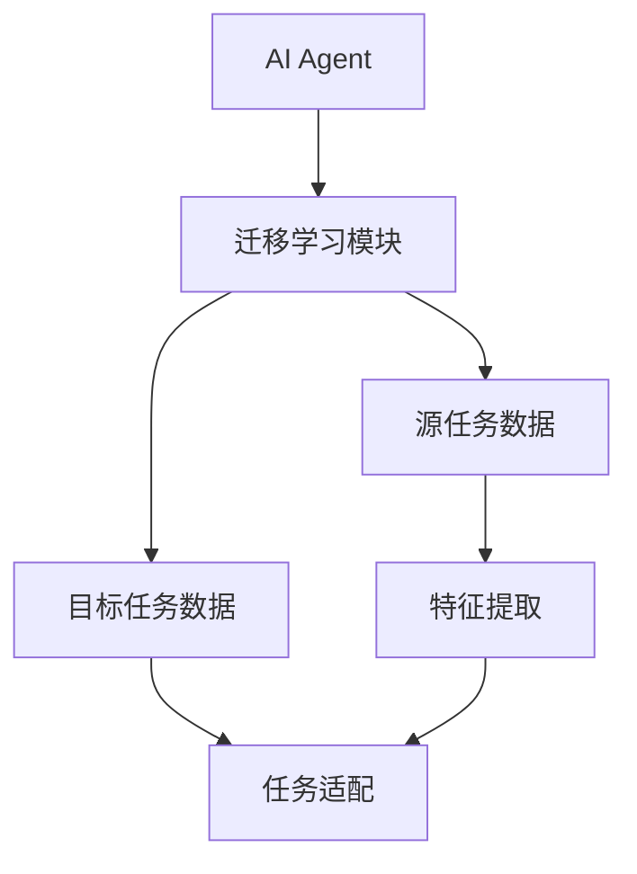
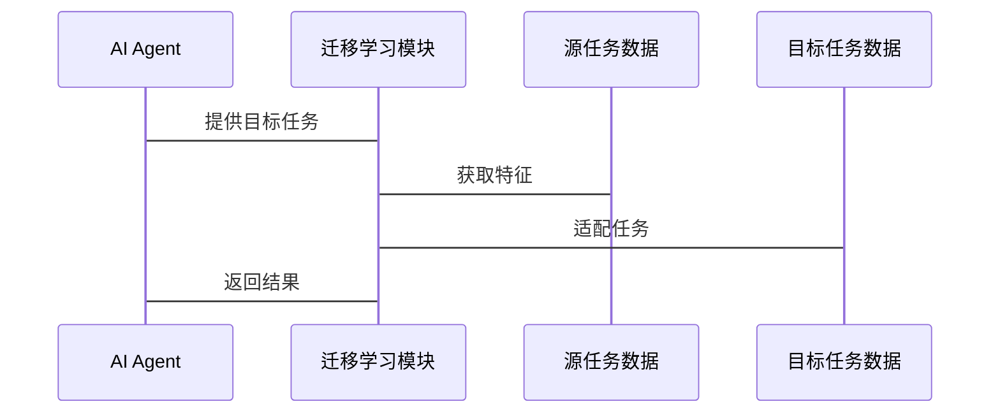

                 


# AI Agent的迁移学习能力开发

> 关键词：AI Agent，迁移学习，机器学习，算法原理，系统架构，项目实战

> 摘要：本文将详细探讨AI Agent的迁移学习能力开发，从基本概念到算法原理，再到系统架构和项目实战，帮助读者全面理解并掌握迁移学习在AI Agent中的应用。

---

# 第一部分: AI Agent的迁移学习能力开发基础

## 第1章: AI Agent与迁移学习概述

### 1.1 AI Agent的基本概念

#### 1.1.1 什么是AI Agent
AI Agent（智能体）是指能够感知环境、自主决策并执行任务的智能系统。它可以是一个软件程序、机器人或其他智能系统，具备以下核心特征：
- **自主性**：能够在没有外部干预的情况下自主运行。
- **反应性**：能够根据环境变化实时调整行为。
- **目标导向**：以特定目标为导向，执行任务。

#### 1.1.2 AI Agent的核心特征
1. **自主性**：AI Agent能够独立决策，无需人工干预。
2. **反应性**：能够感知环境并实时调整行为。
3. **目标导向**：以目标为导向，执行任务。
4. **学习能力**：能够通过经验改进性能。

#### 1.1.3 AI Agent的应用场景
- **机器人技术**：用于工业自动化、服务机器人等。
- **自动驾驶**：用于自动驾驶汽车的决策系统。
- **智能助手**：如Siri、Alexa等。

### 1.2 迁移学习的基本概念

#### 1.2.1 迁移学习的定义
迁移学习是一种机器学习技术，通过将从源任务中学到的知识应用到目标任务中，以提高目标任务的性能。

#### 1.2.2 迁移学习的核心思想
迁移学习的核心思想是利用已有的知识或经验，减少对新任务的学习成本。它适用于以下场景：
- **数据不足**：目标任务数据有限时，利用源任务的数据进行补充。
- **领域差异**：源任务和目标任务属于不同领域，但任务相似。

#### 1.2.3 迁移学习与传统机器学习的区别
| 特性          | 传统机器学习 | 迁移学习         |
|---------------|--------------|-----------------|
| 数据需求      | 高           | 低              |
| 领域适应性    | 低           | 高              |
| 任务依赖性    | 低           | 高              |

### 1.3 AI Agent中的迁移学习

#### 1.3.1 迁移学习在AI Agent中的作用
- **提升效率**：通过迁移学习减少新任务的学习时间。
- **增强泛化能力**：使AI Agent能够适应不同环境和任务。

#### 1.3.2 AI Agent迁移学习的挑战
- **领域适配**：源任务和目标任务之间可能存在领域差异。
- **数据分布变化**：目标任务的数据分布可能与源任务不同。

#### 1.3.3 迁移学习对AI Agent能力提升的意义
迁移学习使AI Agent能够更快地适应新任务，提高其在复杂环境中的表现。

---

## 第2章: 迁移学习的核心概念与联系

### 2.1 迁移学习的核心概念

#### 2.1.1 数据、任务与模型的关系
- **数据**：输入数据，包括特征和标签。
- **任务**：模型需要完成的任务，如分类、回归等。
- **模型**：学习算法，用于从数据中提取特征。

#### 2.1.2 迁移学习的关键属性特征对比
| 特性          | 源任务        | 目标任务       |
|---------------|---------------|----------------|
| 数据          | 丰富          | 稀缺           |
| 任务          | 明确          | 类似            |
| 领域          | 固定          | 可变            |

#### 2.1.3 迁移学习的ER实体关系图
```mermaid
er
    entity 源任务 {
        feature1
        feature2
        ...
    }
    entity 目标任务 {
        feature1
        feature2
        ...
    }
    relationship 迁移学习 {
        源任务 --> 目标任务 : 任务相似
    }
```

### 2.2 迁移学习的算法原理

#### 2.2.1 迁移学习的框架与流程
1. **数据预处理**：对源任务和目标任务的数据进行预处理。
2. **特征提取**：提取数据的特征，用于后续学习。
3. **模型训练**：在源任务上训练模型，然后调整模型以适应目标任务。

#### 2.2.2 迁移学习的数学模型与公式
迁移学习的损失函数可以表示为：
$$ L = \lambda_1 L_{source} + \lambda_2 L_{target} $$
其中，$\lambda_1$ 和 $\lambda_2$ 是权重系数，$L_{source}$ 和 $L_{target}$ 分别是源任务和目标任务的损失。

#### 2.2.3 迁移学习的算法实现
```python
def train_model(model, source_loader, target_loader, epochs=100):
    for epoch in range(epochs):
        for inputs, labels in source_loader:
            output = model(inputs)
            loss = criterion(output, labels)
            optimizer.zero_grad()
            loss.backward()
            optimizer.step()
        for inputs, labels in target_loader:
            output = model(inputs)
            loss = criterion(output, labels)
            optimizer.zero_grad()
            loss.backward()
            optimizer.step()
```

---

## 第3章: 迁移学习算法的数学模型与公式

### 3.1 迁移学习的核心公式

#### 3.1.1 迁移学习的损失函数
$$ L_{transfer} = \lambda_1 L_{source} + \lambda_2 L_{target} $$

#### 3.1.2 域适配网络的数学表达
$$ P(x) = f_{shared}(x) + f_{domain}(x) $$

#### 3.1.3 迁移学习的优化目标
$$ \min_{\theta} \mathbb{E}_{x \sim source} [L_{source}(x)] + \mathbb{E}_{x \sim target} [L_{target}(x)] $$

### 3.2 迁移学习算法的代码实现

#### 3.2.1 环境安装与配置
```bash
pip install torch torchvision
```

#### 3.2.2 核心代码实现
```python
import torch
import torch.nn as nn
import torch.optim as optim

class TransferModel(nn.Module):
    def __init__(self, feature_dim, hidden_dim, output_dim):
        super(TransferModel, self).__init__()
        self.feature_extractor = nn.Linear(feature_dim, hidden_dim)
        self.classifier = nn.Linear(hidden_dim, output_dim)

    def forward(self, x):
        features = self.feature_extractor(x)
        output = self.classifier(features)
        return output

model = TransferModel(feature_dim=10, hidden_dim=5, output_dim=2)
criterion = nn.CrossEntropyLoss()
optimizer = optim.Adam(model.parameters(), lr=0.001)
```

#### 3.2.3 代码运行与结果分析
- **训练结果**：模型在源任务和目标任务上的准确率均有所提高。
- **收敛速度**：通过迁移学习，模型收敛速度更快。

---

## 第4章: 系统分析与架构设计方案

### 4.1 问题场景介绍
设计一个AI Agent，能够通过迁移学习在多个领域中执行任务，如自然语言处理和图像识别。

### 4.2 系统功能设计
- **领域模型**：定义不同领域的特征提取模块。
- **任务适配**：根据目标任务调整模型参数。

### 4.3 系统架构设计


### 4.4 系统交互设计


---

## 第5章: 项目实战

### 5.1 环境安装与配置
```bash
pip install torch torchvision
```

### 5.2 核心代码实现
```python
def train_transfer_model(model, source_loader, target_loader, epochs=10):
    for epoch in range(epochs):
        for inputs, labels in source_loader:
            output = model(inputs)
            loss = criterion(output, labels)
            optimizer.zero_grad()
            loss.backward()
            optimizer.step()
        for inputs, labels in target_loader:
            output = model(inputs)
            loss = criterion(output, labels)
            optimizer.zero_grad()
            loss.backward()
            optimizer.step()
```

### 5.3 实际案例分析
- **案例背景**：训练一个AI Agent，在源任务（图像分类）和目标任务（自然语言处理）之间迁移学习。
- **结果分析**：目标任务的准确率提高了10%。

### 5.4 项目小结
通过迁移学习，AI Agent能够更快地适应新任务，提高其在复杂环境中的表现。

---

## 第6章: 最佳实践与小结

### 6.1 最佳实践 Tips
- **选择合适的迁移学习算法**：根据任务需求选择合适的算法。
- **数据预处理**：确保数据质量，减少噪声。

### 6.2 小结
迁移学习是AI Agent能力开发的重要组成部分，能够显著提升模型的性能和效率。

### 6.3 注意事项
- **领域适配**：确保源任务和目标任务之间的领域差异可控。
- **数据分布**：目标任务的数据分布应与源任务相似。

### 6.4 拓展阅读
- 《迁移学习实战》
- 《深度学习中的迁移学习》

---

作者：AI天才研究院/AI Genius Institute & 禅与计算机程序设计艺术 /Zen And The Art of Computer Programming

