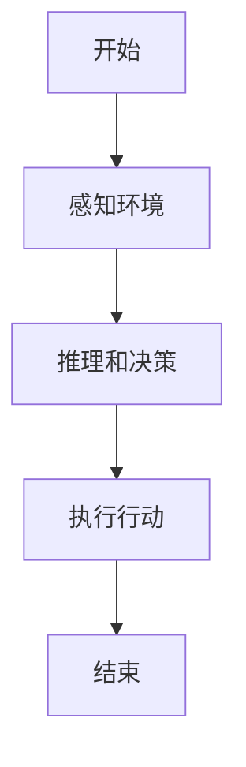
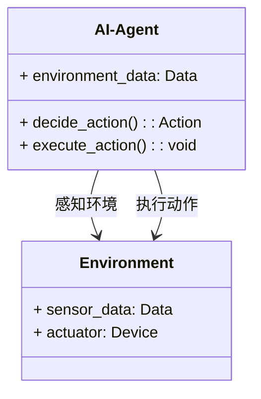

                 


# AI Agent的部署与扩展性考虑

> 关键词：AI Agent，部署，扩展性，云原生架构，系统设计，算法原理

> 摘要：本文详细探讨了AI Agent的部署与扩展性问题，从核心概念、算法原理、系统架构到项目实战，全面分析了AI Agent在实际应用中的关键挑战与解决方案。通过具体的案例分析和系统设计，本文为读者提供了从理论到实践的完整指南。

---

## 第1章: AI Agent的背景与核心概念

### 1.1 AI Agent的基本概念

#### 1.1.1 什么是AI Agent
AI Agent（人工智能代理）是一种能够感知环境、自主决策并执行任务的智能实体。它能够通过传感器获取信息，利用算法进行推理和规划，并通过执行器与环境交互。

- **感知**：AI Agent通过传感器获取环境数据，例如摄像头、麦克风、温度传感器等。
- **推理**：基于感知数据，AI Agent利用算法（如机器学习、规则引擎）进行推理和决策。
- **执行**：根据推理结果，AI Agent通过执行器（如电机、扬声器）完成任务。

#### 1.1.2 AI Agent的核心特征
AI Agent的核心特征包括：
- **自主性**：能够在没有外部干预的情况下自主运行。
- **反应性**：能够实时感知环境变化并做出反应。
- **目标导向性**：具有明确的目标，并通过规划实现目标。
- **学习能力**：能够通过经验改进自身的性能。

#### 1.1.3 AI Agent的分类与应用场景
AI Agent可以根据功能和应用场景分为以下几类：
1. **简单反射型**：基于固定的规则执行任务，适用于简单的场景。
2. **基于模型的反射型**：利用内部模型进行推理和决策。
3. **目标驱动型**：以目标为导向，通过规划实现任务。
4. **实用驱动型**：以效用函数为驱动，选择最优行动方案。

应用场景包括：
- **智能助手**：如Siri、Alexa。
- **自动驾驶**：如自动驾驶汽车。
- **智能客服**：如自动回复的客服机器人。

---

### 1.2 AI Agent的扩展性问题

#### 1.2.1 扩展性的重要性
随着AI Agent的应用场景越来越复杂，扩展性成为一个重要问题。扩展性不仅影响系统的性能，还决定了系统的可维护性和可扩展性。

- **性能扩展**：通过扩展计算资源（如增加CPU、GPU）来提高系统的处理能力。
- **功能扩展**：通过增加新的功能模块来扩展系统的功能。
- **数据扩展**：通过增加数据源和数据量来提高系统的智能化水平。

#### 1.2.2 扩展性面临的主要挑战
AI Agent的扩展性面临以下主要挑战：
1. **资源分配**：如何在扩展系统时合理分配资源。
2. **通信延迟**：随着系统的扩展，通信延迟可能增加。
3. **一致性**：如何保证系统在扩展后的一致性。
4. **安全性**：如何保证扩展后的系统安全性。

#### 1.2.3 扩展性与系统性能的关系
扩展性直接影响系统的性能，包括响应时间、吞吐量和资源利用率。良好的扩展性设计可以提高系统的性能，降低系统的负载压力。

---

### 1.3 云原生架构与AI

#### 1.3.1 云原生架构的定义
云原生架构是一种基于云计算的架构，旨在通过容器化、微服务化和自动化编排来构建和运行应用程序。

- **容器化**：通过Docker等容器技术实现应用程序的隔离和封装。
- **微服务化**：将系统拆分为多个独立的服务，每个服务负责不同的功能。
- **自动化编排**：通过Kubernetes等工具实现服务的自动化部署和管理。

#### 1.3.2 AI Agent与云原生架构的结合
AI Agent可以通过云原生架构实现扩展。具体方法包括：
1. **容器化部署**：将AI Agent封装为容器，通过容器编排工具实现自动扩缩容。
2. **微服务化设计**：将AI Agent的功能模块化，通过微服务架构实现功能扩展。
3. **弹性计算**：根据负载动态调整计算资源。

#### 1.3.3 云原生架构的优势
云原生架构的优势包括：
1. **弹性扩展**：可以根据负载动态调整资源。
2. **高可用性**：通过容器编排工具实现服务的高可用性。
3. **快速部署**：通过自动化工具实现快速部署和更新。

---

## 第2章: 核心概念与联系

### 2.1 AI Agent的核心概念

#### 2.1.1 通信协议
AI Agent之间的通信需要通过通信协议实现。常用的通信协议包括：
- **HTTP**：基于RESTful API的通信。
- **WebSocket**：实时双向通信。
- **Message Queue**：异步消息队列。

#### 2.1.2 任务分配机制
AI Agent在分布式系统中需要通过任务分配机制实现任务的分配与协作。常用的任务分配机制包括：
- **轮询分配**：按顺序分配任务。
- **负载均衡**：根据负载情况动态分配任务。
- **基于优先级的分配**：根据任务优先级分配任务。

#### 2.1.3 数据处理机制
AI Agent需要处理大量的数据，包括感知数据、任务数据和环境数据。常用的数据处理机制包括：
- **数据预处理**：对数据进行清洗和归一化处理。
- **特征提取**：提取数据中的特征，用于模型训练。
- **数据存储**：将数据存储到数据库或数据湖中。

---

### 2.2 对比分析

#### 2.2.1 传统系统与AI Agent的特征对比
| 特征       | 传统系统          | AI Agent           |
|------------|-------------------|---------------------|
| 自主性       | 低                | 高                  |
| 反应性       | 低                | 高                  |
| 学习能力     | 无                | 有                  |
| 扩展性       | 简单              | 复杂                |

#### 2.2.2 系统架构对比
- **传统架构**：基于单体架构，功能模块耦合度高，扩展性差。
- **AI Agent架构**：基于微服务架构，功能模块解耦，扩展性好。

---

## 第3章: 算法原理

### 3.1 算法原理

#### 3.1.1 多智能体协作
多智能体协作是AI Agent扩展性的重要组成部分。多智能体协作的目标是通过多个智能体的协作完成复杂的任务。

- **通信机制**：通过通信协议实现智能体之间的通信。
- **协作机制**：通过任务分配机制实现智能体之间的协作。
- **协调机制**：通过协调机制解决智能体之间的冲突。

#### 3.1.2 算法流程



#### 3.1.3 代码实现

```python
import numpy as np

def perceive_environment():
    # 模拟环境数据
    return np.random.rand(10)

def decide_action(action_space):
    # 模拟决策逻辑
    return np.random.choice(action_space)

def execute_action(action):
    # 模拟执行逻辑
    print(f"执行动作：{action}")

def main():
    action_space = [0, 1, 2]
    while True:
        environment = perceive_environment()
        action = decide_action(action_space)
        execute_action(action)

if __name__ == "__main__":
    main()
```

---

### 3.2 数学模型

#### 3.2.1 状态空间
状态空间是AI Agent所有可能的状态的集合。状态空间可以用集合或图结构表示。

$$ S = \{s_1, s_2, s_3, ..., s_n\} $$

#### 3.2.2 动作空间
动作空间是AI Agent所有可能的动作的集合。

$$ A = \{a_1, a_2, a_3, ..., a_m\} $$

#### 3.2.3 奖励函数
奖励函数是AI Agent在执行动作后获得的奖励。

$$ R(s, a) = \begin{cases}
    r_1 & \text{如果 } s \text{ 和 } a \text{ 满足条件} \\
    r_2 & \text{否则}
\end{cases} $$

---

## 第4章: 系统分析与架构设计

### 4.1 系统分析

#### 4.1.1 问题场景
假设我们正在设计一个智能家居系统，其中包含多个AI Agent，每个AI Agent负责不同的任务。

- **问题场景**：智能家居系统需要协调多个AI Agent完成家庭监控、能源管理、智能家居控制等任务。
- **功能需求**：
  1. 实时监控家庭环境数据。
  2. 根据环境数据自动调整智能家居设备。
  3. 提供用户交互界面。

---

### 4.2 系统设计

#### 4.2.1 系统功能设计



#### 4.2.2 系统架构设计

```mermaid
graph TD
    User --> Gateway: 发送请求
    Gateway --> AI-Agent1: 请求处理
    AI-Agent1 --> Database: 查询数据
    AI-Agent1 --> AI-Agent2: 协调任务
    AI-Agent2 --> Execute: 执行动作
    Execute --> Gateway: 返回结果
    Gateway --> User: 返回响应
```

---

## 第5章: 项目实战

### 5.1 环境安装

#### 5.1.1 安装Python
```bash
python --version
pip install --upgrade pip
```

#### 5.1.2 安装依赖
```bash
pip install numpy
pip install matplotlib
```

---

### 5.2 核心实现

#### 5.2.1 感知环境
```python
import numpy as np

def perceive_environment():
    # 模拟环境数据
    return np.random.rand(10)
```

#### 5.2.2 决策逻辑
```python
def decide_action(action_space):
    # 模拟决策逻辑
    return np.random.choice(action_space)
```

#### 5.2.3 执行动作
```python
def execute_action(action):
    # 模拟执行逻辑
    print(f"执行动作：{action}")
```

---

## 第6章: 总结与展望

### 6.1 总结
本文详细探讨了AI Agent的部署与扩展性问题，从核心概念、算法原理、系统架构到项目实战，全面分析了AI Agent在实际应用中的关键挑战与解决方案。

---

### 6.2 注意事项

1. **性能优化**：在扩展系统时，需要注意性能优化，避免因为资源分配不合理导致系统性能下降。
2. **安全性**：在设计AI Agent时，需要注意安全性，防止恶意攻击。
3. **一致性**：在扩展系统时，需要注意一致性，保证系统在扩展后的一致性。

---

### 6.3 拓展阅读

- 《Cloud Native Patterns》
- 《Microservices Patterns and Principles》
- 《Designing Distributed Systems》

---

## 作者：AI天才研究院/AI Genius Institute & 禅与计算机程序设计艺术 /Zen And The Art of Computer Programming

