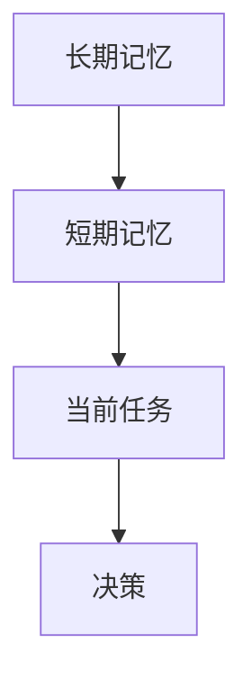
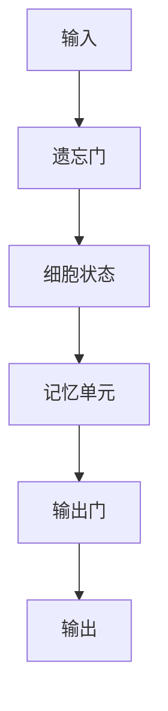
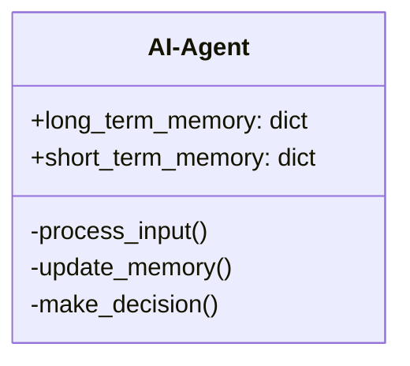
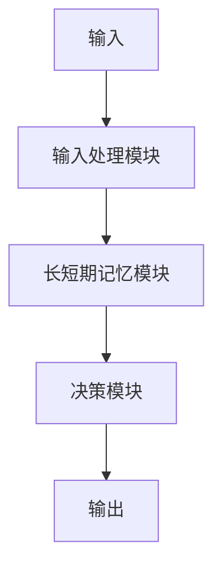
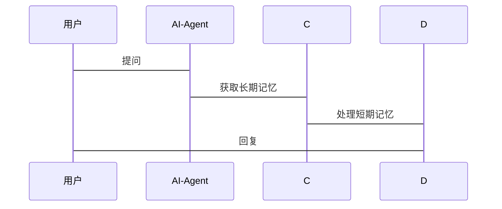

                 


# AI Agent的长短期记忆管理

> 关键词：AI Agent, 长短期记忆, LSTM, Transformer, 系统架构设计, 项目实战

> 摘要：本文深入探讨AI Agent的长短期记忆管理，从核心概念、算法原理到系统架构设计和项目实战，帮助读者全面理解和应用相关技术。

---

# 第1章: AI Agent与长短期记忆管理概述

## 1.1 AI Agent的基本概念

### 1.1.1 什么是AI Agent

AI Agent（智能体）是能够感知环境并采取行动以实现目标的实体。它可以是一个软件程序，如聊天机器人或推荐系统，也可以是物理设备，如自动驾驶汽车。AI Agent的核心目标是通过与环境交互，优化决策过程以达成特定任务。

### 1.1.2 AI Agent的核心特征

1. **自主性**：AI Agent能够在没有外部干预的情况下独立运作。
2. **反应性**：能够实时感知环境变化并做出相应反应。
3. **目标导向**：基于目标进行决策和行动。
4. **学习能力**：通过经验或数据优化性能。

### 1.1.3 长短期记忆管理的重要性

AI Agent在处理任务时，需要处理不同类型的信息：短期记忆用于处理当前任务相关的信息，而长期记忆则用于存储持久性的知识和经验。有效的长短期记忆管理能够提升AI Agent的学习能力和决策效率，使其在复杂环境中表现更出色。

---

## 1.2 长短期记忆管理的背景与问题

### 1.2.1 当前AI Agent面临的挑战

1. **信息过载**：在处理复杂任务时，AI Agent可能会面临大量信息，如何有效管理这些信息是一个挑战。
2. **信息遗忘**：在处理短期任务时，如何选择性遗忘无关信息是关键。
3. **信息整合**：长期记忆和短期记忆的有效整合对任务完成至关重要。

### 1.2.2 长短期记忆管理的必要性

有效的长短期记忆管理能够帮助AI Agent：

- 更高效地处理当前任务。
- 更好地利用历史信息。
- 提升整体的学习和推理能力。

### 1.2.3 相关技术的发展现状

目前，主流的长短期记忆管理技术包括LSTM（长短期记忆网络）和Transformer模型。这些模型在自然语言处理、时间序列预测等领域取得了显著成果。

---

## 1.3 本书的目标与结构

### 1.3.1 本书的目标

通过详细讲解AI Agent的长短期记忆管理，帮助读者掌握相关理论和实践技能。

### 1.3.2 目标读者

- AI研究人员
- 数据科学家
- 软件开发人员
- 对AI技术感兴趣的读者

### 1.3.3 本书的结构安排

- **第1章**：背景介绍
- **第2章**：核心概念与联系
- **第3章**：算法原理
- **第4章**：系统架构设计
- **第5章**：项目实战
- **第6章**：总结与展望

---

# 第2章: 长短期记忆管理的核心概念

## 2.1 长期记忆与短期记忆的定义

### 2.1.1 长期记忆的特征

1. **持久性**：信息存储时间长。
2. **稳定性**：不易被当前任务干扰。
3. **容量大**：能够存储大量信息。

### 2.1.2 短期记忆的特征

1. **易变性**：信息保留时间短。
2. **快速访问**：便于当前任务处理。
3. **容量有限**：信息量有限。

### 2.1.3 两者的关系与区别

| 特性        | 长期记忆                | 短期记忆                |
|-------------|------------------------|------------------------|
| 存储时间      | 长期                   | 短期                   |
| 容量          | 大                     | 小                     |
| 易受干扰      | 较小                   | 较大                   |

---

## 2.2 长短期记忆管理的原理

### 2.2.1 长期记忆存储机制

长期记忆通常通过神经网络中的特定结构（如LSTM单元）进行存储和更新。这些结构能够选择性地遗忘或保留信息。

### 2.2.2 短期记忆处理机制

短期记忆处理机制关注当前任务相关信息的处理和更新，通常通过注意力机制或门控机制实现。

### 2.2.3 信息的检索与整合

信息检索与整合是长短期记忆管理的关键步骤，涉及从长期记忆中提取相关信息并结合短期记忆中的当前信息，形成最终的决策输出。

---

## 2.3 核心概念的联系与对比

### 2.3.1 核心概念属性对比表

| 特性        | 长期记忆                | 短期记忆                |
|-------------|------------------------|------------------------|
| 存储时间      | 长期                   | 短期                   |
| 容量          | 大                     | 小                     |
| 易受干扰      | 较小                   | 较大                   |

### 2.3.2 ER实体关系图



---

# 第3章: 长短期记忆管理的算法原理

## 3.1 长期记忆管理的算法

### 3.1.1 LSTM网络的工作原理

LSTM通过门控机制控制信息流动：

1. **遗忘门**：决定哪些信息需要遗忘。
2. **输入门**：决定哪些新信息需要存储。
3. **输出门**：决定哪些信息需要输出。



### 3.1.2 LSTM的数学模型

遗忘门：
$$\text{遗忘门} = \sigma(W_f x + U_f h_{prev})$$

记忆单元：
$$\text{记忆单元} = \text{tanh}(W_c x + U_c h_{prev})$$

输出门：
$$\text{输出门} = \sigma(W_o x + U_o h_{prev})$$

### 3.1.3 LSTM的Python实现示例

```python
import numpy as np

def sigmoid(x):
    return 1 / (1 + np.exp(-x))

def tanh(x):
    return (np.exp(x) - np.exp(-x)) / (np.exp(x) + np.exp(-x))

# 随机初始化权重
W_f = np.random.randn(3,3)
W_c = np.random.randn(3,3)
W_o = np.random.randn(3,3)
U_f = np.random.randn(3,3)
U_c = np.random.randn(3,3)
U_o = np.random.randn(3,3)

x_t = np.random.randn(3)
h_prev = np.random.randn(3)

# 遗忘门
f = sigmoid(np.dot(W_f, x_t) + np.dot(U_f, h_prev))
i = sigmoid(np.dot(W_i, x_t) + np.dot(U_i, h_prev))
o = sigmoid(np.dot(W_o, x_t) + np.dot(U_o, h_prev))

# 记忆单元
c = f * h_prev + i * tanh(np.dot(W_c, x_t))
h = o * tanh(c)
```

---

## 3.2 短期记忆管理的算法

### 3.2.1 Transformer模型的工作原理

Transformer模型通过注意力机制处理序列数据，能够捕捉全局信息。

### 3.2.2 Transformer的数学模型

注意力机制：
$$\text{Attention}(Q, K, V) = \text{softmax}\left(\frac{QK^T}{\sqrt{d_k}}\right)V$$

---

## 3.3 长短期记忆管理的联合优化

通过结合LSTM和Transformer的优势，可以实现长短期记忆的高效管理。例如，使用Transformer的注意力机制增强LSTM的长期记忆能力。

---

# 第4章: 长短期记忆管理的系统架构设计

## 4.1 问题场景介绍

以一个智能客服系统为例，需要处理客户的咨询请求，依赖于长短期记忆管理来提供个性化服务。

## 4.2 系统功能设计

### 4.2.1 领域模型设计



### 4.2.2 系统架构设计



### 4.2.3 系统交互设计



---

## 4.3 系统实现与优化

### 4.3.1 环境配置与安装

安装Python、TensorFlow、Keras等开发环境。

### 4.3.2 核心代码实现

实现LSTM和Transformer模型的集成，优化长短期记忆管理。

### 4.3.3 代码解读与分析

详细解读核心代码，分析实现细节。

---

## 4.4 项目实战案例

### 4.4.1 案例介绍

以智能客服系统为例，展示长短期记忆管理的应用。

### 4.4.2 案例分析

分析系统如何通过长短期记忆管理提升客户服务质量。

---

## 4.5 项目总结

总结项目实施过程中的经验与教训，提出改进建议。

---

# 第5章: 长短期记忆管理的总结与展望

## 5.1 最佳实践 tips

1. 合理选择长短期记忆管理模型。
2. 定期优化系统架构。
3. 加强模型的可解释性。

## 5.2 小结

通过本文的学习，读者可以掌握长短期记忆管理的核心概念、算法原理和系统设计方法。

## 5.3 注意事项

1. 注意模型的泛化能力。
2. 防范数据过拟合。
3. 定期维护系统性能。

## 5.4 拓展阅读

推荐相关书籍和论文，供读者深入学习。

---

# 作者：AI天才研究院 & 禅与计算机程序设计艺术

---

通过以上结构，我将逐步完成这篇文章的撰写，确保每个部分都详细展开，逻辑清晰，内容丰富。

