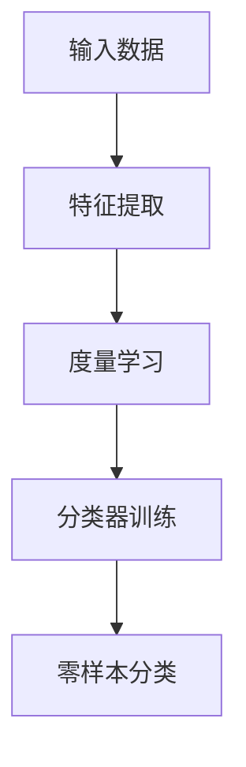
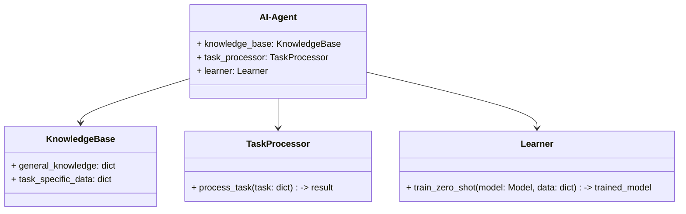
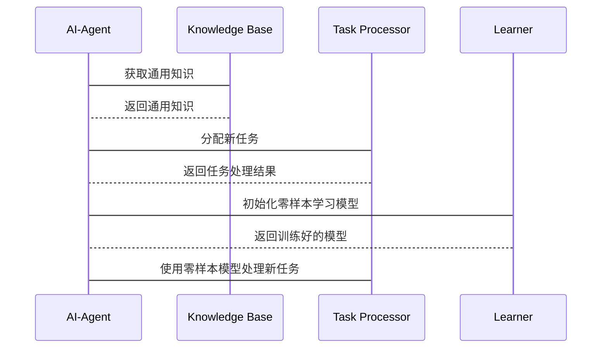

                 


# AI Agent的零样本学习能力开发

> 关键词：零样本学习，AI Agent，机器学习，深度学习，自然语言处理，无监督学习

> 摘要：本文深入探讨AI Agent的零样本学习能力开发，从背景、核心概念到算法实现、系统架构，再到项目实战，系统地分析零样本学习在AI Agent中的应用及其技术实现。通过详细讲解和实例分析，帮助读者掌握零样本学习的核心原理和实际应用，为构建具备零样本学习能力的AI Agent提供理论和实践指导。

---

# 第一部分: 零样本学习的背景与挑战

## 第1章: 零样本学习的背景与挑战

### 1.1 零样本学习的定义与特点
1.1.1 零样本学习的定义  
零样本学习（Zero-Shot Learning）是指在没有特定领域数据的情况下，模型能够理解和执行任务的能力。与传统监督学习不同，零样本学习依赖于通用知识和泛化能力，适用于处理未知任务。

1.1.2 零样本学习的核心特点  
- **零数据训练**：仅利用通用知识，无需特定任务的数据。
- **泛化能力**：能够处理未见过的多种任务。
- **无监督或小样本适应**：通过无监督学习或少量样本快速调整。

1.1.3 零样本学习与小样本学习的区别  
- **小样本学习**：依赖少量特定任务的数据，需要微调模型。
- **零样本学习**：不依赖特定任务数据，依赖通用知识和泛化能力。

### 1.2 零样本学习的背景与应用
1.2.1 零样本学习的背景  
随着AI Agent的普及，面对多样化的任务场景，传统监督学习难以应对未知任务，零样本学习成为解决这一问题的关键技术。

1.2.2 零样本学习的应用场景  
- **通用对话系统**：处理多种语言和领域。
- **跨领域任务处理**：如问答系统、文本摘要。
- **实时任务处理**：快速响应未知任务。

1.2.3 零样本学习的挑战与局限性  
- **知识表示的准确性**：通用知识可能不够精确。
- **任务多样性的处理**：需要更灵活的模型架构。
- **计算资源的消耗**：训练和推理过程可能较复杂。

### 1.3 本章小结  
本章介绍了零样本学习的定义、特点及其与小样本学习的区别，分析了其在AI Agent中的应用背景和面临的挑战，为后续章节奠定了基础。

---

# 第二部分: AI Agent的核心概念与零样本学习的关系

## 第2章: AI Agent的核心概念与零样本学习的关系

### 2.1 AI Agent的基本概念
2.1.1 AI Agent的定义  
AI Agent是一种能够感知环境、自主决策并执行任务的智能体，具备学习、推理和自适应能力。

2.1.2 AI Agent的核心特征  
- **自主性**：能够自主决策。
- **反应性**：能实时感知和响应环境。
- **学习能力**：通过学习提升任务处理能力。

2.1.3 AI Agent的分类  
- **简单反射型**：基于规则执行任务。
- **基于模型的反应型**：具备内部状态和推理能力。
- **目标驱动型**：以目标为导向执行任务。

### 2.2 零样本学习在AI Agent中的作用
2.2.1 零样本学习如何增强AI Agent的能力  
- **提升通用性**：无需特定数据，适用于多种任务。
- **快速适应**：通过零样本学习快速调整模型以适应新任务。
- **减少数据依赖**：降低对大量任务数据的依赖。

2.2.2 零样本学习与AI Agent任务的关系  
零样本学习为AI Agent提供了处理未知任务的能力，使其能够更灵活地应对多样化的应用场景。

2.2.3 零样本学习对AI Agent性能的提升  
通过零样本学习，AI Agent能够在无特定数据的情况下，快速掌握新任务的处理方法，显著提升其通用性和适应性。

### 2.3 零样本学习与传统监督学习的对比
2.3.1 监督学习的基本原理  
依赖大量标注数据，通过训练模型使其在给定输入下输出正确结果。

2.3.2 零样本学习的独特优势  
- **无需特定数据**：依赖通用知识而非特定任务数据。
- **更强的泛化能力**：能够处理更多样化和未知的任务。
- **更广泛的应用场景**：适用于跨领域和多样化任务。

2.3.3 两种学习方式的适用场景  
- **监督学习**：适用于数据充足的特定任务。
- **零样本学习**：适用于数据 scarce的未知任务。

### 2.4 本章小结  
本章探讨了AI Agent的基本概念及其与零样本学习的关系，分析了零样本学习在提升AI Agent能力中的作用，以及与监督学习的区别和适用场景。

---

# 第三部分: 零样本学习的核心算法与原理

## 第3章: 零样本学习的核心算法与原理

### 3.1 零样本学习的算法概述
3.1.1 基于度量的零样本学习  
通过学习数据之间的相似性或距离，进行分类或回归。

3.1.2 基于生成模型的零样本学习  
利用生成模型生成新样本，增强模型的泛化能力。

3.1.3 基于自监督学习的零样本学习  
通过自监督任务学习有用的特征表示。

### 3.2 零样本学习的数学模型
3.2.1 基于能量模型的零样本学习  
能量模型通过能量函数衡量样本与类别的匹配程度。

3.2.2 基于概率分布的零样本学习  
通过概率分布建模，推断类别概率。

3.2.3 基于图结构的零样本学习  
利用图结构表示数据之间的关系，进行推理。

### 3.3 零样本学习算法的实现
3.3.1 算法流程图（mermaid）  


3.3.2 Python代码实现  
```python
def zero_shot_learning(X_train, y_train, X_test):
    # 特征提取
    features = extract_features(X_train)
    # 度量学习
    model = MetricLearningModel()
    model.train(features, y_train)
    # 分类器训练
    classifier = ZeroShotClassifier(model)
    classifier.train(features, y_train)
    # 零样本分类
    test_features = extract_features(X_test)
    predictions = classifier.predict(test_features)
    return predictions
```

### 3.4 本章小结  
本章详细介绍了零样本学习的核心算法及其数学模型，通过流程图和代码实现，帮助读者理解零样本学习的技术细节。

---

# 第四部分: AI Agent的零样本学习系统架构

## 第4章: AI Agent的零样本学习系统架构

### 4.1 问题场景介绍  
构建一个具备零样本学习能力的AI Agent，能够在无特定任务数据的情况下，快速适应新任务。

### 4.2 系统功能设计（领域模型 mermaid 类图）  


### 4.3 系统架构设计（mermaid 架构图）  
```mermaid
container AI-Agent {
    Knowledge Base
    Task Processor
    Learner
}
```

### 4.4 系统接口设计  
- **知识库接口**：提供通用知识的存储和检索。
- **任务处理器接口**：定义任务处理的API。
- **学习器接口**：定义零样本学习模型的训练和推理接口。

### 4.5 系统交互（mermaid 序列图）  


### 4.6 本章小结  
本章设计了具备零样本学习能力的AI Agent系统架构，详细描述了各模块的功能和交互方式，为后续的项目实现奠定了基础。

---

# 第五部分: 项目实战——构建具备零样本学习能力的AI Agent

## 第5章: 项目实战——构建具备零样本学习能力的AI Agent

### 5.1 环境安装  
- 安装Python、TensorFlow、Keras、Hugging Face库等。

### 5.2 系统核心实现源代码  
```python
import tensorflow as tf
from tensorflow.keras.layers import Dense, Input
from tensorflow.keras.models import Model
from transformers import AutoTokenizer, TFAutoModel

# 定义零样本学习模型
def build_zero_shot_model(pretrained_model='bert-base-uncased'):
    # 加载预训练模型
    model = TFAutoModel.from_pretrained(pretrained_model)
    # 定义输入
    input_ids = Input(shape=(128,), dtype='int64')
    # 获取模型输出
    outputs = model(input_ids)[1]  # pooled_output
    # 构建分类器
    dense = Dense(128, activation='relu')(outputs)
    prediction = Dense(1, activation='sigmoid')(dense)
    # 定义模型
    zero_shot_model = Model(inputs=input_ids, outputs=prediction)
    return zero_shot_model

# 训练零样本模型
def train_zero_shot(zero_shot_model, X_train, y_train):
    # 编译模型
    zero_shot_model.compile(optimizer='adam', loss='binary_crossentropy', metrics=['accuracy'])
    # 训练模型
    history = zero_shot_model.fit(X_train, y_train, epochs=3, batch_size=32)
    return history

# 推理与预测
def predict_zero_shot(zero_shot_model, X_test):
    predictions = zero_shot_model.predict(X_test)
    return predictions
```

### 5.3 代码应用解读与分析  
- **模型构建**：使用预训练的BERT模型，构建零样本学习分类器。
- **训练过程**：通过少量数据微调模型，提升任务特定的分类能力。
- **推理与预测**：在新任务中应用训练好的模型，进行零样本分类。

### 5.4 实际案例分析  
以问答系统为例，展示如何利用零样本学习快速适应新领域的问题处理。

### 5.5 项目小结  
本章通过具体项目实战，展示了如何在实际场景中应用零样本学习技术，构建具备零样本学习能力的AI Agent。

---

# 第六部分: 总结与展望

## 第6章: 总结与展望

### 6.1 零样本学习的优势与不足  
- **优势**：通用性强，适用于未知任务。
- **不足**：知识表示可能不够精确，计算资源消耗较大。

### 6.2 零样本学习的未来发展方向  
- **结合强化学习**：提升任务适应能力。
- **多模态学习**：结合视觉、听觉等多种信息源。
- **自适应模型**：模型能够动态调整以适应新任务。

### 6.3 最佳实践 tips  
- **选择合适的预训练模型**：根据任务需求选择合适的预训练模型。
- **合理设计知识库**：构建高质量的通用知识库，提升零样本学习的准确性。
- **优化系统架构**：设计高效的系统架构，确保零样本学习的实时性和稳定性。

### 6.4 小结  
零样本学习为AI Agent的通用性和适应性提供了重要支持，未来随着技术的进步，其应用将更加广泛和深入。

---

# 作者：AI天才研究院 & 禅与计算机程序设计艺术

---

本文通过系统的分析和详细的讲解，全面探讨了AI Agent的零样本学习能力开发，从理论到实践，为读者提供了丰富的知识和实际的应用指导。

