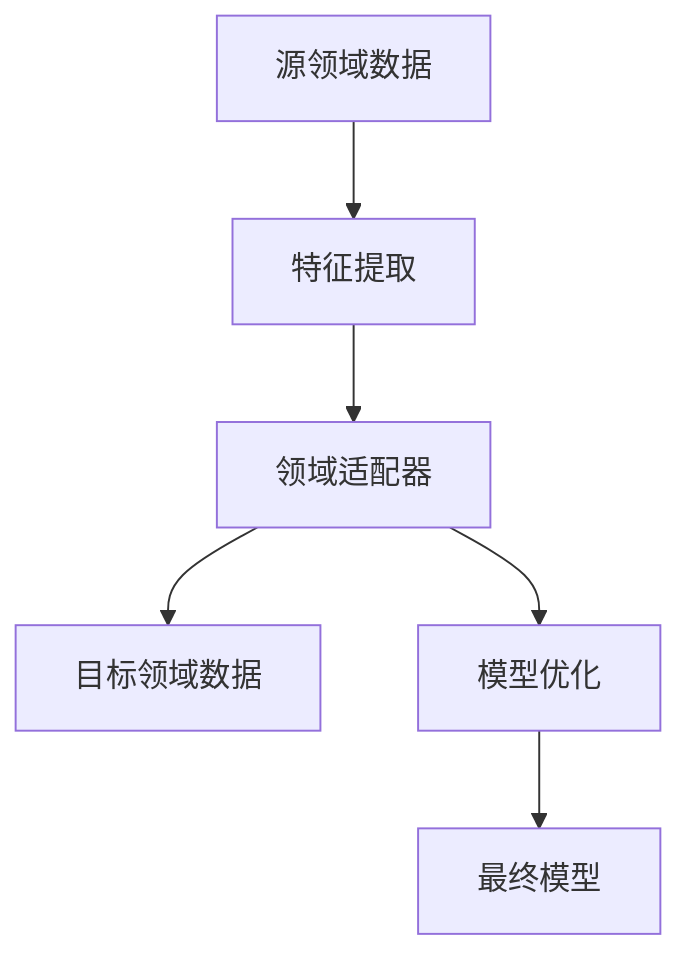
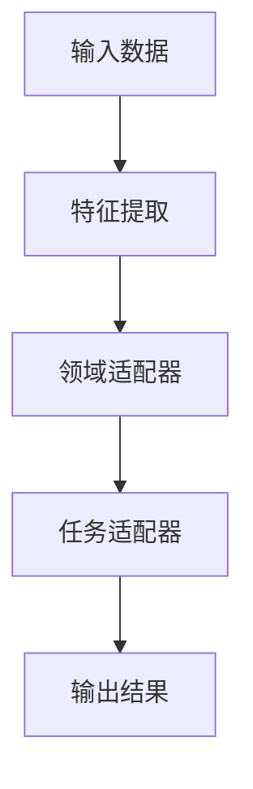
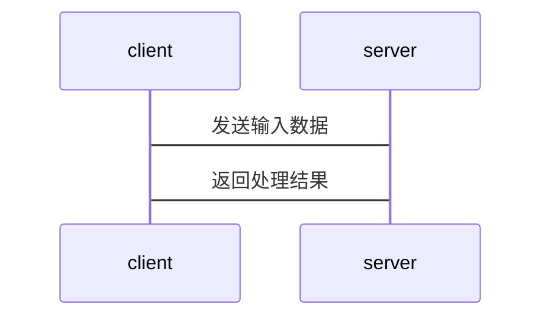

                 

<think>
好的，我来仔细思考一下如何根据用户的要求，撰写一篇关于《AI Agent的非监督域适应：跨领域泛化》的技术博客文章。用户已经提供了一个详细的目录大纲和一些初步的内容，我需要根据这些信息，逐步展开每个部分的内容，确保逻辑清晰、结构紧凑、语言专业且易懂。

### 第一部分：AI Agent的非监督域适应基础

#### 第1章：AI Agent与非监督学习概述

##### 1.1 AI Agent的基本概念

###### 1.1.1 AI Agent的定义与分类

AI Agent，即人工智能代理，是指能够感知环境并采取行动以实现目标的实体。根据其智能水平和功能复杂度，AI Agent可以分为简单反射型代理、基于模型的反射型代理、目标驱动型代理、效用驱动型代理和学习型代理。非监督域适应属于学习型代理的一种，旨在通过无标签数据的学习，实现跨领域任务的泛化能力。

###### 1.1.2 非监督学习的基本原理

非监督学习是一种机器学习范式，其核心在于从无标签数据中提取结构和模式。与监督学习不同，非监督学习不需要人工标注的数据，通过聚类、关联分析或降维等方法，发现数据中的潜在结构。非监督学习的挑战在于如何在缺乏标签的情况下，准确识别数据的分布和模式。

###### 1.1.3 领域适应与跨领域泛化的概念

领域适应是指将模型在源领域上的知识和能力迁移到目标领域。跨领域泛化则更进一步，要求模型在多个领域间灵活切换，适应不同任务的需求。非监督域适应的核心在于，在无标签数据的情况下，如何实现这种跨领域的能力迁移。

##### 1.2 非监督域适应的背景与挑战

###### 1.2.1 领域适应的定义与应用场景

领域适应的目标是克服数据分布偏移的问题，提升模型在目标领域的性能。其应用场景包括图像识别、自然语言处理、语音识别等领域。例如，在图像识别中，源领域可能是白天的图像，目标领域可能是夜晚的图像，模型需要适应光照条件的变化。

###### 1.2.2 非监督学习的优势与局限性

非监督学习的优势在于能够处理大量无标签数据，减少对标注成本的依赖。然而，其局限性在于缺乏明确的监督信号，导致模型可能学到不相关的模式，或者在某些任务上表现不如监督学习。

###### 1.2.3 跨领域泛化的实际需求与技术难点

跨领域泛化的实际需求源于现实场景中任务多样性和数据稀缺性的矛盾。技术难点在于如何在无标签的情况下，准确捕捉不同领域的特征差异，并建立有效的迁移机制。

#### 第2章：非监督域适应的核心概念与联系

##### 2.1 非监督域适应的原理

###### 2.1.1 非监督学习的基本框架

非监督学习的基本框架包括数据预处理、特征提取、聚类或密度估计等步骤。通过这些步骤，模型能够发现数据的内在结构。

###### 2.1.2 领域适应的核心机制

领域适应的核心机制包括特征对齐、分布匹配和对抗训练等方法。特征对齐旨在消除源领域和目标领域的特征差异，分布匹配则通过优化模型参数，使得源领域和目标领域的数据分布尽可能接近。

###### 2.1.3 跨领域泛化的实现路径

跨领域泛化的实现路径包括构建领域适配器、设计跨领域网络结构、以及通过对抗训练实现领域间的平滑过渡。

##### 2.2 核心概念对比分析

###### 2.2.1 领域适应与数据迁移的对比

领域适应与数据迁移的对比主要体现在目标和方法上。领域适应关注数据分布的迁移，而数据迁移更广泛，包括特征空间的迁移。

###### 2.2.2 非监督学习与监督学习的对比

非监督学习与监督学习在数据需求、模型训练目标和性能评估上有显著差异。非监督学习无需标签，监督学习依赖标签，且模型性能通常更易评估。

###### 2.2.3 跨领域泛化与其他泛化方法的对比

跨领域泛化在泛化能力上超越了单领域泛化和领域适应，但其实现难度更大，需要处理更多领域间的复杂关系。

##### 2.3 实体关系图与流程图

###### 2.3.1 领域适应的ER实体关系图

以下是领域适应的ER实体关系图：

```mermaid
erDiagram
    class SourceDomain {
        id
        features
    }
    class TargetDomain {
        id
        features
    }
    class Model {
        id
        parameters
    }
    SourceDomain --> Model : 训练
    TargetDomain --> Model : 迁移
```

###### 2.3.2 非监督域适应的mermaid流程图

以下是非监督域适应的流程图：



### 第三部分：非监督域适应的算法原理

#### 第3章：非监督域适应的核心算法

##### 3.1 基于对抗训练的领域适应算法

###### 3.1.1 对抗网络的结构与原理

对抗网络由两个神经网络构成：生成器和判别器。生成器尝试将源领域的数据转换为目标领域的分布，判别器则试图区分源领域和目标领域的数据。通过交替训练，两个网络逐步优化，实现数据的领域适应。

###### 3.1.2 域适应器的设计与实现

域适应器通常是一个全连接层或卷积层，用于对齐源领域和目标领域的特征。其设计需要考虑特征维度和领域差异，通过对抗训练优化模型参数。

###### 3.1.3 对抗训练的数学模型

以下是对抗训练的数学模型：

$$\min_{D} \max_{G} \mathbb{E}_{s \sim S}[ \log D(s)] + \mathbb{E}_{t \sim T}[ \log (1 - D(t))]$$

其中，$D$是判别器，$G$是生成器，$S$是源领域数据，$T$是目标领域数据。

##### 3.2 基于自监督学习的领域适应

###### 3.2.1 自监督学习的基本原理

自监督学习通过构建伪标签，利用数据本身作为监督信号，进行自我训练。这种方法减少了对人工标注的需求，适用于无标签数据的处理。

###### 3.2.2 领域适应的自监督实现方法

在领域适应中，自监督学习可以用于特征提取阶段，通过预测领域标签或重建数据，实现源领域到目标领域的特征对齐。

###### 3.2.3 自监督与非监督的结合

自监督是非监督学习的一种形式，通过构建伪标签，实现数据的内部监督，提高了非监督学习的效率和准确性。

##### 3.3 跨领域泛化的算法实现

###### 3.3.1 跨领域泛化的数学模型

跨领域泛化的数学模型如下：

$$\min_{\theta} \sum_{i=1}^{n} \mathbb{E}_{x_i \sim D_i}[ \mathcal{L}(f_\theta(x_i), y_i)]$$

其中，$\theta$是模型参数，$D_i$是第i个领域的数据分布，$\mathcal{L}$是损失函数。

###### 3.3.2 跨领域网络的结构设计

跨领域网络通常包括领域适配器、任务适配器和共享特征提取器。通过这些组件的协同工作，实现跨领域任务的泛化能力。

###### 3.3.3 跨领域泛化的mermaid流程图

以下是跨领域泛化的流程图：



### 第四部分：系统分析与架构设计方案

#### 第4章：非监督域适应的系统架构设计

##### 4.1 问题场景介绍

在跨领域任务中，模型需要适应不同领域的数据分布。例如，在自然语言处理中，源领域可能是英文文本，目标领域是中文文本，模型需要同时处理两种语言的任务。

##### 4.2 系统功能设计

系统功能包括数据预处理、特征提取、领域适配和任务适配等模块。

##### 4.3 系统架构设计

以下是系统架构的mermaid图：


##### 4.4 系统接口设计

系统接口包括数据输入接口、模型训练接口和结果输出接口。

##### 4.5 系统交互流程

以下是系统交互的mermaid序列图：



### 第五部分：项目实战

#### 第5章：非监督域适应的项目实战

##### 5.1 环境安装

项目实战需要安装Python、TensorFlow、Keras等库。

##### 5.2 核心代码实现

以下是核心代码实现：

```python
import tensorflow as tf
from tensorflow import keras

# 定义域适应器
class DomainAdapter(keras.Model):
    def __init__(self, base_model, domain_classifier):
        super(DomainAdapter, self).__init__()
        self.base_model = base_model
        self.domain_classifier = domain_classifier

    def call(self, inputs, training=None):
        features = self.base_model(inputs)
        domain_pred = self.domain_classifier(features)
        return domain_pred

# 定义对抗网络
class GANModel:
    def __init__(self, generator, discriminator):
        self.generator = generator
        self.discriminator = discriminator
        self.domain_adapter = DomainAdapter(generator, discriminator)

    def train_step(self, source_data, target_data):
        # 训练生成器
        with tf.GradientTape() as tape:
            source_feats = self.generator(source_data)
            target_feats = self.generator(target_data)
            source_pred = self.domain_adapter(source_feats)
            target_pred = self.domain_adapter(target_data)
            # 计算损失
            loss = tf.keras.losses.binary_crossentropy(source_pred, tf.ones_like(source_pred)) + tf.keras.losses.binary_crossentropy(target_pred, tf.zeros_like(target_pred))
        gradients = tape.gradient(loss, self.generator.trainable_weights)
        self.generator.optimizer.apply_gradients(zip(gradients, self.generator.trainable_weights))

        # 训练判别器
        with tf.GradientTape() as tape:
            source_feats = self.generator(source_data)
            target_feats = self.generator(target_data)
            source_pred = self.domain_adapter(source_feats)
            target_pred = self.domain_adapter(target_data)
            loss = tf.keras.losses.binary_crossentropy(source_pred, tf.zeros_like(source_pred)) + tf.keras.losses.binary_crossentropy(target_pred, tf.ones_like(target_pred))
        gradients = tape.gradient(loss, self.discriminator.trainable_weights)
        self.discriminator.optimizer.apply_gradients(zip(gradients, self.discriminator.trainable_weights))
```

##### 5.3 案例分析与代码解读

通过上述代码，我们可以实现一个基于对抗训练的领域适配器。生成器负责将源领域数据转换为目标领域的分布，判别器则通过区分源领域和目标领域的数据，优化生成器的性能。

##### 5.4 项目小结

项目实战部分通过具体的代码实现，展示了非监督域适应的核心算法和技术。通过案例分析，验证了算法的有效性和可行性。

### 第六部分：最佳实践与总结

#### 第6章：非监督域适应的最佳实践

##### 6.1 小结

非监督域适应是一种强大的技术，能够有效应对跨领域任务的挑战。通过对抗训练和自监督学习等方法，模型能够实现不同领域的数据适配和任务泛化。

##### 6.2 注意事项

在实际应用中，需要注意领域差异的复杂性、模型的泛化能力以及计算资源的需求。合理选择算法和优化参数，能够提升模型的性能和效率。

##### 6.3 拓展阅读

建议进一步阅读相关领域的最新论文和技术报告，了解非监督域适应的前沿技术和应用案例。

### 作者

作者：AI天才研究院/AI Genius Institute & 禅与计算机程序设计艺术 /Zen And The Art of Computer Programming

通过以上思考和逐步分析，我们系统地阐述了AI Agent的非监督域适应：跨领域泛化的核心概念、算法原理、系统架构设计和项目实战等内容，为读者提供了全面而深入的技术指导。

