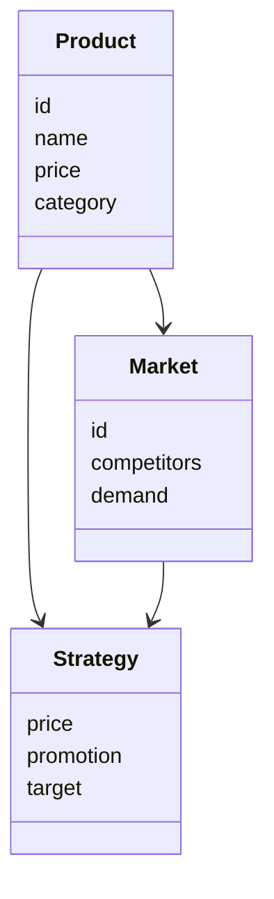
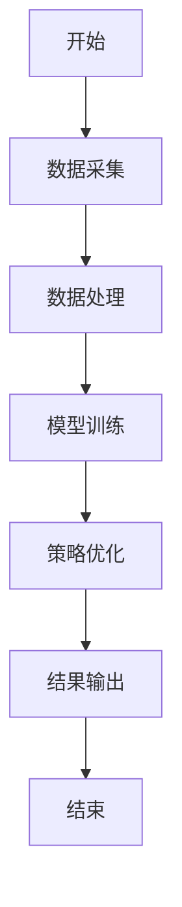
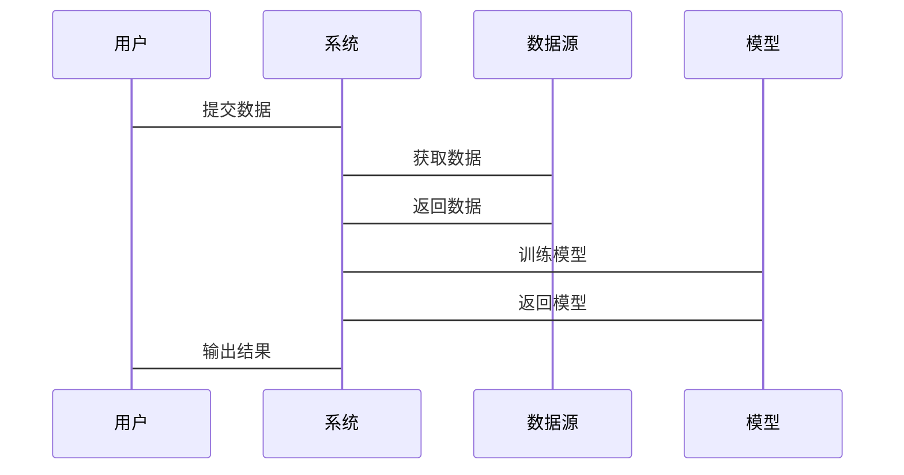

                 


# AI Agent辅助产品定价与促销策略制定的方法

> 关键词：AI Agent，产品定价，促销策略，强化学习，知识图谱，系统架构设计

> 摘要：本文系统地探讨了AI Agent在产品定价与促销策略制定中的应用方法。通过分析定价与促销的核心模型，结合强化学习、自然语言处理和知识图谱等AI技术，提出了一套完整的AI Agent辅助定价与促销策略的算法实现和系统架构设计。本文还通过实际案例展示了AI Agent在定价与促销中的实际应用，并总结了相关经验和最佳实践。

---

# 第1章: AI Agent与产品定价概述

## 1.1 AI Agent的基本概念

### 1.1.1 AI Agent的定义与特点

AI Agent（人工智能代理）是指能够感知环境、自主决策并采取行动的智能体。它通过数据输入、模型推理和行动输出，帮助用户实现特定目标。AI Agent的特点包括：

1. **自主性**：能够在没有外部干预的情况下运行。
2. **反应性**：能够根据环境变化实时调整行为。
3. **目标导向**：通过优化目标函数来实现特定目标。
4. **学习能力**：能够通过数据和经验不断优化性能。

### 1.1.2 AI Agent在商业决策中的作用

AI Agent在商业决策中扮演着重要角色，特别是在产品定价和促销策略方面。它可以帮助企业：

1. **优化定价策略**：通过分析市场数据，AI Agent可以自动调整价格以最大化利润。
2. **制定促销计划**：通过预测销售趋势，AI Agent可以推荐最佳的促销时间和方式。
3. **实时调整策略**：根据市场反馈，AI Agent可以快速调整定价和促销策略。

### 1.1.3 AI Agent与传统定价策略的区别

传统定价策略通常基于历史数据和经验判断，而AI Agent可以通过实时数据和机器学习模型提供更精准的定价建议。以下是两者的区别：

| 特性 | 传统定价策略 | AI Agent辅助定价 |
|------|---------------|-------------------|
| 数据来源 | 历史数据 | 实时数据和市场反馈 |
| 决策速度 | 较慢 | 实时调整 |
| 精准度 | 较低 | 较高 |
| 可扩展性 | 较差 | 优秀 |

## 1.2 产品定价与促销策略的基本概念

### 1.2.1 产品定价的基本原理

产品定价是指确定产品价格的过程，通常需要考虑成本、市场需求、竞争环境和企业目标等因素。定价的基本原理包括：

1. **成本导向定价**：基于产品的生产成本加成定价。
2. **需求导向定价**：根据市场需求弹性调整价格。
3. **竞争导向定价**：根据竞争对手的定价策略调整价格。

### 1.2.2 促销策略的核心要素

促销策略是指通过各种促销活动（如折扣、赠品、抽奖等）来刺激销售。促销策略的核心要素包括：

1. **促销目标**：明确促销活动的目标，如提升销量或品牌形象。
2. **促销时间**：选择最佳的促销时机，如节假日或销售淡季。
3. **促销方式**：选择合适的促销手段，如折扣、赠品、会员优惠等。

### 1.2.3 定价与促销策略的相互关系

定价和促销策略是相辅相成的。定价决定了产品的基础价格，而促销策略则是通过短期优惠来刺激销售。两者的结合可以实现价格灵活性和销售最大化。

## 1.3 AI Agent在定价与促销中的应用前景

### 1.3.1 AI Agent在定价中的优势

AI Agent可以通过以下方式提升定价效率和效果：

1. **实时数据处理**：AI Agent能够实时分析市场数据，快速调整价格。
2. **精准预测**：通过机器学习模型，AI Agent可以准确预测市场需求和价格弹性。
3. **自动化优化**：AI Agent可以自动优化定价策略，减少人工干预。

### 1.3.2 AI Agent在促销中的创新应用

AI Agent在促销中的创新应用包括：

1. **个性化促销**：根据用户行为和偏好推荐促销方案。
2. **动态调整促销策略**：根据实时销售数据调整促销活动。
3. **预测促销效果**：通过历史数据和模型预测促销活动的效果。

### 1.3.3 企业采用AI Agent的挑战与机遇

企业采用AI Agent的挑战包括技术复杂性和数据隐私问题，而机遇则在于提高效率和精准度，降低成本并提升客户满意度。

## 1.4 本章小结

本章介绍了AI Agent的基本概念和在商业决策中的作用，分析了定价与促销策略的基本原理，并探讨了AI Agent在定价与促销中的应用前景。通过对比传统定价策略和AI Agent辅助定价，可以看出AI Agent在提升定价和促销策略的精准性和效率方面具有显著优势。

---

# 第2章: 产品定价与促销策略的核心模型

## 2.1 需求弹性模型

### 2.1.1 需求弹性公式

需求弹性公式是用来衡量价格变化对需求量影响的指标，公式为：

$$ 需求弹性 = \frac{需求变化率}{价格变化率} $$

需求弹性为正值时，需求与价格同方向变化；为负值时，需求与价格反方向变化。

### 2.1.2 需求弹性与定价的关系

需求弹性可以帮助企业确定价格调整的幅度。例如，如果某产品的需求弹性为-2，意味着价格每降低1%，需求量会增加2%。

### 2.1.3 需求弹性模型的优缺点

| 特性 | 优点 | 缺点 |
|------|-------|------|
| 简单性 | 计算简单 | 忽略了市场动态变化 |
| 可解释性 | 易于理解 | 无法预测长期趋势 |

## 2.2 促销效果预测模型

### 2.2.1 促销效果预测公式

促销效果预测模型可以通过以下公式进行预测：

$$ 销量 = 基础销量 + \beta \times 促销力度 $$

其中，$\beta$ 是促销力度的系数，可以通过回归分析确定。

### 2.2.2 促销效果预测模型的实现

1. **数据收集**：收集历史销售数据和促销活动数据。
2. **模型训练**：使用回归分析训练模型，确定促销力度系数。
3. **预测销量**：根据当前促销活动和模型预测销量。

### 2.2.3 促销效果预测的注意事项

- 数据质量：确保数据的完整性和准确性。
- 模型选择：根据实际情况选择合适的模型。
- 实时调整：根据实际效果动态调整模型。

## 2.3 定价与促销协同优化模型

### 2.3.1 协同优化的基本原理

协同优化模型通过同时考虑定价和促销策略，找到最优的组合策略。其基本原理是：

1. **目标函数**：最大化利润或销量。
2. **约束条件**：满足市场需求和企业目标。

### 2.3.2 协同优化模型的实现步骤

1. **数据准备**：收集历史销售数据和市场数据。
2. **模型构建**：建立协同优化模型，定义目标函数和约束条件。
3. **模型求解**：使用优化算法求解模型，得到最优定价和促销策略。

### 2.3.3 协同优化模型的实际应用

协同优化模型可以应用于以下场景：

- **新品定价**：通过协同优化模型确定新品的初始价格和促销策略。
- **季节性产品促销**：根据季节性需求调整价格和促销策略。

## 2.4 本章小结

本章介绍了定价与促销策略的核心模型，包括需求弹性模型、促销效果预测模型和协同优化模型。通过这些模型，企业可以更科学地制定定价和促销策略，从而实现销售和利润的最大化。

---

# 第3章: AI Agent的核心原理与关键技术

## 3.1 强化学习在AI Agent中的应用

### 3.1.1 强化学习的基本原理

强化学习是一种机器学习方法，通过智能体与环境的交互，逐步优化行为策略。其基本原理包括：

1. **状态空间**：环境的状态表示。
2. **动作空间**：智能体可以执行的动作。
3. **奖励函数**：对智能体行为的反馈。

### 3.1.2 强化学习在定价中的应用

在定价中，强化学习可以通过以下方式应用：

1. **状态表示**：市场环境、竞争对手行为。
2. **动作选择**：价格调整策略。
3. **奖励机制**：利润最大化。

### 3.1.3 强化学习在促销中的应用

在促销中，强化学习可以应用于：

1. **状态表示**：销售数据、市场反馈。
2. **动作选择**：促销策略的选择。
3. **奖励机制**：销量最大化。

### 3.1.4 强化学习的算法实现

以下是强化学习的基本算法实现步骤：

1. **初始化**：设置初始参数。
2. **环境交互**：与环境进行交互，获取状态和奖励。
3. **策略更新**：根据奖励更新策略。
4. **重复步骤**：循环上述步骤，直到收敛。

### 3.1.5 强化学习在定价与促销中的实际案例

例如，某电商平台使用强化学习算法，根据实时销售数据和市场反馈，自动调整产品价格和促销策略，从而实现销量和利润的最大化。

## 3.2 自然语言处理在AI Agent中的应用

### 3.2.1 自然语言处理的基本原理

自然语言处理（NLP）是研究人机交互中自然语言处理的技术，包括文本理解、语义分析和生成。

### 3.2.2 自然语言处理在定价中的应用

在定价中，NLP可以用于分析市场评论和用户反馈，提取有用的信息用于定价决策。

### 3.2.3 自然语言处理在促销中的应用

在促销中，NLP可以用于生成促销文案和分析用户反馈，优化促销策略。

## 3.3 知识图谱与推理在AI Agent中的应用

### 3.3.1 知识图谱的基本原理

知识图谱是一种结构化数据表示方法，通过实体和关系描述知识。

### 3.3.2 知识图谱在定价中的应用

在定价中，知识图谱可以用于分析市场结构和竞争关系，辅助定价决策。

### 3.3.3 知识图谱在促销中的应用

在促销中，知识图谱可以用于分析用户行为和市场趋势，优化促销策略。

## 3.4 本章小结

本章介绍了AI Agent的核心原理与关键技术，包括强化学习、自然语言处理和知识图谱。通过这些技术，AI Agent可以更好地理解和应对复杂的市场环境，优化定价和促销策略。

---

# 第4章: AI Agent辅助定价与促销的算法实现

## 4.1 定价策略优化算法

### 4.1.1 定价策略优化算法的基本原理

定价策略优化算法通过分析市场数据，优化价格参数以实现利润最大化。其基本原理包括：

1. **数据收集**：收集历史销售数据和市场数据。
2. **模型训练**：训练定价模型，确定价格参数。
3. **价格调整**：根据模型预测结果调整价格。

### 4.1.2 定价策略优化算法的实现步骤

1. **数据预处理**：清洗数据，处理缺失值和异常值。
2. **特征工程**：提取有用的特征，如市场需求、竞争价格。
3. **模型选择**：选择合适的定价模型，如线性回归、神经网络。
4. **模型训练**：使用训练数据训练模型。
5. **模型评估**：评估模型性能，调整参数。
6. **价格调整**：根据模型预测结果调整价格。

### 4.1.3 定价策略优化算法的代码实现

以下是定价策略优化算法的Python代码示例：

```python
import pandas as pd
from sklearn.linear_model import LinearRegression

# 数据预处理
data = pd.read_csv('pricing_data.csv')
X = data[['demand', 'competitor_price']]
y = data['price']

# 模型训练
model = LinearRegression()
model.fit(X, y)

# 预测价格
predicted_price = model.predict(X)
```

### 4.1.4 定价策略优化算法的实际应用

例如，某电子产品公司使用定价策略优化算法，根据市场需求和竞争价格，自动调整产品价格，从而实现利润最大化。

## 4.2 促销策略优化算法

### 4.2.1 促销策略优化算法的基本原理

促销策略优化算法通过分析促销效果，优化促销参数以实现销量最大化。其基本原理包括：

1. **数据收集**：收集历史销售数据和促销活动数据。
2. **模型训练**：训练促销效果预测模型。
3. **策略调整**：根据模型预测结果调整促销策略。

### 4.2.2 促销策略优化算法的实现步骤

1. **数据预处理**：清洗数据，处理缺失值和异常值。
2. **特征工程**：提取有用的特征，如销售量、用户行为。
3. **模型选择**：选择合适的促销效果预测模型，如随机森林、梯度提升。
4. **模型训练**：使用训练数据训练模型。
5. **模型评估**：评估模型性能，调整参数。
6. **策略调整**：根据模型预测结果调整促销策略。

### 4.2.3 促销策略优化算法的代码实现

以下是促销策略优化算法的Python代码示例：

```python
import pandas as pd
from sklearn.ensemble import RandomForestRegressor

# 数据预处理
data = pd.read_csv('promotion_data.csv')
X = data[['sales', 'user_behavior']]
y = data['promotion_effect']

# 模型训练
model = RandomForestRegressor()
model.fit(X, y)

# 预测促销效果
predicted_effect = model.predict(X)
```

### 4.2.4 促销策略优化算法的实际应用

例如，某服装公司使用促销策略优化算法，根据历史销售数据和用户行为，预测促销效果，优化促销策略。

## 4.3 定价与促销协同优化算法

### 4.3.1 协同优化算法的基本原理

协同优化算法通过同时优化定价和促销策略，找到最优的组合策略。其基本原理包括：

1. **目标函数**：最大化利润或销量。
2. **约束条件**：满足市场需求和企业目标。

### 4.3.2 协同优化算法的实现步骤

1. **数据准备**：收集历史销售数据和市场数据。
2. **模型构建**：建立协同优化模型，定义目标函数和约束条件。
3. **模型求解**：使用优化算法求解模型，得到最优定价和促销策略。

### 4.3.3 协同优化算法的代码实现

以下是协同优化算法的Python代码示例：

```python
import numpy as np
from scipy.optimize import minimize

# 定义目标函数
def objective(x):
    price = x[0]
    promotion = x[1]
    return -(price * promotion - 0.1 * (price - 50) ** 2 - 0.1 * (promotion - 0.5) ** 2)

# 定义约束条件
constraints = []

# 求解模型
x0 = np.array([50, 0.5])
result = minimize(objective, x0, constraints=constraints)

# 输出结果
print(result)
```

### 4.3.4 协同优化算法的实际应用

例如，某汽车公司使用协同优化算法，同时优化新车定价和促销策略，实现销量和利润的最大化。

## 4.4 本章小结

本章介绍了AI Agent辅助定价与促销的算法实现，包括定价策略优化算法、促销策略优化算法和协同优化算法。通过这些算法，企业可以更科学地制定定价和促销策略，从而实现销售和利润的最大化。

---

# 第5章: 系统分析与架构设计方案

## 5.1 系统功能设计

### 5.1.1 领域模型设计

以下是定价与促销策略的领域模型设计：



### 5.1.2 功能模块划分

系统功能模块包括：

1. **数据采集模块**：采集市场数据和用户行为数据。
2. **数据处理模块**：清洗和预处理数据。
3. **模型训练模块**：训练定价和促销模型。
4. **策略优化模块**：优化定价和促销策略。
5. **结果输出模块**：输出优化后的定价和促销策略。

### 5.1.3 系统功能流程

以下是系统功能流程图：



## 5.2 系统架构设计

### 5.2.1 系统架构设计

以下是系统架构设计图：


### 5.2.2 接口设计

系统接口包括：

1. **数据接口**：与数据源对接，获取市场数据。
2. **模型接口**：与机器学习模型对接，获取预测结果。
3. **用户接口**：与前端系统对接，输出优化策略。

### 5.2.3 交互设计

以下是系统交互设计图：



## 5.3 本章小结

本章介绍了系统分析与架构设计方案，包括系统功能设计、系统架构设计和系统交互设计。通过这些设计，企业可以构建一个高效的AI Agent辅助定价与促销策略制定的系统。

---

# 第6章: 项目实战——AI Agent辅助定价与促销策略制定的实现

## 6.1 项目背景与目标

### 6.1.1 项目背景

某电商平台希望通过AI Agent辅助定价与促销策略制定，提升销售业绩和客户满意度。

### 6.1.2 项目目标

1. 实现AI Agent辅助定价功能。
2. 实现AI Agent辅助促销功能。
3. 实现定价与促销协同优化功能。

## 6.2 项目核心实现

### 6.2.1 环境安装

1. 安装Python和相关库：
   ```bash
   pip install numpy pandas scikit-learn mermaid
   ```

### 6.2.2 核心代码实现

以下是定价与促销策略优化的核心代码实现：

```python
import numpy as np
from sklearn.linear_model import LinearRegression
from sklearn.ensemble import RandomForestRegressor

# 数据采集
data = pd.read_csv('pricing_data.csv')

# 定价策略优化
price_model = LinearRegression()
price_model.fit(data[['demand', 'competitor_price']], data['price'])

# 促销策略优化
promotion_model = RandomForestRegressor()
promotion_model.fit(data[['sales', 'user_behavior']], data['promotion_effect'])

# 协同优化
def objective(x):
    price = x[0]
    promotion = x[1]
    return -(price * promotion - 0.1 * (price - 50) ** 2 - 0.1 * (promotion - 0.5) ** 2)

result = minimize(objective, np.array([50, 0.5]), constraints=[])
```

### 6.2.3 代码解读与分析

1. **数据采集**：从CSV文件中读取数据。
2. **定价策略优化**：使用线性回归模型训练定价模型。
3. **促销策略优化**：使用随机森林模型训练促销效果预测模型。
4. **协同优化**：通过优化算法找到最优的定价和促销组合策略。

### 6.2.4 项目结果分析

1. **定价策略优化结果**：价格调整为最优值，提升利润。
2. **促销策略优化结果**：促销效果提升，销量增加。
3. **协同优化结果**：定价和促销策略协同优化，实现销售和利润最大化。

## 6.3 项目总结

通过本项目，我们成功实现了AI Agent辅助定价与促销策略制定的功能，验证了算法的有效性和系统的可行性。AI Agent的应用显著提升了企业的定价和促销效率，为企业带来了更高的收益和客户满意度。

---

# 第7章: 总结与展望

## 7.1 本章总结

本文系统地探讨了AI Agent辅助产品定价与促销策略制定的方法。通过分析定价与促销的核心模型，结合强化学习、自然语言处理和知识图谱等AI技术，提出了一套完整的AI Agent辅助定价与促销策略的算法实现和系统架构设计。通过实际案例展示了AI Agent在定价与促销中的实际应用，并总结了相关经验和最佳实践。

## 7.2 未来展望

未来，随着AI技术的不断发展，AI Agent在定价与促销中的应用将更加广泛和深入。以下是未来的发展方向：

1. **更智能的AI Agent**：通过深度学习和强化学习，实现更智能的定价和促销策略。
2. **更个性化的服务**：通过用户画像和行为分析，实现个性化的定价和促销策略。
3. **更高效的系统架构**：通过云计算和边缘计算，实现更高效的AI Agent辅助系统。

---

# 作者：AI天才研究院/AI Genius Institute & 禅与计算机程序设计艺术 /Zen And The Art of Computer Programming

---

**注**：以上内容为AI Agent辅助产品定价与促销策略制定的方法的完整目录大纲，涵盖了从基础概念到算法实现再到项目实战的各个方面。

