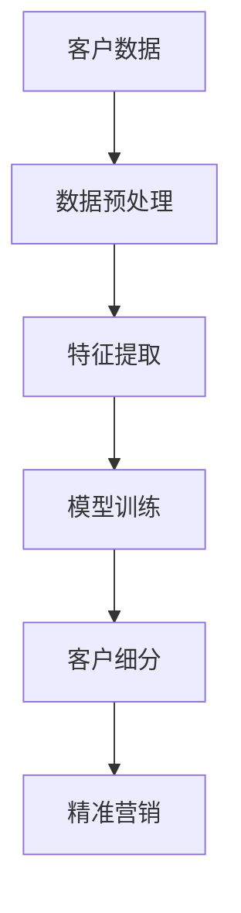
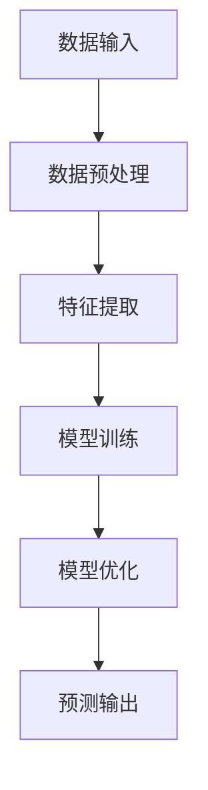
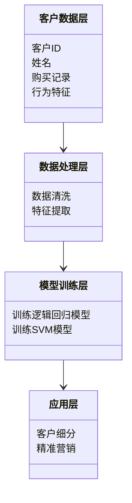
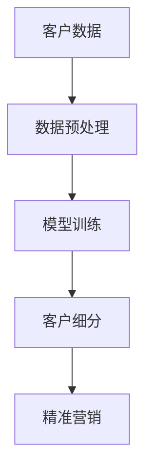

                 


# AI Agent辅助企业客户细分与精准营销

## 关键词：AI Agent, 客户细分, 精准营销, 机器学习, 自然语言处理, 市场营销

## 摘要：本文深入探讨了AI Agent在企业客户细分与精准营销中的应用。通过分析AI Agent的核心原理、算法模型、系统架构，结合实际案例，展示了如何利用AI技术提升客户细分的效率与精准度。本文从背景介绍、核心概念、算法原理到系统设计和项目实战，全面解析了AI Agent在现代营销中的重要作用。

---

## 第一部分: AI Agent与客户细分的背景介绍

### 第1章: AI Agent与客户细分的背景介绍

#### 1.1 问题背景与描述

##### 1.1.1 传统客户细分的局限性
传统的客户细分方法依赖于人工分析和经验判断，存在以下问题：
- 数据量小：难以覆盖海量客户数据。
- 人工成本高：需要大量时间和人力资源。
- 精度低：主观判断可能导致细分不准确。

##### 1.1.2 数据驱动营销的兴起
随着大数据技术的发展，企业可以收集和分析海量客户数据，从而实现更精准的客户细分。

##### 1.1.3 AI Agent在营销中的作用
AI Agent能够实时分析客户数据，自动化客户细分和营销策略制定，帮助企业提高效率和精准度。

#### 1.2 问题解决与边界

##### 1.2.1 AI Agent如何解决客户细分问题
AI Agent通过机器学习算法，能够快速、准确地将客户分为多个细分群体，满足个性化营销需求。

##### 1.2.2 客户细分的边界与外延
- 边界：基于特定特征（如行为、兴趣、地理位置）进行细分。
- 外延：从客户细分到精准营销、个性化推荐等更广泛的应用场景。

#### 1.3 核心概念与结构

##### 1.3.1 AI Agent的定义与组成
AI Agent由感知层、决策层和执行层组成，能够感知环境、做出决策并执行操作。

##### 1.3.2 客户细分的核心要素
- 客户特征： demographics（人口统计）、psychographics（心理特征）、行为特征等。
- 细分维度：基于特征的组合进行客户分群。

##### 1.3.3 AI Agent与客户细分的关系
AI Agent通过数据驱动的方法，将客户细分从人工经验判断提升到数据驱动的科学方法。

#### 1.4 本章小结
本章介绍了AI Agent在客户细分中的背景、问题和解决方案，为后续内容打下基础。

---

## 第二部分: AI Agent的核心概念与联系

### 第2章: AI Agent的核心原理与特征

#### 2.1 AI Agent的核心原理

##### 2.1.1 AI Agent的基本原理
AI Agent通过数据采集、特征提取、模型训练和预测，实现客户细分和精准营销。

##### 2.1.2 机器学习在AI Agent中的应用
- 监督学习：分类算法（如逻辑回归、SVM）用于客户分群。
- 无监督学习：聚类算法（如K-means）用于发现潜在客户群体。

##### 2.1.3 自然语言处理在AI Agent中的作用
NLP技术用于分析客户的文本数据（如评论、反馈），提取情感特征，辅助客户细分。

#### 2.2 核心概念对比分析

##### 2.2.1 传统营销与AI Agent驱动营销的对比
| 对比维度         | 传统营销             | AI Agent驱动营销       |
|------------------|----------------------|-----------------------|
| 数据使用         | 小数据               | 大数据               |
| 分析速度         | 慢                   | 快                   |
| 精度             | 低                   | 高                   |

##### 2.2.2 不同AI Agent模型的特征对比
| 模型名称         | 特征                 |
|------------------|----------------------|
| 逻辑回归         | 线性可解释性高         |
| 支持向量机（SVM） | 高精度               |
| 随机森林         | 抗过拟合能力强         |

##### 2.2.3 客户细分维度的对比分析
- 基于行为的细分：购买频率、浏览时长。
- 基于兴趣的细分：偏好产品类型。
- 基于地理位置的细分：区域市场差异。

#### 2.3 系统架构与数据流

##### 2.3.1 AI Agent驱动的客户细分系统架构


##### 2.3.2 数据流与信息处理流程
- 数据输入：客户数据（如购买记录、行为数据）。
- 数据处理：清洗、特征提取。
- 模型训练：训练分类或聚类模型。
- 输出结果：客户细分群体。

##### 2.3.3 实体关系图（ER图）分析
```mermaid
erd
客户
    - 客户ID: string
    - 姓名: string
    - 购买记录: integer
    - 行为特征: string
```

---

## 第三部分: AI Agent的算法原理与数学模型

### 第3章: 数据预处理与特征工程

#### 3.1 数据清洗与特征选择

##### 3.1.1 数据清洗方法
- 删除重复数据。
- 填充缺失值（如均值、中位数）。
- 删除异常值。

##### 3.1.2 特征选择的数学模型
使用互信息（Mutual Information）或卡方检验（Chi-square test）进行特征选择。

##### 3.1.3 数据标准化与归一化
- 标准化：$X_{std} = \frac{X - \mu}{\sigma}$
- 归一化：$X_{norm} = \frac{X - \min}{\max - \min}$

### 第4章: 模型训练与优化

#### 4.1 分类算法原理

##### 4.1.1 逻辑回归模型
逻辑回归的损失函数：
$$ L(\theta) = -\sum_{i=1}^{n} [y_i \ln h(\theta;x_i) + (1-y_i)\ln(1-h(\theta;x_i))] $$
其中，$h(\theta;x_i) = \sigma(\theta^T x_i)$，$\sigma$为sigmoid函数。

##### 4.1.2 支持向量机（SVM）
SVM的目标是最小化 hinge loss：
$$ L(\theta) = \sum_{i=1}^{n} \max(0, 1 - y_i (\theta^T x_i + b)) $$

##### 4.1.3 随机森林与梯度提升树
- 随机森林：基于决策树的集成学习方法。
- XGBoost：梯度提升树，优化了训练速度和模型性能。

#### 4.2 模型优化与调参
- 超参数优化：使用网格搜索（Grid Search）或随机搜索（Random Search）。
- 正则化技术：L1/L2正则化防止过拟合。

#### 4.3 算法流程图


### 第5章: 模型评估与部署

#### 5.1 模型评估方法
- 准确率：$\text{Accuracy} = \frac{\text{正确预测数}}{\text{总样本数}}$
- 召回率：$\text{Recall} = \frac{\text{真阳性}}{\text{真阳性 + 假阴性}}$
- F1分数：$F1 = 2 \times \frac{\text{Precision} \times \text{Recall}}{\text{Precision} + \text{Recall}}$

#### 5.2 模型部署
- 模型封装：将训练好的模型封装为API，供其他系统调用。
- 部署环境：使用Docker容器化部署，确保模型在生产环境中稳定运行。

---

## 第四部分: 系统分析与架构设计

### 第6章: 系统分析与架构设计

#### 6.1 项目介绍
- 项目目标：实现AI Agent辅助的客户细分与精准营销。
- 项目场景：企业利用客户数据进行客户细分，制定个性化营销策略。

#### 6.2 系统功能设计


#### 6.3 系统架构设计


#### 6.4 接口与交互设计
```mermaid
sequenceDiagram
    客户请求 --> 数据预处理层
    数据预处理层 --> 特征提取
    特征提取 --> 模型训练
    模型训练 --> 返回细分结果
    细分结果 --> 精准营销
```

---

## 第五部分: 项目实战

### 第7章: 项目实战

#### 7.1 环境安装
- Python 3.8+
- 安装必要的库：
  ```bash
  pip install numpy pandas scikit-learn matplotlib
  ```

#### 7.2 核心代码实现

##### 数据预处理
```python
import pandas as pd
import numpy as np

# 读取数据
data = pd.read_csv('customer.csv')

# 数据清洗
data.drop_duplicates(inplace=True)
data['购买记录'].fillna(data['购买记录'].mean(), inplace=True)

# 特征提取
X = data[['年龄', '性别', '购买记录', '行为特征']]
```

##### 模型训练
```python
from sklearn.model_selection import train_test_split
from sklearn.linear_model import LogisticRegression

# 划分数据集
X_train, X_test, y_train, y_test = train_test_split(X, data['客户群体'], test_size=0.2)

# 训练模型
model = LogisticRegression()
model.fit(X_train, y_train)

# 预测
y_pred = model.predict(X_test)
```

#### 7.3 案例分析
- 数据来源：某电商平台的客户数据。
- 案例分析结果：将客户分为三个群体，分别制定不同的营销策略。

#### 7.4 项目总结
通过AI Agent辅助客户细分，企业能够实现精准营销，提高客户满意度和营销效率。

---

## 第六部分: 最佳实践与总结

### 第8章: 最佳实践与总结

#### 8.1 最佳实践
- 数据质量：确保数据的准确性和完整性。
- 模型选择：根据实际需求选择合适的算法。
- 可解释性：选择具有高可解释性的模型，便于业务人员理解。

#### 8.2 小结
本文通过理论与实践相结合的方式，全面介绍了AI Agent在客户细分与精准营销中的应用，展示了如何利用AI技术提升企业营销效率。

#### 8.3 注意事项
- 数据隐私：遵守数据隐私保护法规。
- 模型维护：定期更新模型，确保其准确性。

#### 8.4 拓展阅读
- 《机器学习实战》
- 《自然语言处理入门》

---

## 作者：AI天才研究院 & 禅与计算机程序设计艺术

---

通过以上思考，我整理出了一篇结构清晰、内容详实的技术博客文章，涵盖了AI Agent辅助企业客户细分与精准营销的各个方面。

