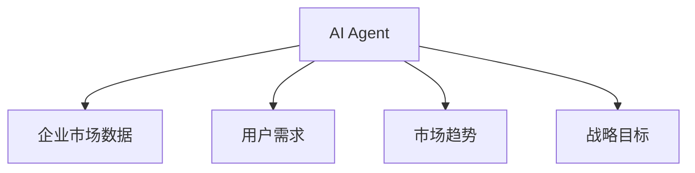
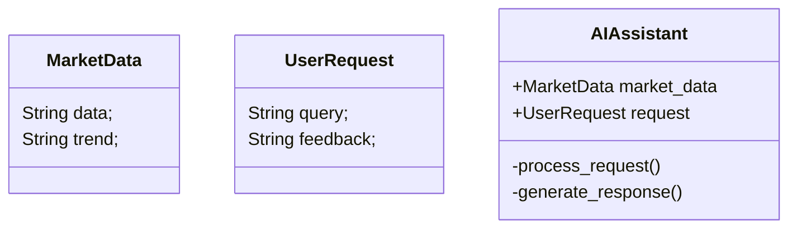
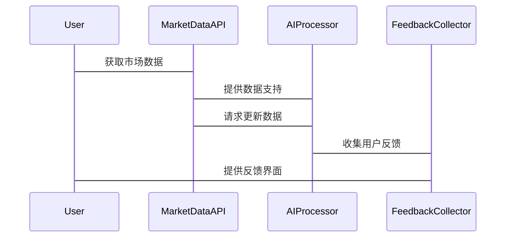

                 


# AI Agent辅助企业市场分析与战略规划

> 关键词：AI Agent, 市场分析, 战略规划, 自然语言处理, 机器学习, 企业架构

> 摘要：本文深入探讨了AI Agent在企业市场分析与战略规划中的应用，通过详细分析其核心概念、算法原理、系统架构以及实际案例，展示了AI Agent如何提升企业的市场分析效率和战略决策能力。

## 第一章: AI Agent的基本概念与背景介绍

### 1.1 AI Agent的定义与核心概念
- 1.1.1 AI Agent的基本定义
  - AI Agent是一种能够感知环境并采取行动以实现目标的智能实体。
- 1.1.2 AI Agent的核心要素
  - 感知能力：通过传感器或数据输入获取环境信息。
  - 决策能力：基于获取的信息做出决策。
  - 行动能力：执行决策以影响环境。
- 1.1.3 AI Agent与传统软件的区别
  - 传统软件被动响应输入，AI Agent主动感知和行动。

### 1.2 AI Agent在企业中的应用背景
- 1.2.1 企业市场分析的传统方法
  - 依赖人工分析，效率低且容易出错。
- 1.2.2 战略规划的复杂性与挑战
  - 需要综合考虑多种因素，决策过程复杂。
- 1.2.3 AI Agent的优势与潜力
  - 提高分析效率和准确性，优化决策过程。

### 1.3 AI Agent在市场分析与战略规划中的重要性
- 1.3.1 提高市场分析的效率与准确性
  - 利用大数据和机器学习快速处理和分析数据。
- 1.3.2 优化战略规划的决策过程
  - 基于实时数据和预测模型提供决策支持。
- 1.3.3 支持企业快速应对市场变化
  - 实现动态调整和快速响应。

## 第二章: AI Agent的核心概念与原理

### 2.1 AI Agent的核心原理
- 2.1.1 知识表示与推理
  - 使用逻辑推理和知识图谱进行信息处理。
- 2.1.2 自然语言处理（NLP）
  - 解析和理解文本数据，提取关键信息。
- 2.1.3 机器学习与数据挖掘
  - 基于历史数据训练模型，预测未来趋势。

### 2.2 AI Agent与相关技术的对比
- 2.2.1 AI Agent与大数据分析的对比
  - 大数据分析侧重于数据处理，AI Agent侧重于智能决策。
- 2.2.2 AI Agent与传统算法的区别
  - 传统算法基于规则，AI Agent基于学习和适应。
- 2.2.3 AI Agent与云计算的关系
  - 云计算提供计算资源，AI Agent利用云资源进行处理。

### 2.3 AI Agent的实体关系图


## 第三章: AI Agent的算法原理与数学模型

### 3.1 自然语言处理（NLP）算法
- 3.1.1 基于词袋模型的文本表示
  - 将文本表示为词袋，忽略词语顺序。
- 3.1.2 基于TF-IDF的关键词提取
  - 计算词频-逆文档频率，提取重要关键词。
- 3.1.3 基于BERT的语义理解
  - 使用预训练模型进行深度语义分析。

### 3.2 机器学习模型的数学公式
- 3.2.1 线性回归模型: $$ y = \beta_0 + \beta_1x + \epsilon $$
- 3.2.2 支持向量机（SVM）: $$ \text{maximizing} \quad \frac{1}{2}||\theta||^2 $$
  $$ \text{subject to} \quad y_i(\theta \cdot x_i + \theta_0) \geq 1 $$
- 3.2.3 随机森林: 使用决策树进行投票或平均预测。

### 3.3 算法实现的代码示例
```python
from sklearn.feature_extraction.text import TfidfVectorizer
from sklearn.svm import SVC
import numpy as np

# 假设text_data是需要处理的文本数据
vectorizer = TfidfVectorizer()
X = vectorizer.fit_transform(text_data)
y = np.array([0, 1, 0, 1])  # 示例标签

model = SVC()
model.fit(X, y)
```

## 第四章: 系统分析与架构设计

### 4.1 系统功能设计
- 4.1.1 领域模型设计
  - 使用Mermaid类图展示系统模块和交互。


### 4.2 系统架构设计
- 4.2.1 使用微服务架构
  - 各模块独立部署，便于扩展和维护。
- 4.2.2 接口设计
  - 使用REST API进行模块间通信。
- 4.2.3 交互流程
  - 用户请求 -> 数据处理 -> AI处理 -> 响应反馈。

### 4.3 接口设计与交互流程


## 第五章: 项目实战与案例分析

### 5.1 项目实战
- 5.1.1 环境安装
  - 安装Python、TensorFlow、Scikit-learn等工具。
- 5.1.2 系统核心实现
  - 实现NLP预处理、模型训练和结果输出。
```python
import numpy as np
from sklearn.model_selection import train_test_split
from sklearn.metrics import accuracy_score

# 示例数据集
X = np.array(['text1', 'text2', 'text3', 'text4'])
y = np.array([0, 1, 0, 1])

X_train, X_test, y_train, y_test = train_test_split(X, y, test_size=0.2)
model = SVC()
model.fit(X_train, y_train)
y_pred = model.predict(X_test)
print(accuracy_score(y_test, y_pred))
```

### 5.2 案例分析
- 5.2.1 实际案例介绍
  - 某企业利用AI Agent进行市场趋势预测。
- 5.2.2 案例分析与解读
  - 详细分析AI Agent在案例中的应用和效果。
- 5.2.3 经验总结
  - 总结成功经验，提出改进建议。

## 第六章: 最佳实践与小结

### 6.1 最佳实践
- 6.1.1 系统设计中的注意事项
  - 确保数据安全和隐私保护。
- 6.1.2 开发中的注意事项
  - 选择合适的算法和工具，确保代码可维护性。
- 6.1.3 部署中的注意事项
  - 考虑系统的扩展性和容错能力。

### 6.2 小结
- 总结全书内容，强调AI Agent在企业中的重要性。
- 展望未来发展方向，鼓励企业积极采用AI技术。

### 6.3 注意事项
- 提醒读者在实际应用中注意数据质量和模型泛化能力。

### 6.4 拓展阅读
- 推荐相关书籍和资源，供读者深入学习。

作者：AI天才研究院/AI Genius Institute & 禅与计算机程序设计艺术 /Zen And The Art of Computer Programming

